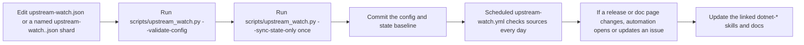

# Contributing

This repository is a shared `.NET` skill catalog.

If you maintain a library, framework integration, or developer tool, please add it here so other agents and contributors can understand how and why to use it.

The goal is not to dump links.

The goal is to make usage of a library or project explicit, concrete, and reusable.

## What We Want Contributors To Add

Please contribute:

- New `dotnet-*` skills for important libraries, frameworks, and integrations.
- New orchestration agents in `agents/` for broad routing roles, or in `skills/<skill>/agents/` for tightly coupled specialist behavior.
- Improvements to existing skills when usage guidance is incomplete or outdated.
- Upstream watch entries for projects that should trigger refresh issues when a new release or documentation change happens.
- Documentation improvements when a skill description, version, category, or compatibility statement is unclear.

## For Library and Project Authors

If you want people to use your library well, please add:

1. Your project to the right upstream watch shard under [`.github/upstream-watch*.json`](.github/)
2. A dedicated skill under [`skills/`](skills) when the project is important enough to justify one
3. Clear guidance in that skill about:
   - what the library is
   - why someone should use it
   - when it should be preferred
   - how it is typically wired into a real `.NET` project
   - what problem it solves
   - what it should not be used for

The skill must be understandable by someone who has never used your project before.

For upstream watch configuration, keep one obvious config surface:

- [`.github/upstream-watch.json`](.github/upstream-watch.json) for shared metadata
- [`.github/upstream-watch*.json`](.github/) for shard files

Each shard keeps the same two obvious lists:

- `github_releases`
- `documentation`

Normal entry shape:

```json
{
  "source": "https://github.com/managedcode/Storage",
  "skills": [
    "dotnet-managedcode-storage"
  ]
}
```

That is enough for automation.
`scripts/upstream_watch.py` derives the watch kind, source coordinates, display name, and default notes at runtime.
Only add extra fields such as `match_tag_regex` or `id` when you actually need them.

## Required Skill Metadata

Every `SKILL.md` must include these frontmatter fields:

- `name`
- `version`
- `category`
- `description`
- `compatibility`

Rules:

- `version` is required and is shown in the README catalog.
- `description` must be a clear, exact statement of what the skill is and when it should be used.
- `description` is copied into the README catalog, so write it carefully.
- `category` must match one of the supported catalog categories.

## Skill Versioning Policy

Use semantic versioning for skill metadata:

- `1.0.0` for a new stable skill
- patch version for clarifications, examples, wording fixes, or small non-breaking improvements
- minor version for meaningful scope expansion or materially better guidance
- major version for a renamed, repurposed, or incompatibly restructured skill

If you materially change what a skill tells an agent to do, bump the version.

## Skill Content Expectations

A good skill is unambiguous.

It should make these points obvious:

- What is this project or library?
- Why would someone use it?
- In which type of `.NET` project does it belong?
- What are the main integration decisions?
- What validations should happen after using it?

If the skill explains non-trivial wiring, runtime flow, integration steps, or decision branches, add at least one Mermaid diagram that makes those details explicit.
Do not leave complex implementation guidance as prose only when a simple diagram would clarify it.

Do not write vague descriptions like:

- "Helper library for communication"
- "Useful storage abstraction"
- "Integration for graphs"

Write precise descriptions like:

- "Provide a provider-agnostic blob storage abstraction for .NET applications that need to work across multiple cloud object storage backends."
- "Use this library when a .NET application wants explicit result objects instead of exception-driven control flow, especially in ASP.NET Core APIs."

## Required Files For A New Skill

Create:

```text
skills/<skill-slug>/
├── SKILL.md
├── scripts/       # optional
├── references/    # optional
└── assets/        # optional
```

`SKILL.md` is the only required file. It uses the universal Agent Skills format with YAML frontmatter (name, description) that works across Claude, Copilot, Gemini, and Codex.

Treat `SKILL.md` as the control plane, not the full documentation dump:

- keep trigger conditions, workflow, deliverables, validation, and concise decision logic in `SKILL.md`
- move long official documentation mirrors, API maps, examples, recipes, and deep topic notes into `references/`
- prefer several small topic-focused reference files over one giant omnibus file so agents can load only the material they need
- every meaningful file under `references/` must be referenced from `SKILL.md` or from an index that `SKILL.md` points to directly
- when `SKILL.md` points at `references/`, concise explicit path mentions such as `references/patterns.md` are fine; use Markdown links only when clickability actually helps

## Required Files For A New Agent

Agent placement depends on scope:

- broad orchestration agents live in `agents/<agent-slug>/AGENT.md`
- tightly coupled specialist agents live in `skills/<skill-slug>/agents/<agent-slug>/AGENT.md`
- top-level agents usually orchestrate a group of related skills, while skill-scoped agents usually ship as a narrow companion to one skill

Current skill-scoped example:

- `skills/dotnet-orleans/agents/dotnet-orleans-specialist/AGENT.md` for Orleans-only triage next to the `dotnet-orleans` skill
- `skills/dotnet-aspire/agents/dotnet-aspire-orchestrator/AGENT.md` for AppHost, integration, deployment, and Community Toolkit routing next to the `dotnet-aspire` skill

Use this decision rule:

- if the agent routes across multiple skills or domains, put it in `agents/`
- if the agent only makes sense next to one skill or one framework surface, put it under that skill

A minimal top-level layout:

```text
agents/
├── README.md
└── <agent-name>/
    ├── AGENT.md
    ├── scripts/       # optional
    ├── references/    # optional
    └── assets/        # optional
```

An agent file should:

- define the role clearly
- say when to invoke it
- list the `dotnet-*` skills it is expected to orchestrate
- explain its boundaries and what it should hand off

Keep `AGENT.md` short. Use it for routing, triage, and bounded role behavior. Put deep framework notes, large decision tables, protocol details, and other heavy material in `references/` or in the paired skill instead of bloating the agent entry file.
Do not store agents as loose flat `.agent.md` source files in the repo; folder-per-agent is the canonical source layout here.

Current skill-scoped specialist examples:

- `skills/dotnet-orleans/agents/dotnet-orleans-specialist/AGENT.md`
- `skills/dotnet-microsoft-agent-framework/agents/agent-framework-router/AGENT.md`

## README and Catalog

The source of truth is the skill metadata in `skills/*/SKILL.md`.

The release catalog manifest is generated in CI during release workflows.
Do not treat the checked-in `catalog/skills.json` file as the canonical source.

Do not hand-edit the generated catalog tables.

Instead:

1. Edit the skill metadata in `SKILL.md`
2. If you want a local preview of generated outputs, run:

```bash
python3 scripts/generate_catalog.py
```

This preview updates:

- the generated catalog section in [`README.md`](README.md)
- the machine-readable manifest in [`catalog/skills.json`](catalog/skills.json)

For metadata-only validation without rewriting generated files:

```bash
python3 scripts/generate_catalog.py --validate-only
```

## Dotnet Tool Distribution

This repository also publishes an installable `.NET` tool for consumers of the catalog:

- package id: `dotnet-skills`
- command name: `dotnet-skills`
- CLI shape: `dotnet skills ...`

The tool is for distribution of the catalog itself, not for general repo maintenance.
It now uses remote GitHub catalog releases by default and only falls back to the bundled catalog when remote sync is unavailable.
Do not trigger ad-hoc publish runs for every merge; the unified `04:00` UTC release workflow publishes the tool, catalog release, and site together.

CLI naming rule:

- keep canonical skill IDs in the catalog as `dotnet-*`
- allow short aliases in commands, for example `dotnet skills install aspire`
- treat the CLI alias layer as user-facing convenience, not as a replacement for stable skill names in `skills/`

Agent target rule:

- support Codex, Claude, Copilot, and Gemini target layouts through `--agent`
- support global or repository-local installation through `--scope`
- when `--agent` is omitted for skill installation, auto-detect native client roots in this order: `.codex`, `.claude`, `.github`, `.gemini`; install into every already existing native platform target you find, and only fall back to `.agents/skills` when none exist
- keep `--target` as an explicit override when a caller wants a custom path, including agent commands
- copy skills as native skill directories for every supported CLI; do not generate Claude-specific skill adapters
- for Codex, use `.codex/skills` and `.codex/agents` for project installs, and `$CODEX_HOME/skills` and `$CODEX_HOME/agents` (default `~/.codex/...`) for global installs
- for Claude, use `.claude/skills` and `.claude/agents` for project installs, and `~/.claude/skills` and `~/.claude/agents` for global installs
- for Copilot, use `.github/skills` and `.github/agents` for project installs, and `~/.copilot/skills` and `~/.copilot/agents` for global installs
- for Gemini, use `.gemini/skills` and `.gemini/agents` for project installs, and `~/.gemini/skills` and `~/.gemini/agents` for global installs
- for orchestration agents, auto-detect only vendor-native agent locations such as `.codex/agents`, `.claude/agents`, `.github/agents`, and `.gemini/agents`
- do not treat `.agents` as a shared agent-install target and do not map it to Codex
- if no native agent directory exists, require an explicit `--agent` or `--target` instead of inventing a fallback
- if a caller uses `dotnet skills agent ... --target <path>`, require an explicit `--agent`; agent payload formats are platform-specific and must not be guessed
- when installing Codex globally, honor `CODEX_HOME` for both skills and agents

Publishing is handled by [`.github/workflows/publish-catalog.yml`](.github/workflows/publish-catalog.yml).

Preferred publish model:

1. Add the `NUGET_API_KEY` repository secret
2. Keep only the manual base version in [`tools/ManagedCode.DotnetSkills/ManagedCode.DotnetSkills.csproj`](tools/ManagedCode.DotnetSkills/ManagedCode.DotnetSkills.csproj) as `<VersionPrefix>major.minor</VersionPrefix>`
3. Let [`.github/workflows/publish-catalog.yml`](.github/workflows/publish-catalog.yml) publish automatically at `04:00` UTC after merges to `main`, or trigger it manually only for a backfill or rerun

The workflow resolves the publish version in CI as `<VersionPrefix>.<GITHUB_RUN_NUMBER>` and pushes the produced `.nupkg` to NuGet. For example, a checked-in `0.0` base version becomes `0.0.412` on run `412`.

## Catalog Releases

The nightly release workflow also handles catalog and site publishing. It includes:

- building and publishing the `catalog-v*` release assets
- generating `artifacts/github-pages`
- deploying GitHub Pages in the same release run

Rules:

- catalog release tags must use `catalog-v<version>`
- the automatic catalog version format is `<year>.<month>.<day>.<daily-build-index>`, for example `2026.3.15.0`
- the daily build index is UTC-based: first release for that UTC date is `.0`, second is `.1`, and so on
- the normal flow is automatic by schedule; do not treat manual dispatch as the primary release path
- the workflow generates fresh catalog outputs in CI from `skills/*/SKILL.md`
- the tool resolves the latest remote catalog from the newest non-draft `catalog-v*` GitHub release
- the workflow uploads two assets:
  - `dotnet-skills-manifest.json`
  - `dotnet-skills-catalog.zip`
- if you need a backfill or emergency rerun, `workflow_dispatch` may still provide an explicit `catalog_version`
- use `dotnet skills sync --catalog-version <version>` only when you intentionally need to validate a pinned catalog release after it is published

If you change the tool:

```bash
dotnet build dotnet-skills.slnx
dotnet test dotnet-skills.slnx
dotnet pack dotnet-skills.slnx -c Release
```

Unit and integration tests run in CI alongside installability smoke tests.
Do not use a local `dotnet tool install --add-source artifacts/nuget ...` loop as the normal contributor workflow.

If you change the catalog release flow, also check:

```bash
dotnet skills list --bundled --local
dotnet skills sync --catalog-version <version>
```

Official references:

- [Create a .NET tool](https://learn.microsoft.com/en-us/dotnet/core/tools/global-tools-how-to-create)
- [NuGet Trusted Publishers](https://learn.microsoft.com/en-us/nuget/nuget-org/trusted-publishers)
- [Create a package using MSBuild](https://learn.microsoft.com/en-us/nuget/create-packages/creating-a-package-msbuild)
- [Publish packages with `dotnet nuget push`](https://learn.microsoft.com/en-us/dotnet/core/tools/dotnet-nuget-push)
- [GitHub REST API for releases](https://docs.github.com/en/rest/releases/releases)

## Upstream Watch Entries

If you add a project to the watch list:

1. Add an entry to the right list in the relevant shard under [`.github/upstream-watch*.json`](.github/)
2. Map it to the affected `dotnet-*` skills
3. Add `match_tag_regex` if the repository publishes multiple release streams
4. Validate the config:

```bash
python3 scripts/upstream_watch.py --validate-config
```

5. Refresh the baseline:

```bash
python3 scripts/upstream_watch.py --sync-state-only
```

For a safe preview:

```bash
python3 scripts/upstream_watch.py --dry-run
```

### Which File Do I Edit?

Keep it simple:

- keep [`.github/upstream-watch.json`](.github/upstream-watch.json) for `watch_issue_label` and `labels`
- edit the relevant shard such as `upstream-watch.ai.json`, `upstream-watch.data.json`, `upstream-watch.platform.json`, or `upstream-watch-agent-framework.json`
- keep shard names semantic and review-friendly
- do not create numbered fragments or `.d` directory indirection

- add GitHub repositories to `github_releases`
- add docs pages to `documentation`
- map each entry to the relevant `dotnet-*` skills
- keep optional fields for exceptions only

### What Happens After I Add A Watch?



### GitHub Release Watch Example

Use the same `source` field for every watch.
Point it at a GitHub repository when you want automation to watch releases:

```json
{
  "source": "https://github.com/myvendor/MyProject",
  "skills": [
    "dotnet-myproject"
  ]
}
```

The watcher fills in the rest at runtime.
Add `match_tag_regex` only when the repo publishes multiple streams and you need the .NET-facing tags only:

```json
{
  "source": "https://github.com/myvendor/MyProject",
  "match_tag_regex": "^dotnet-",
  "skills": [
    "dotnet-myproject"
  ]
}
```

### Documentation Watch Example

Point `source` at a documentation page when you want automation to watch docs:

```json
{
  "source": "https://learn.microsoft.com/example/myproject/overview",
  "skills": [
    "dotnet-myproject"
  ]
}
```

### Required Fields

For normal config entries, every watch entry must define:

- `source`
- `skills`

The watcher derives `kind`, `id`, `name`, source coordinates, and default `notes`.
You can still override those fields explicitly, but do it only when the default output would be unclear.
Issues are deduplicated at the library or skill-group level, so related documentation pages should normally roll up into one open upstream issue instead of one issue per page.

For project-specific libraries, the `skills` list must point to the dedicated project skill.
Do not use umbrella skills such as `dotnet`, `dotnet-architecture`, or `dotnet-orleans` as placeholders for a concrete library watch.

### Commands To Run After Editing Watches

After editing the relevant [`.github/upstream-watch*.json`](.github/) shard, and [`.github/upstream-watch.json`](.github/upstream-watch.json) if you changed shared metadata:

```bash
python3 scripts/upstream_watch.py --validate-config
python3 scripts/upstream_watch.py --sync-state-only
python3 scripts/upstream_watch.py --dry-run
```

What each command is for:

- `--validate-config`: validates the config shape and derived watches without contacting upstream sources
- `--sync-state-only`: records the current upstream values as the new baseline without opening issues
- `--dry-run`: shows what the watcher would do before CI runs it for real

## Before Opening A PR

Run the relevant checks:

```bash
python3 -m py_compile scripts/generate_catalog.py scripts/upstream_watch.py
python3 scripts/generate_catalog.py --validate-only
python3 scripts/upstream_watch.py --validate-config
python3 scripts/upstream_watch.py --dry-run
```

If you changed the watch config:

```bash
python3 scripts/upstream_watch.py --sync-state-only
```

## Catalog Categories

Valid categories are:

- `Core`
- `Web and Cloud`
- `Desktop and Mobile`
- `Data, Distributed, and AI`
- `Legacy and Compatibility`
- `Quality, Testing, and Tooling`

## Final Rule

Please add your projects and write skills for them.

If your library matters to the `.NET` ecosystem, the skill should explain clearly:

- what it is
- why it exists
- how to use it in a concrete project
- when to choose it

That is the standard this repository is trying to enforce.
