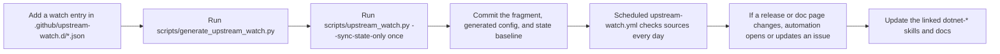

# Contributing

This repository is a shared `.NET` skill catalog.

If you maintain a library, framework integration, or developer tool, please add it here so other agents and contributors can understand how and why to use it.

The goal is not to dump links.

The goal is to make usage of a library or project explicit, concrete, and reusable.

## What We Want Contributors To Add

Please contribute:

- New `dotnet-*` skills for important libraries, frameworks, and integrations.
- Improvements to existing skills when usage guidance is incomplete or outdated.
- Upstream watch entries for projects that should trigger refresh issues when a new release or documentation change happens.
- Documentation improvements when a skill description, version, category, or compatibility statement is unclear.

## For Library and Project Authors

If you want people to use your library well, please add:

1. Your project to the upstream watch fragments in [`.github/upstream-watch.d/`](/Users/ksemenenko/Developer/dotnet-skills/.github/upstream-watch.d)
2. A dedicated skill under [`skills/`](/Users/ksemenenko/Developer/dotnet-skills/skills) when the project is important enough to justify one
3. Clear guidance in that skill about:
   - what the library is
   - why someone should use it
   - when it should be preferred
   - how it is typically wired into a real `.NET` project
   - what problem it solves
   - what it should not be used for

The skill must be understandable by someone who has never used your project before.

For upstream watch configuration, do not append everything to one huge root JSON file.
Add the watch to the right fragment under [`.github/upstream-watch.d/`](/Users/ksemenenko/Developer/dotnet-skills/.github/upstream-watch.d), then regenerate [`.github/upstream-watch.json`](/Users/ksemenenko/Developer/dotnet-skills/.github/upstream-watch.json).

## Required Skill Metadata

Every `SKILL.md` must include these frontmatter fields:

- `name`
- `version`
- `category`
- `description`
- `compatibility`

Rules:

- `version` is required and is shown in the README catalog.
- `description` must be a clear, exact statement of what the skill is and when it should be used.
- `description` is copied into the README catalog, so write it carefully.
- `category` must match one of the supported catalog categories.

## Skill Versioning Policy

Use semantic versioning for skill metadata:

- `1.0.0` for a new stable skill
- patch version for clarifications, examples, wording fixes, or small non-breaking improvements
- minor version for meaningful scope expansion or materially better guidance
- major version for a renamed, repurposed, or incompatibly restructured skill

If you materially change what a skill tells an agent to do, bump the version.

## Skill Content Expectations

A good skill is unambiguous.

It should make these points obvious:

- What is this project or library?
- Why would someone use it?
- In which type of `.NET` project does it belong?
- What are the main integration decisions?
- What validations should happen after using it?

If the skill explains non-trivial wiring, runtime flow, integration steps, or decision branches, add at least one Mermaid diagram that makes those details explicit.
Do not leave complex implementation guidance as prose only when a simple diagram would clarify it.

Do not write vague descriptions like:

- "Helper library for communication"
- "Useful storage abstraction"
- "Integration for graphs"

Write precise descriptions like:

- "Provide a provider-agnostic blob storage abstraction for .NET applications that need to work across multiple cloud object storage backends."
- "Use this library when a .NET application wants explicit result objects instead of exception-driven control flow, especially in ASP.NET Core APIs."

## Required Files For A New Skill

Create:

```text
skills/<skill-slug>/
├── SKILL.md
├── scripts/       # optional
├── references/    # optional
└── assets/        # optional
```

`SKILL.md` is the only required file. It uses the universal Agent Skills format with YAML frontmatter (name, description) that works across Claude, Copilot, Gemini, and Codex.

## README and Catalog

The source of truth is the skill metadata in `skills/*/SKILL.md`.

The release catalog manifest is generated in CI during release workflows.
Do not treat the checked-in `catalog/skills.json` file as the canonical source.

Do not hand-edit the generated catalog tables.

Instead:

1. Edit the skill metadata in `SKILL.md`
2. If you want a local preview of generated outputs, run:

```bash
python3 scripts/generate_catalog.py
```

This preview updates:

- the generated catalog section in [`README.md`](/Users/ksemenenko/Developer/dotnet-skills/README.md)
- the machine-readable manifest in [`catalog/skills.json`](/Users/ksemenenko/Developer/dotnet-skills/catalog/skills.json)

For metadata-only validation without rewriting generated files:

```bash
python3 scripts/generate_catalog.py --validate-only
```

## Dotnet Tool Distribution

This repository also publishes an installable `.NET` tool for consumers of the catalog:

- package id: `dotnet-skills`
- command name: `dotnet-skills`
- CLI shape: `dotnet skills ...`

The tool is for distribution of the catalog itself, not for general repo maintenance.
It now uses remote GitHub catalog releases by default and only falls back to the bundled catalog when remote sync is unavailable.
Do not publish a new NuGet package for every catalog-only change.

CLI naming rule:

- keep canonical skill IDs in the catalog as `dotnet-*`
- allow short aliases in commands, for example `dotnet skills install aspire`
- treat the CLI alias layer as user-facing convenience, not as a replacement for stable skill names in `skills/`

Agent target rule:

- support Codex, Claude, Copilot, and Gemini target layouts through `--agent`
- support global or repository-local installation through `--scope`
- when `--agent` is omitted, auto-detect existing repo roots in this order: `.codex`, `.claude`, `.github`, `.gemini`, `.agents`; if none exist, install into a root `skills/` folder
- keep `--target` as an explicit override when a caller wants a custom path
- for Claude, generate native `.claude/agents` subagent files from `SKILL.md`
- for Gemini, use `.gemini/skills` for explicit `--agent gemini` installs, but keep compatibility with existing shared `.agents/skills` layouts during auto-detect

Publishing is handled by [`.github/workflows/publish-tool.yml`](/Users/ksemenenko/Developer/dotnet-skills/.github/workflows/publish-tool.yml).

Preferred publish model:

1. Add the `NUGET_API_KEY` repository secret
2. Keep only the manual base version in [`tools/ManagedCode.DotnetSkills/ManagedCode.DotnetSkills.csproj`](/Users/ksemenenko/Developer/dotnet-skills/tools/ManagedCode.DotnetSkills/ManagedCode.DotnetSkills.csproj) as `<VersionPrefix>major.minor</VersionPrefix>`
3. Let [`.github/workflows/publish-tool.yml`](/Users/ksemenenko/Developer/dotnet-skills/.github/workflows/publish-tool.yml) publish automatically from `main` when tool-source inputs change, or trigger it manually only for a backfill or rerun

The workflow resolves the publish version in CI as `<VersionPrefix>.<GITHUB_RUN_NUMBER>` and pushes the produced `.nupkg` to NuGet. For example, a checked-in `0.0` base version becomes `0.0.412` on run `412`.

## Catalog Releases

Skill content releases are separate from NuGet tool releases.

Catalog releases are published automatically by [`.github/workflows/publish-catalog.yml`](/Users/ksemenenko/Developer/dotnet-skills/.github/workflows/publish-catalog.yml) on pushes to `main` when catalog-source inputs change.

Rules:

- catalog release tags must use `catalog-v<version>`
- the automatic catalog version format is `<year>.<month>.<day>.<run>`, for example `2026.3.15.42`
- the normal flow is automatic on `main`; do not treat manual dispatch as the primary release path
- the workflow generates fresh catalog outputs in CI from `skills/*/SKILL.md`
- the tool resolves the latest remote catalog from the newest non-draft `catalog-v*` GitHub release
- the workflow uploads two assets:
  - `dotnet-skills-manifest.json`
  - `dotnet-skills-catalog.zip`
- if you need a backfill or emergency rerun, `workflow_dispatch` may still provide an explicit `catalog_version`
- use `dotnet skills sync --catalog-version <version>` only when you intentionally need to validate a pinned catalog release after it is published

If you change the tool:

```bash
dotnet build dotnet-skills.slnx
dotnet pack dotnet-skills.slnx -c Release
```

Installability smoke tests run in CI.
Do not use a local `dotnet tool install --add-source artifacts/nuget ...` loop as the normal contributor workflow.

If you change the catalog release flow, also check:

```bash
dotnet skills list --bundled
dotnet skills sync --catalog-version <version>
```

Official references:

- [Create a .NET tool](https://learn.microsoft.com/en-us/dotnet/core/tools/global-tools-how-to-create)
- [NuGet Trusted Publishers](https://learn.microsoft.com/en-us/nuget/nuget-org/trusted-publishers)
- [Create a package using MSBuild](https://learn.microsoft.com/en-us/nuget/create-packages/creating-a-package-msbuild)
- [Publish packages with `dotnet nuget push`](https://learn.microsoft.com/en-us/dotnet/core/tools/dotnet-nuget-push)
- [GitHub REST API for releases](https://docs.github.com/en/rest/releases/releases)

## Upstream Watch Entries

If you add a project to the watch list:

1. Add an entry to the right fragment under [`.github/upstream-watch.d/`](/Users/ksemenenko/Developer/dotnet-skills/.github/upstream-watch.d)
2. Map it to the affected `dotnet-*` skills
3. Add `match_tag_regex` if the repository publishes multiple release streams
4. Regenerate the root watch file:

```bash
python3 scripts/generate_upstream_watch.py
```

5. Refresh the baseline:

```bash
python3 scripts/upstream_watch.py --sync-state-only
```

For a safe preview:

```bash
python3 scripts/upstream_watch.py --dry-run
```

### Which File Do I Edit?

Do not edit [`.github/upstream-watch.json`](/Users/ksemenenko/Developer/dotnet-skills/.github/upstream-watch.json) directly.
That file is generated from the fragments in [`.github/upstream-watch.d/`](/Users/ksemenenko/Developer/dotnet-skills/.github/upstream-watch.d).

Why the folder ends with `.d`:

- `.d` is a common config convention meaning "directory of drop-in fragments"
- each file in that directory contributes part of the generated watch config
- the goal is to keep watches split by vendor or domain instead of storing everything in one huge JSON file

Use this rule:

- `10-microsoft-releases.json` for Microsoft or official .NET GitHub release feeds
- `20-managedcode-releases.json` for ManagedCode repositories
- `30-docs.json` for official documentation pages
- `40-<vendor>.json` for any other vendor or project family

If a vendor does not fit an existing file, create a new fragment such as `40-myvendor.json` instead of bloating another file.

### What Happens After I Add A Watch?



### GitHub Release Watch Example

Use `kind: "github_release"` when you want automation to watch GitHub releases for a repository:

```json
{
  "id": "myvendor-myproject-release",
  "kind": "github_release",
  "name": "MyVendor MyProject release",
  "owner": "myvendor",
  "repo": "MyProject",
  "notes": "Review MyProject guidance when a new release changes APIs, runtime requirements, or recommended integration patterns.",
  "skills": [
    "dotnet-myproject"
  ]
}
```

Add `match_tag_regex` when the repo publishes multiple streams and you only want the .NET-facing tags:

```json
{
  "id": "myvendor-myproject-release",
  "kind": "github_release",
  "name": "MyVendor MyProject release",
  "owner": "myvendor",
  "repo": "MyProject",
  "match_tag_regex": "^dotnet-",
  "notes": "Review the .NET integration skill when the .NET release stream changes.",
  "skills": [
    "dotnet-myproject"
  ]
}
```

### Documentation Watch Example

Use `kind: "http_document"` when you want automation to watch a stable documentation page:

```json
{
  "id": "myproject-docs",
  "kind": "http_document",
  "name": "MyProject documentation",
  "url": "https://learn.microsoft.com/example/myproject/overview",
  "notes": "Review the MyProject skill when the official overview page changes.",
  "skills": [
    "dotnet-myproject"
  ]
}
```

### Required Fields

Every watch entry should make these points clear:

- `id`: stable unique identifier used by automation and issue tracking
- `kind`: `github_release` or `http_document`
- `name`: human-readable source name
- source coordinates:
  - `owner` and `repo` for `github_release`
  - `url` for `http_document`
- `notes`: why a change matters
- `skills`: which `dotnet-*` skills should be reviewed

### Commands To Run After Editing Watches

After editing [`.github/upstream-watch.d/`](/Users/ksemenenko/Developer/dotnet-skills/.github/upstream-watch.d):

```bash
python3 scripts/generate_upstream_watch.py
python3 scripts/generate_upstream_watch.py --check
python3 scripts/upstream_watch.py --sync-state-only
python3 scripts/upstream_watch.py --dry-run
```

What each command is for:

- `generate_upstream_watch.py`: rebuilds [`.github/upstream-watch.json`](/Users/ksemenenko/Developer/dotnet-skills/.github/upstream-watch.json) from fragments
- `--check`: verifies the generated file is in sync
- `--sync-state-only`: records the current upstream values as the new baseline without opening issues
- `--dry-run`: shows what the watcher would do before CI runs it for real

## Before Opening A PR

Run the relevant checks:

```bash
python3 -m py_compile scripts/generate_catalog.py scripts/generate_upstream_watch.py scripts/upstream_watch.py
python3 scripts/generate_catalog.py --validate-only
python3 scripts/generate_upstream_watch.py
python3 scripts/generate_upstream_watch.py --check
python3 scripts/upstream_watch.py --dry-run
```

If you changed the watch config:

```bash
python3 scripts/upstream_watch.py --sync-state-only
```

## Catalog Categories

Valid categories are:

- `Core`
- `Web and Cloud`
- `Desktop and Mobile`
- `Data, Distributed, and AI`
- `Legacy and Compatibility`
- `Quality, Testing, and Tooling`

## Final Rule

Please add your projects and write skills for them.

If your library matters to the `.NET` ecosystem, the skill should explain clearly:

- what it is
- why it exists
- how to use it in a concrete project
- when to choose it

That is the standard this repository is trying to enforce.
