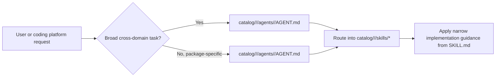
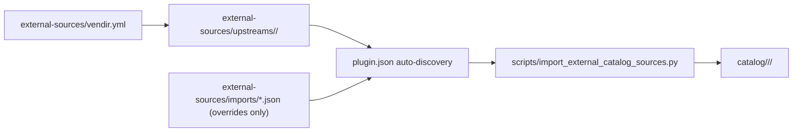

# dotnet-skills

[](https://www.nuget.org/packages/dotnet-skills)
[](LICENSE)
[](#catalog)
[](https://dotnet.microsoft.com/)

**Stop explaining .NET to your AI. Start building.**

We've all been there: asking Claude to use Entity Framework, only to get EF6 patterns in a .NET 8 project. Explaining to Copilot that Blazor Server and Blazor WebAssembly aren't the same thing. Watching Codex generate `Startup.cs` for a Minimal API project.

This catalog fixes that. A growing catalog covering the entire .NET ecosystem—from ASP.NET Core to Orleans, from MAUI to Semantic Kernel. Install them once, and your AI agent actually knows modern .NET.

## Why This Matters

- **No more outdated patterns.** Skills are maintained by the community and track official Microsoft documentation.
- **Works everywhere.** Same skills for Claude, Copilot, Gemini, Codex, and Junie.
- **Community-driven.** Missing a skill for your favorite library? Add it and help everyone.

**Your favorite .NET library deserves a skill.** If you maintain an open-source project or just love a framework that's missing, [contribute it](CONTRIBUTING.md). Let's make AI agents actually useful for .NET developers.

## Quick Start

```bash
dotnet tool install --global dotnet-skills

# choose one dedicated agent launcher
dotnet tool install --global dotnet-agents
dotnet tool install --global agents

dotnet skills version                       # show current tool version and latest NuGet version
dotnet skills --version                     # alias for the same version view
dotnet skills list                          # show installed and available skills
dotnet skills package list                  # show curated skill stacks and category-wide bundles
dotnet skills list --local                  # only installed skills in the current target
dotnet skills recommend                     # suggest skills from local .csproj files
dotnet skills install --auto                # install skills for NuGet packages detected in local .csproj files
dotnet skills install --auto --prune        # remove stale auto-managed skills that no longer match the project
dotnet skills install package ai            # install a multi-skill skill stack
dotnet skills install package mcaf          # install the local MCAF governance skill stack
dotnet skills package install orleans       # alias for package-first install flow
dotnet skills install aspire orleans        # install skills
dotnet skills remove --all                  # remove installed catalog skills from the target
dotnet skills update                        # refresh installed catalog skills
dotnet skills install blazor --agent claude # install for a specific agent
dotnet agents list                          # show bundled orchestration agents
dotnet agents install router --auto         # install agents to detected native agent folders
agents list                                 # same agent-only catalog via the plain standalone command
agents install router --auto                # same agent install flow without the dotnet-prefixed launcher
```

## Commands

| Command | Description |
|---------|-------------|
| `dotnet skills version` | Show the current installed tool version and check whether NuGet has a newer release |
| `dotnet skills list` | Show the current inventory, compare project/global scope when relevant, and keep the remaining catalog as a compact category summary |
| `dotnet skills package list` | Show the curated and category-based skill stacks that expand into multiple related skills |
| `dotnet skills recommend` | Scan local `*.csproj` files, propose relevant `dotnet-*` skills, and let you decide what to install |
| `dotnet skills install --auto` | Inspect local `*.csproj` files, detect NuGet packages and strong project signals, and install matching skills automatically |
| `dotnet skills install --auto --prune` | Remove stale auto-managed skills that no longer match the current project's NuGet packages or app-model signals |
| `dotnet skills install <skill...>` | Install one or more skills |
| `dotnet skills install package <package...>` | Install one or more skill stacks such as `ai`, `code-quality`, `mcaf`, or `orleans`, with each stack expanding into multiple related skills |
| `dotnet skills package install <package...>` | Alias for the same package installation flow |
| `dotnet skills remove [skill...]` | Remove one or more installed catalog skills, or use `--all` to clear the target |
| `dotnet skills update [skill...]` | Update installed catalog skills to the selected catalog version |
| `dotnet skills sync` | Download latest catalog |
| `dotnet skills where` | Show install paths |
| `dotnet agents list` | List available orchestration agents |
| `dotnet agents install <agent...>` | Install orchestration agents |
| `dotnet agents install router --auto` | Install agents to all detected platforms |
| `dotnet agents remove <agent...>` | Remove installed agents |
| `dotnet agents where` | Show native agent install paths |
| `agents list` | List available orchestration agents through the standalone `agents` tool |
| `agents install <agent...>` | Install orchestration agents through the standalone `agents` tool |
| `agents where` | Show native agent install paths through the standalone `agents` tool |

Use `--agent` to target a specific agent platform, `--scope` to choose global or project install. Use `dotnet skills list --installed-only` or the shorter `dotnet skills list --local` when you only want the installed inventory, or `--available-only` when you want the detailed category-by-category breakdown of the remaining catalog. The default `list` view stays compact: it shows the current target inventory, compares project/global scope when that comparison is meaningful, and keeps the remaining catalog as a short category summary instead of dumping one giant description table. The CLI renders rich terminal tables by default so you can quickly see installed versions, update candidates, install commands, and when a newer `dotnet-skills`, `dotnet-agents`, or `agents` package is available on NuGet. `dotnet skills --version`, `dotnet agents --version`, and `agents --version` are shortcuts for the version view.

`dotnet-skills` remains the skill-first CLI and still supports `dotnet skills agent ...` for compatibility. The dedicated agent-only surface is published in both forms: `dotnet-agents` for `dotnet agents ...` and `agents` for `agents ...`. Both top-level `list`, `install`, `remove`, and `where` commands target orchestration agents directly.

`dotnet skills package list` shows the ready-made skill stacks. Skill-stack installs are bulk shortcuts for related skill sets, so `dotnet skills install package ai`, `dotnet skills install package code-quality`, `dotnet skills install package mcaf`, or `dotnet skills install package orleans` will install every skill mapped to that stack in one pass.

`dotnet skills install --auto` inspects local `*.csproj` files, detects NuGet packages plus strong SDK and project-property signals, and installs the matching skills for that project automatically. Add `dotnet skills install --auto --prune` when you also want to remove stale auto-managed skills that no longer match the current project. Protected diagnostic skills and `dotnet-graphify-dotnet` are not pruned.

`dotnet skills recommend` is a scan-only command: it inspects local project files, proposes a skill list, and prints the install command you can run if you agree with the recommendations. It does not install anything automatically.

The bare `dotnet skills` usage view and `help` path also perform the automatic self-update check, so an outdated tool still tells you to upgrade before it renders the command table.

Use `dotnet skills version --no-check`, `dotnet agents version --no-check`, or `agents version --no-check` when you only want the local installed tool version without calling NuGet. Set `DOTNET_SKILLS_SKIP_UPDATE_CHECK=1`, `DOTNET_AGENTS_SKIP_UPDATE_CHECK=1`, or `AGENTS_SKIP_UPDATE_CHECK=1` if you want to suppress automatic update notices during normal command startup.

Catalog releases are published automatically in `.github/workflows/publish-catalog.yml` at `04:00` UTC and include the `catalog-v*` release, GitHub Pages deployment, and NuGet publish for `dotnet-skills`, `dotnet-agents`, and `agents` in the same run. Automatic catalog versions use a numeric calendar-plus-daily-index format such as `2026.3.15.0`, where the first UTC-day release is `.0`, the second is `.1`, and so on. `dotnet-skills` reads the newest non-draft `catalog-v*` release by default, and `--catalog-version` is only for intentional pinning.

Install whichever dedicated agent package you prefer:

- `dotnet tool install --global dotnet-agents` gives you the `dotnet agents ...` command shape.
- `dotnet tool install --global agents` gives you the `agents ...` command shape.

## Agent Support

### Skills Installation Paths

| Agent | Global | Project |
|-------|--------|---------|
| Claude | `~/.claude/skills/` | `.claude/skills/` |
| Copilot | `~/.copilot/skills/` | `.github/skills/` |
| Gemini | `~/.gemini/skills/` | `.gemini/skills/` |
| Codex | `$CODEX_HOME/skills/` (default: `~/.codex/skills/`) | `.codex/skills/` |
| Junie | `~/.junie/skills/` | `.junie/skills/` |
| Default fallback | `~/.agents/skills/` | `.agents/skills/` |

### Orchestration Agents Installation Paths

| Agent | Global | Project |
|-------|--------|---------|
| Claude | `~/.claude/agents/` | `.claude/agents/` |
| Copilot | `~/.copilot/agents/` | `.github/agents/` |
| Gemini | `~/.gemini/agents/` | `.gemini/agents/` |
| Codex | `$CODEX_HOME/agents/` (default: `~/.codex/agents/`) | `.codex/agents/` |
| Junie | `~/.junie/agents/` | `.junie/agents/` |

`dotnet agents install --auto` and `agents install --auto` write only to already existing native agent directories. They do not use `.agents` as a shared agent target; if no native agent directory exists yet, specify `--agent` or `--target`.

`dotnet agents ... --target <path>` and `agents ... --target <path>` require an explicit `--agent` because the generated file format depends on the selected platform.

When `--agent` is omitted for skill installation, the tool checks for `.codex/`, `.claude/`, `.github/`, `.gemini/`, and `.junie/` directories in that order, installs into every already existing native platform target it finds, and creates `.agents/skills/` only when no native platform folder exists.

## Orchestration Agents

This repository now tracks a parallel agent layer above the skill catalog.

- reusable repo-authored `dotnet-*` skills, vendir-imported upstream skills, and repo-owned agents all live under package folders in `catalog/<type>/<package>/`.
- `catalog/<type>/<package>/skills/<skill>/SKILL.md` holds the detailed implementation guidance for one skill.
- `catalog/<type>/<package>/agents/<agent>/AGENT.md` holds routing behavior for one repo-owned orchestration agent.
- package `manifest.json` files hold the package-level metadata that both the installer and the public site scan.
- every skill and agent still gets its own folder so it can carry references, assets, scripts, and future installer metadata.
- an agent can therefore represent either a grouped pack of related skills or a narrow companion to one specific skill.
- the current `dotnet-skills` CLI remains skill-first; repo-owned agents can evolve and ship on their own track.
- runtime-specific `.agent.md` or native Claude files should be treated as install adapters, not as the canonical repo source format.



### Starter Agents

| Agent | Scope | Primary routing |
|-------|-------|-----------------|
| [`dotnet-router`](catalog/Platform/DotNet/agents/dotnet-router/) | package-scoped | classify web, data, AI, build, UI, testing, and modernization work |
| [`dotnet-build`](catalog/Platform/DotNet/agents/dotnet-build/) | package-scoped | restore, build, pack, CI, diagnostics |
| [`dotnet-data`](catalog/Frameworks/Entity-Framework-Core/agents/dotnet-data/) | package-scoped | EF Core, EF6, migrations, query issues |
| [`dotnet-frontend`](catalog/Tools/Biome/agents/dotnet-frontend/) | package-scoped | Blazor, frontend asset quality, browser-facing audits, and file-structure linting inside `.NET` repos |
| [`dotnet-ai`](catalog/Frameworks/Semantic-Kernel/agents/dotnet-ai/) | package-scoped | Semantic Kernel, Microsoft Agent Framework, Microsoft.Extensions.AI, MCP, ML.NET |
| [`dotnet-modernization`](catalog/Platform/Legacy-ASP.NET/agents/dotnet-modernization/) | package-scoped | upgrade, migration, and legacy modernization |
| [`dotnet-review`](catalog/Platform/Code-Review/agents/dotnet-review/) | package-scoped | code review, analyzers, testing, architecture |

### Package-Scoped Specialists

| Agent | Scope | Primary routing |
|-------|-------|-----------------|
| [`dotnet-orleans-specialist`](catalog/Frameworks/Orleans/agents/dotnet-orleans-specialist/) | package-scoped | Orleans grain boundaries, persistence, streams, reminders, placement, Aspire wiring, and cluster validation |
| [`dotnet-aspire-orchestrator`](catalog/Frameworks/Aspire/agents/dotnet-aspire-orchestrator/) | package-scoped | AppHost, CLI, first-party versus CommunityToolkit/Aspire integration choice, testing, and deployment routing inside the Aspire surface |
| [`agent-framework-router`](catalog/Frameworks/Microsoft-Agent-Framework/agents/agent-framework-router/) | package-scoped | Agent Framework agent-vs-workflow choice, `AgentThread`, tools, workflows, hosting, MCP/A2A/AG-UI, durable agents, and migration |

## Repository Layout

```text
catalog/
└── <Type>/
    └── <Package>/
        ├── manifest.json
        ├── icon.svg           # optional
        ├── skills/
        │   └── <skill-name>/
        │       ├── SKILL.md
        │       ├── manifest.json
        │       ├── scripts/     # optional
        │       ├── references/  # optional
        │       └── assets/      # optional
        └── agents/
            └── <agent-name>/
                ├── AGENT.md
                ├── manifest.json # optional
                ├── scripts/     # optional
                ├── references/  # optional
                └── assets/      # optional
```

The package-level `manifest.json` is the package control plane. It carries package title/description/icon and upstream links such as `links.repository`, `links.docs`, and `links.nuget`. Skill- or agent-specific metadata belongs in the nearest sibling `skills/<skill>/manifest.json` or `agents/<agent>/manifest.json`.

`SKILL.md` should stay focused on routing, workflow, deliverables, and validation. Do not put `version`, `category`, `packages`, or `package_prefix` in `SKILL.md` frontmatter.

## External Upstream Sources

External upstream repositories live in the dedicated [`external-sources/`](external-sources/) area.

- `external-sources/vendir.yml` and `external-sources/vendir.lock.yml` handle fetch-and-pin only.
- `external-sources/upstreams/` holds the checked-in vendored snapshots.
- `external-sources/imports/*.json` is overrides-only local policy for type, category, package naming, compatibility, and skill-level package trigger metadata.
- `scripts/import_external_catalog_sources.py` auto-discovers upstream plugins from vendored `plugin.json` files, applies the local overrides, and normalizes the result into `catalog/<type>/<package>/`.
- Imported upstream `SKILL.md`, `AGENT.md`, and `references/` content is copied verbatim; local-only metadata stays in sibling `manifest.json` files instead of being injected into upstream markdown.

Official imports may keep their upstream skill ids instead of being renamed to `dotnet-*`.



When you refresh vendored upstream content locally, use `bash scripts/sync_external_catalog_sources.sh`.

## Catalog

<!-- BEGIN GENERATED CATALOG -->

This catalog currently contains **156** skills.

### AI

| Skill | Version | Description |
|-------|---------|-------------|
| [`dotnet-mcaf-ml-ai-delivery`](catalog/Platform/MCAF/skills/dotnet-mcaf-ml-ai-delivery/) | `1.0.0` | Apply MCAF ML/AI delivery guidance for data exploration, feasibility, experimentation, testing, responsible AI, and operating ML systems. Use when the repo includes model training, inference, data science workflows, or ML-specific delivery planning. |
| [`dotnet-mcp`](catalog/Libraries/MCP/skills/dotnet-mcp/) | `1.1.1` | Build or consume Model Context Protocol (MCP) servers and clients in .NET using the official MCP C# SDK, including stdio, Streamable HTTP, tools, prompts, resources, and capability negotiation. |
| [`dotnet-microsoft-agent-framework`](catalog/Frameworks/Microsoft-Agent-Framework/skills/dotnet-microsoft-agent-framework/) | `1.8.0` | Build .NET AI agents and multi-agent workflows with Microsoft Agent Framework using the right agent type, threads, tools, workflows, hosting protocols, and enterprise guardrails. |
| [`dotnet-microsoft-extensions-ai`](catalog/Libraries/Microsoft-Extensions-AI/skills/dotnet-microsoft-extensions-ai/) | `1.3.0` | Build provider-agnostic .NET AI integrations with `Microsoft.Extensions.AI`, `IChatClient`, embeddings, middleware, structured output, vector search, and evaluation. |
| [`dotnet-mixed-reality`](catalog/Platform/Mixed-Reality/skills/dotnet-mixed-reality/) | `1.0.0` | Work on C# and .NET-adjacent mixed-reality solutions around HoloLens, MRTK, OpenXR, Azure services, and integration boundaries where .NET participates in the stack. |
| [`dotnet-mlnet`](catalog/Frameworks/ML.NET/skills/dotnet-mlnet/) | `1.0.0` | Use ML.NET to train, evaluate, or integrate machine-learning models into .NET applications with realistic data preparation, inference, and deployment expectations. |
| [`dotnet-semantic-kernel`](catalog/Frameworks/Semantic-Kernel/skills/dotnet-semantic-kernel/) | `1.0.0` | Build AI-enabled .NET applications with Semantic Kernel using services, plugins, prompts, and function-calling patterns that remain testable and maintainable. |
| [`mcp-csharp-create`](catalog/Platform/Official-DotNet-AI/skills/mcp-csharp-create/) | `0.1.0` | Create MCP servers using the C# SDK and .NET project templates. Covers scaffolding, tool/prompt/resource implementation, and transport configuration for stdio and HTTP. USE FOR: creating new MCP server projects, scaffolding with dotnet new mcpserver, adding MCP tools/prompts/resources, choosing stdio vs HTTP transport, configuring MCP hosting in Program.cs, setting up ASP.NET Core MCP endpoints with MapMcp. DO NOT USE FOR: debugging or running existing servers (use mcp-csharp-debug), writing tests (use mcp-csharp-test), publishing or deploying (use mcp-csharp-publish), building MCP clients, non-.NET MCP servers. |
| [`mcp-csharp-debug`](catalog/Platform/Official-DotNet-AI/skills/mcp-csharp-debug/) | `0.1.0` | Run and debug C# MCP servers locally. Covers IDE configuration, MCP Inspector testing, GitHub Copilot Agent Mode integration, logging setup, and troubleshooting. USE FOR: running MCP servers locally with dotnet run, configuring VS Code or Visual Studio for MCP debugging, testing tools with MCP Inspector, testing with GitHub Copilot Agent Mode, diagnosing tool registration issues, setting up mcp.json configuration, debugging MCP protocol messages, configuring logging for stdio and HTTP servers. DO NOT USE FOR: creating new MCP servers (use mcp-csharp-create), writing automated tests (use mcp-csharp-test), publishing or deploying to production (use mcp-csharp-publish). |
| [`mcp-csharp-publish`](catalog/Platform/Official-DotNet-AI/skills/mcp-csharp-publish/) | `0.1.0` | Publish and deploy C# MCP servers. Covers NuGet packaging for stdio servers, Docker containerization for HTTP servers, Azure Container Apps and App Service deployment, and publishing to the official MCP Registry. USE FOR: packaging stdio MCP servers as NuGet tools, creating Dockerfiles for HTTP MCP servers, deploying to Azure Container Apps or App Service, publishing to the MCP Registry at registry.modelcontextprotocol.io, configuring server.json for MCP package metadata, setting up CI/CD for MCP server publishing. DO NOT USE FOR: publishing general NuGet libraries (not MCP-specific), general Docker guidance unrelated to MCP, creating new servers (use mcp-csharp-create), debugging (use mcp-csharp-debug), writing tests (use mcp-csharp-test). |
| [`mcp-csharp-test`](catalog/Platform/Official-DotNet-AI/skills/mcp-csharp-test/) | `0.1.0` | Test C# MCP servers at multiple levels: unit tests for individual tools and integration tests using the MCP client SDK. USE FOR: unit testing MCP tool methods, integration testing with in-memory MCP client/server, end-to-end testing via MCP protocol, testing HTTP MCP servers with WebApplicationFactory, mocking dependencies in tool tests, creating evaluations for MCP servers, writing eval questions, measuring tool quality. DO NOT USE FOR: testing MCP clients (this is server testing only), load or performance testing, testing non-.NET MCP servers, debugging server issues (use mcp-csharp-debug). |
| [`technology-selection`](catalog/Platform/Official-DotNet-AI/skills/technology-selection/) | `0.1.0` | Guides technology selection and implementation of AI and ML features in .NET 8+ applications using ML.NET, Microsoft.Extensions.AI (MEAI), Microsoft Agent Framework (MAF), GitHub Copilot SDK, ONNX Runtime, and OllamaSharp. Covers the full spectrum from classic ML through modern LLM orchestration to local inference. Use when adding classification, regression, clustering, anomaly detection, recommendation, LLM integration (text generation, summarization, reasoning), RAG pipelines with vector search, agentic workflows with tool calling, Copilot extensions, or custom model inference via ONNX Runtime to a .NET project. DO NOT USE FOR projects targeting .NET Framework (requires .NET 8+), the task is pure data engineering or ETL with no ML/AI component, or the project needs a custom deep learning training loop (use Python with PyTorch/TensorFlow, then export to ONNX for .NET inference). |

### Architecture

| Skill | Version | Description |
|-------|---------|-------------|
| [`dotnet-archunitnet`](catalog/Libraries/ArchUnitNET/skills/dotnet-archunitnet/) | `1.0.0` | Use the open-source free `ArchUnitNET` library for architecture rules in .NET tests. Use when a repo needs richer architecture assertions than lightweight fluent rule libraries usually provide. |
| [`dotnet-graphify-dotnet`](catalog/Tools/Graphify/skills/dotnet-graphify-dotnet/) | `1.0.0` | Use `graphify-dotnet` to generate codebase knowledge graphs, architecture snapshots, and exportable repository maps from .NET or polyglot source trees, with optional AI-enriched semantic relationships. |
| [`dotnet-mcaf-documentation`](catalog/Platform/MCAF/skills/dotnet-mcaf-documentation/) | `1.0.0` | Apply MCAF documentation guidance for docs structure, navigation, source-of-truth placement, and writing quality. Use when a repo’s docs are missing, stale, duplicated, or hard to navigate, or when adding new durable engineering guidance. |
| [`dotnet-mcaf-feature-spec`](catalog/Platform/MCAF/skills/dotnet-mcaf-feature-spec/) | `1.0.0` | Apply MCAF feature-spec guidance to create or update a feature spec under `docs/Features/` with business rules, user flows, system behaviour, verification, and Definition of Done. Use when the user asks for a feature spec, executable requirements, acceptance criteria, behaviour documentation, or a pre-implementation plan for non-trivial behaviour changes. |
| [`dotnet-mcaf-nfr`](catalog/Platform/MCAF/skills/dotnet-mcaf-nfr/) | `1.0.0` | Apply MCAF non-functional-requirements guidance to capture or refine explicit quality attributes such as accessibility, reliability, scalability, maintainability, performance, and compliance. Use when a feature or architecture change needs explicit quality attributes and trade-offs. |
| [`dotnet-netarchtest`](catalog/Libraries/NetArchTest/skills/dotnet-netarchtest/) | `1.0.0` | Use the open-source free `NetArchTest.Rules` library for architecture rules in .NET unit tests. Use when a repo wants lightweight, fluent architecture assertions for namespaces, dependencies, or layering. |

### Cloud

| Skill | Version | Description |
|-------|---------|-------------|
| [`dotnet-aspire`](catalog/Frameworks/Aspire/skills/dotnet-aspire/) | `1.3.1` | Build, upgrade, and operate .NET Aspire application hosts with current CLI, AppHost, ServiceDefaults, integrations, dashboard, testing, and Azure deployment patterns for distributed apps. |
| [`dotnet-azure-functions`](catalog/Frameworks/Azure-Functions/skills/dotnet-azure-functions/) | `1.0.0` | Build, review, or migrate Azure Functions in .NET with correct execution model, isolated worker setup, bindings, DI, and Durable Functions patterns. |

### Code Quality

| Skill | Version | Description |
|-------|---------|-------------|
| [`dotnet-analyzer-config`](catalog/Tools/Analyzer-Config/skills/dotnet-analyzer-config/) | `1.0.0` | Use a repo-root `.editorconfig` to configure free .NET analyzer and style rules. Use when a .NET repo needs rule severity, code-style options, section layout, or analyzer ownership made explicit. Nested `.editorconfig` files are allowed when they serve a clear subtree-specific purpose. |
| [`dotnet-biome`](catalog/Tools/Biome/skills/dotnet-biome/) | `1.0.0` | Use Biome in .NET repositories that ship Node-based frontend assets and want a fast combined formatter-linter-import organizer for JavaScript, TypeScript, CSS, JSON, GraphQL, or HTML. Use when a repo prefers a modern all-in-one CLI over a larger ESLint plus Prettier style stack. |
| [`dotnet-chous`](catalog/Tools/Chous/skills/dotnet-chous/) | `1.0.0` | Use Chous in .NET repositories that ship sizeable frontend codebases and want file-structure linting, naming convention enforcement, and folder-layout policy as a CLI gate. Use when the problem is frontend architecture drift in the file tree rather than semantic code issues inside the files. |
| [`dotnet-code-analysis`](catalog/Tools/Code-Analysis/skills/dotnet-code-analysis/) | `1.0.1` | Use the free built-in .NET SDK analyzers and analysis levels with gradual Roslyn warning promotion. Use when a .NET repo needs first-party code analysis, `EnableNETAnalyzers`, `AnalysisLevel`, or warning-as-error policy wired into build and CI. |
| [`dotnet-csharpier`](catalog/Tools/CSharpier/skills/dotnet-csharpier/) | `1.0.0` | Use the open-source free `CSharpier` formatter for C# and XML. Use when a .NET repo intentionally wants one opinionated formatter instead of a highly configurable `dotnet format`-driven style model. |
| [`dotnet-eslint`](catalog/Tools/ESLint/skills/dotnet-eslint/) | `1.0.0` | Use ESLint in .NET repositories that ship JavaScript, TypeScript, React, or other Node-based frontend assets. Use when a repo needs a configurable CLI lint gate for frontend correctness, import hygiene, unsafe patterns, or framework-specific rules. |
| [`dotnet-format`](catalog/Tools/Format/skills/dotnet-format/) | `1.0.0` | Use the free first-party `dotnet format` CLI for .NET formatting and analyzer fixes. Use when a .NET repo needs formatting commands, `--verify-no-changes` CI checks, or `.editorconfig`-driven code style enforcement. |
| [`dotnet-htmlhint`](catalog/Tools/HTMLHint/skills/dotnet-htmlhint/) | `1.0.0` | Use HTMLHint in .NET repositories that ship static HTML output or standalone frontend templates. Use when a repo needs a focused CLI lint gate for DOM structure, invalid attributes, and basic HTML correctness checks on static pages. |
| [`dotnet-metalint`](catalog/Tools/Metalint/skills/dotnet-metalint/) | `1.0.0` | Use Metalint in .NET repositories that ship Node-based frontend assets and want one CLI entrypoint over several underlying linters. Use when a repo wants to orchestrate ESLint, Stylelint, HTMLHint, and related frontend checks from a single checked-in `.metalint/` configuration. |
| [`dotnet-meziantou-analyzer`](catalog/Tools/Meziantou-Analyzer/skills/dotnet-meziantou-analyzer/) | `1.0.0` | Use the open-source free `Meziantou.Analyzer` package for design, usage, security, performance, and style rules in .NET. Use when a repo wants broader analyzer coverage with a single NuGet package. |
| [`dotnet-modern-csharp`](catalog/Tools/Modern-CSharp/skills/dotnet-modern-csharp/) | `1.0.0` | Write modern, version-aware C# for .NET repositories. Use when choosing language features across C# versions, especially C# 13 and C# 14, while staying compatible with the repo's target framework and `LangVersion`. |
| [`dotnet-quality-ci`](catalog/Tools/Quality-CI/skills/dotnet-quality-ci/) | `1.0.0` | Set up or refine open-source .NET code-quality gates for CI: formatting, `.editorconfig`, SDK analyzers, third-party analyzers, coverage, mutation testing, architecture tests, and security scanning. Use when a .NET repo needs an explicit quality stack in `AGENTS.md`, docs, or pipeline YAML. |
| [`dotnet-resharper-clt`](catalog/Tools/ReSharper-CLT/skills/dotnet-resharper-clt/) | `1.0.0` | Use the free official JetBrains ReSharper Command Line Tools for .NET repositories. Use when a repo wants powerful `jb inspectcode` inspections, `jb cleanupcode` cleanup profiles, solution-level `.DotSettings` enforcement, or a stronger CLI quality gate for C# than the default SDK analyzers alone. |
| [`dotnet-roslynator`](catalog/Tools/Roslynator/skills/dotnet-roslynator/) | `1.0.0` | Use the open-source free `Roslynator` analyzer packages and optional CLI for .NET. Use when a repo wants broad C# static analysis, auto-fix flows, dead-code detection, optional CLI checks, or extra rules beyond the SDK analyzers. |
| [`dotnet-sonarjs`](catalog/Tools/SonarJS/skills/dotnet-sonarjs/) | `1.0.0` | Use SonarJS-derived rules in .NET repositories that ship JavaScript or TypeScript frontends and need deeper bug-risk, code-smell, or cognitive-complexity checks than a minimal ESLint baseline. Use when the repo wants `eslint-plugin-sonarjs` locally or already runs SonarQube or SonarCloud in CI. |
| [`dotnet-stylecop-analyzers`](catalog/Tools/StyleCop-Analyzers/skills/dotnet-stylecop-analyzers/) | `1.0.0` | Use the open-source free `StyleCop.Analyzers` package for naming, layout, documentation, and style rules in .NET projects. Use when a repo wants stricter style conventions than the SDK analyzers alone provide. |
| [`dotnet-stylelint`](catalog/Tools/Stylelint/skills/dotnet-stylelint/) | `1.1.0` | Use Stylelint in .NET repositories that ship CSS, SCSS, or other stylesheet assets alongside web frontends. Use when a repo needs a dedicated CLI lint gate for selectors, properties, duplicate styles, naming conventions, or design-system rule enforcement. |
| [`dotnet-webhint`](catalog/Tools/webhint/skills/dotnet-webhint/) | `1.0.0` | Use webhint in .NET repositories that ship browser-facing frontends. Use when a repo needs CLI audits for accessibility, performance, security headers, PWA signals, SEO, or runtime page quality against a served site or built frontend output. |

### Core

| Skill | Version | Description |
|-------|---------|-------------|
| [`binlog-failure-analysis`](catalog/Tools/Official-DotNet-MSBuild/skills/binlog-failure-analysis/) | `0.1.0` | Analyze MSBuild binary logs to diagnose build failures by replaying binlogs to searchable text logs. Only activate in MSBuild/.NET build context. USE FOR: build errors that are unclear from console output, diagnosing cascading failures across multi-project builds, tracing MSBuild target execution order, investigating common errors like CS0246 (type not found), MSB4019 (imported project not found), NU1605 (package downgrade), MSB3277 (version conflicts), and ResolveProjectReferences failures. Requires an existing .binlog file. DO NOT USE FOR: generating binlogs (use binlog-generation), build performance analysis (use build-perf-diagnostics), non-MSBuild build systems. INVOKES: dotnet msbuild binlog replay, grep, cat, head, tail for log analysis. |
| [`binlog-generation`](catalog/Tools/Official-DotNet-MSBuild/skills/binlog-generation/) | `0.1.0` | Generate MSBuild binary logs (binlogs) for build diagnostics and analysis. Only activate in MSBuild/.NET build context. USE FOR: adding /bl:{} to any dotnet build, test, pack, publish, or restore command to capture a full build execution trace, prerequisite for binlog-failure-analysis and build-perf-diagnostics skills, enabling post-build investigation of errors or performance. Requires MSBuild 17.8+ / .NET 8 SDK+ for {} placeholder; PowerShell needs -bl:{{}}. DO NOT USE FOR: non-MSBuild build systems (npm, Maven, CMake), analyzing an existing binlog (use binlog-failure-analysis instead). INVOKES: shell commands (dotnet build /bl:{}). |
| [`build-parallelism`](catalog/Tools/Official-DotNet-MSBuild/skills/build-parallelism/) | `0.1.0` | Guide for optimizing MSBuild build parallelism and multi-project scheduling. Only activate in MSBuild/.NET build context. USE FOR: builds not utilizing all CPU cores, speeding up multi-project solutions, evaluating graph build mode (/graph), build time not improving with -m flag, understanding project dependency topology. Note: /maxcpucount default is 1 (sequential) — always use -m for parallel builds. Covers /maxcpucount, graph build for better scheduling and isolation, BuildInParallel on MSBuild task, reducing unnecessary ProjectReferences, solution filters (.slnf) for building subsets. DO NOT USE FOR: single-project builds, incremental build issues (use incremental-build), compilation slowness within a project (use build-perf-diagnostics), non-MSBuild build systems. INVOKES: dotnet build -m, dotnet build /graph, binlog analysis. |
| [`build-perf-baseline`](catalog/Tools/Official-DotNet-MSBuild/skills/build-perf-baseline/) | `0.1.0` | Establish build performance baselines and apply systematic optimization techniques. Only activate in MSBuild/.NET build context. USE FOR: diagnosing slow builds, establishing before/after measurements (cold, warm, no-op scenarios), applying optimization strategies like MSBuild Server, static graph builds, artifacts output, and dependency graph trimming. Start here before diving into build-perf-diagnostics, incremental-build, or build-parallelism. DO NOT USE FOR: non-MSBuild build systems, detailed bottleneck analysis (use build-perf-diagnostics after baselining). |
| [`build-perf-diagnostics`](catalog/Tools/Official-DotNet-MSBuild/skills/build-perf-diagnostics/) | `0.1.0` | Diagnose MSBuild build performance bottlenecks using binary log analysis. Only activate in MSBuild/.NET build context. USE FOR: identifying why builds are slow by analyzing binlog performance summaries, detecting ResolveAssemblyReference (RAR) taking >5s, Roslyn analyzers consuming >30% of Csc time, single targets dominating >50% of build time, node utilization below 80%, excessive Copy tasks, NuGet restore running every build. Covers timeline analysis, Target/Task Performance Summary interpretation, and 7 common bottleneck categories. Use after build-perf-baseline has established measurements. DO NOT USE FOR: establishing initial baselines (use build-perf-baseline first), fixing incremental build issues (use incremental-build), parallelism tuning (use build-parallelism), non-MSBuild build systems. INVOKES: dotnet msbuild binlog replay with performancesummary, grep for analysis. |
| [`check-bin-obj-clash`](catalog/Tools/Official-DotNet-MSBuild/skills/check-bin-obj-clash/) | `0.1.0` | Detects MSBuild projects with conflicting OutputPath or IntermediateOutputPath. Only activate in MSBuild/.NET build context. USE FOR: builds failing with 'Cannot create a file when that file already exists', 'The process cannot access the file because it is being used by another process', intermittent build failures that succeed on retry, missing outputs in multi-project builds, multi-targeting builds where project.assets.json conflicts. Diagnoses when multiple projects or TFMs write to the same bin/obj directories due to shared OutputPath, missing AppendTargetFrameworkToOutputPath, or extra global properties like PublishReadyToRun creating redundant evaluations. DO NOT USE FOR: file access errors unrelated to MSBuild (OS-level locking), single-project single-TFM builds, non-MSBuild build systems. INVOKES: dotnet msbuild binlog replay, grep for output path analysis. |
| [`convert-to-cpm`](catalog/Tools/Official-DotNet-NuGet/skills/convert-to-cpm/) | `0.1.0` | Convert .NET projects and solutions (.sln, .slnx) to NuGet Central Package Management (CPM) using Directory.Packages.props. USE FOR: converting to CPM, centralizing or aligning NuGet package versions across multiple projects, inlining MSBuild version properties from Directory.Build.props into Directory.Packages.props, resolving version conflicts or mismatches across a solution or repository, updating or bumping or syncing package versions across projects. Also activate when packages are out of sync, drifting, or inconsistent -- even without the user mentioning CPM. Provides baseline build capture, version conflict resolution, build validation with binlog comparison, and a structured post-conversion report. DO NOT USE FOR: packages.config projects (must migrate to PackageReference first) or repositories that already have CPM fully enabled. |
| [`csharp-scripts`](catalog/Platform/Official-DotNet/skills/csharp-scripts/) | `0.1.0` | Run single-file C# programs as scripts (file-based apps) for quick experimentation, prototyping, and concept testing. Use when the user wants to write and execute a small C# program without creating a full project. |
| [`directory-build-organization`](catalog/Tools/Official-DotNet-MSBuild/skills/directory-build-organization/) | `0.1.0` | Guide for organizing MSBuild infrastructure with Directory.Build.props, Directory.Build.targets, Directory.Packages.props, and Directory.Build.rsp. Only activate in MSBuild/.NET build context. USE FOR: structuring multi-project repos, centralizing build settings, implementing NuGet Central Package Management (CPM) with ManagePackageVersionsCentrally, consolidating duplicated properties across .csproj files, setting up multi-level Directory.Build hierarchy with GetPathOfFileAbove, understanding evaluation order (Directory.Build.props → SDK .props → .csproj → SDK .targets → Directory.Build.targets). Critical pitfall: $(TargetFramework) conditions in .props silently fail for single-targeting projects — must use .targets. DO NOT USE FOR: non-MSBuild build systems, migrating legacy projects to SDK-style (use msbuild-modernization), single-project solutions with no shared settings. INVOKES: no tools — pure knowledge skill. |
| [`dotnet`](catalog/Platform/DotNet/skills/dotnet/) | `1.0.0` | Primary router skill for broad .NET work. Classify the repo by app model and cross-cutting concern first, then switch to the narrowest matching .NET skill instead of staying at a generic layer. |
| [`dotnet-architecture`](catalog/Platform/Architecture/skills/dotnet-architecture/) | `1.0.0` | Design or review .NET solution architecture across modular monoliths, clean architecture, vertical slices, microservices, DDD, CQRS, and cloud-native boundaries without over-engineering. |
| [`dotnet-code-review`](catalog/Platform/Code-Review/skills/dotnet-code-review/) | `1.0.0` | Review .NET changes for bugs, regressions, architectural drift, missing tests, incorrect async or disposal behavior, and platform-specific pitfalls before you approve or merge them. |
| [`dotnet-managedcode-communication`](catalog/Libraries/ManagedCode-Communication/skills/dotnet-managedcode-communication/) | `1.0.0` | Use ManagedCode.Communication when a .NET application needs explicit result objects, structured errors, and predictable service or API boundaries instead of exception-driven control flow. |
| [`dotnet-managedcode-mimetypes`](catalog/Libraries/ManagedCode-MimeTypes/skills/dotnet-managedcode-mimetypes/) | `1.0.0` | Use ManagedCode.MimeTypes when a .NET application needs consistent MIME type detection, extension mapping, and content-type decisions for uploads, downloads, or HTTP responses. |
| [`dotnet-mcaf`](catalog/Platform/MCAF/skills/dotnet-mcaf/) | `1.2.1` | Adopt MCAF governance in a .NET repository with the right AGENTS.md layout, repo-native docs, skill installation, verification rules, and non-trivial task workflow. Use when bootstrapping or updating MCAF alongside the dotnet-skills catalog. |
| [`dotnet-mcaf-agile-delivery`](catalog/Platform/MCAF/skills/dotnet-mcaf-agile-delivery/) | `1.0.0` | Apply MCAF agile-delivery guidance for backlog quality, roles, ceremonies, and engineering feedback. Use when defining how the team plans, tracks work, and turns feedback into durable improvements. |
| [`dotnet-mcaf-devex`](catalog/Platform/MCAF/skills/dotnet-mcaf-devex/) | `1.0.0` | Apply MCAF developer-experience guidance for onboarding, F5 contract, cross-platform tasks, local inner loop, and reproducible setup. Use when the repo is hard to run, debug, test, or onboard into. |
| [`dotnet-mcaf-human-review-planning`](catalog/Platform/MCAF/skills/dotnet-mcaf-human-review-planning/) | `1.0.0` | Apply MCAF human-review-planning guidance for a large AI-generated code drop by reading the target area, tracing the natural user and system flows, identifying the riskiest boundaries, and prioritizing the files a human should inspect first. Use when the codebase is too large to review line-by-line and you need a practical review sequence plus a prioritized file list. |
| [`dotnet-mcaf-source-control`](catalog/Platform/MCAF/skills/dotnet-mcaf-source-control/) | `1.0.0` | Apply MCAF source-control guidance for repository structure, branch naming, merge strategy, commit hygiene, and secrets-in-git discipline. Use when bootstrapping a repo, tightening PR flow, or documenting branch and release policy. |
| [`dotnet-microsoft-extensions`](catalog/Libraries/Microsoft-Extensions/skills/dotnet-microsoft-extensions/) | `1.0.0` | Use the Microsoft.Extensions stack correctly across Generic Host, dependency injection, configuration, logging, options, HttpClientFactory, and other shared infrastructure patterns. |
| [`dotnet-pinvoke`](catalog/Platform/Official-DotNet/skills/dotnet-pinvoke/) | `0.1.0` | Correctly call native (C/C++) libraries from .NET using P/Invoke and LibraryImport. Covers function signatures, string marshalling, memory lifetime, SafeHandle, and cross-platform patterns. USE FOR: writing new P/Invoke or LibraryImport declarations, reviewing or debugging existing native interop code, wrapping a C or C++ library for use in .NET, diagnosing crashes, memory leaks, or corruption at the managed/native boundary. DO NOT USE FOR: COM interop, C++/CLI mixed-mode assemblies, or pure managed code with no native dependencies. |
| [`dotnet-project-setup`](catalog/Platform/Project-Setup/skills/dotnet-project-setup/) | `1.0.0` | Create or reorganize .NET solutions with clean project boundaries, repeatable SDK settings, and a maintainable baseline for libraries, apps, tests, CI, and local development. |
| [`eval-performance`](catalog/Tools/Official-DotNet-MSBuild/skills/eval-performance/) | `0.1.0` | Guide for diagnosing and improving MSBuild project evaluation performance. Only activate in MSBuild/.NET build context. USE FOR: builds slow before any compilation starts, high evaluation time in binlog analysis, expensive glob patterns walking large directories (node_modules, .git, bin/obj), deep import chains (>20 levels), preprocessed output >10K lines indicating heavy evaluation, property functions with file I/O ($([System.IO.File]::ReadAllText(...))), multiple evaluations per project. Covers the 5 MSBuild evaluation phases, glob optimization via DefaultItemExcludes, import chain analysis with /pp preprocessing. DO NOT USE FOR: compilation-time slowness (use build-perf-diagnostics), incremental build issues (use incremental-build), non-MSBuild build systems. INVOKES: dotnet msbuild -pp:full.xml for preprocessing, /clp:PerformanceSummary. |
| [`exp-simd-vectorization`](catalog/Platform/Official-DotNet-Experimental/skills/exp-simd-vectorization/) | `0.1.0` | Optimizes hot-path scalar loops in .NET 8+ with cross-platform Vector128/Vector256/Vector512 SIMD intrinsics, or replaces manual math loops with single TensorPrimitives API calls. Covers byte-range validation, character counting, bulk bitwise ops, cross-type conversion, fused multi-array computations, and float/double math operations. |
| [`including-generated-files`](catalog/Tools/Official-DotNet-MSBuild/skills/including-generated-files/) | `0.1.0` | Fix MSBuild targets that generate files during the build but those files are missing from compilation or output. Only activate in MSBuild/.NET build context. USE FOR: generated source files not compiling (CS0246 for a type that should exist), custom build tasks that create files but they are invisible to subsequent targets, globs not capturing build-generated files because they expand at evaluation time before execution creates them, ensuring generated files are cleaned by the Clean target. Covers correct BeforeTargets timing (CoreCompile, BeforeBuild, AssignTargetPaths), adding to Compile/FileWrites item groups, using $(IntermediateOutputPath) instead of hardcoded obj/ paths. DO NOT USE FOR: C# source generators that already work via the Roslyn pipeline, T4 design-time generation that runs in Visual Studio, non-MSBuild build systems. INVOKES: no tools — pure knowledge skill. |
| [`incremental-build`](catalog/Tools/Official-DotNet-MSBuild/skills/incremental-build/) | `0.1.0` | Guide for optimizing MSBuild incremental builds. Only activate in MSBuild/.NET build context. USE FOR: builds slower than expected on subsequent runs, 'nothing changed but it rebuilds anyway', diagnosing why targets re-execute unnecessarily, fixing broken no-op builds. Covers 8 common causes: missing Inputs/Outputs on custom targets, volatile properties in output paths (timestamps/GUIDs), file writes outside tracked Outputs, missing FileWrites registration, glob changes, Visual Studio Fast Up-to-Date Check (FUTDC) issues. Key diagnostic: look for 'Building target completely' vs 'Skipping target' in binlog. DO NOT USE FOR: first-time build slowness (use build-perf-baseline), parallelism issues (use build-parallelism), evaluation-phase slowness (use eval-performance), non-MSBuild build systems. INVOKES: dotnet build /bl, binlog replay with diagnostic verbosity. |
| [`msbuild-antipatterns`](catalog/Tools/Official-DotNet-MSBuild/skills/msbuild-antipatterns/) | `0.1.0` | Catalog of MSBuild anti-patterns with detection rules and fix recipes. Only activate in MSBuild/.NET build context. USE FOR: reviewing, auditing, or cleaning up .csproj, .vbproj, .fsproj, .props, .targets, or .proj files. Each anti-pattern has a symptom, explanation, and concrete BAD→GOOD transformation. Covers Exec-instead-of-built-in-task, unquoted conditions, hardcoded paths, restating SDK defaults, scattered package versions, and more. DO NOT USE FOR: non-MSBuild build systems (npm, Maven, CMake, etc.), project migration to SDK-style (use msbuild-modernization). |
| [`msbuild-modernization`](catalog/Tools/Official-DotNet-MSBuild/skills/msbuild-modernization/) | `0.1.0` | Guide for modernizing and migrating MSBuild project files to SDK-style format. Only activate in MSBuild/.NET build context. USE FOR: converting legacy .csproj/.vbproj with verbose XML to SDK-style, migrating packages.config to PackageReference, removing Properties/AssemblyInfo.cs in favor of auto-generation, eliminating explicit <Compile Include> lists via implicit globbing, consolidating shared settings into Directory.Build.props. Indicators of legacy projects: ToolsVersion attribute, <Import Project=\"$(MSBuildToolsPath)\">, .csproj files > 50 lines for simple projects. DO NOT USE FOR: projects already in SDK-style format, non-.NET build systems (npm, Maven, CMake), .NET Framework projects that cannot move to SDK-style. INVOKES: dotnet try-convert, upgrade-assistant tools. |
| [`msbuild-server`](catalog/Tools/Official-DotNet-MSBuild/skills/msbuild-server/) | `0.1.0` | Guide for using MSBuild Server to improve CLI build performance. Only activate in MSBuild/.NET build context. Activate when developers report slow incremental builds from the command line, or when CLI builds are noticeably slower than IDE builds. Covers MSBUILDUSESERVER=1 environment variable for persistent server-based caching. Do not activate for IDE-based builds (Visual Studio already uses a long-lived process). |
| [`nuget-trusted-publishing`](catalog/Platform/Official-DotNet/skills/nuget-trusted-publishing/) | `0.1.0` | Set up NuGet trusted publishing (OIDC) on a GitHub Actions repo — replaces long-lived API keys with short-lived tokens. USE FOR: trusted publishing, NuGet OIDC, keyless NuGet publish, migrate from NuGet API key, NuGet/login, secure NuGet publishing. DO NOT USE FOR: publishing to private feeds or Azure Artifacts (OIDC is nuget.org only). INVOKES: shell (powershell or bash), edit, create, ask_user for guided repo setup. |
| [`resolve-project-references`](catalog/Tools/Official-DotNet-MSBuild/skills/resolve-project-references/) | `0.1.0` | Guide for interpreting ResolveProjectReferences time in MSBuild performance summaries. Only activate in MSBuild/.NET build context. Activate when ResolveProjectReferences appears as the most expensive target and developers are trying to optimize it directly. Explains that the reported time includes wait time for dependent project builds and is misleading. Guides users to focus on task self-time instead. Do not activate for general build performance -- use build-perf-diagnostics instead. |
| [`template-authoring`](catalog/Tools/Official-DotNet-Template-Engine/skills/template-authoring/) | `0.1.0` | Guides creation and validation of custom dotnet new templates. Generates templates from existing projects and validates template.json for authoring issues. USE FOR: creating a reusable dotnet new template from an existing project, validating template.json files for schema compliance and parameter issues, bootstrapping .template.config/template.json with correct identity, shortName, parameters, and post-actions, packaging templates as NuGet packages for distribution. DO NOT USE FOR: finding or using existing templates (use template-discovery and template-instantiation), MSBuild project file issues unrelated to template authoring, NuGet package publishing (only template packaging structure). |
| [`template-discovery`](catalog/Tools/Official-DotNet-Template-Engine/skills/template-discovery/) | `0.1.0` | Helps find, inspect, and compare .NET project templates. Resolves natural-language project descriptions to ranked template matches with pre-filled parameters. USE FOR: finding the right dotnet new template for a task, comparing templates side by side, inspecting template parameters and constraints, understanding what a template produces before creating a project, resolving intent like "web API with auth" to concrete template + parameters. DO NOT USE FOR: actually creating projects (use template-instantiation), authoring custom templates (use template-authoring), MSBuild or build issues (use dotnet-msbuild plugin), NuGet package management unrelated to template packages. |
| [`template-instantiation`](catalog/Tools/Official-DotNet-Template-Engine/skills/template-instantiation/) | `0.1.0` | Creates .NET projects from templates with validated parameters, smart defaults, Central Package Management adaptation, and latest NuGet version resolution. USE FOR: creating new dotnet projects, scaffolding solutions with multiple projects, installing or uninstalling template packages, creating projects that respect Directory.Packages.props (CPM), composing multi-project solutions (API + tests + library), getting latest NuGet package versions in newly created projects. DO NOT USE FOR: finding or comparing templates (use template-discovery), authoring custom templates (use template-authoring), modifying existing projects or adding NuGet packages to existing projects. |
| [`template-validation`](catalog/Tools/Official-DotNet-Template-Engine/skills/template-validation/) | `0.1.0` | Validates custom dotnet new templates for correctness before publishing. Catches missing fields, parameter bugs, shortName conflicts, constraint issues, and common authoring mistakes that cause templates to fail silently. USE FOR: checking template.json files for errors before publishing or testing, diagnosing why a template doesn't appear after installation, reviewing template parameter definitions for type mismatches and missing defaults, finding shortName conflicts with dotnet CLI commands, validating post-action and constraint configuration. DO NOT USE FOR: finding or using existing templates (use template-discovery), creating projects from templates (use template-instantiation), creating templates from existing projects (use template-authoring). |

### Cross-Platform UI

| Skill | Version | Description |
|-------|---------|-------------|
| [`dotnet-maui`](catalog/Frameworks/MAUI/skills/dotnet-maui/) | `1.0.0` | Build, review, or migrate .NET MAUI applications across Android, iOS, macOS, and Windows with correct cross-platform UI, platform integration, and native packaging assumptions. |
| [`dotnet-maui-doctor`](catalog/Frameworks/Official-DotNet-MAUI/skills/dotnet-maui-doctor/) | `0.1.0` | Diagnoses and fixes .NET MAUI development environment issues. Validates .NET SDK, workloads, Java JDK, Android SDK, Xcode, and Windows SDK. All version requirements discovered dynamically from NuGet WorkloadDependencies.json — never hardcoded. Use when: setting up MAUI development, build errors mentioning SDK/workload/JDK/Android, "Android SDK not found", "Java version" errors, "Xcode not found", environment verification after updates, or any MAUI toolchain issues. Do not use for: non-MAUI .NET projects, Xamarin.Forms apps, runtime app crashes unrelated to environment setup, or app store publishing issues. Works on macOS, Windows, and Linux. |
| [`dotnet-mcaf-ui-ux`](catalog/Platform/MCAF/skills/dotnet-mcaf-ui-ux/) | `1.0.0` | Apply MCAF UI/UX guidance for design systems, accessibility, front-end technology selection, and design-to-development collaboration. Use when bootstrapping a UI project, choosing front-end stack, or tightening design and accessibility practices. |
| [`dotnet-mvvm`](catalog/Libraries/MVVM-Toolkit/skills/dotnet-mvvm/) | `1.0.0` | Implement the Model-View-ViewModel pattern in .NET applications with proper separation of concerns, data binding, commands, and testable ViewModels using MVVM Toolkit. |
| [`dotnet-uno-platform`](catalog/Frameworks/Uno-Platform/skills/dotnet-uno-platform/) | `1.0.0` | Build cross-platform .NET applications with Uno Platform targeting WebAssembly, iOS, Android, macOS, Linux, and Windows from a single XAML/C# codebase. |
| [`maui-app-lifecycle`](catalog/Frameworks/Official-DotNet-MAUI/skills/maui-app-lifecycle/) | `0.1.0` | .NET MAUI app lifecycle guidance — the four app states, cross-platform Window lifecycle events (Created, Activated, Deactivated, Stopped, Resumed, Destroying), platform-specific lifecycle mapping, backgrounding and resume behavior, and state-preservation patterns. USE FOR: "app lifecycle", "window lifecycle events", "save state on background", "resume app", "OnStopped", "OnResumed", "backgrounding", "deactivated event", "ConfigureLifecycleEvents", "platform lifecycle hooks". DO NOT USE FOR: navigation events (use maui-shell-navigation), dependency injection setup (use maui-dependency-injection), platform API invocation (use conditional compilation and partial classes). |
| [`maui-collectionview`](catalog/Frameworks/Official-DotNet-MAUI/skills/maui-collectionview/) | `0.1.0` | Guidance for implementing CollectionView in .NET MAUI apps — data display, layouts (list & grid), selection, grouping, scrolling, empty views, templates, incremental loading, swipe actions, and pull-to-refresh. USE FOR: "CollectionView", "list view", "grid layout", "data template", "item template", "grouping", "pull to refresh", "incremental loading", "swipe actions", "empty view", "selection mode", "scroll to item", displaying scrollable data, replacing ListView. DO NOT USE FOR: simple static layouts without scrollable data (use Grid or StackLayout), map pin lists (use Microsoft.Maui.Controls.Maps), table-based data entry forms, or non-MAUI list controls. |
| [`maui-data-binding`](catalog/Frameworks/Official-DotNet-MAUI/skills/maui-data-binding/) | `0.1.0` | Guidance for .NET MAUI XAML and C# data bindings — compiled bindings, INotifyPropertyChanged / ObservableObject, value converters, binding modes, multi-binding, relative bindings, fallbacks, and MVVM best practices. USE FOR: setting up compiled bindings with x:DataType, implementing INotifyPropertyChanged or CommunityToolkit ObservableObject, creating IValueConverter / IMultiValueConverter, choosing binding modes, configuring BindingContext, relative bindings, binding fallbacks, StringFormat, code-behind SetBinding with lambdas, and enforcing XC0022/XC0025 warnings. DO NOT USE FOR: CollectionView item templates and layouts (use maui-collectionview), Shell navigation data passing (use maui-shell-navigation), dependency injection (use maui-dependency-injection), or animations triggered by property changes (use .NET MAUI animation APIs). |
| [`maui-dependency-injection`](catalog/Frameworks/Official-DotNet-MAUI/skills/maui-dependency-injection/) | `0.1.0` | Guidance for configuring dependency injection in .NET MAUI apps — service registration in MauiProgram.cs, lifetime selection (Singleton / Transient / Scoped), constructor injection, Shell navigation auto-resolution, platform-specific registrations, and testability patterns. USE FOR: "dependency injection", "DI setup", "AddSingleton", "AddTransient", "AddScoped", "service registration", "constructor injection", "IServiceProvider", "MauiProgram DI", "register services", "BindingContext injection". DO NOT USE FOR: data binding (use maui-data-binding), Shell route configuration (use maui-shell-navigation), unit-test mocking frameworks (use standard xUnit and NSubstitute patterns). |
| [`maui-safe-area`](catalog/Frameworks/Official-DotNet-MAUI/skills/maui-safe-area/) | `0.1.0` | .NET MAUI safe area and edge-to-edge layout guidance for .NET 10+. Covers the new SafeAreaEdges property, SafeAreaRegions enum, per-edge control, keyboard avoidance, Blazor Hybrid CSS safe areas, migration from legacy iOS-only APIs, and platform-specific behavior for Android, iOS, and Mac Catalyst. USE FOR: "safe area", "edge-to-edge", "SafeAreaEdges", "SafeAreaRegions", "keyboard avoidance", "notch insets", "status bar overlap", "iOS safe area", "Android edge-to-edge", "content behind status bar", "UseSafeArea migration", "soft input keyboard", "IgnoreSafeArea replacement". DO NOT USE FOR: general layout or grid design (use Grid and StackLayout), app lifecycle handling (use maui-app-lifecycle), theming or styling (use maui-theming), or Shell navigation structure. |
| [`maui-shell-navigation`](catalog/Frameworks/Official-DotNet-MAUI/skills/maui-shell-navigation/) | `0.1.0` | Guide for implementing Shell-based navigation in .NET MAUI apps. Covers AppShell setup, visual hierarchy (FlyoutItem, TabBar, Tab, ShellContent), URI-based navigation with GoToAsync, route registration, query parameters, back navigation, flyout and tab configuration, navigation events, and navigation guards. Use when: setting up Shell navigation, adding tabs or flyout menus, navigating between pages with GoToAsync, passing parameters between pages, registering routes, customizing back button behavior, or guarding navigation with confirmation dialogs. Do not use for: deep linking from external URLs (see .NET MAUI deep linking documentation), data binding on pages (use maui-data-binding), dependency injection setup (use maui-dependency-injection), or NavigationPage-only apps that don't use Shell. |
| [`maui-theming`](catalog/Frameworks/Official-DotNet-MAUI/skills/maui-theming/) | `0.1.0` | Guide for theming .NET MAUI apps — light/dark mode via AppThemeBinding, ResourceDictionary theme switching, DynamicResource bindings, system theme detection, and user theme preferences. Use when: "dark mode", "light mode", "theming", "AppThemeBinding", "theme switching", "ResourceDictionary theme", "dynamic resources", "system theme detection", "color scheme", "app theme", "DynamicResource". Do not use for: localization or language switching (see .NET MAUI localization documentation), accessibility visual adjustments (see .NET MAUI accessibility documentation), app icons or splash screens (see .NET MAUI app icons documentation), or Bootstrap-style class theming (see Plugin.Maui.BootstrapTheme NuGet package). |

### Data

| Skill | Version | Description |
|-------|---------|-------------|
| [`dotnet-entity-framework-core`](catalog/Frameworks/Entity-Framework-Core/skills/dotnet-entity-framework-core/) | `1.0.0` | Design, tune, or review EF Core data access with proper modeling, migrations, query translation, performance, and lifetime management for modern .NET applications. |
| [`dotnet-entity-framework6`](catalog/Frameworks/Entity-Framework-6/skills/dotnet-entity-framework6/) | `1.0.1` | Maintain or migrate EF6-based applications with realistic guidance on what to keep, what to modernize, and when EF Core is or is not the right next step. Use when working in an EF6 codebase or planning a data layer migration. |
| [`dotnet-managedcode-markitdown`](catalog/Libraries/ManagedCode-MarkItDown/skills/dotnet-managedcode-markitdown/) | `1.0.0` | Use ManagedCode.MarkItDown when a .NET application needs deterministic document-to-Markdown conversion for ingestion, indexing, summarization, or content-processing workflows. |
| [`dotnet-managedcode-storage`](catalog/Libraries/ManagedCode-Storage/skills/dotnet-managedcode-storage/) | `1.0.0` | Use ManagedCode.Storage when a .NET application needs a provider-agnostic storage abstraction with explicit configuration, container selection, upload and download flows, and backend-specific integration kept behind one library contract. |
| [`dotnet-sep`](catalog/Libraries/Sep/skills/dotnet-sep/) | `1.0.0` | Use Sep for high-performance separated-value parsing and writing in .NET, including delimiter inference, explicit parser/writer options, and low-allocation row/column workflows. |
| [`optimizing-ef-core-queries`](catalog/Libraries/Official-DotNet-Data/skills/optimizing-ef-core-queries/) | `0.1.0` | Optimize Entity Framework Core queries by fixing N+1 problems, choosing correct tracking modes, using compiled queries, and avoiding common performance traps. Use when EF Core queries are slow, generating excessive SQL, or causing high database load. |

### Desktop

| Skill | Version | Description |
|-------|---------|-------------|
| [`dotnet-libvlc`](catalog/Libraries/LibVLC/skills/dotnet-libvlc/) | `1.0.0` | Expert knowledge of the libvlc C API (3.x and 4.x), the multimedia framework behind VLC media player. Use when helping with LibVLC or LibVLCSharp for media playback, streaming, or transcoding. |
| [`dotnet-winforms`](catalog/Frameworks/WinForms/skills/dotnet-winforms/) | `1.0.1` | Build, maintain, or modernize Windows Forms applications with practical guidance on designer-driven UI, event handling, data binding, MVP separation, and migration to modern .NET. Use when working on WinForms projects or migrating from .NET Framework. |
| [`dotnet-winui`](catalog/Frameworks/WinUI/skills/dotnet-winui/) | `1.0.1` | Build or review WinUI 3 applications with the Windows App SDK, including MVVM patterns, packaging decisions, navigation, theming, windowing, and interop boundaries with other .NET stacks. Use when building modern Windows-native desktop UI. |
| [`dotnet-wpf`](catalog/Frameworks/WPF/skills/dotnet-wpf/) | `1.0.0` | Build and modernize WPF applications on .NET with correct XAML, data binding, commands, threading, styling, and Windows desktop migration decisions. |

### Distributed

| Skill | Version | Description |
|-------|---------|-------------|
| [`dotnet-managedcode-orleans-graph`](catalog/Libraries/ManagedCode-Orleans-Graph/skills/dotnet-managedcode-orleans-graph/) | `1.0.1` | Integrate ManagedCode.Orleans.Graph into an Orleans-based .NET application for graph-oriented relationships, edge management, and traversal logic on top of Orleans grains. Use when the application models graph structures in a distributed Orleans system. |
| [`dotnet-managedcode-orleans-signalr`](catalog/Libraries/ManagedCode-Orleans-SignalR/skills/dotnet-managedcode-orleans-signalr/) | `1.0.0` | Use ManagedCode.Orleans.SignalR when a distributed .NET application needs Orleans-based coordination of SignalR real-time messaging, hub delivery, and grain-driven push flows. |
| [`dotnet-orleans`](catalog/Frameworks/Orleans/skills/dotnet-orleans/) | `2.1.0` | Build or review distributed .NET applications with Orleans grains, silos, persistence, streaming, reminders, placement, transactions, serialization, event sourcing, testing, and cloud-native hosting. |
| [`dotnet-worker-services`](catalog/Frameworks/Worker-Services/skills/dotnet-worker-services/) | `1.0.0` | Build long-running .NET background services with `BackgroundService`, Generic Host, graceful shutdown, configuration, logging, and deployment patterns suited to workers and daemons. |

### Legacy

| Skill | Version | Description |
|-------|---------|-------------|
| [`dotnet-aot-compat`](catalog/Platform/Official-DotNet-Upgrade/skills/dotnet-aot-compat/) | `0.1.0` | Make .NET projects compatible with Native AOT and trimming by systematically resolving IL trim/AOT analyzer warnings. USE FOR: making projects AOT-compatible, fixing trimming warnings, resolving IL warnings (IL2026, IL2070, IL2067, IL2072, IL3050), adding DynamicallyAccessedMembers annotations, enabling IsAotCompatible. DO NOT USE FOR: publishing native AOT binaries, optimizing binary size, replacing reflection-heavy libraries with alternatives. INVOKES: no tools — pure knowledge skill. |
| [`dotnet-legacy-aspnet`](catalog/Platform/Legacy-ASP.NET/skills/dotnet-legacy-aspnet/) | `1.0.0` | Maintain classic ASP.NET applications on .NET Framework, including Web Forms, older MVC, and legacy hosting patterns, while planning realistic modernization boundaries. |
| [`dotnet-wcf`](catalog/Frameworks/WCF/skills/dotnet-wcf/) | `1.0.0` | Work on WCF services, clients, bindings, contracts, and migration decisions for SOAP and multi-transport service-oriented systems on .NET Framework or compatible stacks. |
| [`dotnet-workflow-foundation`](catalog/Frameworks/Workflow-Foundation/skills/dotnet-workflow-foundation/) | `1.0.0` | Maintain or assess Workflow Foundation-based solutions on .NET Framework, especially where long-lived process logic or legacy designer artifacts still matter. |
| [`migrate-dotnet10-to-dotnet11`](catalog/Platform/Official-DotNet-Upgrade/skills/migrate-dotnet10-to-dotnet11/) | `0.1.0` | Migrate a .NET 10 project or solution to .NET 11 and resolve all breaking changes. This is a MIGRATION skill — use it when upgrading from .NET 10 to .NET 11, NOT for writing new programs. USE FOR: upgrading TargetFramework from net10.0 to net11.0, fixing build errors after updating the .NET 11 SDK, resolving source-breaking and behavioral changes in .NET 11 runtime, C# 15 compiler, and EF Core 11, adapting to updated minimum hardware requirements (x86-64-v2, Arm64 LSE), and updating CI/CD pipelines and Dockerfiles for .NET 11. DO NOT USE FOR: .NET Framework migrations, upgrading from .NET 9 or earlier, greenfield .NET 11 projects, or cosmetic modernization unrelated to the upgrade. NOTE: .NET 11 is in preview. Covers breaking changes through Preview 1. |
| [`migrate-dotnet8-to-dotnet9`](catalog/Platform/Official-DotNet-Upgrade/skills/migrate-dotnet8-to-dotnet9/) | `0.1.0` | Migrate a .NET 8 project to .NET 9 and resolve all breaking changes. USE FOR: upgrading TargetFramework from net8.0 to net9.0, fixing build errors after updating the .NET 9 SDK, resolving behavioral changes in .NET 9 / C# 13 / ASP.NET Core 9 / EF Core 9, replacing BinaryFormatter (now always throws), resolving SYSLIB0054-SYSLIB0057, adapting to params span overload resolution, fixing C# 13 compiler changes, updating HttpClientFactory for SocketsHttpHandler, and resolving EF Core 9 migration/Cosmos DB changes. DO NOT USE FOR: .NET Framework migrations, upgrading from .NET 7 or earlier, greenfield .NET 9 projects, or cosmetic modernization unrelated to the upgrade. |
| [`migrate-dotnet9-to-dotnet10`](catalog/Platform/Official-DotNet-Upgrade/skills/migrate-dotnet9-to-dotnet10/) | `0.1.0` | Migrate a .NET 9 project or solution to .NET 10 and resolve all breaking changes. USE FOR: upgrading TargetFramework from net9.0 to net10.0, fixing build errors after updating the .NET 10 SDK, resolving source and behavioral changes in .NET 10 / C# 14 / ASP.NET Core 10 / EF Core 10, updating Dockerfiles for Debian-to-Ubuntu base images, resolving obsoletion warnings (SYSLIB0058-SYSLIB0062), adapting to SDK/NuGet changes (NU1510, PrunePackageReference), migrating System.Linq.Async to built-in AsyncEnumerable, fixing OpenApi v2 API changes, cryptography renames, and C# 14 compiler changes (field keyword, extension keyword, span overloads). DO NOT USE FOR: .NET Framework migrations, upgrading from .NET 8 or earlier (use migrate-dotnet8-to-dotnet9 first), greenfield .NET 10 projects, or cosmetic modernization. LOADS REFERENCES: csharp-compiler, core-libraries, sdk-msbuild (always); aspnet-core, efcore, cryptography, extensions-hosting, serialization-networking, winforms-wpf, containers-interop (selective). |
| [`migrate-nullable-references`](catalog/Platform/Official-DotNet-Upgrade/skills/migrate-nullable-references/) | `0.1.0` | Enable nullable reference types in a C# project and systematically resolve all warnings. USE FOR: adopting NRTs in existing codebases, file-by-file or project-wide migration, fixing CS8602/CS8618/CS86xx warnings, annotating APIs for nullability, cleaning up null-forgiving operators, upgrading dependencies with new nullable annotations. DO NOT USE FOR: projects already fully migrated with zero warnings (unless auditing suppressions), fixing a handful of nullable warnings in code that already has NRTs enabled, suppressing warnings without fixing them, C# 7.3 or earlier projects. INVOKES: Get-NullableReadiness.ps1 scanner script. |
| [`thread-abort-migration`](catalog/Platform/Official-DotNet-Upgrade/skills/thread-abort-migration/) | `0.1.0` | Guides migration of .NET Framework Thread.Abort usage to cooperative cancellation in modern .NET. USE FOR: modernizing code that calls Thread.Abort, catching ThreadAbortException, replacing Thread.ResetAbort, replacing Thread.Interrupt for thread termination, resolving PlatformNotSupportedException or SYSLIB0006 after retargeting to .NET 6+, migrating ASP.NET Response.End or Response.Redirect(url, true) which internally call Thread.Abort. DO NOT USE FOR: code that only uses Thread.Join, Thread.Sleep, or Thread.Start without any abort, interrupt, or ThreadAbortException usage — these APIs work identically in modern .NET and need no migration. Also not for projects staying on .NET Framework, or Thread.Abort usage inside third-party libraries you do not control. |

### Metrics

| Skill | Version | Description |
|-------|---------|-------------|
| [`analyzing-dotnet-performance`](catalog/Tools/Official-DotNet-Diagnostics/skills/analyzing-dotnet-performance/) | `0.1.0` | Scans .NET code for ~50 performance anti-patterns across async, memory, strings, collections, LINQ, regex, serialization, and I/O with tiered severity classification. Use when analyzing .NET code for optimization opportunities, reviewing hot paths, or auditing allocation-heavy patterns. |
| [`android-tombstone-symbolication`](catalog/Tools/Official-DotNet-Diagnostics/skills/android-tombstone-symbolication/) | `0.1.0` | Symbolicate the .NET runtime frames in an Android tombstone file. Extracts BuildIds and PC offsets from the native backtrace, downloads debug symbols from the Microsoft symbol server, and runs llvm-symbolizer to produce function names with source file and line numbers. USE FOR triaging a .NET MAUI or Mono Android app crash from a tombstone, resolving native backtrace frames in libmonosgen-2.0.so or libcoreclr.so to .NET runtime source code, or investigating SIGABRT, SIGSEGV, or other native signals originating from the .NET runtime on Android. DO NOT USE FOR pure Java/Kotlin crashes, managed .NET exceptions that are already captured in logcat, or iOS crash logs. INVOKES Symbolicate-Tombstone.ps1 script, llvm-symbolizer, Microsoft symbol server. |
| [`clr-activation-debugging`](catalog/Tools/Official-DotNet-Diagnostics/skills/clr-activation-debugging/) | `0.1.0` | Diagnoses .NET Framework CLR activation issues using CLR activation logs (CLRLoad logs) produced by mscoree.dll. Use when: the shim picks the wrong runtime, fails to load any runtime, shows unexpected .NET 3.5 Feature-on-Demand (FOD) dialogs, unexpectedly does NOT show FOD dialogs, loads both v2 and v4 into the same process causing failures, or any time someone is wondering "what is happening with .NET Framework activation?" |
| [`dotnet-asynkron-profiler`](catalog/Tools/Asynkron-Profiler/skills/dotnet-asynkron-profiler/) | `1.0.0` | Use the open-source free `Asynkron.Profiler` dotnet tool for CLI-first CPU, allocation, exception, contention, and heap profiling of .NET commands or existing trace artifacts. |
| [`dotnet-cloc`](catalog/Tools/cloc/skills/dotnet-cloc/) | `1.0.0` | Use the open-source free `cloc` tool for line-count, language-mix, and diff statistics in .NET repositories. Use when a repo needs C# and solution footprint metrics, branch-to-branch LOC comparison, or repeatable code-size reporting in local workflows and CI. |
| [`dotnet-codeql`](catalog/Tools/CodeQL/skills/dotnet-codeql/) | `1.0.0` | Use the open-source CodeQL ecosystem for .NET security analysis. Use when a repo needs CodeQL query packs, CLI-based analysis on open source codebases, or GitHub Action setup with explicit licensing caveats for private repositories. |
| [`dotnet-complexity`](catalog/Tools/Complexity/skills/dotnet-complexity/) | `1.0.0` | Use free built-in .NET maintainability analyzers and code metrics configuration to find overly complex methods and coupled code. Use when a repo needs cyclomatic complexity checks, maintainability thresholds, or complexity-driven refactoring gates. |
| [`dotnet-profiling`](catalog/Tools/Profiling/skills/dotnet-profiling/) | `1.0.0` | Use the free official .NET diagnostics CLI tools for profiling and runtime investigation in .NET repositories. Use when a repo needs CPU tracing, live counters, GC and allocation investigation, exception or contention tracing, heap snapshots, or startup diagnostics without GUI-only tooling. |
| [`dotnet-quickdup`](catalog/Tools/QuickDup/skills/dotnet-quickdup/) | `1.0.0` | Use the open-source free `QuickDup` clone detector for .NET repositories. Use when a repo needs duplicate C# code discovery, structural clone detection, DRY refactoring candidates, or repeatable duplication scans in local workflows and CI. |
| [`dotnet-trace-collect`](catalog/Tools/Official-DotNet-Diagnostics/skills/dotnet-trace-collect/) | `0.1.0` | Guide developers through capturing diagnostic artifacts to diagnose production .NET performance issues. Use when the user needs help choosing diagnostic tools, collecting performance data, or understanding tool trade-offs across different environments (Windows/Linux, .NET Framework/modern .NET, container/non-container). |
| [`dump-collect`](catalog/Tools/Official-DotNet-Diagnostics/skills/dump-collect/) | `0.1.0` | Configure and collect crash dumps for modern .NET applications. USE FOR: enabling automatic crash dumps for CoreCLR or NativeAOT, capturing dumps from running .NET processes, setting up dump collection in Docker or Kubernetes, using dotnet-dump collect or createdump. DO NOT USE FOR: analyzing or debugging dumps, post-mortem investigation with lldb/windbg/dotnet-dump analyze, profiling or tracing, or for .NET Framework processes. |
| [`microbenchmarking`](catalog/Tools/Official-DotNet-Diagnostics/skills/microbenchmarking/) | `0.1.0` | Activate this skill when BenchmarkDotNet (BDN) is involved in the task — creating, running, configuring, or reviewing BDN benchmarks. Also activate when microbenchmarking .NET code would be useful and BenchmarkDotNet is the likely tool. Consider activating when answering a .NET performance question requires measurement and BenchmarkDotNet may be needed. Covers microbenchmark design, BDN configuration and project setup, how to run BDN microbenchmarks efficiently and effectively, and using BDN for side-by-side performance comparisons. Do NOT use for profiling/tracing .NET code (dotnet-trace, PerfView), production telemetry, or load/stress testing (Crank, k6). |

### Testing

| Skill | Version | Description |
|-------|---------|-------------|
| [`code-testing-agent`](catalog/Testing/Official-DotNet-Test/skills/code-testing-agent/) | `0.1.0` | Generates comprehensive, workable unit tests for any programming language using a multi-agent pipeline. Use when asked to generate tests, write unit tests, improve test coverage, add test coverage, create test files, or test a codebase. Supports C#, TypeScript, JavaScript, Python, Go, Rust, Java, and more. Orchestrates research, planning, and implementation phases to produce tests that compile, pass, and follow project conventions. |
| [`coverage-analysis`](catalog/Testing/Official-DotNet-Test/skills/coverage-analysis/) | `0.1.0` | Automated, project-wide code coverage and CRAP (Change Risk Anti-Patterns) score analysis for .NET projects with existing unit tests. Auto-detects solution structure, runs coverage collection via `dotnet test` (supports both Microsoft.Testing.Extensions.CodeCoverage and Coverlet), generates reports via ReportGenerator, calculates CRAP scores per method, and surfaces risk hotspots — complex code with low test coverage that is dangerous to modify. Use when the user wants project-wide coverage analysis with risk prioritization, coverage gap identification, CRAP score computation across an entire solution, or to diagnose why coverage is stuck or plateaued and identify what methods are blocking improvement. DO NOT USE FOR: targeted single-method CRAP analysis (use crap-score skill), writing tests, general test execution unrelated to coverage/CRAP analysis, or coverage reporting without CRAP context. |
| [`crap-score`](catalog/Testing/Official-DotNet-Test/skills/crap-score/) | `0.1.0` | Calculates CRAP (Change Risk Anti-Patterns) score for .NET methods, classes, or files. Use when the user asks to assess test quality, identify risky untested code, compute CRAP scores, or evaluate whether complex methods have sufficient test coverage. Requires code coverage data (Cobertura XML) and cyclomatic complexity analysis. DO NOT USE FOR: writing tests, general test execution unrelated to coverage/CRAP analysis, or general code coverage reporting without CRAP context. |
| [`dotnet-coverlet`](catalog/Testing/Coverlet/skills/dotnet-coverlet/) | `1.0.0` | Use the open-source free `coverlet` toolchain for .NET code coverage. Use when a repo needs line and branch coverage, collector versus MSBuild driver selection, or CI-safe coverage commands. |
| [`dotnet-mstest`](catalog/Testing/MSTest/skills/dotnet-mstest/) | `1.0.0` | Write, run, or repair .NET tests that use MSTest. Use when a repo uses `MSTest.Sdk`, `MSTest`, `[TestClass]`, `[TestMethod]`, `DataRow`, or Microsoft.Testing.Platform-based MSTest execution. |
| [`dotnet-nunit`](catalog/Testing/NUnit/skills/dotnet-nunit/) | `1.0.0` | Write, run, or repair .NET tests that use NUnit. Use when a repo uses `NUnit`, `[Test]`, `[TestCase]`, `[TestFixture]`, or NUnit3TestAdapter for VSTest or Microsoft.Testing.Platform execution. |
| [`dotnet-reportgenerator`](catalog/Tools/ReportGenerator/skills/dotnet-reportgenerator/) | `1.0.0` | Use the open-source free `ReportGenerator` tool for turning .NET coverage outputs into HTML, Markdown, Cobertura, badges, and merged reports. Use when raw coverage files are not readable enough for CI or human review. |
| [`dotnet-stryker`](catalog/Testing/Stryker/skills/dotnet-stryker/) | `1.0.0` | Use the open-source free `Stryker.NET` mutation testing tool for .NET. Use when a repo needs to measure whether tests actually catch faults, especially in critical libraries or domains. |
| [`dotnet-test-frameworks`](catalog/Testing/Official-DotNet-Test/skills/dotnet-test-frameworks/) | `0.1.0` | Reference data for .NET test framework detection patterns, assertion APIs, skip annotations, setup/teardown methods, and common test smell indicators across MSTest, xUnit, NUnit, and TUnit. DO NOT USE directly — loaded by test analysis skills (test-anti-patterns, exp-test-smell-detection, exp-assertion-quality, exp-test-maintainability, exp-test-tagging) when they need framework-specific lookup tables. |
| [`dotnet-tunit`](catalog/Testing/TUnit/skills/dotnet-tunit/) | `1.1.0` | Write, run, or repair .NET tests that use TUnit. Use when a repo uses `TUnit`, `TUnit.Playwright`, `[Test]`, `[Arguments]`, `ClassDataSource`, `SharedType.PerTestSession`, or Microsoft.Testing.Platform-based execution. |
| [`dotnet-xunit`](catalog/Testing/xUnit/skills/dotnet-xunit/) | `1.0.0` | Write, run, or repair .NET tests that use xUnit. Use when a repo uses `xunit`, `xunit.v3`, `[Fact]`, `[Theory]`, or `xunit.runner.visualstudio`, and you need the right CLI, package, and runner guidance for xUnit on VSTest or Microsoft.Testing.Platform. |
| [`exp-assertion-quality`](catalog/Platform/Official-DotNet-Experimental/skills/exp-assertion-quality/) | `0.1.0` | Analyzes the variety and depth of assertions across .NET test suites. Use when the user asks to evaluate assertion quality, find shallow testing, identify tests with only trivial assertions, measure assertion coverage diversity, or audit whether tests verify different facets of correctness. Produces metrics and actionable recommendations. Works with MSTest, xUnit, NUnit, and TUnit. DO NOT USE FOR: writing new tests (use writing-mstest-tests), detecting anti-patterns (use test-anti-patterns), or fixing existing assertions. |
| [`exp-dotnet-test-frameworks`](catalog/Platform/Official-DotNet-Experimental/skills/exp-dotnet-test-frameworks/) | `0.1.0` | Reference data for .NET test framework detection patterns, assertion APIs, skip annotations, setup/teardown methods, and common test smell indicators across MSTest, xUnit, NUnit, and TUnit. DO NOT USE directly — loaded by test analysis skills (exp-test-smell-detection, exp-assertion-quality, exp-test-maintainability, exp-test-tagging) when they need framework-specific lookup tables. |
| [`exp-mock-usage-analysis`](catalog/Platform/Official-DotNet-Experimental/skills/exp-mock-usage-analysis/) | `0.1.0` | Audits .NET test mock usage by tracing each mock setup through the production code's execution path to find dead, unreachable, redundant, or replaceable mocks. Use when the user asks to audit mock usage, find unused or unnecessary mock setups, check if mocks are needed, reduce mock duplication or over-mocking, simplify test setup, or review whether mock configurations like ILogger/IOptions should use real implementations instead. Supports Moq, NSubstitute, and FakeItEasy. |
| [`exp-test-gap-analysis`](catalog/Platform/Official-DotNet-Experimental/skills/exp-test-gap-analysis/) | `0.1.0` | Performs pseudo-mutation analysis on .NET production code to find gaps in existing test suites. Use when the user asks to find weak tests, discover untested edge cases, check if tests would catch a bug, or evaluate test effectiveness through mutation-style reasoning. Analyzes production code for mutation points (boundary conditions, boolean flips, null returns, exception removal, arithmetic changes) and checks whether existing tests would detect each mutation. Works with MSTest, xUnit, NUnit, and TUnit. DO NOT USE FOR: writing new tests (use writing-mstest-tests), detecting test anti-patterns (use test-anti-patterns), measuring assertion diversity (use exp-assertion-quality), or running actual mutation testing tools. |
| [`exp-test-maintainability`](catalog/Platform/Official-DotNet-Experimental/skills/exp-test-maintainability/) | `0.1.0` | Detects duplicate boilerplate, copy-paste tests, and structural maintainability issues across .NET test suites. Use when the user asks to reduce repetition, consolidate similar test methods, convert copy-paste tests to data-driven parameterized tests, suggest a better test structure, or identify refactoring opportunities. Identifies repeated construction, assertion patterns, copy-paste methods convertible to DataRow/Theory/TestCase, redundant setup/teardown, and shared infrastructure. Produces an analysis report with concrete before/after suggestions. Works with MSTest, xUnit, NUnit, and TUnit. DO NOT USE FOR: writing new tests (use writing-mstest-tests), reviewing test quality or anti-patterns (use test-anti-patterns), or deep mock auditing (use exp-mock-usage-analysis). |
| [`exp-test-smell-detection`](catalog/Platform/Official-DotNet-Experimental/skills/exp-test-smell-detection/) | `0.1.0` | Deep formal test smell audit based on academic research taxonomy (testsmells.org). Detects 19 categorized smell types — conditional logic, mystery guests, sensitive equality, eager tests, and more — with calibrated severity and research-backed remediation. Use for comprehensive test suite health assessments. For a quick pragmatic review, use test-anti-patterns instead. DO NOT USE FOR: writing new tests (use writing-mstest-tests), evaluating assertion quality specifically (use exp-assertion-quality), or finding test duplication and boilerplate (use exp-test-maintainability). |
| [`exp-test-tagging`](catalog/Platform/Official-DotNet-Experimental/skills/exp-test-tagging/) | `0.1.0` | Analyzes test suites and tags each test with a standardized set of traits (e.g., positive, negative, critical-path, boundary, smoke, regression). Use when the user wants to categorize, audit, or label tests with traits. Do not use for writing new tests, running tests, or migrating test frameworks. |
| [`filter-syntax`](catalog/Testing/Official-DotNet-Test/skills/filter-syntax/) | `0.1.0` | Reference data for test filter syntax across all platform and framework combinations: VSTest --filter expressions, MTP filters for MSTest/NUnit/xUnit v3/TUnit, and VSTest-to-MTP filter translation. DO NOT USE directly — loaded by run-tests, mtp-hot-reload, and migrate-vstest-to-mtp when they need filter syntax. |
| [`migrate-mstest-v1v2-to-v3`](catalog/Testing/Official-DotNet-Test/skills/migrate-mstest-v1v2-to-v3/) | `0.1.0` | Migrate MSTest v1 or v2 test project to MSTest v3. Use when user says "upgrade MSTest", "upgrade to MSTest v3", "migrate to MSTest v3", "update test framework", "modernize tests", "MSTest v3 migration", "MSTest compatibility", "MSTest v2 to v3", or build errors after updating MSTest packages from 1.x/2.x to 3.x. USE FOR: upgrading from MSTest v1 assembly references (Microsoft.VisualStudio.QualityTools.UnitTestFramework) or MSTest v2 NuGet (MSTest.TestFramework 1.x-2.x) to MSTest v3, fixing assertion overload errors (AreEqual/AreNotEqual), updating DataRow constructors, replacing .testsettings with .runsettings, timeout behavior changes, target framework compatibility (.NET 5 dropped -- use .NET 6+; .NET Fx older than 4.6.2 dropped), adopting MSTest.Sdk. First step toward MSTest v4 -- after this, use migrate-mstest-v3-to-v4. DO NOT USE FOR: migrating to MSTest v4 (use migrate-mstest-v3-to-v4), migrating between frameworks (MSTest to xUnit/NUnit), or general .NET upgrades unrelated to MSTest. |
| [`migrate-mstest-v3-to-v4`](catalog/Testing/Official-DotNet-Test/skills/migrate-mstest-v3-to-v4/) | `0.1.0` | Migrate an MSTest v3 test project to MSTest v4. Use when user says "upgrade to MSTest v4", "update to latest MSTest", "MSTest 4 migration", "MSTest v4 breaking changes", "MSTest v4 compatibility", or has build errors after updating MSTest packages from 3.x to 4.x. Also use for target framework compatibility (e.g. net6.0/net7.0 support with MSTest v4). USE FOR: upgrading MSTest packages from 3.x to 4.x, fixing source breaking changes (Execute -> ExecuteAsync, CallerInfo constructor, ClassCleanupBehavior removal, TestContext.Properties, Assert API changes, ExpectedExceptionAttribute removal, TestTimeout enum removal), resolving behavioral changes (TreatDiscoveryWarningsAsErrors, TestContext lifecycle, TestCase.Id changes, MSTest.Sdk MTP changes), handling dropped TFMs (net5.0-net7.0 dropped, only net8.0+, net462, uap10.0 supported). DO NOT USE FOR: migrating from MSTest v1/v2 to v3 (use migrate-mstest-v1v2-to-v3 first), migrating between test frameworks, or general .NET upgrades unrelated to MSTest. |
| [`migrate-vstest-to-mtp`](catalog/Testing/Official-DotNet-Test/skills/migrate-vstest-to-mtp/) | `0.1.0` | Migrates .NET test projects from VSTest to Microsoft.Testing.Platform (MTP). Use when user asks to "migrate to MTP", "switch from VSTest", "enable Microsoft.Testing.Platform", "use MTP runner", or mentions EnableMSTestRunner, EnableNUnitRunner, UseMicrosoftTestingPlatformRunner, or dotnet test exit code 8. Supports MSTest, NUnit, xUnit.net v2 (via YTest.MTP.XUnit2), and xUnit.net v3 (native MTP). Also covers translating xUnit.net v3 MTP filter syntax (--filter-class, --filter-trait, --filter-query). Covers runner enablement, CLI argument translation, Directory.Build.props and global.json configuration, CI/CD pipeline updates, and MTP extension packages. DO NOT USE FOR: migrating between test frameworks (MSTest/xUnit/NUnit), xUnit.net v2 to v3 API migration, MSTest version upgrades (use migrate-mstest-* skills), TFM upgrades, or UWP/WinUI test projects. |
| [`migrate-xunit-to-xunit-v3`](catalog/Testing/Official-DotNet-Test/skills/migrate-xunit-to-xunit-v3/) | `0.1.0` | Migrates .NET test projects from xUnit.net v2 to xUnit.net v3. USE FOR: upgrading xunit to xunit.v3. DO NOT USE FOR: migrating between test frameworks (MSTest/NUnit to xUnit.net), migrating from VSTest to Microsoft.Testing.Platform (use migrate-vstest-to-mtp). |
| [`mtp-hot-reload`](catalog/Testing/Official-DotNet-Test/skills/mtp-hot-reload/) | `0.1.0` | Suggests using Microsoft Testing Platform (MTP) hot reload to iterate fixes on failing tests without rebuilding. Use when user says "hot reload tests", "iterate on test fix", "run tests without rebuilding", "speed up test loop", "fix test faster", or needs to set up MTP hot reload to rapidly iterate on test failures. Covers setup (NuGet package, environment variable, launchSettings.json) and the iterative workflow for fixing tests. DO NOT USE FOR: writing test code, diagnosing test failures, CI/CD pipeline configuration, or Visual Studio Test Explorer hot reload (which is a different feature). |
| [`platform-detection`](catalog/Testing/Official-DotNet-Test/skills/platform-detection/) | `0.1.0` | Reference data for detecting the test platform (VSTest vs Microsoft.Testing.Platform) and test framework (MSTest, xUnit, NUnit, TUnit) from project files. DO NOT USE directly — loaded by run-tests, mtp-hot-reload, and migrate-vstest-to-mtp when they need detection logic. |
| [`run-tests`](catalog/Testing/Official-DotNet-Test/skills/run-tests/) | `0.1.0` | Runs .NET tests with dotnet test. Use when user says "run tests", "execute tests", "dotnet test", "test filter", "filter by category", "filter by class", "run only specific tests", "tests not running", "hang timeout", "blame-hang", "blame-crash", "TUnit", "treenode-filter", or needs to detect the test platform (VSTest or Microsoft.Testing.Platform), identify the test framework, apply test filters, or troubleshoot test execution failures. Covers MSTest, xUnit, NUnit, and TUnit across both VSTest and MTP platforms. Also use for --filter-class, --filter-trait, and other framework-specific filter syntax. DO NOT USE FOR: writing or generating test code, CI/CD pipeline configuration, or debugging failing test logic. |
| [`test-anti-patterns`](catalog/Testing/Official-DotNet-Test/skills/test-anti-patterns/) | `0.1.0` | Quick pragmatic review of .NET test code for anti-patterns that undermine reliability and diagnostic value. Use when asked to review tests, find test problems, check test quality, or audit tests for common mistakes. Catches assertion gaps, flakiness indicators, over-mocking, naming issues, and structural problems with actionable fixes. Use for periodic test code reviews and PR feedback. For a deep formal audit based on academic test smell taxonomy, use exp-test-smell-detection instead. Works with MSTest, xUnit, NUnit, and TUnit. |
| [`writing-mstest-tests`](catalog/Testing/Official-DotNet-Test/skills/writing-mstest-tests/) | `0.1.0` | Best practices for writing MSTest 3.x/4.x unit tests. Use when the user needs to write, improve, fix, or review MSTest tests, including modern assertions, data-driven tests, test lifecycle, and common anti-patterns. Also use when fixing test issues like swapped Assert.AreEqual arguments, incorrect assertion usage, or modernizing legacy test code. Covers MSTest.Sdk, sealed classes, Assert.Throws, DynamicData with ValueTuples, TestContext, and conditional execution. |

### Web

| Skill | Version | Description |
|-------|---------|-------------|
| [`configuring-opentelemetry-dotnet`](catalog/Frameworks/Official-DotNet-ASPNet/skills/configuring-opentelemetry-dotnet/) | `0.1.0` | Configure OpenTelemetry distributed tracing, metrics, and logging in ASP.NET Core using the .NET OpenTelemetry SDK. Use when adding observability, setting up OTLP exporters, creating custom metrics/spans, or troubleshooting distributed trace correlation. |
| [`dotnet-aspnet-core`](catalog/Frameworks/ASP.NET-Core/skills/dotnet-aspnet-core/) | `1.0.0` | Build, debug, modernize, or review ASP.NET Core applications with correct hosting, middleware, security, configuration, logging, and deployment patterns on current .NET. |
| [`dotnet-blazor`](catalog/Frameworks/Blazor/skills/dotnet-blazor/) | `1.0.0` | Build and review Blazor applications across server, WebAssembly, web app, and hybrid scenarios with correct component design, state flow, rendering, and hosting choices. |
| [`dotnet-grpc`](catalog/Frameworks/gRPC/skills/dotnet-grpc/) | `1.0.0` | Build or review gRPC services and clients in .NET with correct contract-first design, streaming behavior, transport assumptions, and backend service integration. |
| [`dotnet-minimal-apis`](catalog/Frameworks/Minimal-APIs/skills/dotnet-minimal-apis/) | `1.0.0` | Design and implement Minimal APIs in ASP.NET Core using handler-first endpoints, route groups, filters, and lightweight composition suited to modern .NET services. |
| [`dotnet-signalr`](catalog/Frameworks/SignalR/skills/dotnet-signalr/) | `1.0.0` | Implement or review SignalR hubs, streaming, reconnection, transport, and real-time delivery patterns in ASP.NET Core applications. |
| [`dotnet-web-api`](catalog/Frameworks/Web-API/skills/dotnet-web-api/) | `1.0.0` | Build or maintain controller-based ASP.NET Core APIs when the project needs controller conventions, advanced model binding, validation extensions, OData, JsonPatch, or existing API patterns. |
| [`minimal-api-file-upload`](catalog/Frameworks/Official-DotNet-ASPNet/skills/minimal-api-file-upload/) | `0.1.0` | File upload endpoints in ASP.NET minimal APIs (.NET 8+) |

<!-- END GENERATED CATALOG -->

## How Updates Are Tracked

This repository does not guess what to monitor.

It watches only the sources explicitly listed in the upstream watch config surface:

- [`.github/upstream-watch.json`](.github/upstream-watch.json) for shared metadata such as labels
- [`.github/upstream-watch*.json`](.github/) for shard files such as `upstream-watch.ai.json` or `upstream-watch-agent-framework.json`

Those files are the human-maintained source of truth for:

- GitHub release streams that should trigger skill review
- documentation pages that should trigger skill review
- which `dotnet-*` skills are affected by each upstream change
- how multiple page-level watches roll up into one open upstream issue per library or skill group

Each named shard file has exactly two lists:

- `github_releases`
- `documentation`

High-level flow:

```mermaid
flowchart LR
  A["Edit upstream-watch.json or a named upstream-watch.<domain>.json shard"] --> B["Run scripts/upstream_watch.py --validate-config"]
  B --> C["Run dry-run and sync-state-only once"]
  C --> D["Scheduled upstream-watch.yml runs upstream_watch.py daily"]
  D --> E["GitHub release or documentation change is detected"]
  E --> F["Automation opens or updates one grouped upstream issue per library or skill set"]
  F --> G["A human or agent updates catalog/<type>/<package>/ content and docs"]
  G --> H["Changes merge to main"]
  H --> I["04:00 UTC release pipeline publishes catalog, site, and tool"]
```



Use this shape:

```json
{
  "watch_issue_label": "upstream-update",
  "labels": [
    {
      "name": "upstream-update",
      "color": "5319E7",
      "description": "Framework or documentation updates detected by automation"
    }
  ]
}
```

```json
{
  "github_releases": [
    {
      "source": "https://github.com/managedcode/Storage",
      "skills": [
        "dotnet-managedcode-storage"
      ]
    }
  ],
  "documentation": [
    {
      "source": "https://learn.microsoft.com/dotnet/aspire/",
      "skills": [
        "dotnet-aspire"
      ]
    }
  ]
}
```

Keep the base file small and name shard files semantically, for example `upstream-watch.ai.json`, `upstream-watch.data.json`, `upstream-watch.platform.json`, or `upstream-watch-agent-framework.json`.

That is enough for normal maintenance.
`scripts/upstream_watch.py` derives the watch kind, ids, source coordinates, display names, and default notes at runtime.
Use optional fields only when you really need them, for example `match_tag_regex` for mixed release streams or `id` for a stable legacy key.

If you add a new library or framework and want this repo to keep watching it, the actual how-to is in [CONTRIBUTING.md](CONTRIBUTING.md#upstream-watch-entries).

## Contributing

**This catalog is community-driven.** If you maintain a .NET library, framework, or tool:

1. **Add or update a catalog package** under `catalog/<type>/<package>/`
2. **Keep package metadata in package `manifest.json`**: title, description, icon, and upstream `links`
3. **Keep entity-specific metadata in sibling manifests** such as `catalog/<type>/<package>/skills/<skill>/manifest.json` for `version`, `category`, `packages`, or `package_prefix`
4. **Keep implementation guidance in `catalog/<type>/<package>/skills/<skill>/SKILL.md`** and routing behavior in `catalog/<type>/<package>/agents/<agent>/AGENT.md`
5. **Add upstream watch** so we know when your project releases updates

See [CONTRIBUTING.md](CONTRIBUTING.md) for the full guide, and use the GitHub contribution templates when opening a package request, maintenance issue, or PR.

## Credits

This catalog builds on the work of many open-source projects and their authors:

### Inspiration & Standards

| Project | Authors | Description |
|---------|---------|-------------|
| [MCAF](https://mcaf.managed-code.com/) | Managed Code | Framework for building real software with AI coding agents through repo-native context, verification, `AGENTS.md`, and skills |
| [dotnet/skills](https://github.com/dotnet/skills) | Microsoft, .NET team | Official .NET skills repository vendir-imported into this catalog for upstream task-specific skills and agents |
| [Agent Skills Standard](https://agentskills.io) | Anthropic | Open specification for portable agent skill packages |
| [Claude Code](https://code.claude.com) | Anthropic | Subagent architecture that shaped our orchestration agent design |

### Test Frameworks

| Tool/Library | Authors | License |
|--------------|---------|---------|
| [xUnit](https://github.com/xunit/xunit) | Brad Wilson, James Newkirk | Apache-2.0 |
| [NUnit](https://github.com/nunit/nunit) | Charlie Poole, NUnit team | MIT |
| [MSTest](https://github.com/microsoft/testfx) | Microsoft | MIT |
| [TUnit](https://github.com/thomhurst/TUnit) | Tom Longhurst | MIT |

### Code Coverage & Mutation Testing

| Tool/Library | Authors | License |
|--------------|---------|---------|
| [Coverlet](https://github.com/coverlet-coverage/coverlet) | Toni Solarin-Sodara, Marco Rossignoli | MIT |
| [ReportGenerator](https://github.com/danielpalme/ReportGenerator) | Daniel Palme | Apache-2.0 |
| [Stryker.NET](https://github.com/stryker-mutator/stryker-net) | Stryker Mutator team | Apache-2.0 |

### Analyzers & Formatters

| Tool/Library | Authors | License |
|--------------|---------|---------|
| [Roslynator](https://github.com/dotnet/roslynator) | Josef Pihrt, .NET Foundation | Apache-2.0 |
| [StyleCop.Analyzers](https://github.com/DotNetAnalyzers/StyleCopAnalyzers) | .NET Analyzers team | MIT |
| [Meziantou.Analyzer](https://github.com/meziantou/Meziantou.Analyzer) | Gérald Barré | MIT |
| [CSharpier](https://github.com/belav/csharpier) | Bela VanderVoort | MIT |
| [ReSharper CLT](https://www.jetbrains.com/resharper/features/command-line.html) | JetBrains | Proprietary (free) |

### Architecture Testing

| Tool/Library | Authors | License |
|--------------|---------|---------|
| [NetArchTest](https://github.com/BenMorris/NetArchTest) | Ben Morris | MIT |
| [ArchUnitNET](https://github.com/TNG/ArchUnitNET) | TNG Technology Consulting | Apache-2.0 |

### Metrics & Analysis

| Tool/Library | Authors | License |
|--------------|---------|---------|
| [cloc](https://github.com/AlDanial/cloc) | Al Danial | GPL-2.0 |
| [CodeQL](https://github.com/github/codeql) | GitHub, Semmle | MIT (queries) |
| [QuickDup](https://github.com/asynkron/QuickDup) | Roger Johansson, Asynkron | MIT |
| [Asynkron.Profiler](https://github.com/asynkron/Asynkron.Profiler) | Roger Johansson, Asynkron | MIT |

### Frameworks & Libraries

| Tool/Library | Authors | License |
|--------------|---------|---------|
| [CommunityToolkit.Mvvm](https://github.com/CommunityToolkit/dotnet) | Microsoft, .NET Foundation | MIT |
| [Microsoft Agent Framework](https://github.com/microsoft/agent-framework) | Microsoft | MIT |
| [Microsoft.Extensions.AI](https://github.com/dotnet/extensions) | Microsoft, .NET Foundation | MIT |
| [MCP C# SDK](https://github.com/modelcontextprotocol/csharp-sdk) | Anthropic, Microsoft | Apache-2.0 |
| [Uno Platform](https://github.com/unoplatform/uno) | nventive, Uno Platform | Apache-2.0 |
| [Orleans](https://github.com/dotnet/orleans) | Microsoft | MIT |
| [Semantic Kernel](https://github.com/microsoft/semantic-kernel) | Microsoft | MIT |
| [Entity Framework Core](https://github.com/dotnet/efcore) | Microsoft, .NET Foundation | MIT |
| [ML.NET](https://github.com/dotnet/machinelearning) | Microsoft, .NET Foundation | MIT |
| [LibVLCSharp](https://github.com/videolan/libvlcsharp) | VideoLAN | LGPL-2.1 |

*Want your project credited? Add a skill and include yourself in this list!*
