# dotnet-skills

[](https://www.nuget.org/packages/dotnet-skills)
[](LICENSE)
[](#catalog)
[](https://dotnet.microsoft.com/)

**Stop explaining .NET to your AI. Start building.**

We've all been there: asking Claude to use Entity Framework, only to get EF6 patterns in a .NET 8 project. Explaining to Copilot that Blazor Server and Blazor WebAssembly aren't the same thing. Watching Codex generate `Startup.cs` for a Minimal API project.

This catalog fixes that. **56 skills** covering the entire .NET ecosystem—from ASP.NET Core to Orleans, from MAUI to Semantic Kernel. Install them once, and your AI agent actually knows modern .NET.

## Why This Matters

- **No more outdated patterns.** Skills are maintained by the community and track official Microsoft documentation.
- **Works everywhere.** Same skills for Claude, Copilot, Gemini, and Codex.
- **Community-driven.** Missing a skill for your favorite library? Add it and help everyone.

**Your favorite .NET library deserves a skill.** If you maintain an open-source project or just love a framework that's missing, [contribute it](CONTRIBUTING.md). Let's make AI agents actually useful for .NET developers.

## Quick Start

```bash
dotnet tool install --global dotnet-skills

dotnet skills list                          # show all skills
dotnet skills install aspire orleans        # install skills
dotnet skills install blazor --agent claude # install for specific agent
```

## Commands

| Command | Description |
|---------|-------------|
| `dotnet skills list` | List all available skills |
| `dotnet skills install <skill...>` | Install one or more skills |
| `dotnet skills sync` | Download latest catalog |
| `dotnet skills where` | Show install paths |

Use `--agent` to target a specific agent, `--scope` to choose global or project install.

Catalog releases are published automatically from `main` when `skills/` or catalog-generation inputs change. Automatic catalog versions use a numeric calendar-plus-run format such as `2026.3.15.42`. The tool reads the newest non-draft `catalog-v*` release by default, and `--catalog-version` is only for intentional pinning.

## How Updates Are Tracked

This repository does not guess what to monitor.

It watches only the sources explicitly listed in [`.github/upstream-watch.d/`](/Users/ksemenenko/Developer/dotnet-skills/.github/upstream-watch.d). Those fragments are the human-maintained source of truth for:

- GitHub release streams that should trigger skill review
- documentation pages that should trigger skill review
- which `dotnet-*` skills are affected by each upstream change

Why the name `upstream-watch.d`:

- the `.d` suffix means "directory of drop-in config fragments"
- each JSON file in that folder is one small part of the full watch configuration
- this keeps watch config readable and avoids one giant JSON file

High-level flow:

```mermaid
flowchart LR
  A["Edit .github/upstream-watch.d/*.json"] --> B["Run scripts/generate_upstream_watch.py"]
  B --> C["Generated .github/upstream-watch.json stays in sync"]
  C --> D["Scheduled upstream-watch.yml runs upstream_watch.py daily"]
  D --> E["GitHub release or documentation change is detected"]
  E --> F["Automation opens or updates an upstream issue"]
  F --> G["A human or agent updates skills/ and docs"]
  G --> H["Changes merge to main"]
  H --> I["publish-catalog.yml releases a new catalog-v..."]
```



Use these fragment conventions:

- [`.github/upstream-watch.d/10-microsoft-releases.json`](/Users/ksemenenko/Developer/dotnet-skills/.github/upstream-watch.d/10-microsoft-releases.json) for first-party Microsoft or .NET GitHub release feeds
- [`.github/upstream-watch.d/20-managedcode-releases.json`](/Users/ksemenenko/Developer/dotnet-skills/.github/upstream-watch.d/20-managedcode-releases.json) for ManagedCode libraries
- [`.github/upstream-watch.d/30-docs.json`](/Users/ksemenenko/Developer/dotnet-skills/.github/upstream-watch.d/30-docs.json) for documentation pages
- `40-<vendor>.json` for any other vendor or project family

If you add a new library or framework and want this repo to keep watching it, the actual how-to is in [CONTRIBUTING.md](/Users/ksemenenko/Developer/dotnet-skills/CONTRIBUTING.md#upstream-watch-entries).

## Agent Support

| Agent | Global | Project |
|-------|--------|---------|
| Claude | `~/.claude/agents/` | `.claude/agents/` |
| Copilot | `~/.copilot/skills/` | `.github/skills/` |
| Gemini | `~/.gemini/skills/` | `.gemini/skills/` |
| Codex | `~/.codex/skills/` | `.codex/skills/` |

When `--agent` is omitted, the tool auto-detects your project layout.

## Skill Layout

```text
skills/<skill-name>/
├── SKILL.md          # required
├── scripts/          # optional
├── references/       # optional
└── assets/           # optional
```

## Catalog

<!-- BEGIN GENERATED CATALOG -->

This catalog currently contains **56** skills.

### Core

<table>
  <colgroup>
    <col width="24%" />
    <col width="9%" />
    <col width="49%" />
    <col width="18%" />
  </colgroup>
  <thead>
    <tr>
      <th align="left">Skill</th>
      <th align="left">Version</th>
      <th align="left">Description</th>
      <th align="left">Folder</th>
    </tr>
  </thead>
  <tbody>
    <tr>
      <td><a href="skills/dotnet/"><code>dotnet</code></a></td>
      <td><code>1.0.0</code></td>
      <td>Primary router skill for broad .NET work. Classify the repo by app model and cross-cutting concern first, then switch to the narrowest matching .NET skill instead of staying at a generic layer.</td>
      <td><a href="skills/dotnet/"><code>skills/dotnet/</code></a></td>
    </tr>
    <tr>
      <td><a href="skills/dotnet-architecture/"><code>dotnet&#8209;architecture</code></a></td>
      <td><code>1.0.0</code></td>
      <td>Design or review .NET solution architecture across modular monoliths, clean architecture, vertical slices, microservices, DDD, CQRS, and cloud-native boundaries without over-engineering.</td>
      <td><a href="skills/dotnet-architecture/"><code>skills/dotnet-architecture/</code></a></td>
    </tr>
    <tr>
      <td><a href="skills/dotnet-code-review/"><code>dotnet&#8209;code&#8209;review</code></a></td>
      <td><code>1.0.0</code></td>
      <td>Review .NET changes for bugs, regressions, architectural drift, missing tests, incorrect async or disposal behavior, and platform-specific pitfalls before you approve or merge them.</td>
      <td><a href="skills/dotnet-code-review/"><code>skills/dotnet-code-review/</code></a></td>
    </tr>
    <tr>
      <td><a href="skills/dotnet-microsoft-extensions/"><code>dotnet&#8209;microsoft&#8209;extensions</code></a></td>
      <td><code>1.0.0</code></td>
      <td>Use the Microsoft.Extensions stack correctly across Generic Host, dependency injection, configuration, logging, options, HttpClientFactory, and other shared infrastructure patterns.</td>
      <td><a href="skills/dotnet-microsoft-extensions/"><code>skills/dotnet-microsoft-extensions/</code></a></td>
    </tr>
    <tr>
      <td><a href="skills/dotnet-project-setup/"><code>dotnet&#8209;project&#8209;setup</code></a></td>
      <td><code>1.0.0</code></td>
      <td>Create or reorganize .NET solutions with clean project boundaries, repeatable SDK settings, and a maintainable baseline for libraries, apps, tests, CI, and local development.</td>
      <td><a href="skills/dotnet-project-setup/"><code>skills/dotnet-project-setup/</code></a></td>
    </tr>
  </tbody>
</table>

### Web

<table>
  <colgroup>
    <col width="24%" />
    <col width="9%" />
    <col width="49%" />
    <col width="18%" />
  </colgroup>
  <thead>
    <tr>
      <th align="left">Skill</th>
      <th align="left">Version</th>
      <th align="left">Description</th>
      <th align="left">Folder</th>
    </tr>
  </thead>
  <tbody>
    <tr>
      <td><a href="skills/dotnet-aspnet-core/"><code>dotnet&#8209;aspnet&#8209;core</code></a></td>
      <td><code>1.0.0</code></td>
      <td>Build, debug, modernize, or review ASP.NET Core applications with correct hosting, middleware, security, configuration, logging, and deployment patterns on current .NET.</td>
      <td><a href="skills/dotnet-aspnet-core/"><code>skills/dotnet-aspnet-core/</code></a></td>
    </tr>
    <tr>
      <td><a href="skills/dotnet-blazor/"><code>dotnet&#8209;blazor</code></a></td>
      <td><code>1.0.0</code></td>
      <td>Build and review Blazor applications across server, WebAssembly, web app, and hybrid scenarios with correct component design, state flow, rendering, and hosting choices.</td>
      <td><a href="skills/dotnet-blazor/"><code>skills/dotnet-blazor/</code></a></td>
    </tr>
    <tr>
      <td><a href="skills/dotnet-grpc/"><code>dotnet&#8209;grpc</code></a></td>
      <td><code>1.0.0</code></td>
      <td>Build or review gRPC services and clients in .NET with correct contract-first design, streaming behavior, transport assumptions, and backend service integration.</td>
      <td><a href="skills/dotnet-grpc/"><code>skills/dotnet-grpc/</code></a></td>
    </tr>
    <tr>
      <td><a href="skills/dotnet-minimal-apis/"><code>dotnet&#8209;minimal&#8209;apis</code></a></td>
      <td><code>1.0.0</code></td>
      <td>Design and implement Minimal APIs in ASP.NET Core using handler-first endpoints, route groups, filters, and lightweight composition suited to modern .NET services.</td>
      <td><a href="skills/dotnet-minimal-apis/"><code>skills/dotnet-minimal-apis/</code></a></td>
    </tr>
    <tr>
      <td><a href="skills/dotnet-signalr/"><code>dotnet&#8209;signalr</code></a></td>
      <td><code>1.0.0</code></td>
      <td>Implement or review SignalR hubs, streaming, reconnection, transport, and real-time delivery patterns in ASP.NET Core applications.</td>
      <td><a href="skills/dotnet-signalr/"><code>skills/dotnet-signalr/</code></a></td>
    </tr>
    <tr>
      <td><a href="skills/dotnet-web-api/"><code>dotnet&#8209;web&#8209;api</code></a></td>
      <td><code>1.0.0</code></td>
      <td>Build or maintain controller-based ASP.NET Core APIs when the project needs controller conventions, advanced model binding, validation extensions, OData, JsonPatch, or existing API patterns.</td>
      <td><a href="skills/dotnet-web-api/"><code>skills/dotnet-web-api/</code></a></td>
    </tr>
  </tbody>
</table>

### Cloud

<table>
  <colgroup>
    <col width="24%" />
    <col width="9%" />
    <col width="49%" />
    <col width="18%" />
  </colgroup>
  <thead>
    <tr>
      <th align="left">Skill</th>
      <th align="left">Version</th>
      <th align="left">Description</th>
      <th align="left">Folder</th>
    </tr>
  </thead>
  <tbody>
    <tr>
      <td><a href="skills/dotnet-aspire/"><code>dotnet&#8209;aspire</code></a></td>
      <td><code>1.0.0</code></td>
      <td>Use .NET Aspire to orchestrate distributed .NET applications locally with service discovery, telemetry, dashboards, and cloud-ready composition for cloud-native development.</td>
      <td><a href="skills/dotnet-aspire/"><code>skills/dotnet-aspire/</code></a></td>
    </tr>
    <tr>
      <td><a href="skills/dotnet-azure-functions/"><code>dotnet&#8209;azure&#8209;functions</code></a></td>
      <td><code>1.0.0</code></td>
      <td>Build, review, or migrate Azure Functions in .NET with correct execution model, isolated worker setup, bindings, DI, and Durable Functions patterns.</td>
      <td><a href="skills/dotnet-azure-functions/"><code>skills/dotnet-azure-functions/</code></a></td>
    </tr>
  </tbody>
</table>

### Distributed

<table>
  <colgroup>
    <col width="24%" />
    <col width="9%" />
    <col width="49%" />
    <col width="18%" />
  </colgroup>
  <thead>
    <tr>
      <th align="left">Skill</th>
      <th align="left">Version</th>
      <th align="left">Description</th>
      <th align="left">Folder</th>
    </tr>
  </thead>
  <tbody>
    <tr>
      <td><a href="skills/dotnet-orleans/"><code>dotnet&#8209;orleans</code></a></td>
      <td><code>1.0.0</code></td>
      <td>Build or review distributed .NET applications with Orleans grains, silos, streams, persistence, versioning, and cloud-native hosting patterns.</td>
      <td><a href="skills/dotnet-orleans/"><code>skills/dotnet-orleans/</code></a></td>
    </tr>
    <tr>
      <td><a href="skills/dotnet-worker-services/"><code>dotnet&#8209;worker&#8209;services</code></a></td>
      <td><code>1.0.0</code></td>
      <td>Build long-running .NET background services with `BackgroundService`, Generic Host, graceful shutdown, configuration, logging, and deployment patterns suited to workers and daemons.</td>
      <td><a href="skills/dotnet-worker-services/"><code>skills/dotnet-worker-services/</code></a></td>
    </tr>
  </tbody>
</table>

### Desktop

<table>
  <colgroup>
    <col width="24%" />
    <col width="9%" />
    <col width="49%" />
    <col width="18%" />
  </colgroup>
  <thead>
    <tr>
      <th align="left">Skill</th>
      <th align="left">Version</th>
      <th align="left">Description</th>
      <th align="left">Folder</th>
    </tr>
  </thead>
  <tbody>
    <tr>
      <td><a href="skills/dotnet-winforms/"><code>dotnet&#8209;winforms</code></a></td>
      <td><code>1.0.0</code></td>
      <td>Build, maintain, or modernize Windows Forms applications with practical guidance on designer-driven UI, event handling, data binding, and migration to modern .NET.</td>
      <td><a href="skills/dotnet-winforms/"><code>skills/dotnet-winforms/</code></a></td>
    </tr>
    <tr>
      <td><a href="skills/dotnet-winui/"><code>dotnet&#8209;winui</code></a></td>
      <td><code>1.0.0</code></td>
      <td>Build or review WinUI 3 applications with the Windows App SDK, modern Windows desktop patterns, packaging decisions, and interop boundaries with other .NET stacks.</td>
      <td><a href="skills/dotnet-winui/"><code>skills/dotnet-winui/</code></a></td>
    </tr>
    <tr>
      <td><a href="skills/dotnet-wpf/"><code>dotnet&#8209;wpf</code></a></td>
      <td><code>1.0.0</code></td>
      <td>Build and modernize WPF applications on .NET with correct XAML, data binding, commands, threading, styling, and Windows desktop migration decisions.</td>
      <td><a href="skills/dotnet-wpf/"><code>skills/dotnet-wpf/</code></a></td>
    </tr>
  </tbody>
</table>

### Cross-Platform UI

<table>
  <colgroup>
    <col width="24%" />
    <col width="9%" />
    <col width="49%" />
    <col width="18%" />
  </colgroup>
  <thead>
    <tr>
      <th align="left">Skill</th>
      <th align="left">Version</th>
      <th align="left">Description</th>
      <th align="left">Folder</th>
    </tr>
  </thead>
  <tbody>
    <tr>
      <td><a href="skills/dotnet-maui/"><code>dotnet&#8209;maui</code></a></td>
      <td><code>1.0.0</code></td>
      <td>Build, review, or migrate .NET MAUI applications across Android, iOS, macOS, and Windows with correct cross-platform UI, platform integration, and native packaging assumptions.</td>
      <td><a href="skills/dotnet-maui/"><code>skills/dotnet-maui/</code></a></td>
    </tr>
    <tr>
      <td><a href="skills/dotnet-mvvm/"><code>dotnet&#8209;mvvm</code></a></td>
      <td><code>1.0.0</code></td>
      <td>Implement the Model-View-ViewModel pattern in .NET applications with proper separation of concerns, data binding, commands, and testable ViewModels using MVVM Toolkit.</td>
      <td><a href="skills/dotnet-mvvm/"><code>skills/dotnet-mvvm/</code></a></td>
    </tr>
    <tr>
      <td><a href="skills/dotnet-uno-platform/"><code>dotnet&#8209;uno&#8209;platform</code></a></td>
      <td><code>1.0.0</code></td>
      <td>Build cross-platform .NET applications with Uno Platform targeting WebAssembly, iOS, Android, macOS, Linux, and Windows from a single XAML/C# codebase.</td>
      <td><a href="skills/dotnet-uno-platform/"><code>skills/dotnet-uno-platform/</code></a></td>
    </tr>
  </tbody>
</table>

### Data

<table>
  <colgroup>
    <col width="24%" />
    <col width="9%" />
    <col width="49%" />
    <col width="18%" />
  </colgroup>
  <thead>
    <tr>
      <th align="left">Skill</th>
      <th align="left">Version</th>
      <th align="left">Description</th>
      <th align="left">Folder</th>
    </tr>
  </thead>
  <tbody>
    <tr>
      <td><a href="skills/dotnet-entity-framework-core/"><code>dotnet&#8209;entity&#8209;framework&#8209;core</code></a></td>
      <td><code>1.0.0</code></td>
      <td>Design, tune, or review EF Core data access with proper modeling, migrations, query translation, performance, and lifetime management for modern .NET applications.</td>
      <td><a href="skills/dotnet-entity-framework-core/"><code>skills/dotnet-entity-framework-core/</code></a></td>
    </tr>
    <tr>
      <td><a href="skills/dotnet-entity-framework6/"><code>dotnet&#8209;entity&#8209;framework6</code></a></td>
      <td><code>1.0.0</code></td>
      <td>Maintain or migrate EF6-based applications with realistic guidance on what to keep, what to modernize, and when EF Core is or is not the right next step.</td>
      <td><a href="skills/dotnet-entity-framework6/"><code>skills/dotnet-entity-framework6/</code></a></td>
    </tr>
  </tbody>
</table>

### AI

<table>
  <colgroup>
    <col width="24%" />
    <col width="9%" />
    <col width="49%" />
    <col width="18%" />
  </colgroup>
  <thead>
    <tr>
      <th align="left">Skill</th>
      <th align="left">Version</th>
      <th align="left">Description</th>
      <th align="left">Folder</th>
    </tr>
  </thead>
  <tbody>
    <tr>
      <td><a href="skills/dotnet-mcp/"><code>dotnet&#8209;mcp</code></a></td>
      <td><code>1.0.0</code></td>
      <td>Implement Model Context Protocol (MCP) servers and clients in .NET to enable secure, standardized communication between LLM applications and external tools or data sources.</td>
      <td><a href="skills/dotnet-mcp/"><code>skills/dotnet-mcp/</code></a></td>
    </tr>
    <tr>
      <td><a href="skills/dotnet-microsoft-agent-framework/"><code>dotnet&#8209;microsoft&#8209;agent&#8209;framework</code></a></td>
      <td><code>1.0.0</code></td>
      <td>Build agentic .NET applications with Microsoft Agent Framework using modern agent orchestration, provider abstractions, telemetry, and enterprise integration patterns.</td>
      <td><a href="skills/dotnet-microsoft-agent-framework/"><code>skills/dotnet-microsoft-agent-framework/</code></a></td>
    </tr>
    <tr>
      <td><a href="skills/dotnet-microsoft-extensions-ai/"><code>dotnet&#8209;microsoft&#8209;extensions&#8209;ai</code></a></td>
      <td><code>1.0.0</code></td>
      <td>Use Microsoft.Extensions.AI abstractions such as `IChatClient` and embeddings cleanly in .NET applications, libraries, and provider integrations.</td>
      <td><a href="skills/dotnet-microsoft-extensions-ai/"><code>skills/dotnet-microsoft-extensions-ai/</code></a></td>
    </tr>
    <tr>
      <td><a href="skills/dotnet-mixed-reality/"><code>dotnet&#8209;mixed&#8209;reality</code></a></td>
      <td><code>1.0.0</code></td>
      <td>Work on C# and .NET-adjacent mixed-reality solutions around HoloLens, MRTK, OpenXR, Azure services, and integration boundaries where .NET participates in the stack.</td>
      <td><a href="skills/dotnet-mixed-reality/"><code>skills/dotnet-mixed-reality/</code></a></td>
    </tr>
    <tr>
      <td><a href="skills/dotnet-mlnet/"><code>dotnet&#8209;mlnet</code></a></td>
      <td><code>1.0.0</code></td>
      <td>Use ML.NET to train, evaluate, or integrate machine-learning models into .NET applications with realistic data preparation, inference, and deployment expectations.</td>
      <td><a href="skills/dotnet-mlnet/"><code>skills/dotnet-mlnet/</code></a></td>
    </tr>
    <tr>
      <td><a href="skills/dotnet-semantic-kernel/"><code>dotnet&#8209;semantic&#8209;kernel</code></a></td>
      <td><code>1.0.0</code></td>
      <td>Build AI-enabled .NET applications with Semantic Kernel using services, plugins, prompts, and function-calling patterns that remain testable and maintainable.</td>
      <td><a href="skills/dotnet-semantic-kernel/"><code>skills/dotnet-semantic-kernel/</code></a></td>
    </tr>
  </tbody>
</table>

### Legacy

<table>
  <colgroup>
    <col width="24%" />
    <col width="9%" />
    <col width="49%" />
    <col width="18%" />
  </colgroup>
  <thead>
    <tr>
      <th align="left">Skill</th>
      <th align="left">Version</th>
      <th align="left">Description</th>
      <th align="left">Folder</th>
    </tr>
  </thead>
  <tbody>
    <tr>
      <td><a href="skills/dotnet-legacy-aspnet/"><code>dotnet&#8209;legacy&#8209;aspnet</code></a></td>
      <td><code>1.0.0</code></td>
      <td>Maintain classic ASP.NET applications on .NET Framework, including Web Forms, older MVC, and legacy hosting patterns, while planning realistic modernization boundaries.</td>
      <td><a href="skills/dotnet-legacy-aspnet/"><code>skills/dotnet-legacy-aspnet/</code></a></td>
    </tr>
    <tr>
      <td><a href="skills/dotnet-wcf/"><code>dotnet&#8209;wcf</code></a></td>
      <td><code>1.0.0</code></td>
      <td>Work on WCF services, clients, bindings, contracts, and migration decisions for SOAP and multi-transport service-oriented systems on .NET Framework or compatible stacks.</td>
      <td><a href="skills/dotnet-wcf/"><code>skills/dotnet-wcf/</code></a></td>
    </tr>
    <tr>
      <td><a href="skills/dotnet-workflow-foundation/"><code>dotnet&#8209;workflow&#8209;foundation</code></a></td>
      <td><code>1.0.0</code></td>
      <td>Maintain or assess Workflow Foundation-based solutions on .NET Framework, especially where long-lived process logic or legacy designer artifacts still matter.</td>
      <td><a href="skills/dotnet-workflow-foundation/"><code>skills/dotnet-workflow-foundation/</code></a></td>
    </tr>
  </tbody>
</table>

### Testing

<table>
  <colgroup>
    <col width="24%" />
    <col width="9%" />
    <col width="49%" />
    <col width="18%" />
  </colgroup>
  <thead>
    <tr>
      <th align="left">Skill</th>
      <th align="left">Version</th>
      <th align="left">Description</th>
      <th align="left">Folder</th>
    </tr>
  </thead>
  <tbody>
    <tr>
      <td><a href="skills/dotnet-coverlet/"><code>dotnet&#8209;coverlet</code></a></td>
      <td><code>1.0.0</code></td>
      <td>Use the open-source free `coverlet` toolchain for .NET code coverage. Use when a repo needs line and branch coverage, collector versus MSBuild driver selection, or CI-safe coverage commands.</td>
      <td><a href="skills/dotnet-coverlet/"><code>skills/dotnet-coverlet/</code></a></td>
    </tr>
    <tr>
      <td><a href="skills/dotnet-mstest/"><code>dotnet&#8209;mstest</code></a></td>
      <td><code>1.0.0</code></td>
      <td>Write, run, or repair .NET tests that use MSTest. Use when a repo uses `MSTest.Sdk`, `MSTest`, `[TestClass]`, `[TestMethod]`, `DataRow`, or Microsoft.Testing.Platform-based MSTest execution.</td>
      <td><a href="skills/dotnet-mstest/"><code>skills/dotnet-mstest/</code></a></td>
    </tr>
    <tr>
      <td><a href="skills/dotnet-nunit/"><code>dotnet&#8209;nunit</code></a></td>
      <td><code>1.0.0</code></td>
      <td>Write, run, or repair .NET tests that use NUnit. Use when a repo uses `NUnit`, `[Test]`, `[TestCase]`, `[TestFixture]`, or NUnit3TestAdapter for VSTest or Microsoft.Testing.Platform execution.</td>
      <td><a href="skills/dotnet-nunit/"><code>skills/dotnet-nunit/</code></a></td>
    </tr>
    <tr>
      <td><a href="skills/dotnet-reportgenerator/"><code>dotnet&#8209;reportgenerator</code></a></td>
      <td><code>1.0.0</code></td>
      <td>Use the open-source free `ReportGenerator` tool for turning .NET coverage outputs into HTML, Markdown, Cobertura, badges, and merged reports. Use when raw coverage files are not readable enough for CI or human review.</td>
      <td><a href="skills/dotnet-reportgenerator/"><code>skills/dotnet-reportgenerator/</code></a></td>
    </tr>
    <tr>
      <td><a href="skills/dotnet-stryker/"><code>dotnet&#8209;stryker</code></a></td>
      <td><code>1.0.0</code></td>
      <td>Use the open-source free `Stryker.NET` mutation testing tool for .NET. Use when a repo needs to measure whether tests actually catch faults, especially in critical libraries or domains.</td>
      <td><a href="skills/dotnet-stryker/"><code>skills/dotnet-stryker/</code></a></td>
    </tr>
    <tr>
      <td><a href="skills/dotnet-tunit/"><code>dotnet&#8209;tunit</code></a></td>
      <td><code>1.0.0</code></td>
      <td>Write, run, or repair .NET tests that use TUnit. Use when a repo uses `TUnit`, `[Test]`, `[Arguments]`, source-generated test projects, or Microsoft.Testing.Platform-based execution.</td>
      <td><a href="skills/dotnet-tunit/"><code>skills/dotnet-tunit/</code></a></td>
    </tr>
    <tr>
      <td><a href="skills/dotnet-xunit/"><code>dotnet&#8209;xunit</code></a></td>
      <td><code>1.0.0</code></td>
      <td>Write, run, or repair .NET tests that use xUnit. Use when a repo uses `xunit`, `xunit.v3`, `[Fact]`, `[Theory]`, or `xunit.runner.visualstudio`, and you need the right CLI, package, and runner guidance for xUnit on VSTest or Microsoft.Testing.Platform.</td>
      <td><a href="skills/dotnet-xunit/"><code>skills/dotnet-xunit/</code></a></td>
    </tr>
  </tbody>
</table>

### Code Quality

<table>
  <colgroup>
    <col width="24%" />
    <col width="9%" />
    <col width="49%" />
    <col width="18%" />
  </colgroup>
  <thead>
    <tr>
      <th align="left">Skill</th>
      <th align="left">Version</th>
      <th align="left">Description</th>
      <th align="left">Folder</th>
    </tr>
  </thead>
  <tbody>
    <tr>
      <td><a href="skills/dotnet-analyzer-config/"><code>dotnet&#8209;analyzer&#8209;config</code></a></td>
      <td><code>1.0.0</code></td>
      <td>Use a repo-root `.editorconfig` to configure free .NET analyzer and style rules. Use when a .NET repo needs rule severity, code-style options, section layout, or analyzer ownership made explicit. Nested `.editorconfig` files are allowed when they serve a clear subtree-specific purpose.</td>
      <td><a href="skills/dotnet-analyzer-config/"><code>skills/dotnet-analyzer-config/</code></a></td>
    </tr>
    <tr>
      <td><a href="skills/dotnet-code-analysis/"><code>dotnet&#8209;code&#8209;analysis</code></a></td>
      <td><code>1.0.0</code></td>
      <td>Use the free built-in .NET SDK analyzers and analysis levels. Use when a .NET repo needs first-party code analysis, `EnableNETAnalyzers`, `AnalysisLevel`, or warning policy wired into build and CI.</td>
      <td><a href="skills/dotnet-code-analysis/"><code>skills/dotnet-code-analysis/</code></a></td>
    </tr>
    <tr>
      <td><a href="skills/dotnet-csharpier/"><code>dotnet&#8209;csharpier</code></a></td>
      <td><code>1.0.0</code></td>
      <td>Use the open-source free `CSharpier` formatter for C# and XML. Use when a .NET repo intentionally wants one opinionated formatter instead of a highly configurable `dotnet format`-driven style model.</td>
      <td><a href="skills/dotnet-csharpier/"><code>skills/dotnet-csharpier/</code></a></td>
    </tr>
    <tr>
      <td><a href="skills/dotnet-format/"><code>dotnet&#8209;format</code></a></td>
      <td><code>1.0.0</code></td>
      <td>Use the free first-party `dotnet format` CLI for .NET formatting and analyzer fixes. Use when a .NET repo needs formatting commands, `--verify-no-changes` CI checks, or `.editorconfig`-driven code style enforcement.</td>
      <td><a href="skills/dotnet-format/"><code>skills/dotnet-format/</code></a></td>
    </tr>
    <tr>
      <td><a href="skills/dotnet-meziantou-analyzer/"><code>dotnet&#8209;meziantou&#8209;analyzer</code></a></td>
      <td><code>1.0.0</code></td>
      <td>Use the open-source free `Meziantou.Analyzer` package for design, usage, security, performance, and style rules in .NET. Use when a repo wants broader analyzer coverage with a single NuGet package.</td>
      <td><a href="skills/dotnet-meziantou-analyzer/"><code>skills/dotnet-meziantou-analyzer/</code></a></td>
    </tr>
    <tr>
      <td><a href="skills/dotnet-modern-csharp/"><code>dotnet&#8209;modern&#8209;csharp</code></a></td>
      <td><code>1.0.0</code></td>
      <td>Write modern, version-aware C# for .NET repositories. Use when choosing language features across C# versions, especially C# 13 and C# 14, while staying compatible with the repo&#x27;s target framework and `LangVersion`.</td>
      <td><a href="skills/dotnet-modern-csharp/"><code>skills/dotnet-modern-csharp/</code></a></td>
    </tr>
    <tr>
      <td><a href="skills/dotnet-quality-ci/"><code>dotnet&#8209;quality&#8209;ci</code></a></td>
      <td><code>1.0.0</code></td>
      <td>Set up or refine open-source .NET code-quality gates for CI: formatting, `.editorconfig`, SDK analyzers, third-party analyzers, coverage, mutation testing, architecture tests, and security scanning. Use when a .NET repo needs an explicit quality stack in `AGENTS.md`, docs, or pipeline YAML.</td>
      <td><a href="skills/dotnet-quality-ci/"><code>skills/dotnet-quality-ci/</code></a></td>
    </tr>
    <tr>
      <td><a href="skills/dotnet-resharper-clt/"><code>dotnet&#8209;resharper&#8209;clt</code></a></td>
      <td><code>1.0.0</code></td>
      <td>Use the free official JetBrains ReSharper Command Line Tools for .NET repositories. Use when a repo wants powerful `jb inspectcode` inspections, `jb cleanupcode` cleanup profiles, solution-level `.DotSettings` enforcement, or a stronger CLI quality gate for C# than the default SDK analyzers alone.</td>
      <td><a href="skills/dotnet-resharper-clt/"><code>skills/dotnet-resharper-clt/</code></a></td>
    </tr>
    <tr>
      <td><a href="skills/dotnet-roslynator/"><code>dotnet&#8209;roslynator</code></a></td>
      <td><code>1.0.0</code></td>
      <td>Use the open-source free `Roslynator` analyzer packages and optional CLI for .NET. Use when a repo wants broad C# static analysis, auto-fix flows, dead-code detection, optional CLI checks, or extra rules beyond the SDK analyzers.</td>
      <td><a href="skills/dotnet-roslynator/"><code>skills/dotnet-roslynator/</code></a></td>
    </tr>
    <tr>
      <td><a href="skills/dotnet-stylecop-analyzers/"><code>dotnet&#8209;stylecop&#8209;analyzers</code></a></td>
      <td><code>1.0.0</code></td>
      <td>Use the open-source free `StyleCop.Analyzers` package for naming, layout, documentation, and style rules in .NET projects. Use when a repo wants stricter style conventions than the SDK analyzers alone provide.</td>
      <td><a href="skills/dotnet-stylecop-analyzers/"><code>skills/dotnet-stylecop-analyzers/</code></a></td>
    </tr>
  </tbody>
</table>

### Architecture

<table>
  <colgroup>
    <col width="24%" />
    <col width="9%" />
    <col width="49%" />
    <col width="18%" />
  </colgroup>
  <thead>
    <tr>
      <th align="left">Skill</th>
      <th align="left">Version</th>
      <th align="left">Description</th>
      <th align="left">Folder</th>
    </tr>
  </thead>
  <tbody>
    <tr>
      <td><a href="skills/dotnet-archunitnet/"><code>dotnet&#8209;archunitnet</code></a></td>
      <td><code>1.0.0</code></td>
      <td>Use the open-source free `ArchUnitNET` library for architecture rules in .NET tests. Use when a repo needs richer architecture assertions than lightweight fluent rule libraries usually provide.</td>
      <td><a href="skills/dotnet-archunitnet/"><code>skills/dotnet-archunitnet/</code></a></td>
    </tr>
    <tr>
      <td><a href="skills/dotnet-netarchtest/"><code>dotnet&#8209;netarchtest</code></a></td>
      <td><code>1.0.0</code></td>
      <td>Use the open-source free `NetArchTest.Rules` library for architecture rules in .NET unit tests. Use when a repo wants lightweight, fluent architecture assertions for namespaces, dependencies, or layering.</td>
      <td><a href="skills/dotnet-netarchtest/"><code>skills/dotnet-netarchtest/</code></a></td>
    </tr>
  </tbody>
</table>

### Metrics

<table>
  <colgroup>
    <col width="24%" />
    <col width="9%" />
    <col width="49%" />
    <col width="18%" />
  </colgroup>
  <thead>
    <tr>
      <th align="left">Skill</th>
      <th align="left">Version</th>
      <th align="left">Description</th>
      <th align="left">Folder</th>
    </tr>
  </thead>
  <tbody>
    <tr>
      <td><a href="skills/dotnet-cloc/"><code>dotnet&#8209;cloc</code></a></td>
      <td><code>1.0.0</code></td>
      <td>Use the open-source free `cloc` tool for line-count, language-mix, and diff statistics in .NET repositories. Use when a repo needs C# and solution footprint metrics, branch-to-branch LOC comparison, or repeatable code-size reporting in local workflows and CI.</td>
      <td><a href="skills/dotnet-cloc/"><code>skills/dotnet-cloc/</code></a></td>
    </tr>
    <tr>
      <td><a href="skills/dotnet-codeql/"><code>dotnet&#8209;codeql</code></a></td>
      <td><code>1.0.0</code></td>
      <td>Use the open-source CodeQL ecosystem for .NET security analysis. Use when a repo needs CodeQL query packs, CLI-based analysis on open source codebases, or GitHub Action setup with explicit licensing caveats for private repositories.</td>
      <td><a href="skills/dotnet-codeql/"><code>skills/dotnet-codeql/</code></a></td>
    </tr>
    <tr>
      <td><a href="skills/dotnet-complexity/"><code>dotnet&#8209;complexity</code></a></td>
      <td><code>1.0.0</code></td>
      <td>Use free built-in .NET maintainability analyzers and code metrics configuration to find overly complex methods and coupled code. Use when a repo needs cyclomatic complexity checks, maintainability thresholds, or complexity-driven refactoring gates.</td>
      <td><a href="skills/dotnet-complexity/"><code>skills/dotnet-complexity/</code></a></td>
    </tr>
    <tr>
      <td><a href="skills/dotnet-profiling/"><code>dotnet&#8209;profiling</code></a></td>
      <td><code>1.0.0</code></td>
      <td>Use the free official .NET diagnostics CLI tools for profiling and runtime investigation in .NET repositories. Use when a repo needs CPU tracing, live counters, GC and allocation investigation, exception or contention tracing, heap snapshots, or startup diagnostics without GUI-only tooling.</td>
      <td><a href="skills/dotnet-profiling/"><code>skills/dotnet-profiling/</code></a></td>
    </tr>
    <tr>
      <td><a href="skills/dotnet-quickdup/"><code>dotnet&#8209;quickdup</code></a></td>
      <td><code>1.0.0</code></td>
      <td>Use the open-source free `QuickDup` clone detector for .NET repositories. Use when a repo needs duplicate C# code discovery, structural clone detection, DRY refactoring candidates, or repeatable duplication scans in local workflows and CI.</td>
      <td><a href="skills/dotnet-quickdup/"><code>skills/dotnet-quickdup/</code></a></td>
    </tr>
  </tbody>
</table>

<!-- END GENERATED CATALOG -->

## Contributing

**This catalog is community-driven.** If you maintain a .NET library, framework, or tool:

1. **Add your project** as a skill in `skills/`
2. **Write clear guidance** on what it is, why to use it, and how to wire it up
3. **Add upstream watch** so we know when your project releases updates

See [CONTRIBUTING.md](CONTRIBUTING.md) for the full guide.

## Credits

This catalog builds on the work of many open-source projects and their authors:

### Test Frameworks

| Tool/Library | Authors | License |
|--------------|---------|---------|
| [xUnit](https://github.com/xunit/xunit) | Brad Wilson, James Newkirk | Apache-2.0 |
| [NUnit](https://github.com/nunit/nunit) | Charlie Poole, NUnit team | MIT |
| [MSTest](https://github.com/microsoft/testfx) | Microsoft | MIT |
| [TUnit](https://github.com/thomhurst/TUnit) | Tom Longhurst | MIT |

### Code Coverage & Mutation Testing

| Tool/Library | Authors | License |
|--------------|---------|---------|
| [Coverlet](https://github.com/coverlet-coverage/coverlet) | Toni Solarin-Sodara, Marco Rossignoli | MIT |
| [ReportGenerator](https://github.com/danielpalme/ReportGenerator) | Daniel Palme | Apache-2.0 |
| [Stryker.NET](https://github.com/stryker-mutator/stryker-net) | Stryker Mutator team | Apache-2.0 |

### Analyzers & Formatters

| Tool/Library | Authors | License |
|--------------|---------|---------|
| [Roslynator](https://github.com/dotnet/roslynator) | Josef Pihrt, .NET Foundation | Apache-2.0 |
| [StyleCop.Analyzers](https://github.com/DotNetAnalyzers/StyleCopAnalyzers) | .NET Analyzers team | MIT |
| [Meziantou.Analyzer](https://github.com/meziantou/Meziantou.Analyzer) | Gérald Barré | MIT |
| [CSharpier](https://github.com/belav/csharpier) | Bela VanderVoort | MIT |
| [ReSharper CLT](https://www.jetbrains.com/resharper/features/command-line.html) | JetBrains | Proprietary (free) |

### Architecture Testing

| Tool/Library | Authors | License |
|--------------|---------|---------|
| [NetArchTest](https://github.com/BenMorris/NetArchTest) | Ben Morris | MIT |
| [ArchUnitNET](https://github.com/TNG/ArchUnitNET) | TNG Technology Consulting | Apache-2.0 |

### Metrics & Analysis

| Tool/Library | Authors | License |
|--------------|---------|---------|
| [cloc](https://github.com/AlDanial/cloc) | Al Danial | GPL-2.0 |
| [CodeQL](https://github.com/github/codeql) | GitHub, Semmle | MIT (queries) |
| [QuickDup](https://github.com/asynkron/QuickDup) | Roger Johansson, Asynkron | MIT |

### Frameworks & Libraries

| Tool/Library | Authors | License |
|--------------|---------|---------|
| [CommunityToolkit.Mvvm](https://github.com/CommunityToolkit/dotnet) | Microsoft, .NET Foundation | MIT |
| [MCP C# SDK](https://github.com/modelcontextprotocol/csharp-sdk) | Anthropic, Microsoft | Apache-2.0 |
| [Uno Platform](https://github.com/unoplatform/uno) | nventive, Uno Platform | Apache-2.0 |
| [Orleans](https://github.com/dotnet/orleans) | Microsoft | MIT |
| [Semantic Kernel](https://github.com/microsoft/semantic-kernel) | Microsoft | MIT |
| [Entity Framework Core](https://github.com/dotnet/efcore) | Microsoft, .NET Foundation | MIT |
| [ML.NET](https://github.com/dotnet/machinelearning) | Microsoft, .NET Foundation | MIT |

*Want your project credited? Add a skill and include yourself in this list!*
