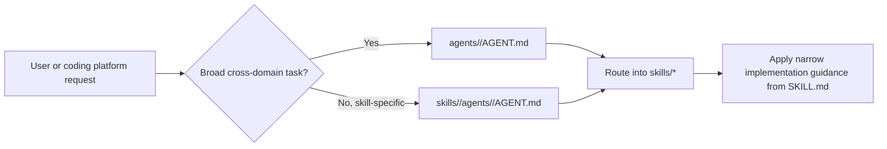

# dotnet-skills

[](https://www.nuget.org/packages/dotnet-skills)
[](LICENSE)
[](#catalog)
[](https://dotnet.microsoft.com/)

**Stop explaining .NET to your AI. Start building.**

We've all been there: asking Claude to use Entity Framework, only to get EF6 patterns in a .NET 8 project. Explaining to Copilot that Blazor Server and Blazor WebAssembly aren't the same thing. Watching Codex generate `Startup.cs` for a Minimal API project.

This catalog fixes that. A growing catalog covering the entire .NET ecosystem—from ASP.NET Core to Orleans, from MAUI to Semantic Kernel. Install them once, and your AI agent actually knows modern .NET.

## Why This Matters

- **No more outdated patterns.** Skills are maintained by the community and track official Microsoft documentation.
- **Works everywhere.** Same skills for Claude, Copilot, Gemini, and Codex.
- **Community-driven.** Missing a skill for your favorite library? Add it and help everyone.

**Your favorite .NET library deserves a skill.** If you maintain an open-source project or just love a framework that's missing, [contribute it](CONTRIBUTING.md). Let's make AI agents actually useful for .NET developers.

## Quick Start

```bash
dotnet tool install --global dotnet-skills

dotnet skills version                       # show current tool version and latest NuGet version
dotnet skills --version                     # alias for the same version view
dotnet skills list                          # show installed and available skills
dotnet skills list --local                  # only installed skills in the current target
dotnet skills recommend                     # suggest skills from local .csproj files
dotnet skills install aspire orleans        # install skills
dotnet skills remove --all                  # remove installed catalog skills from the target
dotnet skills update                        # refresh installed catalog skills
dotnet skills install blazor --agent claude # install for a specific agent
```

## Commands

| Command | Description |
|---------|-------------|
| `dotnet skills version` | Show the current installed tool version and check whether NuGet has a newer release |
| `dotnet skills list` | Show the current inventory, compare project/global scope when relevant, and keep the remaining catalog as a compact category summary |
| `dotnet skills recommend` | Scan local `*.csproj` files, propose relevant `dotnet-*` skills, and let you decide what to install |
| `dotnet skills install <skill...>` | Install one or more skills |
| `dotnet skills remove [skill...]` | Remove one or more installed catalog skills, or use `--all` to clear the target |
| `dotnet skills update [skill...]` | Update installed catalog skills to the selected catalog version |
| `dotnet skills sync` | Download latest catalog |
| `dotnet skills where` | Show install paths |
| `dotnet skills agent list` | List available orchestration agents |
| `dotnet skills agent install <agent...>` | Install orchestration agents |
| `dotnet skills agent install router --auto` | Install agents to all detected platforms |
| `dotnet skills agent remove <agent...>` | Remove installed agents |

Use `--agent` to target a specific agent, `--scope` to choose global or project install. Use `dotnet skills list --installed-only` or the shorter `dotnet skills list --local` when you only want the installed inventory, or `--available-only` when you want the detailed category-by-category breakdown of the remaining catalog. The default `list` view stays compact: it shows the current target inventory, compares project/global scope when that comparison is meaningful, and keeps the remaining catalog as a short category summary instead of dumping one giant description table. The CLI renders rich terminal tables by default so you can quickly see installed versions, update candidates, install commands, and when a newer `dotnet-skills` package is available on NuGet. `dotnet skills --version` is a shortcut for the version view.

`dotnet skills recommend` is a scan-only command: it inspects local project files, proposes a skill list, and prints the install command you can run if you agree with the recommendations. It does not install anything automatically.

The bare `dotnet skills` usage view and `help` path also perform the automatic self-update check, so an outdated tool still tells you to upgrade before it renders the command table.

Use `dotnet skills version --no-check` when you only want the local installed tool version without calling NuGet. Set `DOTNET_SKILLS_SKIP_UPDATE_CHECK=1` if you want to suppress automatic update notices during normal command startup.

Catalog releases are published automatically from `main` when `skills/` or catalog-generation inputs change. Automatic catalog versions use a numeric calendar-plus-run format such as `2026.3.15.42`. The tool reads the newest non-draft `catalog-v*` release by default, and `--catalog-version` is only for intentional pinning.

## Agent Support

### Skills Installation Paths

| Agent | Global | Project |
|-------|--------|---------|
| Claude | `~/.claude/agents/` | `.claude/agents/` |
| Copilot | `~/.copilot/skills/` | `.github/skills/` |
| Gemini | `~/.gemini/skills/` | `.gemini/skills/` |
| Codex | `~/.agents/skills/` | `.agents/skills/` |

### Orchestration Agents Installation Paths

| Agent | Global | Project |
|-------|--------|---------|
| Claude | `~/.claude/agents/` | `.claude/agents/` |
| Copilot | — | `.github/agents/` |
| Gemini | `~/.gemini/agents/` | `.gemini/agents/` |
| Codex | `~/.agents/skills/` | `.agents/skills/` |

When `--agent` is omitted, the tool auto-detects your project layout by checking for `.codex/`, `.claude/`, `.github/`, `.gemini/`, or `.agents/` directories.

## Orchestration Agents

This repository now tracks a parallel agent layer above the skill catalog.

- `skills/` remain the canonical reusable `dotnet-*` building blocks.
- top-level `agents/<agent>/AGENT.md` folders hold broad orchestration agents for routing, review, modernization, or other grouped flows that span multiple skills.
- `skills/<skill>/agents/<agent>/AGENT.md` can hold tightly coupled specialist agents that should ship next to one skill and use that skill as their main implementation source.
- every agent gets its own folder so it can carry references, assets, scripts, and future installer metadata.
- an agent can therefore represent either a grouped pack of related skills or a narrow companion to one specific skill.
- the current `dotnet-skills` CLI remains skill-first; repo-owned agents can evolve and ship on their own track.
- runtime-specific `.agent.md` or native Claude files should be treated as install adapters, not as the canonical repo source format.



### Starter Agents

| Agent | Scope | Primary routing |
|-------|-------|-----------------|
| [`dotnet-router`](agents/dotnet-router/AGENT.md) | top-level | classify web, data, AI, build, UI, testing, and modernization work |
| [`dotnet-build`](agents/dotnet-build/AGENT.md) | top-level | restore, build, pack, CI, diagnostics |
| [`dotnet-data`](agents/dotnet-data/AGENT.md) | top-level | EF Core, EF6, migrations, query issues |
| [`dotnet-ai`](agents/dotnet-ai/AGENT.md) | top-level | Semantic Kernel, Microsoft Agent Framework, Microsoft.Extensions.AI, MCP, ML.NET |
| [`dotnet-modernization`](agents/dotnet-modernization/AGENT.md) | top-level | upgrade, migration, and legacy modernization |
| [`dotnet-review`](agents/dotnet-review/AGENT.md) | top-level | code review, analyzers, testing, architecture |

### Skill-Scoped Specialists

| Agent | Scope | Primary routing |
|-------|-------|-----------------|
| [`dotnet-orleans-specialist`](skills/dotnet-orleans/agents/dotnet-orleans-specialist/AGENT.md) | skill-scoped | Orleans grain boundaries, persistence, streams, reminders, placement, Aspire wiring, and cluster validation |
| [`dotnet-aspire-orchestrator`](skills/dotnet-aspire/agents/dotnet-aspire-orchestrator/AGENT.md) | skill-scoped | AppHost, CLI, first-party versus CommunityToolkit/Aspire integration choice, testing, and deployment routing inside the Aspire surface |
| [`agent-framework-router`](skills/dotnet-microsoft-agent-framework/agents/agent-framework-router/AGENT.md) | skill-scoped | Agent Framework agent-vs-workflow choice, `AgentThread`, tools, workflows, hosting, MCP/A2A/AG-UI, durable agents, and migration |

## Repository Layout

```text
agents/
├── README.md
└── <agent-name>/
    ├── AGENT.md
    ├── scripts/       # optional
    ├── references/    # optional
    └── assets/        # optional

skills/<skill-name>/
├── SKILL.md          # required
├── agents/           # optional skill-scoped agents
│   └── <agent-name>/
│       ├── AGENT.md
│       ├── scripts/    # optional
│       ├── references/ # optional
│       └── assets/     # optional
├── scripts/          # optional
├── references/       # optional
└── assets/           # optional
```

## Catalog

<!-- BEGIN GENERATED CATALOG -->

This catalog currently contains **63** skills.

### Core

| Skill | Version | Description |
|-------|---------|-------------|
| [`dotnet`](skills/dotnet/) | `1.0.0` | Primary router skill for broad .NET work. Classify the repo by app model and cross-cutting concern first, then switch to the narrowest matching .NET skill instead of staying at a generic layer. |
| [`dotnet-architecture`](skills/dotnet-architecture/) | `1.0.0` | Design or review .NET solution architecture across modular monoliths, clean architecture, vertical slices, microservices, DDD, CQRS, and cloud-native boundaries without over-engineering. |
| [`dotnet-code-review`](skills/dotnet-code-review/) | `1.0.0` | Review .NET changes for bugs, regressions, architectural drift, missing tests, incorrect async or disposal behavior, and platform-specific pitfalls before you approve or merge them. |
| [`dotnet-managedcode-communication`](skills/dotnet-managedcode-communication/) | `1.0.0` | Use ManagedCode.Communication when a .NET application needs explicit result objects, structured errors, and predictable service or API boundaries instead of exception-driven control flow. |
| [`dotnet-managedcode-mimetypes`](skills/dotnet-managedcode-mimetypes/) | `1.0.0` | Use ManagedCode.MimeTypes when a .NET application needs consistent MIME type detection, extension mapping, and content-type decisions for uploads, downloads, or HTTP responses. |
| [`dotnet-microsoft-extensions`](skills/dotnet-microsoft-extensions/) | `1.0.0` | Use the Microsoft.Extensions stack correctly across Generic Host, dependency injection, configuration, logging, options, HttpClientFactory, and other shared infrastructure patterns. |
| [`dotnet-project-setup`](skills/dotnet-project-setup/) | `1.0.0` | Create or reorganize .NET solutions with clean project boundaries, repeatable SDK settings, and a maintainable baseline for libraries, apps, tests, CI, and local development. |

### Web

| Skill | Version | Description |
|-------|---------|-------------|
| [`dotnet-aspnet-core`](skills/dotnet-aspnet-core/) | `1.0.0` | Build, debug, modernize, or review ASP.NET Core applications with correct hosting, middleware, security, configuration, logging, and deployment patterns on current .NET. |
| [`dotnet-blazor`](skills/dotnet-blazor/) | `1.0.0` | Build and review Blazor applications across server, WebAssembly, web app, and hybrid scenarios with correct component design, state flow, rendering, and hosting choices. |
| [`dotnet-grpc`](skills/dotnet-grpc/) | `1.0.0` | Build or review gRPC services and clients in .NET with correct contract-first design, streaming behavior, transport assumptions, and backend service integration. |
| [`dotnet-minimal-apis`](skills/dotnet-minimal-apis/) | `1.0.0` | Design and implement Minimal APIs in ASP.NET Core using handler-first endpoints, route groups, filters, and lightweight composition suited to modern .NET services. |
| [`dotnet-signalr`](skills/dotnet-signalr/) | `1.0.0` | Implement or review SignalR hubs, streaming, reconnection, transport, and real-time delivery patterns in ASP.NET Core applications. |
| [`dotnet-web-api`](skills/dotnet-web-api/) | `1.0.0` | Build or maintain controller-based ASP.NET Core APIs when the project needs controller conventions, advanced model binding, validation extensions, OData, JsonPatch, or existing API patterns. |

### Cloud

| Skill | Version | Description |
|-------|---------|-------------|
| [`dotnet-aspire`](skills/dotnet-aspire/) | `1.1.0` | Build, upgrade, and operate .NET Aspire application hosts with current CLI, AppHost, ServiceDefaults, integrations, dashboard, testing, and Azure deployment patterns for distributed apps. |
| [`dotnet-azure-functions`](skills/dotnet-azure-functions/) | `1.0.0` | Build, review, or migrate Azure Functions in .NET with correct execution model, isolated worker setup, bindings, DI, and Durable Functions patterns. |

### Distributed

| Skill | Version | Description |
|-------|---------|-------------|
| [`dotnet-managedcode-orleans-graph`](skills/dotnet-managedcode-orleans-graph/) | `1.0.0` | Use ManagedCode.Orleans.Graph when a distributed .NET application models graph-oriented relationships or traversal logic on top of Orleans grains and graph-aware integration patterns. |
| [`dotnet-managedcode-orleans-signalr`](skills/dotnet-managedcode-orleans-signalr/) | `1.0.0` | Use ManagedCode.Orleans.SignalR when a distributed .NET application needs Orleans-based coordination of SignalR real-time messaging, hub delivery, and grain-driven push flows. |
| [`dotnet-orleans`](skills/dotnet-orleans/) | `1.2.0` | Build or review distributed .NET applications with Orleans grains, silos, persistence, streaming, reminders, placement, testing, and cloud-native hosting. |
| [`dotnet-worker-services`](skills/dotnet-worker-services/) | `1.0.0` | Build long-running .NET background services with `BackgroundService`, Generic Host, graceful shutdown, configuration, logging, and deployment patterns suited to workers and daemons. |

### Desktop

| Skill | Version | Description |
|-------|---------|-------------|
| [`dotnet-libvlc`](skills/dotnet-libvlc/) | `1.0.0` | Expert knowledge of the libvlc C API (3.x and 4.x), the multimedia framework behind VLC media player. Use when helping with LibVLC or LibVLCSharp for media playback, streaming, or transcoding. |
| [`dotnet-winforms`](skills/dotnet-winforms/) | `1.0.0` | Build, maintain, or modernize Windows Forms applications with practical guidance on designer-driven UI, event handling, data binding, and migration to modern .NET. |
| [`dotnet-winui`](skills/dotnet-winui/) | `1.0.0` | Build or review WinUI 3 applications with the Windows App SDK, modern Windows desktop patterns, packaging decisions, and interop boundaries with other .NET stacks. |
| [`dotnet-wpf`](skills/dotnet-wpf/) | `1.0.0` | Build and modernize WPF applications on .NET with correct XAML, data binding, commands, threading, styling, and Windows desktop migration decisions. |

### Cross-Platform UI

| Skill | Version | Description |
|-------|---------|-------------|
| [`dotnet-maui`](skills/dotnet-maui/) | `1.0.0` | Build, review, or migrate .NET MAUI applications across Android, iOS, macOS, and Windows with correct cross-platform UI, platform integration, and native packaging assumptions. |
| [`dotnet-mvvm`](skills/dotnet-mvvm/) | `1.0.0` | Implement the Model-View-ViewModel pattern in .NET applications with proper separation of concerns, data binding, commands, and testable ViewModels using MVVM Toolkit. |
| [`dotnet-uno-platform`](skills/dotnet-uno-platform/) | `1.0.0` | Build cross-platform .NET applications with Uno Platform targeting WebAssembly, iOS, Android, macOS, Linux, and Windows from a single XAML/C# codebase. |

### Data

| Skill | Version | Description |
|-------|---------|-------------|
| [`dotnet-entity-framework-core`](skills/dotnet-entity-framework-core/) | `1.0.0` | Design, tune, or review EF Core data access with proper modeling, migrations, query translation, performance, and lifetime management for modern .NET applications. |
| [`dotnet-entity-framework6`](skills/dotnet-entity-framework6/) | `1.0.0` | Maintain or migrate EF6-based applications with realistic guidance on what to keep, what to modernize, and when EF Core is or is not the right next step. |
| [`dotnet-managedcode-markitdown`](skills/dotnet-managedcode-markitdown/) | `1.0.0` | Use ManagedCode.MarkItDown when a .NET application needs deterministic document-to-Markdown conversion for ingestion, indexing, summarization, or content-processing workflows. |
| [`dotnet-managedcode-storage`](skills/dotnet-managedcode-storage/) | `1.0.0` | Use ManagedCode.Storage when a .NET application needs a provider-agnostic storage abstraction with explicit configuration, container selection, upload and download flows, and backend-specific integration kept behind one library contract. |

### AI

| Skill | Version | Description |
|-------|---------|-------------|
| [`dotnet-mcp`](skills/dotnet-mcp/) | `1.1.0` | Build or consume Model Context Protocol (MCP) servers and clients in .NET using the official MCP C# SDK, including stdio, Streamable HTTP, tools, prompts, resources, and capability negotiation. |
| [`dotnet-microsoft-agent-framework`](skills/dotnet-microsoft-agent-framework/) | `1.4.0` | Build .NET AI agents and multi-agent workflows with Microsoft Agent Framework using the right agent type, threads, tools, workflows, hosting protocols, and enterprise guardrails. |
| [`dotnet-microsoft-extensions-ai`](skills/dotnet-microsoft-extensions-ai/) | `1.2.1` | Build provider-agnostic .NET AI integrations with `Microsoft.Extensions.AI`, `IChatClient`, embeddings, middleware, structured output, vector search, and evaluation. |
| [`dotnet-mixed-reality`](skills/dotnet-mixed-reality/) | `1.0.0` | Work on C# and .NET-adjacent mixed-reality solutions around HoloLens, MRTK, OpenXR, Azure services, and integration boundaries where .NET participates in the stack. |
| [`dotnet-mlnet`](skills/dotnet-mlnet/) | `1.0.0` | Use ML.NET to train, evaluate, or integrate machine-learning models into .NET applications with realistic data preparation, inference, and deployment expectations. |
| [`dotnet-semantic-kernel`](skills/dotnet-semantic-kernel/) | `1.0.0` | Build AI-enabled .NET applications with Semantic Kernel using services, plugins, prompts, and function-calling patterns that remain testable and maintainable. |

### Legacy

| Skill | Version | Description |
|-------|---------|-------------|
| [`dotnet-legacy-aspnet`](skills/dotnet-legacy-aspnet/) | `1.0.0` | Maintain classic ASP.NET applications on .NET Framework, including Web Forms, older MVC, and legacy hosting patterns, while planning realistic modernization boundaries. |
| [`dotnet-wcf`](skills/dotnet-wcf/) | `1.0.0` | Work on WCF services, clients, bindings, contracts, and migration decisions for SOAP and multi-transport service-oriented systems on .NET Framework or compatible stacks. |
| [`dotnet-workflow-foundation`](skills/dotnet-workflow-foundation/) | `1.0.0` | Maintain or assess Workflow Foundation-based solutions on .NET Framework, especially where long-lived process logic or legacy designer artifacts still matter. |

### Testing

| Skill | Version | Description |
|-------|---------|-------------|
| [`dotnet-coverlet`](skills/dotnet-coverlet/) | `1.0.0` | Use the open-source free `coverlet` toolchain for .NET code coverage. Use when a repo needs line and branch coverage, collector versus MSBuild driver selection, or CI-safe coverage commands. |
| [`dotnet-mstest`](skills/dotnet-mstest/) | `1.0.0` | Write, run, or repair .NET tests that use MSTest. Use when a repo uses `MSTest.Sdk`, `MSTest`, `[TestClass]`, `[TestMethod]`, `DataRow`, or Microsoft.Testing.Platform-based MSTest execution. |
| [`dotnet-nunit`](skills/dotnet-nunit/) | `1.0.0` | Write, run, or repair .NET tests that use NUnit. Use when a repo uses `NUnit`, `[Test]`, `[TestCase]`, `[TestFixture]`, or NUnit3TestAdapter for VSTest or Microsoft.Testing.Platform execution. |
| [`dotnet-reportgenerator`](skills/dotnet-reportgenerator/) | `1.0.0` | Use the open-source free `ReportGenerator` tool for turning .NET coverage outputs into HTML, Markdown, Cobertura, badges, and merged reports. Use when raw coverage files are not readable enough for CI or human review. |
| [`dotnet-stryker`](skills/dotnet-stryker/) | `1.0.0` | Use the open-source free `Stryker.NET` mutation testing tool for .NET. Use when a repo needs to measure whether tests actually catch faults, especially in critical libraries or domains. |
| [`dotnet-tunit`](skills/dotnet-tunit/) | `1.0.0` | Write, run, or repair .NET tests that use TUnit. Use when a repo uses `TUnit`, `[Test]`, `[Arguments]`, source-generated test projects, or Microsoft.Testing.Platform-based execution. |
| [`dotnet-xunit`](skills/dotnet-xunit/) | `1.0.0` | Write, run, or repair .NET tests that use xUnit. Use when a repo uses `xunit`, `xunit.v3`, `[Fact]`, `[Theory]`, or `xunit.runner.visualstudio`, and you need the right CLI, package, and runner guidance for xUnit on VSTest or Microsoft.Testing.Platform. |

### Code Quality

| Skill | Version | Description |
|-------|---------|-------------|
| [`dotnet-analyzer-config`](skills/dotnet-analyzer-config/) | `1.0.0` | Use a repo-root `.editorconfig` to configure free .NET analyzer and style rules. Use when a .NET repo needs rule severity, code-style options, section layout, or analyzer ownership made explicit. Nested `.editorconfig` files are allowed when they serve a clear subtree-specific purpose. |
| [`dotnet-code-analysis`](skills/dotnet-code-analysis/) | `1.0.1` | Use the free built-in .NET SDK analyzers and analysis levels with gradual Roslyn warning promotion. Use when a .NET repo needs first-party code analysis, `EnableNETAnalyzers`, `AnalysisLevel`, or warning-as-error policy wired into build and CI. |
| [`dotnet-csharpier`](skills/dotnet-csharpier/) | `1.0.0` | Use the open-source free `CSharpier` formatter for C# and XML. Use when a .NET repo intentionally wants one opinionated formatter instead of a highly configurable `dotnet format`-driven style model. |
| [`dotnet-format`](skills/dotnet-format/) | `1.0.0` | Use the free first-party `dotnet format` CLI for .NET formatting and analyzer fixes. Use when a .NET repo needs formatting commands, `--verify-no-changes` CI checks, or `.editorconfig`-driven code style enforcement. |
| [`dotnet-meziantou-analyzer`](skills/dotnet-meziantou-analyzer/) | `1.0.0` | Use the open-source free `Meziantou.Analyzer` package for design, usage, security, performance, and style rules in .NET. Use when a repo wants broader analyzer coverage with a single NuGet package. |
| [`dotnet-modern-csharp`](skills/dotnet-modern-csharp/) | `1.0.0` | Write modern, version-aware C# for .NET repositories. Use when choosing language features across C# versions, especially C# 13 and C# 14, while staying compatible with the repo's target framework and `LangVersion`. |
| [`dotnet-quality-ci`](skills/dotnet-quality-ci/) | `1.0.0` | Set up or refine open-source .NET code-quality gates for CI: formatting, `.editorconfig`, SDK analyzers, third-party analyzers, coverage, mutation testing, architecture tests, and security scanning. Use when a .NET repo needs an explicit quality stack in `AGENTS.md`, docs, or pipeline YAML. |
| [`dotnet-resharper-clt`](skills/dotnet-resharper-clt/) | `1.0.0` | Use the free official JetBrains ReSharper Command Line Tools for .NET repositories. Use when a repo wants powerful `jb inspectcode` inspections, `jb cleanupcode` cleanup profiles, solution-level `.DotSettings` enforcement, or a stronger CLI quality gate for C# than the default SDK analyzers alone. |
| [`dotnet-roslynator`](skills/dotnet-roslynator/) | `1.0.0` | Use the open-source free `Roslynator` analyzer packages and optional CLI for .NET. Use when a repo wants broad C# static analysis, auto-fix flows, dead-code detection, optional CLI checks, or extra rules beyond the SDK analyzers. |
| [`dotnet-stylecop-analyzers`](skills/dotnet-stylecop-analyzers/) | `1.0.0` | Use the open-source free `StyleCop.Analyzers` package for naming, layout, documentation, and style rules in .NET projects. Use when a repo wants stricter style conventions than the SDK analyzers alone provide. |

### Architecture

| Skill | Version | Description |
|-------|---------|-------------|
| [`dotnet-archunitnet`](skills/dotnet-archunitnet/) | `1.0.0` | Use the open-source free `ArchUnitNET` library for architecture rules in .NET tests. Use when a repo needs richer architecture assertions than lightweight fluent rule libraries usually provide. |
| [`dotnet-netarchtest`](skills/dotnet-netarchtest/) | `1.0.0` | Use the open-source free `NetArchTest.Rules` library for architecture rules in .NET unit tests. Use when a repo wants lightweight, fluent architecture assertions for namespaces, dependencies, or layering. |

### Metrics

| Skill | Version | Description |
|-------|---------|-------------|
| [`dotnet-cloc`](skills/dotnet-cloc/) | `1.0.0` | Use the open-source free `cloc` tool for line-count, language-mix, and diff statistics in .NET repositories. Use when a repo needs C# and solution footprint metrics, branch-to-branch LOC comparison, or repeatable code-size reporting in local workflows and CI. |
| [`dotnet-codeql`](skills/dotnet-codeql/) | `1.0.0` | Use the open-source CodeQL ecosystem for .NET security analysis. Use when a repo needs CodeQL query packs, CLI-based analysis on open source codebases, or GitHub Action setup with explicit licensing caveats for private repositories. |
| [`dotnet-complexity`](skills/dotnet-complexity/) | `1.0.0` | Use free built-in .NET maintainability analyzers and code metrics configuration to find overly complex methods and coupled code. Use when a repo needs cyclomatic complexity checks, maintainability thresholds, or complexity-driven refactoring gates. |
| [`dotnet-profiling`](skills/dotnet-profiling/) | `1.0.0` | Use the free official .NET diagnostics CLI tools for profiling and runtime investigation in .NET repositories. Use when a repo needs CPU tracing, live counters, GC and allocation investigation, exception or contention tracing, heap snapshots, or startup diagnostics without GUI-only tooling. |
| [`dotnet-quickdup`](skills/dotnet-quickdup/) | `1.0.0` | Use the open-source free `QuickDup` clone detector for .NET repositories. Use when a repo needs duplicate C# code discovery, structural clone detection, DRY refactoring candidates, or repeatable duplication scans in local workflows and CI. |

<!-- END GENERATED CATALOG -->

## How Updates Are Tracked

This repository does not guess what to monitor.

It watches only the sources explicitly listed in the upstream watch config surface:

- [`.github/upstream-watch.json`](.github/upstream-watch.json) for shared metadata such as labels
- [`.github/upstream-watch*.json`](.github/) for shard files such as `upstream-watch.ai.json` or `upstream-watch-agent-framework.json`

Those files are the human-maintained source of truth for:

- GitHub release streams that should trigger skill review
- documentation pages that should trigger skill review
- which `dotnet-*` skills are affected by each upstream change

Each named shard file has exactly two lists:

- `github_releases`
- `documentation`

High-level flow:

```mermaid
flowchart LR
  A["Edit upstream-watch.json or a named upstream-watch.<domain>.json shard"] --> B["Run scripts/upstream_watch.py --validate-config"]
  B --> C["Run dry-run and sync-state-only once"]
  C --> D["Scheduled upstream-watch.yml runs upstream_watch.py daily"]
  D --> E["GitHub release or documentation change is detected"]
  E --> F["Automation opens or updates an upstream issue"]
  F --> G["A human or agent updates skills/ and docs"]
  G --> H["Changes merge to main"]
  H --> I["publish-catalog.yml releases a new catalog-v..."]
```



Use this shape:

```json
{
  "watch_issue_label": "upstream-update",
  "labels": [
    {
      "name": "upstream-update",
      "color": "5319E7",
      "description": "Framework or documentation updates detected by automation"
    }
  ]
}
```

```json
{
  "github_releases": [
    {
      "source": "https://github.com/managedcode/Storage",
      "skills": [
        "dotnet-managedcode-storage"
      ]
    }
  ],
  "documentation": [
    {
      "source": "https://learn.microsoft.com/dotnet/aspire/",
      "skills": [
        "dotnet-aspire"
      ]
    }
  ]
}
```

Keep the base file small and name shard files semantically, for example `upstream-watch.ai.json`, `upstream-watch.data.json`, `upstream-watch.platform.json`, or `upstream-watch-agent-framework.json`.

That is enough for normal maintenance.
`scripts/upstream_watch.py` derives the watch kind, ids, source coordinates, display names, and default notes at runtime.
Use optional fields only when you really need them, for example `match_tag_regex` for mixed release streams or `id` for a stable legacy key.

If you add a new library or framework and want this repo to keep watching it, the actual how-to is in [CONTRIBUTING.md](CONTRIBUTING.md#upstream-watch-entries).

## Contributing

**This catalog is community-driven.** If you maintain a .NET library, framework, or tool:

1. **Add your project** as a skill in `skills/`
2. **Write clear guidance** on what it is, why to use it, and how to wire it up
3. **Add upstream watch** so we know when your project releases updates

See [CONTRIBUTING.md](CONTRIBUTING.md) for the full guide.

## Credits

This catalog builds on the work of many open-source projects and their authors:

### Inspiration & Standards

| Project | Authors | Description |
|---------|---------|-------------|
| [dotnet/skills](https://github.com/dotnet/skills) | Microsoft, .NET team | Official .NET skills repository that inspired our agent format and skill structure |
| [Agent Skills Standard](https://agentskills.io) | Anthropic | Open specification for portable agent skill packages |
| [Claude Code](https://code.claude.com) | Anthropic | Subagent architecture that shaped our orchestration agent design |

### Test Frameworks

| Tool/Library | Authors | License |
|--------------|---------|---------|
| [xUnit](https://github.com/xunit/xunit) | Brad Wilson, James Newkirk | Apache-2.0 |
| [NUnit](https://github.com/nunit/nunit) | Charlie Poole, NUnit team | MIT |
| [MSTest](https://github.com/microsoft/testfx) | Microsoft | MIT |
| [TUnit](https://github.com/thomhurst/TUnit) | Tom Longhurst | MIT |

### Code Coverage & Mutation Testing

| Tool/Library | Authors | License |
|--------------|---------|---------|
| [Coverlet](https://github.com/coverlet-coverage/coverlet) | Toni Solarin-Sodara, Marco Rossignoli | MIT |
| [ReportGenerator](https://github.com/danielpalme/ReportGenerator) | Daniel Palme | Apache-2.0 |
| [Stryker.NET](https://github.com/stryker-mutator/stryker-net) | Stryker Mutator team | Apache-2.0 |

### Analyzers & Formatters

| Tool/Library | Authors | License |
|--------------|---------|---------|
| [Roslynator](https://github.com/dotnet/roslynator) | Josef Pihrt, .NET Foundation | Apache-2.0 |
| [StyleCop.Analyzers](https://github.com/DotNetAnalyzers/StyleCopAnalyzers) | .NET Analyzers team | MIT |
| [Meziantou.Analyzer](https://github.com/meziantou/Meziantou.Analyzer) | Gérald Barré | MIT |
| [CSharpier](https://github.com/belav/csharpier) | Bela VanderVoort | MIT |
| [ReSharper CLT](https://www.jetbrains.com/resharper/features/command-line.html) | JetBrains | Proprietary (free) |

### Architecture Testing

| Tool/Library | Authors | License |
|--------------|---------|---------|
| [NetArchTest](https://github.com/BenMorris/NetArchTest) | Ben Morris | MIT |
| [ArchUnitNET](https://github.com/TNG/ArchUnitNET) | TNG Technology Consulting | Apache-2.0 |

### Metrics & Analysis

| Tool/Library | Authors | License |
|--------------|---------|---------|
| [cloc](https://github.com/AlDanial/cloc) | Al Danial | GPL-2.0 |
| [CodeQL](https://github.com/github/codeql) | GitHub, Semmle | MIT (queries) |
| [QuickDup](https://github.com/asynkron/QuickDup) | Roger Johansson, Asynkron | MIT |

### Frameworks & Libraries

| Tool/Library | Authors | License |
|--------------|---------|---------|
| [CommunityToolkit.Mvvm](https://github.com/CommunityToolkit/dotnet) | Microsoft, .NET Foundation | MIT |
| [Microsoft Agent Framework](https://github.com/microsoft/agent-framework) | Microsoft | MIT |
| [Microsoft.Extensions.AI](https://github.com/dotnet/extensions) | Microsoft, .NET Foundation | MIT |
| [MCP C# SDK](https://github.com/modelcontextprotocol/csharp-sdk) | Anthropic, Microsoft | Apache-2.0 |
| [Uno Platform](https://github.com/unoplatform/uno) | nventive, Uno Platform | Apache-2.0 |
| [Orleans](https://github.com/dotnet/orleans) | Microsoft | MIT |
| [Semantic Kernel](https://github.com/microsoft/semantic-kernel) | Microsoft | MIT |
| [Entity Framework Core](https://github.com/dotnet/efcore) | Microsoft, .NET Foundation | MIT |
| [ML.NET](https://github.com/dotnet/machinelearning) | Microsoft, .NET Foundation | MIT |
| [LibVLCSharp](https://github.com/videolan/libvlcsharp) | VideoLAN | LGPL-2.1 |

*Want your project credited? Add a skill and include yourself in this list!*
