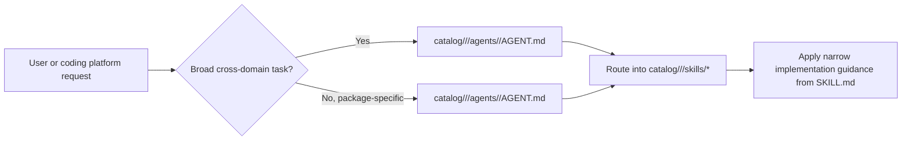
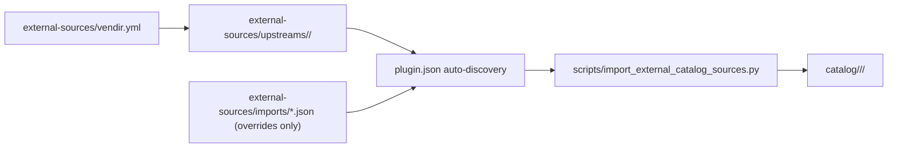

# dotnet-skills

[](https://www.nuget.org/packages/dotnet-skills)
[](LICENSE)
[](#catalog)
[](https://dotnet.microsoft.com/)

**Stop explaining .NET to your AI. Start building.**

We've all been there: asking Claude to use Entity Framework, only to get EF6 patterns in a .NET 8 project. Explaining to Copilot that Blazor Server and Blazor WebAssembly aren't the same thing. Watching Codex generate `Startup.cs` for a Minimal API project.

This catalog fixes that. A growing catalog covering the entire .NET ecosystem—from ASP.NET Core to Orleans, from MAUI to Semantic Kernel. Install them once, and your AI agent actually knows modern .NET.

## Why This Matters

- **No more outdated patterns.** Skills are maintained by the community and track official Microsoft documentation.
- **Works everywhere.** Same skills for Claude, Copilot, Gemini, Codex, and Junie.
- **Community-driven.** Missing a skill for your favorite library? Add it and help everyone.

**Your favorite .NET library deserves a skill.** If you maintain an open-source project or just love a framework that's missing, [contribute it](CONTRIBUTING.md). Let's make AI agents actually useful for .NET developers.

## Quick Start

```bash
dotnet tool install --global dotnet-skills

# choose one dedicated agent launcher
dotnet tool install --global dotnet-agents
dotnet tool install --global agents

dotnet skills                               # open the interactive control center
dotnet skills version                       # show current tool version and latest NuGet version
dotnet skills --version                     # alias for the same version view
dotnet skills list                          # show installed and available skills
dotnet skills bundle list                   # show focused bundles by collection and workflow
dotnet skills list --local                  # only installed skills in the current target
dotnet skills recommend                     # suggest skills from local .csproj files
dotnet skills install --auto                # install skills for NuGet packages detected in local .csproj files
dotnet skills install --auto --prune        # remove stale auto-managed skills that no longer match the project
dotnet skills install bundle quality        # install a focused .NET quality bundle
dotnet skills install bundle mcaf           # install the MCAF governance bundle
dotnet skills install bundle orleans        # install the Orleans workflow bundle
dotnet skills install aspire orleans        # install skills
dotnet skills catalog tokens --catalog-root . # export per-skill token counts as JSON
dotnet skills remove aspire                 # remove one installed skill
dotnet skills remove bundle quality         # remove every skill from a focused bundle
dotnet skills remove collection distributed # remove every skill from a collection
dotnet skills remove --all                  # remove installed catalog skills from the target
dotnet skills update                        # refresh installed catalog skills
dotnet skills install blazor --agent claude # install for a specific agent
dotnet agents list                          # show bundled orchestration agents
dotnet agents install router --auto         # install agents to detected native agent folders
agents list                                 # same agent-only catalog via the plain standalone command
agents install router --auto                # same agent install flow without the dotnet-prefixed launcher
```

## Commands

| Command | Description |
|---------|-------------|
| `dotnet skills` | Open the interactive control center with direct skill browsing, collections, analysis, bundles, and install preview |
| `dotnet skills version` | Show the current installed tool version and check whether NuGet has a newer release |
| `dotnet skills list` | Show the current inventory, compare project/global scope when relevant, and keep the remaining catalog as a compact collection summary |
| `dotnet skills bundle list` | Show the focused bundles that expand into related skills by collection or workflow |
| `dotnet skills recommend` | Scan local `*.csproj` files, propose relevant skills, and let you decide what to install |
| `dotnet skills install --auto` | Inspect local `*.csproj` files, detect NuGet packages and strong project signals, and install matching skills automatically |
| `dotnet skills install --auto --prune` | Remove stale auto-managed skills that no longer match the current project's NuGet packages or app-model signals |
| `dotnet skills install <skill...>` | Install one or more skills |
| `dotnet skills install bundle <bundle...>` | Install one or more focused bundles such as `quality`, `frontend-quality`, `mcaf`, or `orleans` |
| `dotnet skills catalog tokens --catalog-root .` | Export the tokenizer model name plus per-skill token counts as JSON |
| `dotnet skills remove <skill...>` | Remove one or more installed catalog skills by skill id or alias |
| `dotnet skills remove bundle <bundle...>` | Remove every installed skill mapped to one or more focused bundles |
| `dotnet skills remove collection <collection...>` | Remove every installed skill in one or more collections |
| `dotnet skills remove --all` | Remove every installed catalog skill from the selected target |
| `dotnet skills update [skill...]` | Update installed catalog skills to the selected catalog version |
| `dotnet skills sync` | Download latest catalog |
| `dotnet skills where` | Show install paths |
| `dotnet agents list` | List available orchestration agents |
| `dotnet agents install <agent...>` | Install orchestration agents |
| `dotnet agents install router --auto` | Install agents to all detected platforms |
| `dotnet agents remove <agent...>` | Remove installed agents |
| `dotnet agents where` | Show native agent install paths |
| `agents list` | List available orchestration agents through the standalone `agents` tool |
| `agents install <agent...>` | Install orchestration agents through the standalone `agents` tool |
| `agents where` | Show native agent install paths through the standalone `agents` tool |

Use `--agent` to target a specific agent platform, `--scope` to choose global or project install. Use `dotnet skills list --installed-only` or the shorter `dotnet skills list --local` when you only want the installed inventory, or `--available-only` when you want the detailed collection-by-collection breakdown of the remaining catalog. The default `list` view stays compact: it shows the current target inventory, compares project/global scope when that comparison is meaningful, and keeps the remaining catalog as a short collection summary instead of dumping one giant description table. The CLI renders rich terminal tables by default so you can quickly see installed versions, update candidates, install commands, and when a newer `dotnet-skills`, `dotnet-agents`, or `agents` package is available on NuGet. `dotnet skills --version`, `dotnet agents --version`, and `agents --version` are shortcuts for the version view.

`dotnet-skills` remains the skill-first CLI and still supports `dotnet skills agent ...` for compatibility. The dedicated agent-only surface is published in both forms: `dotnet-agents` for `dotnet agents ...` and `agents` for `agents ...`. Both top-level `list`, `install`, `remove`, and `where` commands target orchestration agents directly.

The interactive shell behind bare `dotnet skills` is the main control center: its primary catalog row now mirrors the public site with `Packages`, `Bundles`, `Collections`, `Skills`, `Agents`, and `About`, then layers CLI-only lifecycle surfaces such as `Project`, `Installed`, `Analysis`, and `Workspace` underneath. Inside that control center you still get direct individual-skill picking, `Collection -> Lane -> Skill` browsing, package-entry analysis, token hotspots, a full tree view, and install preview before files are written.

The public site mirrors the same primary surface now: `Packages`, `Bundles`, `Collections`, `Skills`, `Agents`, and `About`. The published GitHub Pages output uses the same shared navigation manifest and collection taxonomy as the CLI instead of the old manifest-category grouping.

`dotnet skills bundle list` shows the ready-made focused bundles. Bundle installs are bulk shortcuts for related skill sets, so `dotnet skills install bundle quality`, `dotnet skills install bundle frontend-quality`, `dotnet skills install bundle mcaf`, or `dotnet skills install bundle orleans` install every skill mapped to that focused bundle in one pass.

`dotnet skills install --auto` inspects local `*.csproj` files, detects NuGet packages plus strong SDK and project-property signals, and installs the matching skills for that project automatically. Add `dotnet skills install --auto --prune` when you also want to remove stale auto-managed skills that no longer match the current project. Protected diagnostic skills and `graphify-dotnet` are not pruned.

`dotnet skills recommend` is a scan-only command: it inspects local project files, proposes a skill list, and prints the install command you can run if you agree with the recommendations. It does not install anything automatically.

The bare `dotnet skills` usage view and `help` path also perform the automatic self-update check, so an outdated tool still tells you to upgrade before it renders the command table.

Use `dotnet skills version --no-check`, `dotnet agents version --no-check`, or `agents version --no-check` when you only want the local installed tool version without calling NuGet. Set `DOTNET_SKILLS_SKIP_UPDATE_CHECK=1`, `DOTNET_AGENTS_SKIP_UPDATE_CHECK=1`, or `AGENTS_SKIP_UPDATE_CHECK=1` if you want to suppress automatic update notices during normal command startup.

## Local Preview

When you want to preview the generated docs and public site locally:

```bash
python3 scripts/generate_catalog.py
python3 scripts/generate_pages.py
```

`README.md` is refreshed from the scanned catalog, and the GitHub Pages output is written to `artifacts/github-pages/` with the same shared `Packages / Bundles / Collections / Skills / Agents / About` navigation that the site and CLI home surface now use.

## Install Surface

Public bundle installs use `bundle`, not `package`. The focused bundle surface is intentionally small:

- `foundations`
- `quality`
- `frontend-quality`
- `architecture-core`
- `testing-base`
- `testing-xunit`
- `testing-nunit`
- `testing-mstest`
- `testing-tunit`
- `testing-migrations`
- `runtime-upgrades`
- `mcaf`
- `orleans`

Collections are intentionally split so installs stay explicit instead of collapsing into one overloaded `.NET` bucket:

- `.NET Foundations`
- `.NET Quality`
- `MSBuild`
- `NuGet & Publishing`
- `Templates & Scaffolding`
- `Diagnostics & Metrics`
- `Web`
- `Aspire`
- `Azure Functions`
- `Background Workers`
- `Mobile & Device`
- `XR & Spatial`
- `Desktop & UI`
- `Frontend Quality`
- `Testing`
- `Testing Research`
- `Architecture`
- `Governance & Delivery`
- `Data`
- `AI & Agents`
- `Distributed`
- `Legacy`
- `Upgrades & Migration`

Catalog releases are published automatically in `.github/workflows/publish-catalog.yml` at `04:00` UTC and include the `catalog-v*` release, GitHub Pages deployment, and NuGet publish for `dotnet-skills`, `dotnet-agents`, and `agents` in the same run. Automatic catalog versions use a numeric calendar-plus-daily-index format such as `2026.3.15.0`, where the first UTC-day release is `.0`, the second is `.1`, and so on. `dotnet-skills` reads the newest non-draft `catalog-v*` release by default, and `--catalog-version` is only for intentional pinning.

Install whichever dedicated agent package you prefer:

- `dotnet tool install --global dotnet-agents` gives you the `dotnet agents ...` command shape.
- `dotnet tool install --global agents` gives you the `agents ...` command shape.

## Agent Support

### Skills Installation Paths

| Agent | Global | Project |
|-------|--------|---------|
| Claude | `~/.claude/skills/` | `.claude/skills/` |
| Copilot | `~/.copilot/skills/` | `.github/skills/` |
| Gemini | `~/.gemini/skills/` | `.gemini/skills/` |
| Codex | `$CODEX_HOME/skills/` (default: `~/.codex/skills/`) | `.codex/skills/` |
| Junie | `~/.junie/skills/` | `.junie/skills/` |
| Default shared root | `~/.agents/skills/` | `.agents/skills/` |

### Orchestration Agents Installation Paths

| Agent | Global | Project |
|-------|--------|---------|
| Claude | `~/.claude/agents/` | `.claude/agents/` |
| Copilot | `~/.copilot/agents/` | `.github/agents/` |
| Gemini | `~/.gemini/agents/` | `.gemini/agents/` |
| Codex | `$CODEX_HOME/agents/` (default: `~/.codex/agents/`) | `.codex/agents/` |
| Junie | `~/.junie/agents/` | `.junie/agents/` |

`dotnet agents install --auto` and `agents install --auto` write only to already existing native agent directories. They do not use `.agents` as a shared agent target; if no native agent directory exists yet, specify `--agent` or `--target`.

`dotnet agents ... --target <path>` and `agents ... --target <path>` require an explicit `--agent` because the generated file format depends on the selected platform.

When `--agent` is omitted for skill installation, the tool checks for `.codex/`, `.claude/`, `.github/`, `.gemini/`, and `.junie/` directories in that order, installs into every already existing native platform target it finds, and uses `.agents/skills/` only when no native platform folder exists yet.

## Orchestration Agents

This repository now tracks a parallel agent layer above the skill catalog.

- reusable repo-authored skills, vendir-imported upstream skills, and repo-owned agents all live under package folders in `catalog/<type>/<package>/`.
- `catalog/<type>/<package>/skills/<skill>/SKILL.md` holds the detailed implementation guidance for one skill.
- `catalog/<type>/<package>/agents/<agent>/AGENT.md` holds routing behavior for one repo-owned orchestration agent.
- package `manifest.json` files hold the package-level metadata that both the installer and the public site scan.
- every skill and agent still gets its own folder so it can carry references, assets, scripts, and future installer metadata.
- an agent can therefore represent either a grouped pack of related skills or a narrow companion to one specific skill.
- the current `dotnet-skills` CLI remains skill-first; repo-owned agents can evolve and ship on their own track.
- runtime-specific `.agent.md` or native Claude files should be treated as install adapters, not as the canonical repo source format.



### Starter Agents

| Agent | Scope | Primary routing |
|-------|-------|-----------------|
| [`dotnet-router`](catalog/Platform/DotNet/agents/dotnet-router/) | package-scoped | classify web, data, AI, build, UI, testing, and modernization work |
| [`dotnet-build`](catalog/Platform/DotNet/agents/dotnet-build/) | package-scoped | restore, build, pack, CI, diagnostics |
| [`dotnet-data`](catalog/Frameworks/Entity-Framework-Core/agents/dotnet-data/) | package-scoped | EF Core, EF6, migrations, query issues |
| [`dotnet-frontend`](catalog/Tools/Biome/agents/dotnet-frontend/) | package-scoped | Blazor, frontend asset quality, browser-facing audits, and file-structure linting inside `.NET` repos |
| [`dotnet-ai`](catalog/Frameworks/Semantic-Kernel/agents/dotnet-ai/) | package-scoped | Semantic Kernel, Microsoft Agent Framework, Microsoft.Extensions.AI, MCP, ML.NET |
| [`dotnet-modernization`](catalog/Platform/Legacy-ASP.NET/agents/dotnet-modernization/) | package-scoped | upgrade, migration, and legacy modernization |
| [`dotnet-review`](catalog/Platform/Code-Review/agents/dotnet-review/) | package-scoped | code review, analyzers, testing, architecture |

### Package-Scoped Specialists

| Agent | Scope | Primary routing |
|-------|-------|-----------------|
| [`dotnet-orleans-specialist`](catalog/Frameworks/Orleans/agents/dotnet-orleans-specialist/) | package-scoped | Orleans grain boundaries, persistence, streams, reminders, placement, Aspire wiring, and cluster validation |
| [`dotnet-aspire-orchestrator`](catalog/Frameworks/Aspire/agents/dotnet-aspire-orchestrator/) | package-scoped | AppHost, CLI, first-party versus CommunityToolkit/Aspire integration choice, testing, and deployment routing inside the Aspire surface |
| [`agent-framework-router`](catalog/Frameworks/Microsoft-Agent-Framework/agents/agent-framework-router/) | package-scoped | Agent Framework agent-vs-workflow choice, `AgentThread`, tools, workflows, hosting, MCP/A2A/AG-UI, durable agents, and migration |

## Repository Layout

```text
catalog/
└── <Type>/
    └── <Package>/
        ├── manifest.json
        ├── icon.svg           # optional
        ├── skills/
        │   └── <skill-name>/
        │       ├── SKILL.md
        │       ├── manifest.json
        │       ├── scripts/     # optional
        │       ├── references/  # optional
        │       └── assets/      # optional
        └── agents/
            └── <agent-name>/
                ├── AGENT.md
                ├── manifest.json # optional
                ├── scripts/     # optional
                ├── references/  # optional
                └── assets/      # optional
```

The package-level `manifest.json` is the package control plane. It carries package title/description/icon and upstream links such as `links.repository`, `links.docs`, and `links.nuget`. Skill- or agent-specific metadata belongs in the nearest sibling `skills/<skill>/manifest.json` or `agents/<agent>/manifest.json`.

`SKILL.md` should stay focused on routing, workflow, deliverables, and validation. Do not put `version`, `category`, `packages`, or `package_prefix` in `SKILL.md` frontmatter.

## External Upstream Sources

External upstream repositories live in the dedicated [`external-sources/`](external-sources/) area.

- `external-sources/vendir.yml` and `external-sources/vendir.lock.yml` handle fetch-and-pin only.
- `external-sources/upstreams/` holds the checked-in vendored snapshots.
- `external-sources/imports/*.json` is overrides-only local policy for type, category, package naming, compatibility, and skill-level package trigger metadata.
- `scripts/import_external_catalog_sources.py` auto-discovers upstream plugins from vendored `plugin.json` files, applies the local overrides, and normalizes the result into `catalog/<type>/<package>/`.
- Imported upstream `SKILL.md`, `AGENT.md`, and `references/` content is copied verbatim; local-only metadata stays in sibling `manifest.json` files instead of being injected into upstream markdown.

Official imports may keep their upstream skill ids instead of being renamed to match local repo-authored conventions.



When you refresh vendored upstream content locally, use `bash scripts/sync_external_catalog_sources.sh`.

## Catalog

<!-- BEGIN GENERATED CATALOG -->

This catalog currently contains **184** skills.

### .NET Foundations

| Skill | Version | Description |
|-------|---------|-------------|
| [`author-component`](catalog/Platform/Official-DotNet-Blazor/skills/author-component/) | `0.1.0` | Create or review Blazor components (.razor files) with correct architecture. USE FOR: writing new Blazor components that do NOT involve JavaScript interop, implementing parameters and EventCallback, RenderFragment slots, component lifecycle (OnInitializedAsync, OnParametersSet), async patterns, IAsyncDisposable, CancellationToken, CSS isolation, code-behind. DO NOT USE FOR: creating new projects (use create-blazor-project), JavaScript interop or calling browser APIs from Blazor (use use-js-interop), forms and validation (use collect-user-input), prerendering issues (use support-prerendering), HTTP data fetching patterns (use fetch-and-send-data), coordinating state between unrelated components (use coordinate-components). |
| [`collect-user-input`](catalog/Platform/Official-DotNet-Blazor/skills/collect-user-input/) | `0.1.0` | Build forms, validate data, and react to user input in Blazor. USE FOR adding forms, search boxes, filter panels, inline editing, data-entry UI, file uploads, validation (annotations or custom), handling form submissions, and binding input controls. Covers EditForm, built-in input components, DataAnnotationsValidator, custom validation, SSR form patterns (SupplyParameterFromForm, FormName, AntiforgeryToken, Enhance), and @bind for simple interactive controls. DO NOT USE for project scaffolding (see create-blazor-project) or prerendering issues (see support-prerendering). |
| [`configure-auth`](catalog/Platform/Official-DotNet-Blazor/skills/configure-auth/) | `0.1.0` | Add authentication and authorization to a Blazor Web App, accounting for the app's render mode. USE WHEN the user needs [Authorize] on pages, AuthorizeView, role or policy-based access, login/logout Identity pages, or AuthenticationStateProvider. Also USE WHEN auth state is null after WebAssembly loads, SignInManager throws in an interactive component, <NotAuthorized> content never renders in static SSR, or HttpContext.User is null in an interactive component. DO NOT USE for general component authoring (see author-component), for prerendering concerns unrelated to auth (see support-prerendering), or for managing non-auth cascading state (see coordinate-components). |
| [`coordinate-components`](catalog/Platform/Official-DotNet-Blazor/skills/coordinate-components/) | `0.1.0` | Share state between components that don't have a direct parent-child parameter relationship, using cascading values, scoped services with change events, or CascadingValueSource via DI. USE WHEN the user needs a CascadingParameter or CascadingValue that works across render mode boundaries, a shopping cart or notification count accessible from multiple pages, a theme or user preference cascaded app-wide, or when components in different parts of the tree must react when shared data changes. Also USE WHEN cascading values aren't reaching interactive children in per-page interactivity mode, or when the user needs to understand scoped vs singleton service lifetime for state on Blazor Server. DO NOT USE for direct parent-child parameter passing or EventCallback (see author-component), for persisting state across prerender-to-interactive transitions (see support-prerendering), or for service abstractions for data fetching in Auto/WebAssembly (see fetch-and-send-data). |
| [`create-blazor-project`](catalog/Platform/Official-DotNet-Blazor/skills/create-blazor-project/) | `0.1.0` | Create a new ASP.NET Core web application or web site using Blazor. USE FOR: creating a new Blazor web app, scaffolding a new web project, starting a new web site, choosing render modes (Static SSR, Interactive Server, Interactive WebAssembly, Auto), running dotnet new blazor with the right options, setting up initial project structure. DO NOT USE FOR: adding features to existing projects, changing how an existing app renders, or component authoring (use author-component). |
| [`csharp-scripts`](catalog/Platform/Official-DotNet-Advanced/skills/csharp-scripts/) | `0.2.0` | Run file-based C# apps with the .NET CLI when the user explicitly wants C#/.NET code without creating a project. Use for C# language/API experiments, one-file C# apps, small multi-file C# apps composed with `#:include`/`#:exclude`, or C# file-based apps linked with `#:ref`. Do not use for language-agnostic throwaway scripts, generic computations, Python/PowerShell-style automation, full projects, or existing app integration. |
| [`dotnet`](catalog/Platform/DotNet/skills/dotnet/) | `1.0.3` | Primary router skill for broad .NET work. Classify the repo by app model and cross-cutting concern first, then switch to the narrowest matching .NET skill instead of staying at a generic layer. USE FOR: general .NET requests without a narrower framework; C# implementation, debugging, review, or refactoring; routing to framework and tooling skills. DO NOT USE FOR: unrelated stacks; tasks already covered by a narrower .NET skill. INVOKES: inspect the repository context, edit targeted files, and run relevant build, test, lint, or validation commands when changes are made. |
| [`dotnet-pinvoke`](catalog/Platform/Official-DotNet-Advanced/skills/dotnet-pinvoke/) | `0.2.0` | Correctly call native (C/C++) libraries from .NET using P/Invoke and LibraryImport. Covers function signatures, string marshalling, memory lifetime, SafeHandle, and cross-platform patterns. USE FOR: writing new P/Invoke or LibraryImport declarations, reviewing or debugging existing native interop code, wrapping a C or C++ library for use in .NET, diagnosing crashes, memory leaks, or corruption at the managed/native boundary. DO NOT USE FOR: COM interop, C++/CLI mixed-mode assemblies, or pure managed code with no native dependencies. |
| [`fetch-and-send-data`](catalog/Platform/Official-DotNet-Blazor/skills/fetch-and-send-data/) | `0.1.0` | Call APIs, load data into components, and handle the async lifecycle in Blazor. USE FOR fetching data from a backend, submitting data to an API, displaying loading/error states, registering HttpClient, building service abstractions for Auto/WebAssembly render modes. DO NOT USE for form validation (see collect-user-input), prerendering persistence (see support-prerendering), or project scaffolding (see create-blazor-project). |
| [`fsharp`](catalog/Tools/FSharp/skills/fsharp/) | `1.0.1` | Write, review, or modernize F# code in .NET repositories with functional-first design, algebraic data types, pattern matching, pipelines, async workflows, project ordering, and C# interop. USE FOR: F# .fs/.fsproj code; discriminated unions, records, options, results, pattern matching, computation expressions, or functional domain modeling; strongly typed AI-generated .NET code. DO NOT USE FOR: C# language modernization; FSI-only exploratory scripts with no project changes. INVOKES: inspect .fsproj file order and SDK settings, edit F# source and project files, and run dotnet build/test or dotnet fsi validation commands when changes are made. |
| [`fsi`](catalog/Tools/FSharp/skills/fsi/) | `1.0.1` | Use F# Interactive (`dotnet fsi`) for .NET exploration, scriptable experiments, package-backed .fsx workflows, quick data transforms, and reproducible command-line probes. USE FOR: .fsx scripts, F# REPL work, #r nuget references, #load composition, interactive type exploration, and small strongly typed experiments before moving code into a project. DO NOT USE FOR: production application code that needs compiled project structure; C# scripting; long-lived automation better expressed as a normal CLI, test, or build target. INVOKES: run dotnet fsi, edit .fsx scripts, load project or source files, and validate snippets against the target SDK. |
| [`managedcode-communication`](catalog/Libraries/ManagedCode-Communication/skills/managedcode-communication/) | `1.1.0` | Use ManagedCode.Communication when a .NET application needs explicit result objects, structured errors, and predictable service or API boundaries instead of exception-driven control flow. USE FOR: integrating ManagedCode.Communication into services or APIs; replacing exception-driven result handling with explicit results; reviewing service boundaries that return. DO NOT USE FOR: unrelated stacks; generic tasks that do not need this specific guidance. INVOKES: inspect the repository context, edit targeted files, and run relevant build, test, lint, or validation commands when changes are made. |
| [`managedcode-mimetypes`](catalog/Libraries/ManagedCode-MimeTypes/skills/managedcode-mimetypes/) | `1.0.0` | Use ManagedCode.MimeTypes when a .NET application needs consistent MIME type detection, extension mapping, and content-type decisions for uploads, downloads, or HTTP responses. USE FOR: integrating ManagedCode.MimeTypes into upload or download flows; mapping file extensions to content types in APIs or background processing; reviewing content-type. DO NOT USE FOR: unrelated stacks; generic tasks that do not need this specific guidance. INVOKES: inspect the repository context, edit targeted files, and run relevant build, test, lint, or validation commands when changes are made. |
| [`microsoft-extensions`](catalog/Libraries/Microsoft-Extensions/skills/microsoft-extensions/) | `1.1.0` | Use the Microsoft.Extensions stack correctly across Generic Host, dependency injection, configuration, logging, options, HttpClientFactory, and other shared infrastructure patterns. USE FOR: wiring dependency injection, configuration, logging, or options; introducing Generic Host patterns into non-web .NET apps; cleaning up service registration, typed HTTP. DO NOT USE FOR: unrelated stacks; generic tasks that do not need this specific guidance. INVOKES: inspect the repository context, edit targeted files, and run relevant build, test, lint, or validation commands when changes are made. |
| [`modern-csharp`](catalog/Tools/Modern-CSharp/skills/modern-csharp/) | `1.0.1` | Write modern, version-aware C# for .NET repositories while staying compatible with the repo's target framework and language-version policy. USE FOR: modern idiomatic C# code; language-version compatibility decisions; upgrading or reviewing C# feature usage across versions. DO NOT USE FOR: non-C# .NET languages such as F# or VB; analyzer-only or formatter-only setup with no language feature choice. INVOKES: inspect the repository context, edit targeted files, and run relevant build, test, lint, or validation commands when changes are made. |
| [`plan-ui-change`](catalog/Platform/Official-DotNet-Blazor/skills/plan-ui-change/) | `0.1.0` | Plan complex Blazor UI features by decomposing them into focused components. USE FOR: building a complex Blazor page with multiple sections, planning component decomposition, designing a multi-section dashboard or layout, breaking down a large UI feature into composable components, pages with sidebars and content panels, any page with 3+ distinct visual sections or multiple interacting sub-features, identifying parent-child relationships and data flow. DO NOT USE FOR: creating new Blazor projects or apps from scratch (use create-blazor-project), implementing a single individual component (use author-component), writing component code with parameters and EventCallback (use author-component), or simple single-component pages. |
| [`project-setup`](catalog/Platform/Project-Setup/skills/project-setup/) | `1.0.1` | Create or reorganize .NET solutions with clean project boundaries, repeatable SDK settings, and a maintainable baseline for libraries, apps, tests, CI, and local development. USE FOR: creating a new .NET solution or restructuring an existing one; setting up Directory.Build.props, shared package management, or repo-wide defaults; defining project. DO NOT USE FOR: unrelated stacks; generic tasks that do not need this specific guidance. INVOKES: inspect the repository context, edit targeted files, and run relevant build, test, lint, or validation commands when changes are made. |
| [`setup-local-sdk`](catalog/Platform/Official-DotNet/skills/setup-local-sdk/) | `0.2.0` | Install a .NET SDK locally for safe preview testing, specific-version pinning, or reproducible team setups — without modifying the system-wide installation. USE FOR: trying .NET previews safely, testing specific SDK versions, installing MAUI or other workloads on a preview, updating or replacing an existing local SDK, creating reproducible team/CI install scripts, configuring global.json paths. DO NOT USE FOR: system-wide SDK installs, .NET hosts older than 10, runtime-only installs, or projects not using SDK-style commands. |
| [`support-prerendering`](catalog/Platform/Official-DotNet-Blazor/skills/support-prerendering/) | `0.1.0` | Make interactive Blazor components work correctly with prerendering. USE FOR fixing duplicate data loads, UI flicker during prerender-to-interactive handoff, null references during prerender, persisting state across prerender, disabling prerendering, excluding pages from interactive routing, or detecting whether a component is currently prerendering. DO NOT USE for choosing which render mode to use (see create-blazor-project) or general component authoring (see author-component). |
| [`system-text-json-net11`](catalog/Platform/Official-DotNet-Dotnet11/skills/system-text-json-net11/) | `0.1.0` | Provides guidance on new System.Text.Json APIs introduced in .NET 11. It covers typed JsonTypeInfo access via GetTypeInfo<T> and TryGetTypeInfo<T> on JsonSerializerOptions, and the new JsonNamingPolicy.PascalCase static property. Use when serializing or deserializing JSON in .NET 11 applications and needing typed metadata access or PascalCase property naming. |
| [`use-js-interop`](catalog/Platform/Official-DotNet-Blazor/skills/use-js-interop/) | `0.1.0` | Add, review, or fix JavaScript interop in Blazor components. USE FOR: calling JavaScript from Blazor, calling .NET from JavaScript, collocated .razor.js modules, IJSRuntime, IJSObjectReference lifecycle, DotNetObjectReference, ElementReference, timing rules for when JS is available, IAsyncDisposable disposal of JS references, server-side JS interop safety. DO NOT USE FOR: general Blazor component authoring without JS interop needs (use author-component), forms (use collect-user-input). |

### .NET Quality

| Skill | Version | Description |
|-------|---------|-------------|
| [`analyzer-config`](catalog/Tools/Analyzer-Config/skills/analyzer-config/) | `1.0.0` | Use a repo-root `.editorconfig` to configure free .NET analyzer and style rules. Use when a .NET repo needs rule severity, code-style options, section layout, or analyzer ownership made explicit. USE FOR: the repo needs a root .editorconfig; analyzer severity and style ownership are unclear; the team wants one source of truth for rule configuration. DO NOT USE FOR: choosing analyzers with no config change; formatting-only execution with no config ownership question. INVOKES: inspect the repository context, edit targeted files, and run relevant build, test, lint, or validation commands when changes are made. |
| [`chous`](catalog/Tools/Chous/skills/chous/) | `1.0.0` | Use Chous in .NET repositories that ship sizeable frontend codebases and want file-structure linting, naming convention enforcement, and folder-layout policy as a CLI gate. USE FOR: growing frontend trees; naming, folder, or file-placement policy; CI checks for frontend layout drift. DO NOT USE FOR: semantic code bugs, type errors, or framework API misuse; CSS, HTML, or JS rule enforcement inside files. INVOKES: inspect the repository context, edit targeted files, and run relevant build, test, lint, or validation commands when changes are made. |
| [`code-analysis`](catalog/Tools/Code-Analysis/skills/code-analysis/) | `1.0.1` | Use the free built-in .NET SDK analyzers and analysis levels with gradual Roslyn warning promotion. USE FOR: the repo wants first-party .NET analyzers; CI should fail on analyzer warnings; the team needs AnalysisLevel or AnalysisMode guidance. DO NOT USE FOR: third-party analyzer selection by itself; formatting-only work. INVOKES: inspect the repository context, edit targeted files, and run relevant build, test, lint, or validation commands when changes are made. |
| [`complexity`](catalog/Tools/Complexity/skills/complexity/) | `1.0.0` | Use free built-in .NET maintainability analyzers and code metrics configuration to find overly complex methods and coupled code. USE FOR: the team wants to find overly complex methods; cyclomatic complexity thresholds are needed in CI; maintainability metrics or coupling thresholds need to be configured. DO NOT USE FOR: formatting-only work; generic analyzer setup with no complexity policy change. INVOKES: inspect the repository context, edit targeted files, and run relevant build, test, lint, or validation commands when changes are made. |
| [`csharpier`](catalog/Tools/CSharpier/skills/csharpier/) | `1.0.0` | Use the open-source free `CSharpier` formatter for C# and XML. Use when a .NET repo intentionally wants one opinionated formatter instead of a highly configurable `dotnet format`-driven style model. USE FOR: the repo uses or wants CSharpier; the team prefers an opinionated formatter over many configurable style knobs. DO NOT USE FOR: repos that already standardized on dotnet format as the only formatter. INVOKES: inspect the repository context, edit targeted files, and run relevant build, test, lint, or validation commands when changes are made. |
| [`format`](catalog/Tools/Format/skills/format/) | `1.0.0` | Use the free first-party `dotnet format` CLI for .NET formatting and analyzer fixes. USE FOR: the repo uses dotnet format; you need a CI-safe formatting check for .NET; the repo wants .editorconfig-driven style enforcement. DO NOT USE FOR: repositories that intentionally use CSharpier as the only formatter; analyzer strategy with no formatting command change. INVOKES: inspect the repository context, edit targeted files, and run relevant build, test, lint, or validation commands when changes are made. |
| [`metalint`](catalog/Tools/Metalint/skills/metalint/) | `1.0.0` | Use Metalint in .NET repositories that ship Node-based frontend assets and want one CLI entrypoint over several underlying linters. USE FOR: unified frontend lint commands; combined ESLint, Stylelint, HTMLHint, or similar checks; CI orchestration over multiple frontend linters. DO NOT USE FOR: simple repos where Biome already covers the required surface; teams that have not decided which underlying linters own each file type. INVOKES: inspect the repository context, edit targeted files, and run relevant build, test, lint, or validation commands when changes are made. |
| [`meziantou-analyzer`](catalog/Tools/Meziantou-Analyzer/skills/meziantou-analyzer/) | `1.0.0` | Use the open-source free `Meziantou.Analyzer` package for design, usage, security, performance, and style rules in .NET. Use when a repo wants broader analyzer coverage with a single NuGet package. USE FOR: the repo uses or wants Meziantou.Analyzer; the team wants one analyzer pack that covers design, usage, security, performance, and style. DO NOT USE FOR: repos that already enforce an overlapping analyzer baseline and do not want extra diagnostics; formatting-only work. INVOKES: inspect the repository context, edit targeted files, and run relevant build, test, lint, or validation commands when changes are made. |
| [`quality-ci`](catalog/Tools/Quality-CI/skills/quality-ci/) | `1.0.0` | Set up or refine open-source .NET code-quality gates for CI: formatting, `.editorconfig`, SDK analyzers, third-party analyzers, coverage, mutation testing, architecture tests, and security scanning. USE FOR: .NET quality gates in CI; analyzer, coverage, mutation, and architecture-test choices; standardizing `.editorconfig`, `dotnet format`, and warning policy. DO NOT USE FOR: non-.NET repositories; generic CI/CD guidance with no .NET quality stack decisions. INVOKES: inspect the repository context, edit targeted files, and run relevant build, test, lint, or validation commands when changes are made. |
| [`resharper-clt`](catalog/Tools/ReSharper-CLT/skills/resharper-clt/) | `1.0.0` | Use the free official JetBrains ReSharper Command Line Tools for .NET repositories. USE FOR: `jb inspectcode`; `jb cleanupcode`; stronger C# inspections, cleanup profiles, and CI-friendly JetBrains analysis. DO NOT USE FOR: replacing tests with inspection output; ad-hoc formatting-only work when the repo intentionally standardizes on another formatter. INVOKES: inspect the repository context, edit targeted files, and run relevant build, test, lint, or validation commands when changes are made. |
| [`roslynator`](catalog/Tools/Roslynator/skills/roslynator/) | `1.0.0` | Use the open-source free `Roslynator` analyzer packages and optional CLI for .NET. USE FOR: Roslynator.Analyzers setup; Roslynator CLI checks or cleanup; C# linting, static analysis, and code-fix automation. DO NOT USE FOR: overlapping analyzer packs with no consolidation plan; formatting-only work owned by another formatter. INVOKES: inspect the repository context, edit targeted files, and run relevant build, test, lint, or validation commands when changes are made. |
| [`stylecop-analyzers`](catalog/Tools/StyleCop-Analyzers/skills/stylecop-analyzers/) | `1.0.0` | Use the open-source free `StyleCop.Analyzers` package for naming, layout, documentation, and style rules in .NET projects. Use when a repo wants stricter style conventions than the SDK analyzers alone provide. USE FOR: the repo wants StyleCop.Analyzers; naming, layout, or documentation style needs stronger enforcement; the team needs stylecop.json guidance. DO NOT USE FOR: repos that intentionally rely only on SDK analyzers; repos where StyleCop overlaps too heavily with an existing style package and no. INVOKES: inspect the repository context, edit targeted files, and run relevant build, test, lint, or validation commands when changes are made. |

### MSBuild

| Skill | Version | Description |
|-------|---------|-------------|
| [`binlog-failure-analysis`](catalog/Tools/Official-DotNet-MSBuild/skills/binlog-failure-analysis/) | `0.1.0` | Analyze MSBuild binary logs to diagnose build failures. USE FOR: build errors that are unclear from console output, diagnosing cascading failures across multi-project builds, tracing MSBuild target execution order, and generally any MSBuild build issues. Requires an existing .binlog file. DO NOT USE FOR: generating binlogs (use binlog-generation), non-MSBuild build systems. |
| [`binlog-generation`](catalog/Tools/Official-DotNet-MSBuild/skills/binlog-generation/) | `0.1.0` | Generate MSBuild binary logs (binlogs) for build diagnostics and analysis. USE FOR: adding /bl:{} to any dotnet build, test, pack, publish, or restore command to capture a full build execution trace, prerequisite for binlog-failure-analysis and build-perf-diagnostics skills, enabling post-build investigation of errors or performance. Requires MSBuild 17.8+ / .NET 8 SDK+ for {} placeholder; PowerShell needs -bl:{{}}. DO NOT USE FOR: non-MSBuild build systems (npm, Maven, CMake), analyzing an existing binlog (use binlog-failure-analysis instead). |
| [`build-parallelism`](catalog/Tools/Official-DotNet-MSBuild/skills/build-parallelism/) | `0.1.0` | Guide for optimizing MSBuild build parallelism and multi-project scheduling. USE FOR: builds not utilizing all CPU cores, speeding up multi-project solutions, evaluating graph build mode (/graph), build time not improving with -m flag, understanding project dependency topology. Note: /maxcpucount default is 1 (sequential) — always use -m for parallel builds. Covers /maxcpucount, graph build for better scheduling and isolation, BuildInParallel on MSBuild task, reducing unnecessary ProjectReferences, solution filters (.slnf) for building subsets. DO NOT USE FOR: single-project builds, incremental build issues (use incremental-build), compilation slowness within a project (use build-perf-diagnostics), non-MSBuild build systems. |
| [`build-perf-baseline`](catalog/Tools/Official-DotNet-MSBuild/skills/build-perf-baseline/) | `0.1.0` | Establish build performance baselines and apply systematic optimization techniques. USE FOR: diagnosing slow builds, establishing before/after measurements (cold, warm, no-op scenarios), applying optimization strategies like MSBuild Server, static graph builds, artifacts output, and dependency graph trimming. Start here before diving into build-perf-diagnostics, incremental-build, or build-parallelism. DO NOT USE FOR: non-MSBuild build systems, detailed bottleneck analysis (use build-perf-diagnostics after baselining). |
| [`build-perf-diagnostics`](catalog/Tools/Official-DotNet-MSBuild/skills/build-perf-diagnostics/) | `0.1.0` | Diagnose MSBuild build performance bottlenecks using binary log analysis. USE FOR: identifying why builds are slow by analyzing binlog performance summaries, detecting ResolveAssemblyReference (RAR) taking >5s, Roslyn analyzers consuming >30% of Csc time, single targets dominating >50% of build time, node utilization below 80%, excessive Copy tasks, NuGet restore running every build. Covers timeline analysis, Target/Task Performance Summary interpretation, and 7 common bottleneck categories. Use after build-perf-baseline has established measurements. DO NOT USE FOR: establishing initial baselines (use build-perf-baseline first), fixing incremental build issues (use incremental-build), parallelism tuning (use build-parallelism), non-MSBuild build systems. |
| [`check-bin-obj-clash`](catalog/Tools/Official-DotNet-MSBuild/skills/check-bin-obj-clash/) | `0.1.0` | Detects MSBuild projects with conflicting OutputPath or IntermediateOutputPath. USE FOR: builds failing with 'Cannot create a file when that file already exists', 'The process cannot access the file because it is being used by another process', intermittent build failures that succeed on retry, missing outputs in multi-project builds, multi-targeting builds where project.assets.json conflicts. Diagnoses when multiple projects or TFMs write to the same bin/obj directories due to shared OutputPath, missing AppendTargetFrameworkToOutputPath, or extra global properties like PublishReadyToRun creating redundant evaluations. DO NOT USE FOR: file access errors unrelated to MSBuild (OS-level locking), single-project single-TFM builds, non-MSBuild build systems. |
| [`directory-build-organization`](catalog/Tools/Official-DotNet-MSBuild/skills/directory-build-organization/) | `0.1.0` | Guide for organizing MSBuild infrastructure with Directory.Build.props, Directory.Build.targets, Directory.Packages.props, and Directory.Build.rsp. USE FOR: structuring multi-project repos, centralizing build settings, implementing NuGet Central Package Management (CPM) with ManagePackageVersionsCentrally, consolidating duplicated properties across .csproj files, setting up multi-level Directory.Build hierarchy with GetPathOfFileAbove, understanding evaluation order (Directory.Build.props → SDK .props → .csproj → SDK .targets → Directory.Build.targets). Critical pitfall: $(TargetFramework) conditions in .props silently fail for single-targeting projects — must use .targets. DO NOT USE FOR: non-MSBuild build systems, migrating legacy projects to SDK-style (use msbuild-modernization), single-project solutions with no shared settings. |
| [`eval-performance`](catalog/Tools/Official-DotNet-MSBuild/skills/eval-performance/) | `0.1.0` | Guide for diagnosing and improving MSBuild project evaluation performance. USE FOR: builds slow before any compilation starts, high evaluation time in binlog analysis, expensive glob patterns walking large directories (node_modules, .git, bin/obj), deep import chains (>20 levels), preprocessed output >10K lines indicating heavy evaluation, property functions with file I/O ($([System.IO.File]::ReadAllText(...))), multiple evaluations per project. Covers the 5 MSBuild evaluation phases, glob optimization via DefaultItemExcludes, import chain analysis with /pp preprocessing. DO NOT USE FOR: compilation-time slowness (use build-perf-diagnostics), incremental build issues (use incremental-build), non-MSBuild build systems. |
| [`extension-points`](catalog/Tools/Official-DotNet-MSBuild/skills/extension-points/) | `0.1.0` | Guide for MSBuild extensibility: CustomBefore/CustomAfter hooks, wildcard imports with alphabetic ordering, import gating with control properties, NuGet package build extension layout (build/buildTransitive), and the MicrosoftCommonPropsHasBeenImported guard. USE FOR: diagnosing and fixing MSBuild import and hook patterns, reviewing and fixing extension point anti-patterns in Directory.Build files, fixing missing Exists() guards on imports that break fresh clones, fixing NuGet package hooks being silently dropped instead of appended, making build targets extensible for other projects, injecting custom logic into the build pipeline, creating NuGet packages that extend the build, conditionally disabling imports. DO NOT USE FOR: target authoring patterns (use target-authoring), props vs targets placement (use directory-build-organization), general anti-patterns (use msbuild-antipatterns), non-MSBuild build systems. |
| [`including-generated-files`](catalog/Tools/Official-DotNet-MSBuild/skills/including-generated-files/) | `0.1.0` | Fix MSBuild targets that generate files during the build but those files are missing from compilation or output. USE FOR: generated source files not compiling (CS0246 for a type that should exist), custom build tasks that create files but they are invisible to subsequent targets, globs not capturing build-generated files because they expand at evaluation time before execution creates them, ensuring generated files are cleaned by the Clean target. Covers correct BeforeTargets timing (CoreCompile, BeforeBuild, AssignTargetPaths), adding to Compile/FileWrites item groups, using $(IntermediateOutputPath) instead of hardcoded obj/ paths. DO NOT USE FOR: C# source generators that already work via the Roslyn pipeline, T4 design-time generation that runs in Visual Studio, non-MSBuild build systems. |
| [`incremental-build`](catalog/Tools/Official-DotNet-MSBuild/skills/incremental-build/) | `0.1.0` | Guide for optimizing MSBuild incremental builds. USE FOR: builds slower than expected on subsequent runs, 'nothing changed but it rebuilds anyway', diagnosing why targets re-execute unnecessarily, fixing broken no-op builds. Covers 8 common causes: missing Inputs/Outputs on custom targets, volatile properties in output paths (timestamps/GUIDs), file writes outside tracked Outputs, missing FileWrites registration, glob changes, Visual Studio Fast Up-to-Date Check (FUTDC) issues. Key diagnostic: look for 'Building target completely' vs 'Skipping target' in binlog. DO NOT USE FOR: first-time build slowness (use build-perf-baseline), parallelism issues (use build-parallelism), evaluation-phase slowness (use eval-performance), non-MSBuild build systems. |
| [`item-management`](catalog/Tools/Official-DotNet-MSBuild/skills/item-management/) | `0.1.0` | Patterns for managing MSBuild item groups: Include/Remove/Update semantics, item metadata, batching with %(Metadata), transforms, per-item filtering, and cross-product batching pitfalls. USE FOR: diagnosing and fixing item group anti-patterns in .csproj files, reviewing item management for correctness, fixing CS2002 duplicate file warnings from SDK globbing, fixing targets that run more times than expected due to cross-product batching, fixing Include vs Update misuse on SDK-globbed items, fixing FileWrites registration for generated file clean support, moving generated files to IntermediateOutputPath. DO NOT USE FOR: target chain architecture (use target-authoring), property patterns (use property-patterns), incrementality (use incremental-build), general anti-patterns (use msbuild-antipatterns), non-MSBuild build systems. |
| [`msbuild-antipatterns`](catalog/Tools/Official-DotNet-MSBuild/skills/msbuild-antipatterns/) | `0.1.0` | Catalog of MSBuild anti-patterns with detection rules and fix recipes. USE FOR: reviewing, auditing, or cleaning up .csproj, .vbproj, .fsproj, .props, .targets, or .proj files. Each anti-pattern has a symptom, explanation, and concrete BAD→GOOD transformation. Covers Exec-instead-of-built-in-task, unquoted conditions, hardcoded paths, restating SDK defaults, scattered package versions, and more. DO NOT USE FOR: non-MSBuild build systems (npm, Maven, CMake, etc.), project migration to SDK-style (use msbuild-modernization). |
| [`msbuild-modernization`](catalog/Tools/Official-DotNet-MSBuild/skills/msbuild-modernization/) | `0.1.0` | Guide for modernizing and migrating MSBuild project files to SDK-style format. USE FOR: converting legacy .csproj/.vbproj with verbose XML to SDK-style, migrating packages.config to PackageReference, removing Properties/AssemblyInfo.cs in favor of auto-generation, eliminating explicit <Compile Include> lists via implicit globbing, consolidating shared settings into Directory.Build.props. Indicators of legacy projects: ToolsVersion attribute, <Import Project=\"$(MSBuildToolsPath)\">, .csproj files > 50 lines for simple projects. DO NOT USE FOR: projects already in SDK-style format, non-.NET build systems (npm, Maven, CMake), .NET Framework projects that cannot move to SDK-style. |
| [`msbuild-server`](catalog/Tools/Official-DotNet-MSBuild/skills/msbuild-server/) | `0.1.0` | Guide for using MSBuild Server to improve CLI build performance. Activate when developers report slow incremental builds from the command line, or when CLI builds are noticeably slower than IDE builds. Covers MSBUILDUSESERVER=1 environment variable for persistent server-based caching. Do not activate for IDE-based builds (Visual Studio already uses a long-lived process). |
| [`property-patterns`](catalog/Tools/Official-DotNet-MSBuild/skills/property-patterns/) | `0.1.0` | MSBuild property definition patterns: conditional defaults, composition/concatenation, path normalization, trailing slash handling, TFM detection helpers, and property evaluation order. USE FOR: diagnosing and fixing MSBuild property definition issues in .props or .csproj files, reviewing and fixing shared property configuration anti-patterns, fixing DefineConstants or NoWarn being overwritten instead of appended, fixing unconditional property assignments that prevent project-level overrides, fixing unquoted conditions that fail when properties are empty, fixing hardcoded paths that break cross-platform builds, setting property defaults that can be overridden, understanding property evaluation order and last-write-wins semantics. DO NOT USE FOR: props vs targets placement (use directory-build-organization), item operations (use item-management), target structure (use target-authoring), general anti-patterns (use msbuild-antipatterns), non-MSBuild build systems. |
| [`resolve-project-references`](catalog/Tools/Official-DotNet-MSBuild/skills/resolve-project-references/) | `0.1.0` | Guide for interpreting ResolveProjectReferences time in MSBuild performance summaries. Activate when ResolveProjectReferences appears as the most expensive target and developers are trying to optimize it directly. Explains that the reported time includes wait time for dependent project builds and is misleading. Guides users to focus on task self-time instead. Do not activate for general build performance -- use build-perf-diagnostics instead. |
| [`target-authoring`](catalog/Tools/Official-DotNet-MSBuild/skills/target-authoring/) | `0.1.0` | Canonical patterns for writing custom MSBuild targets. USE FOR: diagnosing and fixing custom target authoring anti-patterns, reviewing MSBuild target definitions for correctness, diagnosing broken SDK target chains across files (e.g., Directory.Build.targets silently redefining SDK targets), fixing targets that replace CompileDependsOn instead of extending it with $(CompileDependsOn), fixing query targets that return stale results due to Outputs vs Returns misuse, fixing missing Inputs/Outputs causing unnecessary rebuilds, fixing missing FileWrites registration. Covers DependsOnTargets vs BeforeTargets vs AfterTargets, the Build→CoreBuild three-level pattern, hooking into the build pipeline, the $(XxxDependsOn) chain-extension pattern. DO NOT USE FOR: incremental build tuning (use incremental-build), parallelization (use build-parallelism), general anti-patterns (use msbuild-antipatterns), non-MSBuild build systems. |

### NuGet & Publishing

| Skill | Version | Description |
|-------|---------|-------------|
| [`convert-to-cpm`](catalog/Tools/Official-DotNet-NuGet/skills/convert-to-cpm/) | `0.1.0` | Convert .NET projects and solutions (.sln, .slnx) to NuGet Central Package Management (CPM) using Directory.Packages.props. USE FOR: converting to CPM, centralizing or aligning NuGet package versions across multiple projects, inlining MSBuild version properties from Directory.Build.props into Directory.Packages.props, resolving version conflicts or mismatches across a solution or repository, updating or bumping or syncing package versions across projects. Also activate when packages are out of sync, drifting, or inconsistent -- even without the user mentioning CPM. Provides baseline build capture, version conflict resolution, build validation with binlog comparison, and a structured post-conversion report. DO NOT USE FOR: packages.config projects (must migrate to PackageReference first) or repositories that already have CPM fully enabled. |
| [`nuget-trusted-publishing`](catalog/Platform/Official-DotNet-Advanced/skills/nuget-trusted-publishing/) | `0.2.0` | Set up NuGet trusted publishing (OIDC) on a GitHub Actions repo — replaces long-lived API keys with short-lived tokens. USE FOR: trusted publishing, NuGet OIDC, keyless NuGet publish, migrate from NuGet API key, NuGet/login, secure NuGet publishing. DO NOT USE FOR: publishing to private feeds or Azure Artifacts (OIDC is nuget.org only). INVOKES: shell (powershell or bash), edit, create, ask_user for guided repo setup. |

### Templates & Scaffolding

| Skill | Version | Description |
|-------|---------|-------------|
| [`template-authoring`](catalog/Tools/Official-DotNet-Template-Engine/skills/template-authoring/) | `0.1.0` | Guides creation and validation of custom dotnet new templates. Generates templates from existing projects and validates template.json for authoring issues. USE FOR: creating a reusable dotnet new template from an existing project, validating template.json files for schema compliance and parameter issues, bootstrapping .template.config/template.json with correct identity, shortName, parameters, and post-actions, packaging templates as NuGet packages for distribution. DO NOT USE FOR: finding or using existing templates (use template-discovery and template-instantiation), MSBuild project file issues unrelated to template authoring, NuGet package publishing (only template packaging structure). |
| [`template-comparison`](catalog/Tools/Official-DotNet-Template-Engine/skills/template-comparison/) | `0.1.0` | Compares two or more dotnet new templates side by side to help users choose between them based on parameters, feature support, frameworks, and classifications. USE FOR: deciding between similar templates (webapi vs webapp, blazor vs blazorwasm, console vs worker), producing a side-by-side comparison of parameters and feature support, understanding how templates differ before creating a project. DO NOT USE FOR: creating a project from a template (use template-instantiation), authoring or validating custom templates (use template-authoring and template-validation), general single-template discovery (use template-discovery). |
| [`template-discovery`](catalog/Tools/Official-DotNet-Template-Engine/skills/template-discovery/) | `0.1.0` | Helps find, inspect, and compare .NET project templates. Resolves natural-language project descriptions to ranked template matches with pre-filled parameters. USE FOR: finding the right dotnet new template for a task, comparing templates side by side, inspecting template parameters and constraints, understanding what a template produces before creating a project, resolving intent like "web API with auth" to concrete template + parameters. DO NOT USE FOR: actually creating projects (use template-instantiation), authoring custom templates (use template-authoring), comparing templates side by side in detail (use template-comparison), MSBuild or build issues (use dotnet-msbuild plugin), NuGet package management unrelated to template packages. |
| [`template-instantiation`](catalog/Tools/Official-DotNet-Template-Engine/skills/template-instantiation/) | `0.1.0` | Creates .NET projects from templates with validated parameters, smart defaults, Central Package Management adaptation, and latest NuGet version resolution. USE FOR: creating new dotnet projects, scaffolding solutions with multiple projects, installing or uninstalling template packages, creating projects that respect Directory.Packages.props (CPM), composing multi-project solutions (API + tests + library), getting latest NuGet package versions in newly created projects. DO NOT USE FOR: finding or comparing templates (use template-discovery), authoring custom templates (use template-authoring), modifying existing projects or adding NuGet packages to existing projects. |
| [`template-smart-defaults`](catalog/Tools/Official-DotNet-Template-Engine/skills/template-smart-defaults/) | `0.1.0` | Applies cross-parameter default rules when creating .NET projects with dotnet new, filling gaps consistently without overriding values the user set explicitly. USE FOR: choosing sensible defaults for related parameters during project creation, resolving cross-parameter interactions (AOT implies a compatible framework, auth implies HTTPS, controllers excludes minimal-API flags), explaining why a default was applied. DO NOT USE FOR: creating the project itself (use template-instantiation), finding or comparing templates (use template-discovery and template-comparison), authoring or validating custom templates (use template-authoring and template-validation). |
| [`template-validation`](catalog/Tools/Official-DotNet-Template-Engine/skills/template-validation/) | `0.1.0` | Validates custom dotnet new templates for correctness before publishing. Catches missing fields, parameter bugs, shortName conflicts, constraint issues, and common authoring mistakes that cause templates to fail silently. USE FOR: checking template.json files for errors before publishing or testing, diagnosing why a template doesn't appear after installation, reviewing template parameter definitions for type mismatches and missing defaults, finding shortName conflicts with dotnet CLI commands, validating post-action and constraint configuration. DO NOT USE FOR: finding or using existing templates (use template-discovery), creating projects from templates (use template-instantiation), creating templates from existing projects (use template-authoring). |

### Diagnostics & Metrics

| Skill | Version | Description |
|-------|---------|-------------|
| [`analyzing-dotnet-performance`](catalog/Tools/Official-DotNet-Diagnostics/skills/analyzing-dotnet-performance/) | `0.1.0` | Scans .NET code for ~50 performance anti-patterns across async, memory, strings, collections, LINQ, regex, serialization, and I/O with tiered severity classification. Use when analyzing .NET code for optimization opportunities, reviewing hot paths, or auditing allocation-heavy patterns. |
| [`android-tombstone-symbolication`](catalog/Tools/Official-DotNet-Diagnostics/skills/android-tombstone-symbolication/) | `0.1.0` | Symbolicate the .NET runtime frames in an Android tombstone file. Extracts BuildIds and PC offsets from the native backtrace, downloads debug symbols from the Microsoft symbol server, and runs llvm-symbolizer to produce function names with source file and line numbers. USE FOR triaging a .NET MAUI or Mono Android app crash from a tombstone, resolving native backtrace frames in libmonosgen-2.0.so or libcoreclr.so to .NET runtime source code, or investigating SIGABRT, SIGSEGV, or other native signals originating from the .NET runtime on Android. DO NOT USE FOR pure Java/Kotlin crashes, managed .NET exceptions that are already captured in logcat, or iOS crash logs. INVOKES Symbolicate-Tombstone.ps1 script, llvm-symbolizer, Microsoft symbol server. |
| [`apple-crash-symbolication`](catalog/Tools/Official-DotNet-Diagnostics/skills/apple-crash-symbolication/) | `0.1.0` | Symbolicate .NET runtime frames in Apple platform .ips crash logs (iOS, tvOS, Mac Catalyst, macOS). Extracts UUIDs and addresses from the native backtrace, locates dSYM debug symbols, and runs atos to produce function names with source file and line numbers. Automatically downloads .dwarf symbols from the Microsoft symbol server using Mach-O UUIDs. USE FOR triaging a .NET MAUI or Mono app crash from an .ips file on any Apple platform, resolving native backtrace frames in libcoreclr or libmonosgen-2.0 to .NET runtime source code, retrieving .ips crash logs from a connected iOS device or iPhone, or investigating EXC_CRASH, EXC_BAD_ACCESS, SIGABRT, or SIGSEGV originating from the .NET runtime. DO NOT USE FOR pure Swift/Objective-C crashes with no .NET components, or Android tombstone files. INVOKES Symbolicate-Crash.ps1 script, atos, dwarfdump, idevicecrashreport. |
| [`asynkron-profiler`](catalog/Tools/Asynkron-Profiler/skills/asynkron-profiler/) | `1.0.0` | Use the open-source free `Asynkron.Profiler` dotnet tool for CLI-first CPU, allocation, exception, contention, and heap profiling of .NET commands or existing trace artifacts. USE FOR: Asynkron.Profiler setup; automation-friendly profiling output; CPU, allocation, exception, contention, and heap investigation. DO NOT USE FOR: unrelated stacks; generic tasks that do not need this specific guidance. INVOKES: inspect the repository context, edit targeted files, and run relevant build, test, lint, or validation commands when changes are made. |
| [`cloc`](catalog/Tools/cloc/skills/cloc/) | `1.0.0` | Use the open-source free `cloc` tool for line-count, language-mix, and diff statistics in .NET repositories. USE FOR: repeatable LOC reports; language-mix or branch-diff statistics; codebase size and solution-composition measurements. DO NOT USE FOR: judging developer productivity from raw LOC; replacing behavioral verification, architecture review, or complexity analysis. INVOKES: inspect the repository context, edit targeted files, and run relevant build, test, lint, or validation commands when changes are made. |
| [`clr-activation-debugging`](catalog/Tools/Official-DotNet-Diagnostics/skills/clr-activation-debugging/) | `0.1.0` | Diagnoses .NET Framework CLR activation issues using CLR activation logs (CLRLoad logs) produced by mscoree.dll. Use when: the shim picks the wrong runtime, fails to load any runtime, shows unexpected .NET 3.5 Feature-on-Demand (FOD) dialogs, unexpectedly does NOT show FOD dialogs, loads both v2 and v4 into the same process causing failures, or any time someone is wondering "what is happening with .NET Framework activation?" |
| [`codeql`](catalog/Tools/CodeQL/skills/codeql/) | `1.0.0` | Use the open-source CodeQL ecosystem for .NET security analysis. Use when a repo needs CodeQL query packs, CLI-based analysis on open source codebases, or GitHub Action setup with explicit licensing caveats. USE FOR: the repo uses or wants CodeQL for .NET security analysis; GitHub code scanning is part of the CI plan. DO NOT USE FOR: teams that need a tool with no private-repo licensing caveat. INVOKES: inspect the repository context, edit targeted files, and run relevant build, test, lint, or validation commands when changes are made. |
| [`dotnet-trace-collect`](catalog/Tools/Official-DotNet-Diagnostics/skills/dotnet-trace-collect/) | `0.1.0` | Guide developers through capturing diagnostic artifacts to diagnose production .NET performance issues. Use when the user needs help choosing diagnostic tools, collecting performance data, or understanding tool trade-offs across different environments (Windows/Linux, .NET Framework/modern .NET, container/non-container). |
| [`dump-collect`](catalog/Tools/Official-DotNet-Diagnostics/skills/dump-collect/) | `0.1.0` | Configure and collect crash dumps for modern .NET applications. USE FOR: enabling automatic crash dumps for CoreCLR or NativeAOT, capturing dumps from running .NET processes, setting up dump collection in Docker or Kubernetes, using dotnet-dump collect or createdump. DO NOT USE FOR: analyzing or debugging dumps, post-mortem investigation with lldb/windbg/dotnet-dump analyze, profiling or tracing, or for .NET Framework processes. |
| [`exp-simd-vectorization`](catalog/Platform/Official-DotNet-Experimental/skills/exp-simd-vectorization/) | `0.1.0` | Optimizes hot-path scalar loops in .NET 8+ with cross-platform Vector128/Vector256/Vector512 SIMD intrinsics, or replaces manual math loops with single TensorPrimitives API calls. Covers byte-range validation, character counting, bulk bitwise ops, cross-type conversion, fused multi-array computations, and float/double math operations. |
| [`microbenchmarking`](catalog/Tools/Official-DotNet-Diagnostics/skills/microbenchmarking/) | `0.1.0` | Activate this skill when BenchmarkDotNet (BDN) is involved in the task — creating, running, configuring, or reviewing BDN benchmarks. Also activate when microbenchmarking .NET code would be useful and BenchmarkDotNet is the likely tool. Consider activating when answering a .NET performance question requires measurement and BenchmarkDotNet may be needed. Covers microbenchmark design, BDN configuration and project setup, how to run BDN microbenchmarks efficiently and effectively, and using BDN for side-by-side performance comparisons. Do NOT use for profiling/tracing .NET code (dotnet-trace, PerfView), production telemetry, or load/stress testing (Crank, k6). |
| [`profiling`](catalog/Tools/Profiling/skills/profiling/) | `1.0.0` | Use the free official .NET diagnostics CLI tools for profiling and runtime investigation in .NET repositories. USE FOR: the repo needs performance or runtime profiling for a .NET application; the user asks about slow code, high CPU, GC pressure, allocation growth, exception storms, lock. DO NOT USE FOR: replacing realistic performance tests or load tests with ad-hoc tracing alone; production heap collection when the pause risk has not been. INVOKES: inspect the repository context, edit targeted files, and run relevant build, test, lint, or validation commands when changes are made. |
| [`pvanalyze`](catalog/Tools/pvanalyze/skills/pvanalyze/) | `1.0.1` | Use `pvanalyze` to inspect existing .NET `.nettrace` files from the command line, including GC, JIT, CPU stacks, allocation, DATAS, events, exceptions, timeline, and call-tree analysis with JSON or SpeedScope. USE FOR: the user mentions pvanalyze, PerfView-style CLI trace analysis, or cross-platform .nettrace inspection; the task starts from an existing .nettrace file and needs. DO NOT USE FOR: unrelated stacks; generic tasks that do not need this specific guidance. INVOKES: inspect the repository context, edit targeted files, and run relevant build, test, lint, or validation commands when changes are made. |
| [`quickdup`](catalog/Tools/QuickDup/skills/quickdup/) | `1.0.0` | Use the open-source free `QuickDup` clone detector for .NET repositories. Use when a repo needs duplicate C# code discovery, structural clone detection, DRY refactoring candidates, or repeatable duplication. USE FOR: the repo wants QuickDup; the team needs repeatable duplicate-code scans for C#; the user asks about DRY cleanup, copy-paste detection, clone detection, or duplicate. DO NOT USE FOR: formatting-only work; repos that intentionally use a different clone detector and do not want overlap. INVOKES: inspect the repository context, edit targeted files, and run relevant build, test, lint, or validation commands when changes are made. |

### Web

| Skill | Version | Description |
|-------|---------|-------------|
| [`aspnet-core`](catalog/Frameworks/ASP.NET-Core/skills/aspnet-core/) | `1.0.1` | Build, debug, modernize, or review ASP.NET Core applications with correct hosting, middleware, security, configuration, logging, and deployment patterns on current .NET. USE FOR: working on ASP.NET Core apps, services, or middleware; changing auth, routing, configuration, hosting, or deployment behavior; deciding between ASP.NET Core sub-stacks. DO NOT USE FOR: unrelated stacks; generic tasks that do not need this specific guidance. INVOKES: inspect the repository context, edit targeted files, and run relevant build, test, lint, or validation commands when changes are made. |
| [`blazor`](catalog/Frameworks/Blazor/skills/blazor/) | `1.0.1` | Build and review Blazor applications across server, WebAssembly, web app, and hybrid scenarios with correct component design, state flow, rendering, and hosting choices. USE FOR: building interactive web UIs with C# instead of JavaScript; choosing between Server, WebAssembly, or Auto render modes; designing component hierarchies and state. DO NOT USE FOR: unrelated stacks; generic tasks that do not need this specific guidance. INVOKES: inspect the repository context, edit targeted files, and run relevant build, test, lint, or validation commands when changes are made. |
| [`chrome-devtools-mcp`](catalog/Tools/Chrome-DevTools-MCP/skills/chrome-devtools-mcp/) | `1.1.0` | Use Chrome DevTools MCP from .NET agents and .NET-focused repos to inspect, debug, and automate Chrome through an MCP client. USE FOR: the repo needs browser-level debugging for ASP.NET Core, Blazor, WebAssembly, or any .NET app with a web UI; the user wants an MCP server that can inspect console. DO NOT USE FOR: pure .NET code analysis, unit testing, or NuGet/package management; static HTML linting alone. INVOKES: inspect the repository context, edit targeted files, and run relevant build, test, lint, or validation commands when changes are made. |
| [`configuring-opentelemetry-dotnet`](catalog/Frameworks/Official-DotNet-ASPNetCore/skills/configuring-opentelemetry-dotnet/) | `0.1.0` | Configure OpenTelemetry distributed tracing, metrics, and logging in ASP.NET Core using the .NET OpenTelemetry SDK. Use when adding observability, setting up OTLP exporters, creating custom metrics/spans, or troubleshooting distributed trace correlation. |
| [`convert-blazor-server-to-webapp`](catalog/Frameworks/Official-DotNet-ASPNetCore/skills/convert-blazor-server-to-webapp/) | `0.1.0` | Guides conversion of a pre-.NET 8 Blazor Server app into a .NET 8+ Blazor Web App. USE FOR: migrating apps that use AddServerSideBlazor and MapBlazorHub to the AddRazorComponents/MapRazorComponents model, converting _Host.cshtml to an App.razor root component, replacing blazor.server.js with blazor.web.js, migrating CascadingAuthenticationState to a service, adopting new Blazor Web App features like enhanced navigation and streaming rendering. DO NOT USE FOR: apps that are already Blazor Web Apps (already use AddRazorComponents and MapRazorComponents), Blazor WebAssembly or hosted Blazor WebAssembly apps (different migration path), apps that should stay on the Blazor Server hosting model without converting, or apps still targeting .NET Framework. |
| [`dotnet-webapi`](catalog/Frameworks/Official-DotNet-ASPNetCore/skills/dotnet-webapi/) | `0.1.0` | Guides creation and modification of ASP.NET Core Web API endpoints with correct HTTP semantics, OpenAPI metadata, and error handling. USE FOR: adding new API endpoints (controllers or minimal APIs), wiring up OpenAPI/Swagger, creating .http test files, setting up global error handling middleware. DO NOT USE FOR: general C# coding style, EF Core data access or query optimization (use optimizing-ef-core-queries), frontend/Blazor work, gRPC services, or SignalR hubs. |
| [`grpc`](catalog/Frameworks/gRPC/skills/grpc/) | `1.0.1` | Build or review gRPC services and clients in .NET. USE FOR: ASP.NET Core gRPC, protobuf contracts, unary or streaming RPC, gRPC client factory, interceptors, deadlines, cancellation, channel reuse, backend service integration. DO NOT USE FOR: broad browser-facing APIs without gRPC-Web tradeoff review, SignalR realtime hubs, plain REST APIs. INVOKES: dotnet build/test and focused service or client smoke checks when code changes. |
| [`minimal-api-file-upload`](catalog/Frameworks/Official-DotNet-ASPNetCore/skills/minimal-api-file-upload/) | `0.1.0` | File upload endpoints in ASP.NET minimal APIs (.NET 8+) |
| [`minimal-apis`](catalog/Frameworks/Minimal-APIs/skills/minimal-apis/) | `1.0.1` | Design and implement Minimal APIs in ASP.NET Core using handler-first endpoints, route groups, filters, and lightweight composition suited to modern .NET services. USE FOR: building new HTTP APIs in ASP.NET Core; creating lightweight microservices; choosing between Minimal APIs and controllers. DO NOT USE FOR: unrelated stacks; generic tasks that do not need this specific guidance. INVOKES: inspect the repository context, edit targeted files, and run relevant build, test, lint, or validation commands when changes are made. |
| [`signalr`](catalog/Frameworks/SignalR/skills/signalr/) | `1.0.1` | Implement or review SignalR hubs, streaming, reconnection, transport, and real-time delivery patterns in ASP.NET Core applications. USE FOR: building chat, notification, collaboration, or live-update features; debugging hub lifetime, connection state, or transport issues; deciding whether SignalR or another. DO NOT USE FOR: unrelated stacks; generic tasks that do not need this specific guidance. INVOKES: inspect the repository context, edit targeted files, and run relevant build, test, lint, or validation commands when changes are made. |
| [`web-api`](catalog/Frameworks/Web-API/skills/web-api/) | `1.0.1` | Build or maintain controller-based ASP.NET Core APIs when the project needs controller conventions, advanced model binding, validation extensions, OData, JsonPatch, or existing API patterns. USE FOR: working on controller-based APIs in ASP.NET Core; needing controller-specific extensibility or conventions; migrating or reviewing existing API controllers and filters. DO NOT USE FOR: unrelated stacks; generic tasks that do not need this specific guidance. INVOKES: inspect the repository context, edit targeted files, and run relevant build, test, lint, or validation commands when changes are made. |

### Aspire

| Skill | Version | Description |
|-------|---------|-------------|
| [`aspire`](catalog/Frameworks/Aspire/skills/aspire/) | `1.4.0` | Build, upgrade, and operate .NET Aspire 13.4.x application hosts with current CLI, AppHost, ServiceDefaults, integrations, dashboard, testing, MCP, and Azure deployment patterns for distributed apps. USE FOR: Aspire.AppHost.Sdk, Aspire.Hosting.*, DistributedApplication.CreateBuilder, WithReference, WaitFor, AddProject, AddRedis, AddPostgres, aspire run, aspire init, aspire. DO NOT USE FOR: unrelated stacks; generic tasks that do not need this specific guidance. INVOKES: inspect the repository context, edit targeted files, and run relevant build, test, lint, or validation commands when changes are made. |

### Azure Functions

| Skill | Version | Description |
|-------|---------|-------------|
| [`azure-functions`](catalog/Frameworks/Azure-Functions/skills/azure-functions/) | `1.0.0` | Build, review, or migrate Azure Functions in .NET with correct execution model, isolated worker setup, bindings, DI, and Durable Functions patterns. USE FOR: working on Azure Functions in .NET; migrating from the in-process model to the isolated worker model; adding Durable Functions, bindings, or host configuration. DO NOT USE FOR: unrelated stacks; generic tasks that do not need this specific guidance. INVOKES: inspect the repository context, edit targeted files, and run relevant build, test, lint, or validation commands when changes are made. |

### Background Workers

| Skill | Version | Description |
|-------|---------|-------------|
| [`worker-services`](catalog/Frameworks/Worker-Services/skills/worker-services/) | `1.0.1` | Build long-running .NET background services with `BackgroundService`, Generic Host, graceful shutdown, configuration, logging, and deployment patterns suited to workers and daemons. USE FOR: background services; scheduled workers; hosted services; worker extraction; graceful shutdown, health checks, and service hosting review. DO NOT USE FOR: unrelated stacks; generic tasks that do not need this specific guidance. INVOKES: inspect the repository context, edit targeted files, and run relevant build, test, lint, or validation commands when changes are made. |

### Mobile & Device

| Skill | Version | Description |
|-------|---------|-------------|
| [`dotnet-maui-doctor`](catalog/Frameworks/Official-DotNet-MAUI/skills/dotnet-maui-doctor/) | `0.1.0` | Diagnoses and fixes .NET MAUI development environment issues. Validates .NET SDK, workloads, Java JDK, Android SDK, Xcode, and Windows SDK. All version requirements discovered dynamically from NuGet WorkloadDependencies.json — never hardcoded. Use when: setting up MAUI development, build errors mentioning SDK/workload/JDK/Android, "Android SDK not found", "Java version" errors, "Xcode not found", environment verification after updates, or any MAUI toolchain issues. Do not use for: non-MAUI .NET projects, Xamarin.Forms apps, runtime app crashes unrelated to environment setup, or app store publishing issues. Works on macOS, Windows, and Linux. |
| [`maui`](catalog/Frameworks/MAUI/skills/maui/) | `1.0.1` | Build, review, or migrate .NET MAUI applications across Android, iOS, macOS, and Windows with correct cross-platform UI, platform integration, and native packaging assumptions. USE FOR: working on cross-platform mobile or desktop UI in .NET MAUI; integrating device capabilities, navigation, or platform-specific code; migrating Xamarin.Forms or aligning. DO NOT USE FOR: unrelated stacks; generic tasks that do not need this specific guidance. INVOKES: inspect the repository context, edit targeted files, and run relevant build, test, lint, or validation commands when changes are made. |
| [`maui-app-lifecycle`](catalog/Frameworks/Official-DotNet-MAUI/skills/maui-app-lifecycle/) | `0.1.0` | .NET MAUI app lifecycle guidance — the four app states, cross-platform Window lifecycle events (Created, Activated, Deactivated, Stopped, Resumed, Destroying), platform-specific lifecycle mapping, backgrounding and resume behavior, and state-preservation patterns. USE FOR: "app lifecycle", "window lifecycle events", "save state on background", "resume app", "OnStopped", "OnResumed", "backgrounding", "deactivated event", "ConfigureLifecycleEvents", "platform lifecycle hooks". DO NOT USE FOR: navigation events (use maui-shell-navigation), dependency injection setup (use maui-dependency-injection), platform API invocation (use conditional compilation and partial classes). |
| [`maui-collectionview`](catalog/Frameworks/Official-DotNet-MAUI/skills/maui-collectionview/) | `0.1.0` | Guidance for implementing CollectionView in .NET MAUI apps — data display, layouts (list & grid), selection, grouping, scrolling, empty views, templates, incremental loading, swipe actions, and pull-to-refresh. USE FOR: "CollectionView", "list view", "grid layout", "data template", "item template", "grouping", "pull to refresh", "incremental loading", "swipe actions", "empty view", "selection mode", "scroll to item", displaying scrollable data, replacing ListView. DO NOT USE FOR: simple static layouts without scrollable data (use Grid or StackLayout), map pin lists (use Microsoft.Maui.Controls.Maps), table-based data entry forms, or non-MAUI list controls. |
| [`maui-data-binding`](catalog/Frameworks/Official-DotNet-MAUI/skills/maui-data-binding/) | `0.1.0` | Guidance for .NET MAUI XAML and C# data bindings — compiled bindings, INotifyPropertyChanged / ObservableObject, value converters, binding modes, multi-binding, relative bindings, fallbacks, and MVVM best practices. USE FOR: setting up compiled bindings with x:DataType, implementing INotifyPropertyChanged or CommunityToolkit ObservableObject, creating IValueConverter / IMultiValueConverter, choosing binding modes, configuring BindingContext, relative bindings, binding fallbacks, StringFormat, code-behind SetBinding with lambdas, and enforcing XC0022/XC0025 warnings. DO NOT USE FOR: CollectionView item templates and layouts (use maui-collectionview), Shell navigation data passing (use maui-shell-navigation), dependency injection (use maui-dependency-injection), or animations triggered by property changes (use .NET MAUI animation APIs). |
| [`maui-dependency-injection`](catalog/Frameworks/Official-DotNet-MAUI/skills/maui-dependency-injection/) | `0.1.0` | Guidance for configuring dependency injection in .NET MAUI apps — service registration in MauiProgram.cs, lifetime selection (Singleton / Transient / Scoped), constructor injection, Shell navigation auto-resolution, platform-specific registrations, and testability patterns. USE FOR: "dependency injection", "DI setup", "AddSingleton", "AddTransient", "AddScoped", "service registration", "constructor injection", "IServiceProvider", "MauiProgram DI", "register services", "BindingContext injection". DO NOT USE FOR: data binding (use maui-data-binding), Shell route configuration (use maui-shell-navigation), unit-test mocking frameworks (use standard xUnit and NSubstitute patterns). |
| [`maui-safe-area`](catalog/Frameworks/Official-DotNet-MAUI/skills/maui-safe-area/) | `0.1.0` | .NET MAUI safe area and edge-to-edge layout guidance for .NET 10+. Covers the new SafeAreaEdges property, SafeAreaRegions enum, per-edge control, keyboard avoidance, Blazor Hybrid CSS safe areas, migration from legacy iOS-only APIs, and platform-specific behavior for Android, iOS, and Mac Catalyst. USE FOR: "safe area", "edge-to-edge", "SafeAreaEdges", "SafeAreaRegions", "keyboard avoidance", "notch insets", "status bar overlap", "iOS safe area", "Android edge-to-edge", "content behind status bar", "UseSafeArea migration", "soft input keyboard", "IgnoreSafeArea replacement". DO NOT USE FOR: general layout or grid design (use Grid and StackLayout), app lifecycle handling (use maui-app-lifecycle), theming or styling (use maui-theming), or Shell navigation structure. |
| [`maui-shell-navigation`](catalog/Frameworks/Official-DotNet-MAUI/skills/maui-shell-navigation/) | `0.1.0` | Guide for implementing Shell-based navigation in .NET MAUI apps. Covers AppShell setup, visual hierarchy (FlyoutItem, TabBar, Tab, ShellContent), URI-based navigation with GoToAsync, route registration, query parameters, back navigation, flyout and tab configuration, navigation events, and navigation guards. Use when: setting up Shell navigation, adding tabs or flyout menus, navigating between pages with GoToAsync, passing parameters between pages, registering routes, customizing back button behavior, or guarding navigation with confirmation dialogs. Do not use for: deep linking from external URLs (see .NET MAUI deep linking documentation), data binding on pages (use maui-data-binding), dependency injection setup (use maui-dependency-injection), or NavigationPage-only apps that don't use Shell. |
| [`maui-theming`](catalog/Frameworks/Official-DotNet-MAUI/skills/maui-theming/) | `0.1.0` | Guide for theming .NET MAUI apps — light/dark mode via AppThemeBinding, ResourceDictionary theme switching, DynamicResource bindings, system theme detection, and user theme preferences. Use when: "dark mode", "light mode", "theming", "AppThemeBinding", "theme switching", "ResourceDictionary theme", "dynamic resources", "system theme detection", "color scheme", "app theme", "DynamicResource". Do not use for: localization or language switching (see .NET MAUI localization documentation), accessibility visual adjustments (see .NET MAUI accessibility documentation), app icons or splash screens (see .NET MAUI app icons documentation), or Bootstrap-style class theming (see Plugin.Maui.BootstrapTheme NuGet package). |

### XR & Spatial

| Skill | Version | Description |
|-------|---------|-------------|
| [`mixed-reality`](catalog/Platform/Mixed-Reality/skills/mixed-reality/) | `1.0.0` | Work on C# and .NET-adjacent mixed-reality solutions around HoloLens, MRTK, OpenXR, Azure services, and integration boundaries where .NET participates in the stack. USE FOR: building or integrating mixed-reality solutions with C#; working on HoloLens, MRTK, Azure mixed-reality services, or OpenXR-related code; reviewing how .NET services. DO NOT USE FOR: unrelated stacks; generic tasks that do not need this specific guidance. INVOKES: inspect the repository context, edit targeted files, and run relevant build, test, lint, or validation commands when changes are made. |

### Desktop & UI

| Skill | Version | Description |
|-------|---------|-------------|
| [`libvlc`](catalog/Libraries/LibVLC/skills/libvlc/) | `1.0.0` | Expert knowledge of the libvlc C API (3.x and 4.x), the multimedia framework behind VLC media player. Use when helping with LibVLC or LibVLCSharp for media playback, streaming, or transcoding. USE FOR: LibVLC Skill implementation, review, migration, debugging, or documentation work. DO NOT USE FOR: unrelated stacks; generic tasks that do not need this specific guidance. INVOKES: inspect the repository context, edit targeted files, and run relevant build, test, lint, or validation commands when changes are made. |
| [`mvvm`](catalog/Libraries/MVVM-Toolkit/skills/mvvm/) | `1.0.0` | Implement the Model-View-ViewModel pattern in .NET applications with proper separation of concerns, data binding, commands, and testable ViewModels using MVVM Toolkit. USE FOR: implementing UI separation with Model-View-ViewModel; using MVVM Toolkit (CommunityToolkit.Mvvm) for ViewModels; designing testable UI architecture. DO NOT USE FOR: unrelated stacks; generic tasks that do not need this specific guidance. INVOKES: inspect the repository context, edit targeted files, and run relevant build, test, lint, or validation commands when changes are made. |
| [`uno-platform`](catalog/Frameworks/Uno-Platform/skills/uno-platform/) | `1.0.0` | Build cross-platform .NET applications with Uno Platform targeting WebAssembly, iOS, Android, macOS, Linux, and Windows from a single XAML/C# codebase. USE FOR: building cross-platform apps from a single C# and XAML codebase; targeting WebAssembly, iOS, Android, macOS, Linux, and Windows simultaneously; migrating WPF or UWP. DO NOT USE FOR: unrelated stacks; generic tasks that do not need this specific guidance. INVOKES: inspect the repository context, edit targeted files, and run relevant build, test, lint, or validation commands when changes are made. |
| [`winforms`](catalog/Frameworks/WinForms/skills/winforms/) | `1.0.2` | Build, maintain, or modernize Windows Forms applications with practical guidance on designer-driven UI, event handling, data binding, MVP separation, and migration to modern .NET. USE FOR: working on Windows Forms UI, event-driven workflows, or classic LOB applications; migrating WinForms from .NET Framework to modern .NET; cleaning up oversized form code. DO NOT USE FOR: unrelated stacks; generic tasks that do not need this specific guidance. INVOKES: inspect the repository context, edit targeted files, and run relevant build, test, lint, or validation commands when changes are made. |
| [`winui`](catalog/Frameworks/WinUI/skills/winui/) | `1.1.0` | Build or review WinUI 3 applications with the Windows App SDK, including MVVM patterns, packaging decisions, navigation, theming, windowing, and interop boundaries with other .NET stacks. USE FOR: building native modern Windows desktop UI on WinUI 3; integrating Windows App SDK features into a .NET app; deciding between WinUI, WPF, WinForms, and MAUI for Windows. DO NOT USE FOR: unrelated stacks; generic tasks that do not need this specific guidance. INVOKES: inspect the repository context, edit targeted files, and run relevant build, test, lint, or validation commands when changes are made. |
| [`wpf`](catalog/Frameworks/WPF/skills/wpf/) | `1.0.1` | Build and modernize WPF applications on .NET with correct XAML, data binding, commands, threading, styling, and Windows desktop migration decisions. USE FOR: working on WPF UI, MVVM, binding, commands, or desktop modernization; migrating WPF from .NET Framework to .NET; integrating newer Windows capabilities into a WPF app. DO NOT USE FOR: unrelated stacks; generic tasks that do not need this specific guidance. INVOKES: inspect the repository context, edit targeted files, and run relevant build, test, lint, or validation commands when changes are made. |

### Frontend Quality

| Skill | Version | Description |
|-------|---------|-------------|
| [`biome`](catalog/Tools/Biome/skills/biome/) | `1.1.0` | Use Biome in .NET repositories that ship Node-based frontend assets and want a fast combined formatter-linter-import organizer for JavaScript, TypeScript, CSS, JSON, GraphQL, or HTML. USE FOR: biome.json or @biomejs/biome setup; fast frontend formatting and linting; replacing overlapping frontend style tools deliberately. DO NOT USE FOR: ESLint-only plugin coverage; runtime site audits such as headers, accessibility, or browser behavior. INVOKES: inspect the repository context, edit targeted files, and run relevant build, test, lint, or validation commands when changes are made. |
| [`eslint`](catalog/Tools/ESLint/skills/eslint/) | `1.1.0` | Use ESLint in .NET repositories that ship JavaScript, TypeScript, React, or other Node-based frontend assets. USE FOR: the repo has package.json, eslint.config.*, .eslintrc*, tsconfig.json, or JS/TS/React frontend files; the user asks for JavaScript or TypeScript linting, React rule. DO NOT USE FOR: CSS ownership by itself; route that to stylelint; HTML-only checks on static output; route that to htmlhint. INVOKES: inspect the repository context, edit targeted files, and run relevant build, test, lint, or validation commands when changes are made. |
| [`htmlhint`](catalog/Tools/HTMLHint/skills/htmlhint/) | `1.0.0` | Use HTMLHint in .NET repositories that ship static HTML output or standalone frontend templates. USE FOR: static HTML files; generated frontend output; standalone templates under wwwroot, dist, or other web folders; HTML structure checks. DO NOT USE FOR: raw .cshtml or .razor source with server-side directives; JavaScript or TypeScript linting. INVOKES: inspect the repository context, edit targeted files, and run relevant build, test, lint, or validation commands when changes are made. |
| [`sonarjs`](catalog/Tools/SonarJS/skills/sonarjs/) | `1.0.0` | Use SonarJS-derived rules in .NET repositories that ship JavaScript or TypeScript frontends and need deeper bug-risk, code-smell, or cognitive-complexity checks than a minimal ESLint baseline. USE FOR: SonarQube, SonarCloud, or eslint-plugin-sonarjs setups; frontend code smells; cognitive complexity and deeper bug-risk rules. DO NOT USE FOR: lightweight base lint setups with no extra smell or complexity rules; teams that reject Sonar tooling. INVOKES: inspect the repository context, edit targeted files, and run relevant build, test, lint, or validation commands when changes are made. |
| [`stylelint`](catalog/Tools/Stylelint/skills/stylelint/) | `1.2.0` | Use Stylelint in .NET repositories that ship CSS, SCSS, or other stylesheet assets alongside web frontends. USE FOR: stylelint.config.*, .stylelintrc*, CSS or SCSS assets; CSS linting; duplicate style cleanup and naming-convention checks. DO NOT USE FOR: JavaScript or TypeScript lint ownership; runtime accessibility, performance, SEO, or header checks. INVOKES: inspect the repository context, edit targeted files, and run relevant build, test, lint, or validation commands when changes are made. |
| [`webhint`](catalog/Tools/webhint/skills/webhint/) | `1.0.0` | Use webhint in .NET repositories that ship browser-facing frontends. Use when a repo needs CLI audits for accessibility, performance, security headers, PWA signals, SEO, or runtime page quality against a. USE FOR: the repo ships a browser-facing site and the user asks about accessibility, performance, SEO, security headers, or page quality; the repo has .hintrc, hint scripts, or a. DO NOT USE FOR: JavaScript or TypeScript semantic linting; route that to eslint or biome; stylesheet-only linting; route that to stylelint. INVOKES: inspect the repository context, edit targeted files, and run relevant build, test, lint, or validation commands when changes are made. |

### Testing

| Skill | Version | Description |
|-------|---------|-------------|
| [`assertion-quality`](catalog/Testing/Official-DotNet-Test/skills/assertion-quality/) | `0.2.0` | Analyzes the variety and depth of assertions across test suites in any language. Use when the user asks to evaluate assertion quality, find shallow tests, identify assertion-free tests (no assertions or only trivial ones like Assert.IsNotNull / toBeTruthy()), flag self-referential or tautological assertions, measure assertion diversity, or audit whether tests verify different facets of behavior. Polyglot: .NET, Python, TS/JS, Java, Go, Ruby, Rust, Swift, Kotlin, PowerShell, C++. DO NOT USE FOR: writing new tests (use code-testing-agent / writing-mstest-tests), mutation reasoning about whether tests would catch a bug (use test-gap-analysis), or a general severity-ranked anti-pattern audit (use test-anti-patterns), fixing or rewriting assertions, or writing, fixing, or modernizing MSTest tests, assertions, or attributes (use writing-mstest-tests). |
| [`code-testing-extensions`](catalog/Testing/Official-DotNet-Test/skills/code-testing-extensions/) | `0.2.0` | Provides file paths to language-specific extension files for the code-testing pipeline. Call this skill to discover available extension guidance files (e.g., dotnet.md for .NET, cpp.md for C++). Do not use directly — invoked by code-testing agents and skills that need language-specific references. |
| [`coverage-analysis`](catalog/Testing/Official-DotNet-Test/skills/coverage-analysis/) | `0.2.0` | Project-wide code coverage and CRAP (Change Risk Anti-Patterns) score analysis for .NET projects. Calculates CRAP scores per method and surfaces risk hotspots — complex code with low coverage that is dangerous to modify. Use to diagnose why coverage is stuck or plateaued, identify what methods block improvement, or get project-wide coverage analysis with risk ranking. USE FOR: coverage stuck, coverage plateau, can't increase coverage, what's blocking coverage, coverage gap, CRAP scores, risk hotspots, where to add tests, coverage analysis, coverage report. DO NOT USE FOR: targeted single-method CRAP analysis (use crap-score); auditing test code for coverage-touching or other anti-patterns (use test-anti-patterns); writing tests; running tests (use run-tests). Requires or produces coverage (Cobertura) and CRAP metrics. |
| [`coverlet`](catalog/Testing/Coverlet/skills/coverlet/) | `1.0.0` | Use the open-source free `coverlet` toolchain for .NET code coverage. Use when a repo needs line and branch coverage, collector versus MSBuild driver selection, or CI-safe coverage commands. USE FOR: coverlet setup; CI line or branch coverage; choosing between collector and MSBuild drivers. DO NOT USE FOR: coverage report rendering by itself; repos that intentionally use a different coverage engine. INVOKES: inspect the repository context, edit targeted files, and run relevant build, test, lint, or validation commands when changes are made. |
| [`crap-score`](catalog/Testing/Official-DotNet-Test/skills/crap-score/) | `0.2.0` | Calculates targeted CRAP (Change Risk Anti-Patterns) scores for a named .NET method, class, or single source file. Use when the user explicitly asks to compute CRAP scores or assess risky untested code for a specific target, combining Cobertura coverage data with cyclomatic complexity analysis. DO NOT USE FOR: project-wide coverage analysis, coverage plateau or "stuck coverage" diagnosis, what's blocking coverage, or where to add tests across a project (use coverage-analysis); writing tests; running tests without CRAP context. |
| [`detect-static-dependencies`](catalog/Testing/Official-DotNet-Test/skills/detect-static-dependencies/) | `0.2.0` | Scan C# source files for hard-to-test static dependencies — DateTime.Now/UtcNow, File.*, Directory.*, Environment.*, HttpClient, Console.*, Process.*, and other untestable statics. Produces a ranked report of static call sites by frequency. USE FOR: find untestable statics, scan for static dependencies, testability audit, identify hard-to-mock code, find DateTime.Now usage, detect static coupling, testability report, static analysis for testability. DO NOT USE FOR: generating wrappers (use generate-testability-wrappers), migrating code (use migrate-static-to-wrapper), general code review, or finding statics that are already behind abstractions. |
| [`filter-syntax`](catalog/Testing/Official-DotNet-Test/skills/filter-syntax/) | `0.2.0` | Reference data for test filter syntax across all platform and framework combinations: VSTest --filter expressions, MTP filters for MSTest/NUnit/xUnit v3/TUnit, and VSTest-to-MTP filter translation. DO NOT USE directly — loaded by run-tests, mtp-hot-reload, and migrate-vstest-to-mtp when they need filter syntax. |
| [`find-untested-sources`](catalog/Testing/Official-DotNet-Test/skills/find-untested-sources/) | `0.2.0` | Parse-only static analysis that pairs source files with the tests referencing them and emits JSON listing untested files ordered by API surface, each with a suggested_test_path. Roslyn engine for C#/.NET (namespace-aware), tree-sitter engine for polyglot repos (Python, TS/JS, Go, Java, Rust, Ruby). USE FOR: where to write tests next, which files have no tests, find untested code, build a source-to-test pairing map, prioritized test-gap worklist. DO NOT USE FOR: line/branch coverage or CRAP risk (use coverage-analysis); whether existing tests are strong (use test-gap-analysis or assertion-quality). |
| [`generate-testability-wrappers`](catalog/Testing/Official-DotNet-Test/skills/generate-testability-wrappers/) | `0.2.0` | Generate wrapper interfaces and DI registration for hard-to-test static dependencies in C#. Produces IFileSystem, IEnvironmentProvider, IConsole, IProcessRunner wrappers, or guides adoption of TimeProvider and IHttpClientFactory. USE FOR: generate wrapper for static, create IFileSystem wrapper, wrap DateTime.Now, make static testable, make class testable, create abstraction for File.*, generate DI registration, TimeProvider adoption, IHttpClientFactory setup, testability wrapper, mock-friendly interface, mock time in tests, create the right abstraction to mock, how to mock DateTime, test code using File.ReadAllText, what abstraction for Environment, how to make statics injectable, adopt System.IO.Abstractions, make file calls testable. DO NOT USE FOR: detecting statics (use detect-static-dependencies), migrating call sites (use migrate-static-to-wrapper), general interface design not about testability. |
| [`grade-tests`](catalog/Testing/Official-DotNet-Test/skills/grade-tests/) | `0.2.0` | Grades a specified set of test methods individually and produces a concise table mapping each test (fully-qualified name) to a letter grade (A–F), a score band, and a one-line note — designed to be posted as a PR comment. Use when the caller wants per-test feedback on a curated list of methods (for example, the new or modified tests in a pull request), not a suite-wide audit. Polyglot: .NET, Python, TS/JS, Java, Go, Ruby, Rust, Swift, Kotlin, PowerShell, C++. Input is a list of test methods (or method bodies / file+line spans); output is a compact markdown table plus a short summary. DO NOT USE FOR: full suite audits (use test-quality-auditor agent or test-anti-patterns), writing new tests (use code-testing-generator agent or writing-mstest-tests), fixing failures, or measuring code coverage. |
| [`mstest`](catalog/Testing/MSTest/skills/mstest/) | `1.0.0` | Write, run, or repair .NET tests that use MSTest. Use when a repo uses `MSTest.Sdk`, `MSTest`, `[TestClass]`, `[TestMethod]`, `DataRow`, or Microsoft.Testing.Platform-based MSTest execution. USE FOR: the repo uses MSTest; you need to add, run, debug, or repair MSTest tests; the repo is moving between VSTest and Microsoft.Testing.Platform. DO NOT USE FOR: xUnit projects; TUnit projects. INVOKES: inspect the repository context, edit targeted files, and run relevant build, test, lint, or validation commands when changes are made. |
| [`nunit`](catalog/Testing/NUnit/skills/nunit/) | `1.0.0` | Write, run, or repair .NET tests that use NUnit. Use when a repo uses `NUnit`, `[Test]`, `[TestCase]`, `[TestFixture]`, or NUnit3TestAdapter for VSTest or Microsoft.Testing.Platform execution. USE FOR: writing or reviewing NUnit tests; using [Test], [TestCase], [TestFixture], [SetUp], [TearDown] attributes; configuring NUnit3TestAdapter or NUnit.Analyzers. DO NOT USE FOR: unrelated stacks; generic tasks that do not need this specific guidance. INVOKES: inspect the repository context, edit targeted files, and run relevant build, test, lint, or validation commands when changes are made. |
| [`platform-detection`](catalog/Testing/Official-DotNet-Test/skills/platform-detection/) | `0.2.0` | Reference data for detecting the test platform (VSTest vs Microsoft.Testing.Platform) and test framework (MSTest, xUnit, NUnit, TUnit) from project files. DO NOT USE directly — loaded by run-tests, mtp-hot-reload, and migrate-vstest-to-mtp when they need detection logic. |
| [`playwright-visual-testing`](catalog/Testing/Playwright/skills/playwright-visual-testing/) | `1.0.0` | Add, repair, or review Playwright visual regression tests for browser-facing .NET apps, including screenshot baselines, Pixelmatch thresholds, deterministic rendering, and GitHub Actions artifacts. USE FOR: toHaveScreenshot, page.screenshot visual checks, Pixelmatch/pngjs comparison scripts, visual baseline updates, screenshot diff triage, or CI workflows for UI regression screenshots. DO NOT USE FOR: pure unit tests, accessibility audits, browser-debugging sessions, or frontend linting. |
| [`reportgenerator`](catalog/Tools/ReportGenerator/skills/reportgenerator/) | `1.0.0` | Use the open-source free `ReportGenerator` tool for turning .NET coverage outputs into HTML, Markdown, Cobertura, badges, and merged reports. USE FOR: the repo uses or wants ReportGenerator; CI needs human-readable coverage reports; multiple coverage files must be merged. DO NOT USE FOR: raw coverage collection with no reporting need. INVOKES: inspect the repository context, edit targeted files, and run relevant build, test, lint, or validation commands when changes are made. |
| [`run-tests`](catalog/Testing/Official-DotNet-Test/skills/run-tests/) | `0.2.0` | Run, filter, or troubleshoot .NET tests with `dotnet test`. USE FOR: running all tests in a project or solution; running only a subset (a specific test class, category, or trait) via filters; running a single target framework in a multi-TFM project (`--framework`); producing TRX reports; collecting crash or hang dumps; diagnosing why `dotnet test` fails or uses the wrong argument syntax. Detects the test platform (VSTest vs Microsoft.Testing.Platform) and framework (MSTest/xUnit/NUnit/TUnit), then picks the matching command: the `--` separator on .NET SDK 8/9 vs 10+, the right filter flag (--filter, --filter-class, --filter-trait, --filter-query, --treenode-filter), and TRX/blame flags. DO NOT USE FOR: writing test code (use code-testing-agent), iterating on failing tests without rebuilding (use mtp-hot-reload), CI/CD config, or debugging test logic. |
| [`test-analysis-extensions`](catalog/Testing/Official-DotNet-Test/skills/test-analysis-extensions/) | `0.2.0` | Provides file paths to language-specific reference files for the test ANALYSIS skills (assertion-quality, test-anti-patterns, test-gap-analysis, test-smell-detection, test-tagging). Call this skill to discover available extension files (e.g., dotnet.md for .NET/MSTest/xUnit/NUnit/TUnit, python.md for pytest/unittest, typescript.md for Jest/Vitest/Mocha, java.md for JUnit/TestNG, etc.). Do not use directly — invoked by the test-quality-auditor agent and polyglot analysis skills that need framework-specific lookup tables (test markers, assertion APIs, skip annotations, sleep patterns, mystery guest indicators, integration markers, setup/teardown, tag-support capability). |
| [`test-anti-patterns`](catalog/Testing/Official-DotNet-Test/skills/test-anti-patterns/) | `0.2.0` | Audits an existing test file or suite in any language for anti-patterns and quality issues — produces a severity-ranked report (Critical/Warning/Info). INVOKE whenever asked to audit or review tests, find what's wrong with a suite, judge whether tests are any good, or check for: tests that pass but verify nothing, missing assertions, swallowed exceptions, self-comparing / tautological assertions, coverage-touching tests, broad exceptions, flaky or order-dependent tests (Thread.Sleep, DateTime.Now, shared state), duplicated tests, or magic values — in .NET, Python/pytest, TS/Jest, Java, Go, Ruby or C++. DO NOT USE FOR: writing new tests (use code-testing-agent, or writing-mstest-tests for MSTest); running tests (use run-tests); migration; assertion-diversity metrics (use assertion-quality); coverage/CRAP metrics (use coverage-analysis); the testsmells.org academic catalog (use test-smell-detection); fixing or modernizing MSTest tests, assertions, attributes, or lifecycle (use writing-mstest-tests). |
| [`test-gap-analysis`](catalog/Testing/Official-DotNet-Test/skills/test-gap-analysis/) | `0.2.0` | Performs pseudo-mutation analysis on production code in any language to find gaps in existing tests. Use when the user asks to find weak or shallow tests, discover untested edge cases, or check whether tests would catch a bug — e.g. \"would my tests catch it if someone changed the code\", \"would a subtle logic or boundary change slip past the current tests\", \"are my tests strong enough to catch a subtle bug\". Evaluates test effectiveness through mutation-style reasoning: analyzes mutation points (boundaries, boolean flips, null returns, exception removal, arithmetic changes) and checks whether tests would detect each. Polyglot: .NET, Python, TS/JS, Java, Go, Ruby, Rust, Swift, Kotlin, PowerShell, C++. DO NOT USE FOR: writing new tests (use code-testing-agent, or writing-mstest-tests for MSTest), detecting anti-patterns (use test-anti-patterns), measuring assertion diversity (use assertion-quality), or running actual mutation testing tools (Stryker, mutmut, PIT, cargo-mutants). |
| [`test-smell-detection`](catalog/Testing/Official-DotNet-Test/skills/test-smell-detection/) | `0.2.0` | Deep-dive audit using the full testsmells.org 19-smell academic catalog for tests in any language. Every finding maps to a named, citable smell from the research literature (Assertion Roulette, Duplicate Assert, Mystery Guest, Eager Test, Sensitive Equality, Conditional Test Logic, Sleepy Test, Magic Number Test, etc.) with research-backed severity. Polyglot: .NET (MSTest/xUnit/NUnit/TUnit), Python (pytest/unittest), TS/JS (Jest/Vitest/Mocha/node:test), Java (JUnit/TestNG), Go, Ruby (RSpec/Minitest), Rust, Swift, Kotlin (JUnit/Kotest), PowerShell (Pester), C++ (GoogleTest/Catch2). INVOKE ONLY when explicitly asked for the testsmells.org 19-smell academic catalog or citable smell names from the literature. DO NOT USE FOR: general or pragmatic audits — use test-anti-patterns; writing new tests (use code-testing-agent, or writing-mstest-tests for MSTest); running tests (use run-tests); framework migration. |
| [`test-tagging`](catalog/Testing/Official-DotNet-Test/skills/test-tagging/) | `0.2.0` | Analyzes test suites in any language and tags each test with standardized traits (positive, negative, critical-path, boundary, smoke, regression, integration, performance, security). Use when the user wants to categorize, audit, or label tests with traits. Works across .NET (MSTest/xUnit/NUnit/TUnit), Python (pytest), TS/JS (Jest/Vitest), Java, Go, Ruby, Rust, Swift, Kotlin, PowerShell, and C++ — auto-editing when the framework has canonical tag syntax, otherwise report-only. Do not use for writing new tests, running tests, or migrating frameworks. |
| [`tunit`](catalog/Testing/TUnit/skills/tunit/) | `1.1.0` | Write, run, or repair .NET tests that use TUnit. Use when a repo uses `TUnit`, `TUnit.Playwright`, `[Test]`, `[Arguments]`, `ClassDataSource`, `SharedType.PerTestSession`, or Microsoft.Testing.Platform-based. USE FOR: the repo uses TUnit; you need to add, run, debug, or repair TUnit tests; the repo uses Microsoft.Testing.Platform-based test execution. DO NOT USE FOR: xUnit projects; MSTest projects. INVOKES: inspect the repository context, edit targeted files, and run relevant build, test, lint, or validation commands when changes are made. |
| [`writing-mstest-tests`](catalog/Testing/Official-DotNet-Test/skills/writing-mstest-tests/) | `0.2.0` | Write, create, modernize, or fix comprehensive MSTest unit tests with MSTest 3.x/4.x APIs. USE FOR: write or create MSTest unit tests, fix/modernize MSTest assertions, better MSTest assertion than Assert.IsTrue, replace hard cast with type check (IsInstanceOfType), MSTest assertion APIs (Contains, ContainsSingle, HasCount, IsEmpty, IsNotEmpty, DoesNotContain, AreSame, IsNull, StartsWith, EndsWith, MatchesRegex, IsGreaterThan, IsLessThan, IsInRange), swapped Assert.AreEqual args, replace ExpectedException with Assert.Throws, data-driven (DataRow, DynamicData, ValueTuples), lifecycle (TestInitialize, TestCleanup, TestContext), async tests and cancellation tokens, conditional execution/retry/cleanup (OSCondition, Retry), parallelization (Parallelize/DoNotParallelize), MSTest.Sdk setup, MSTESTxxxx analyzer fixes. DO NOT USE FOR: test quality audits (use test-anti-patterns), running tests (use run-tests), MSTest version migration (use the migrate-mstest skills), xUnit/NUnit/TUnit, or non-.NET languages. |
| [`xunit`](catalog/Testing/xUnit/skills/xunit/) | `1.0.0` | Write, run, or repair .NET tests that use xUnit with the right package, CLI, and runner guidance. USE FOR: xUnit v2 or xUnit v3 projects; adding, running, debugging, or repairing xUnit tests; choosing between VSTest and Microsoft.Testing.Platform. DO NOT USE FOR: TUnit projects; MSTest projects. INVOKES: inspect the repository context, edit targeted files, and run relevant build, test, lint, or validation commands when changes are made. |

### Testing Research

| Skill | Version | Description |
|-------|---------|-------------|
| [`code-testing-agent`](catalog/Testing/Official-DotNet-Test/skills/code-testing-agent/) | `0.2.0` | Generates and writes new unit tests for any programming language — scaffolds test projects and configures coverage tooling (coverlet, pytest-cov, @vitest/coverage-v8) as part of test generation. Use when asked to generate tests, generate pytest tests, generate Vitest tests, write unit tests, add tests, improve coverage, comprehensive tests, or scaffold a new test project or suite for an app, service, library, REST API, blueprint, or package — including project-wide, multi-file test generation across services, repositories, routes, and modules. Supports C#/.NET, Python (pytest, Flask/Django), TypeScript/JavaScript (Vitest, Jest, Mocha), Go, Rust, Java (JUnit). Runs a research, planning, and implementation pipeline so tests compile and pass. DO NOT USE FOR: running existing tests (use run-tests); analyzing existing coverage reports (use coverage-analysis or crap-score); writing, fixing, or modernizing MSTest-specific tests, assertions, attributes, or lifecycle (use writing-mstest-tests). |
| [`exp-mock-usage-analysis`](catalog/Platform/Official-DotNet-Experimental/skills/exp-mock-usage-analysis/) | `0.1.0` | Audits .NET test mock usage by tracing each mock setup through the production code's execution path to find dead, unreachable, redundant, or replaceable mocks. Use when the user asks to audit mock usage, find unused or unnecessary mock setups, check if mocks are needed, reduce mock duplication or over-mocking, simplify test setup, or review whether mock configurations like ILogger/IOptions should use real implementations instead. Supports Moq, NSubstitute, and FakeItEasy. |
| [`exp-test-maintainability`](catalog/Platform/Official-DotNet-Experimental/skills/exp-test-maintainability/) | `0.1.0` | Detects duplicate boilerplate, copy-paste tests, and structural maintainability issues across .NET test suites. Use when the user asks to reduce repetition, consolidate similar test methods, convert copy-paste tests to data-driven parameterized tests, suggest a better test structure, or identify refactoring opportunities. Identifies repeated construction, assertion patterns, copy-paste methods convertible to DataRow/Theory/TestCase, redundant setup/teardown, and shared infrastructure. Produces an analysis report with concrete before/after suggestions. Works with MSTest, xUnit, NUnit, and TUnit. DO NOT USE FOR: writing new tests (use writing-mstest-tests), reviewing test quality or anti-patterns (use test-anti-patterns), or deep mock auditing (use exp-mock-usage-analysis). |
| [`stryker`](catalog/Testing/Stryker/skills/stryker/) | `1.0.0` | Use the open-source free `Stryker.NET` mutation testing tool for .NET. Use when a repo needs to measure whether tests actually catch faults, especially in critical libraries or domains. USE FOR: the repo uses or wants Stryker.NET; mutation testing is needed for high-risk code. DO NOT USE FOR: every PR path by default in a large repo; simple coverage collection. INVOKES: inspect the repository context, edit targeted files, and run relevant build, test, lint, or validation commands when changes are made. |

### Architecture

| Skill | Version | Description |
|-------|---------|-------------|
| [`architecture`](catalog/Platform/Architecture/skills/architecture/) | `1.0.0` | Design or review .NET solution architecture across modular monoliths, clean architecture, vertical slices, microservices, DDD, CQRS, and cloud-native boundaries without over-engineering. USE FOR: .NET architecture choices; layer and domain boundary review; service decomposition; clean architecture, vertical slice, DDD, CQRS, and modular monolith decisions. DO NOT USE FOR: unrelated stacks; generic tasks that do not need this specific guidance. INVOKES: inspect the repository context, edit targeted files, and run relevant build, test, lint, or validation commands when changes are made. |
| [`archunitnet`](catalog/Libraries/ArchUnitNET/skills/archunitnet/) | `1.0.0` | Use the open-source free `ArchUnitNET` library for architecture rules in .NET tests. Use when a repo needs richer architecture assertions than lightweight fluent rule libraries usually provide. USE FOR: the repo uses or wants ArchUnitNET; architecture testing needs richer modeling than simple dependency checks. DO NOT USE FOR: the lightest possible architecture rule checks. INVOKES: inspect the repository context, edit targeted files, and run relevant build, test, lint, or validation commands when changes are made. |
| [`graphify-dotnet`](catalog/Tools/Graphify/skills/graphify-dotnet/) | `1.0.0` | Use `graphify-dotnet` to generate codebase knowledge graphs, architecture snapshots, and exportable repository maps from .NET or polyglot source trees, with optional AI-enriched semantic relationships. USE FOR: graphify commands; graph JSON, HTML, SVG, Cypher, Markdown, and Obsidian exports; repository map and architecture snapshot generation. DO NOT USE FOR: unrelated stacks; generic tasks that do not need this specific guidance. INVOKES: inspect the repository context, edit targeted files, and run relevant build, test, lint, or validation commands when changes are made. |
| [`netarchtest`](catalog/Libraries/NetArchTest/skills/netarchtest/) | `1.0.0` | Use the open-source free `NetArchTest.Rules` library for architecture rules in .NET unit tests. Use when a repo wants lightweight, fluent architecture assertions for namespaces, dependencies, or layering. USE FOR: the repo uses or wants NetArchTest.Rules; architecture rules should be enforced in automated tests. DO NOT USE FOR: very rich architecture modeling that needs a heavier DSL. INVOKES: inspect the repository context, edit targeted files, and run relevant build, test, lint, or validation commands when changes are made. |

### Governance & Delivery

| Skill | Version | Description |
|-------|---------|-------------|
| [`code-review`](catalog/Platform/Code-Review/skills/code-review/) | `1.0.0` | Review .NET changes for bugs, regressions, architectural drift, missing tests, incorrect async or disposal behavior, and platform-specific pitfalls before you approve or merge them. USE FOR: reviewing a pull request or patch in a .NET repository; checking for behavioral regressions, API misuse, or missing tests; auditing architectural or framework-specific. DO NOT USE FOR: unrelated stacks; generic tasks that do not need this specific guidance. INVOKES: inspect the repository context, edit targeted files, and run relevant build, test, lint, or validation commands when changes are made. |
| [`mcaf`](catalog/Platform/MCAF/skills/mcaf/) | `1.2.1` | Adopt MCAF governance in a .NET repository with the right AGENTS.md layout, repo-native docs, skill installation, verification rules, and non-trivial task workflow. USE FOR: bootstrapping MCAF in a new or existing repository that also contains .NET work; updating root or project-local AGENTS.md files to follow a durable repo workflow;. DO NOT USE FOR: unrelated stacks; generic tasks that do not need this specific guidance. INVOKES: inspect the repository context, edit targeted files, and run relevant build, test, lint, or validation commands when changes are made. |
| [`mcaf-agile-delivery`](catalog/Platform/MCAF/skills/mcaf-agile-delivery/) | `1.0.0` | Apply MCAF agile-delivery guidance for backlog quality, roles, ceremonies, and engineering feedback. Use when defining how the team plans, tracks work, and turns feedback into durable improvements. USE FOR: the team needs backlog, ceremony, role, or feedback-loop rules; delivery process is vague, too heavy, or living only in chat; recurring team pain needs to become durable. DO NOT USE FOR: repo governance that belongs in AGENTS.md; feature planning for one specific feature doc. INVOKES: inspect the repository context, edit targeted files, and run relevant build, test, lint, or validation commands when changes are made. |
| [`mcaf-devex`](catalog/Platform/MCAF/skills/mcaf-devex/) | `1.0.0` | Apply MCAF developer-experience guidance for onboarding, F5 contract, cross-platform tasks, local inner loop, and reproducible setup. Use when the repo is hard to run, debug, test, or onboard into. USE FOR: the repo is hard to run, test, debug, or onboard into; local setup differs too much across contributors; the inner loop is slow or undocumented. DO NOT USE FOR: production deployment or pipeline policy; pure documentation cleanup with no developer workflow impact. INVOKES: inspect the repository context, edit targeted files, and run relevant build, test, lint, or validation commands when changes are made. |
| [`mcaf-documentation`](catalog/Platform/MCAF/skills/mcaf-documentation/) | `1.0.0` | Apply MCAF documentation guidance for docs structure, navigation, source-of-truth placement, and writing quality. USE FOR: docs are missing, stale, duplicated, or hard to navigate; a repo needs a cleaner source-of-truth structure; durable engineering guidance needs to be added without. DO NOT USE FOR: writing a specific feature spec or ADR when that skill already fits; dumping large template content into public pages. INVOKES: inspect the repository context, edit targeted files, and run relevant build, test, lint, or validation commands when changes are made. |
| [`mcaf-feature-spec`](catalog/Platform/MCAF/skills/mcaf-feature-spec/) | `1.0.0` | Apply MCAF feature-spec guidance to create or update a feature spec under `docs/Features/` with business rules, user flows, system behaviour, verification, and Definition of Done. USE FOR: add or change non-trivial behaviour; behaviour is under-specified and engineers are guessing; tests need a stable behavioural source of truth. DO NOT USE FOR: architecture decisions that need alternatives and trade-offs; tiny typo or cosmetic-only changes with no behavioural impact. INVOKES: inspect the repository context, edit targeted files, and run relevant build, test, lint, or validation commands when changes are made. |
| [`mcaf-human-review-planning`](catalog/Platform/MCAF/skills/mcaf-human-review-planning/) | `1.0.0` | Apply MCAF human-review-planning guidance for a large AI-generated code drop by reading the target area, tracing the natural user and system flows, identifying the riskiest boundaries, and prioritizing the. USE FOR: a large AI-generated code drop needs a human review plan; the reviewer cannot inspect every line and needs prioritization; the user asks which files are highest risk. DO NOT USE FOR: normal small pull-request review; automated bug finding without creating a human review sequence. INVOKES: inspect the repository context, edit targeted files, and run relevant build, test, lint, or validation commands when changes are made. |
| [`mcaf-ml-ai-delivery`](catalog/Platform/MCAF/skills/mcaf-ml-ai-delivery/) | `1.0.0` | Apply MCAF ML/AI delivery guidance for data exploration, feasibility, experimentation, testing, responsible AI, and operating ML systems. USE FOR: the repo contains model training, inference, experimentation, or data-science workflow; ML work needs explicit process, testing, or responsible-AI guidance; delivery. DO NOT USE FOR: generic software delivery with no ML or data-science component; loading all ML references when only one stage is active. INVOKES: inspect the repository context, edit targeted files, and run relevant build, test, lint, or validation commands when changes are made. |
| [`mcaf-nfr`](catalog/Platform/MCAF/skills/mcaf-nfr/) | `1.0.0` | Apply MCAF non-functional-requirements guidance to capture or refine explicit quality attributes such as accessibility, reliability, scalability, maintainability, performance, and compliance. USE FOR: feature or architecture changes needing measurable quality attributes; vague quality goals that need concrete constraints; docs, ADRs, and tests that must align on NFRs. DO NOT USE FOR: generic architecture or feature writing with no quality-attribute decision; loading all NFR references at once. INVOKES: inspect the repository context, edit targeted files, and run relevant build, test, lint, or validation commands when changes are made. |
| [`mcaf-source-control`](catalog/Platform/MCAF/skills/mcaf-source-control/) | `1.0.0` | Apply MCAF source-control guidance for repository structure, branch naming, merge strategy, commit hygiene, and secrets-in-git discipline. USE FOR: bootstrapping source-control policy; tightening branch, merge, or PR rules; documenting commit or release hygiene. DO NOT USE FOR: CI/CD workflow design with no source-control policy change; one-off git commands that do not alter repo policy. INVOKES: inspect the repository context, edit targeted files, and run relevant build, test, lint, or validation commands when changes are made. |
| [`mcaf-ui-ux`](catalog/Platform/MCAF/skills/mcaf-ui-ux/) | `1.0.0` | Apply MCAF UI/UX guidance for design systems, accessibility, front-end technology selection, and design-to-development collaboration. USE FOR: bootstrapping a UI project; choosing front-end stack or design-system direction; tightening accessibility or design-to-development collaboration. DO NOT USE FOR: pure backend or infrastructure work; vague visual taste debates with no delivery consequence. INVOKES: inspect the repository context, edit targeted files, and run relevant build, test, lint, or validation commands when changes are made. |

### Data

| Skill | Version | Description |
|-------|---------|-------------|
| [`entity-framework-core`](catalog/Frameworks/Entity-Framework-Core/skills/entity-framework-core/) | `1.0.1` | Design, tune, or review EF Core data access with proper modeling, migrations, query translation, performance, and lifetime management for modern .NET applications. USE FOR: DbContext, migrations, model configuration, EF queries, tracking, loading, performance, transactions, and EF6 migration decisions. DO NOT USE FOR: unrelated stacks; generic tasks that do not need this specific guidance. INVOKES: inspect the repository context, edit targeted files, and run relevant build, test, lint, or validation commands when changes are made. |
| [`managedcode-markitdown`](catalog/Libraries/ManagedCode-MarkItDown/skills/managedcode-markitdown/) | `1.0.0` | Use ManagedCode.MarkItDown when a .NET application needs deterministic document-to-Markdown conversion for ingestion, indexing, summarization, or content-processing workflows. USE FOR: ManagedCode.MarkItDown integration; document ingestion flows; Office or rich-text conversion to Markdown; indexing and summarization pipelines. DO NOT USE FOR: unrelated stacks; generic tasks that do not need this specific guidance. INVOKES: inspect the repository context, edit targeted files, and run relevant build, test, lint, or validation commands when changes are made. |
| [`managedcode-storage`](catalog/Libraries/ManagedCode-Storage/skills/managedcode-storage/) | `1.0.0` | Use ManagedCode.Storage when a .NET application needs a provider-agnostic storage abstraction with explicit configuration, container selection, upload and download flows, and backend-specific integration kept. USE FOR: integrating ManagedCode.Storage into a .NET application; reviewing how a project abstracts file or object storage; deciding whether to centralize storage provider. DO NOT USE FOR: unrelated stacks; generic tasks that do not need this specific guidance. INVOKES: inspect the repository context, edit targeted files, and run relevant build, test, lint, or validation commands when changes are made. |
| [`optimizing-ef-core-queries`](catalog/Libraries/Official-DotNet-Data/skills/optimizing-ef-core-queries/) | `0.1.0` | Optimize Entity Framework Core queries by fixing N+1 problems, choosing correct tracking modes, using compiled queries, and avoiding common performance traps. Use when EF Core queries are slow, generating excessive SQL, or causing high database load. |
| [`sep`](catalog/Libraries/Sep/skills/sep/) | `1.0.0` | Use Sep for high-performance separated-value parsing and writing in .NET, including delimiter inference, explicit parser/writer options, and low-allocation row/column workflows. USE FOR: delimited data needs are performance-sensitive and allocation-aware; project needs explicit control over separator inference, escaping, trimming, and header behavior;. DO NOT USE FOR: unrelated stacks; generic tasks that do not need this specific guidance. INVOKES: inspect the repository context, edit targeted files, and run relevant build, test, lint, or validation commands when changes are made. |
| [`xtwitter-scraper`](catalog/Libraries/XTwitterScraper/skills/xtwitter-scraper/) | `1.0.0` | Use XTwitterScraper when a .NET application needs typed access to Xquik's X automation REST API for tweet search, user lookup, posting workflows, extraction jobs, monitors, webhooks, or giveaway draws. USE FOR: integrating the XTwitterScraper NuGet package; reviewing Xquik API client usage; modeling API-key configuration, pagination, binary exports, raw responses, retries, and webhook/event flows in .NET. DO NOT USE FOR: unrelated stacks; direct browser automation; generic social-media strategy; or code that does not call Xquik. INVOKES: inspect the repository context, edit targeted files, and run relevant build, test, lint, or validation commands when changes are made. |

### AI & Agents

| Skill | Version | Description |
|-------|---------|-------------|
| [`mcp`](catalog/Libraries/MCP/skills/mcp/) | `1.2.0` | Build or consume Model Context Protocol (MCP) servers and clients in .NET using the official MCP C# SDK, including stdio, Streamable HTTP, tools, prompts, resources, and capability negotiation. USE FOR: .NET MCP servers or clients; stdio versus HTTP transport choices; tools, resources, prompts, completions, and capability negotiation. DO NOT USE FOR: unrelated stacks; generic tasks that do not need this specific guidance. INVOKES: inspect the repository context, edit targeted files, and run relevant build, test, lint, or validation commands when changes are made. |
| [`microsoft-agent-framework`](catalog/Frameworks/Microsoft-Agent-Framework/skills/microsoft-agent-framework/) | `1.8.1` | Build .NET AI agents and multi-agent workflows with Microsoft Agent Framework using the right agent type, threads, tools, workflows, hosting protocols, and enterprise guardrails. USE FOR: building or reviewing .NET code that uses Microsoft.Agents.*, Microsoft.Extensions.AI, AIAgent, AgentThread, AgentSession, or Agent Framework hosting packages; choosing. DO NOT USE FOR: unrelated stacks; generic tasks that do not need this specific guidance. INVOKES: inspect the repository context, edit targeted files, and run relevant build, test, lint, or validation commands when changes are made. |
| [`microsoft-extensions-ai`](catalog/Libraries/Microsoft-Extensions-AI/skills/microsoft-extensions-ai/) | `1.5.0` | Build provider-agnostic .NET AI integrations with `Microsoft.Extensions.AI`, `IChatClient`, embeddings, middleware, structured output, vector search, and evaluation. USE FOR: building or reviewing .NET code that uses Microsoft.Extensions.AI, Microsoft.Extensions.AI.Abstractions, IChatClient, IEmbeddingGenerator, ChatOptions, or AIFunction;. DO NOT USE FOR: unrelated stacks; generic tasks that do not need this specific guidance. INVOKES: inspect the repository context, edit targeted files, and run relevant build, test, lint, or validation commands when changes are made. |
| [`mlnet`](catalog/Frameworks/ML.NET/skills/mlnet/) | `1.0.0` | Use ML.NET to train, evaluate, or integrate machine-learning models into .NET applications with realistic data preparation, inference, and deployment expectations. USE FOR: ML.NET integration; local model training or retraining; inference pipelines, model loading, evaluation, and deployment review. DO NOT USE FOR: unrelated stacks; generic tasks that do not need this specific guidance. INVOKES: inspect the repository context, edit targeted files, and run relevant build, test, lint, or validation commands when changes are made. |
| [`semantic-kernel`](catalog/Frameworks/Semantic-Kernel/skills/semantic-kernel/) | `1.1.0` | Build AI-enabled .NET applications with Semantic Kernel using services, plugins, prompts, and function-calling patterns that remain testable and maintainable. USE FOR: adding AI-driven prompts, plugins, or orchestration to a .NET app; reviewing kernel construction, service registration, or plugin usage; building function-calling. DO NOT USE FOR: unrelated stacks; generic tasks that do not need this specific guidance. INVOKES: inspect the repository context, edit targeted files, and run relevant build, test, lint, or validation commands when changes are made. |
| [`technology-selection`](catalog/Platform/Official-DotNet-AI/skills/technology-selection/) | `0.1.0` | Guides technology selection and implementation of AI and ML features in .NET 8+ applications using ML.NET, Microsoft.Extensions.AI (MEAI), Microsoft Agent Framework (MAF), GitHub Copilot SDK, ONNX Runtime, and OllamaSharp. Covers the full spectrum from classic ML through modern LLM orchestration to local inference. Use when adding classification, regression, clustering, anomaly detection, recommendation, LLM integration (text generation, summarization, reasoning), RAG pipelines with vector search, agentic workflows with tool calling, Copilot extensions, or custom model inference via ONNX Runtime to a .NET project. DO NOT USE FOR projects targeting .NET Framework (requires .NET 8+), the task is pure data engineering or ETL with no ML/AI component, or the project needs a custom deep learning training loop (use Python with PyTorch/TensorFlow, then export to ONNX for .NET inference). |

### Distributed

| Skill | Version | Description |
|-------|---------|-------------|
| [`managedcode-orleans-graph`](catalog/Libraries/ManagedCode-Orleans-Graph/skills/managedcode-orleans-graph/) | `1.1.0` | Integrate ManagedCode.Orleans.Graph into an Orleans-based .NET application for grain-call policy enforcement, deadlock detection, live-call telemetry, and Mermaid graph diagnostics. USE FOR: ManagedCode.Orleans.Graph integration; allowed grain transitions; Orleans call filters; live policy graphs; reviewing Orleans call-cycle risk. DO NOT USE FOR: generic graph data modeling or traversal unrelated to Orleans calls. INVOKES: inspect the repository context, edit targeted files, and run relevant build, test, lint, or validation commands when changes are made. |
| [`managedcode-orleans-signalr`](catalog/Libraries/ManagedCode-Orleans-SignalR/skills/managedcode-orleans-signalr/) | `1.0.0` | Use ManagedCode.Orleans.SignalR when a distributed .NET application needs Orleans-based coordination of SignalR real-time messaging, hub delivery, and grain-driven push flows. USE FOR: integrating ManagedCode.Orleans.SignalR into a real-time distributed application; coordinating SignalR delivery from Orleans grains; reviewing grain-to-hub push flows. DO NOT USE FOR: unrelated stacks; generic tasks that do not need this specific guidance. INVOKES: inspect the repository context, edit targeted files, and run relevant build, test, lint, or validation commands when changes are made. |
| [`orleans`](catalog/Frameworks/Orleans/skills/orleans/) | `2.2.0` | Build or review distributed .NET applications with Orleans grains, silos, persistence, streaming, reminders, placement, transactions, serialization, event sourcing, testing, and cloud-native hosting. USE FOR: Orleans grains, silos, clients, persistence, streams, reminders, placement, serialization, testing, and Aspire hosting. DO NOT USE FOR: unrelated stacks; generic distributed-system advice with no Orleans code or design decision. INVOKES: inspect the repository context, edit targeted files, and run relevant build, test, lint, or validation commands when changes are made. |

### Legacy

| Skill | Version | Description |
|-------|---------|-------------|
| [`entity-framework6`](catalog/Frameworks/Entity-Framework-6/skills/entity-framework6/) | `1.0.2` | Maintain or migrate EF6-based applications with realistic guidance on what to keep, what to modernize, and when EF Core is or is not the right next step. USE FOR: EF6 codebases; runtime versus ORM migration decisions; EDMX, code-first, ObjectContext, and legacy data-access review. DO NOT USE FOR: unrelated stacks; generic tasks that do not need this specific guidance. INVOKES: inspect the repository context, edit targeted files, and run relevant build, test, lint, or validation commands when changes are made. |
| [`legacy-aspnet`](catalog/Platform/Legacy-ASP.NET/skills/legacy-aspnet/) | `1.0.0` | Maintain classic ASP.NET applications on .NET Framework, including Web Forms, older MVC, and legacy hosting patterns, while planning realistic modernization boundaries. USE FOR: working in Web Forms, legacy MVC, or classic ASP.NET applications; reviewing old IIS-centric configuration and lifecycle behavior; planning migration toward ASP.NET Core. DO NOT USE FOR: unrelated stacks; generic tasks that do not need this specific guidance. INVOKES: inspect the repository context, edit targeted files, and run relevant build, test, lint, or validation commands when changes are made. |
| [`wcf`](catalog/Frameworks/WCF/skills/wcf/) | `1.0.0` | Work on WCF services, clients, bindings, contracts, and migration decisions for SOAP and multi-transport service-oriented systems on .NET Framework or compatible stacks. USE FOR: working on WCF services, bindings, or clients; deciding whether a service should stay WCF or move to modern HTTP APIs; reviewing transport, security, or interoperability. DO NOT USE FOR: unrelated stacks; generic tasks that do not need this specific guidance. INVOKES: inspect the repository context, edit targeted files, and run relevant build, test, lint, or validation commands when changes are made. |
| [`workflow-foundation`](catalog/Frameworks/Workflow-Foundation/skills/workflow-foundation/) | `1.0.0` | Maintain or assess Workflow Foundation-based solutions on .NET Framework, especially where long-lived process logic or legacy designer artifacts still matter. USE FOR: WF activities and workflows; designer-backed process logic; long-lived workflow state and persistence; keep, isolate, or replace decisions. DO NOT USE FOR: unrelated stacks; generic tasks that do not need this specific guidance. INVOKES: inspect the repository context, edit targeted files, and run relevant build, test, lint, or validation commands when changes are made. |

### Upgrades & Migration

| Skill | Version | Description |
|-------|---------|-------------|
| [`dotnet-aot-compat`](catalog/Platform/Official-DotNet-Upgrade/skills/dotnet-aot-compat/) | `0.1.0` | Make .NET projects compatible with Native AOT and trimming by systematically resolving IL trim/AOT analyzer warnings. USE FOR: making projects AOT-compatible, fixing trimming warnings, resolving IL warnings (IL2026, IL2070, IL2067, IL2072, IL3050), adding DynamicallyAccessedMembers annotations, enabling IsAotCompatible. DO NOT USE FOR: publishing native AOT binaries, optimizing binary size, replacing reflection-heavy libraries with alternatives. INVOKES: no tools — pure knowledge skill. |
| [`migrate-dotnet10-to-dotnet11`](catalog/Platform/Official-DotNet-Upgrade/skills/migrate-dotnet10-to-dotnet11/) | `0.1.0` | Migrate a .NET 10 project or solution to .NET 11 and resolve all breaking changes. This is a MIGRATION skill — use it when upgrading from .NET 10 to .NET 11, NOT for writing new programs. USE FOR: upgrading TargetFramework from net10.0 to net11.0, fixing build errors after updating the .NET 11 SDK, resolving source-breaking and behavioral changes in .NET 11 runtime, C# 15 compiler, and EF Core 11, adapting to updated minimum hardware requirements (x86-64-v2, Arm64 LSE), and updating CI/CD pipelines and Dockerfiles for .NET 11. DO NOT USE FOR: .NET Framework migrations, upgrading from .NET 9 or earlier, greenfield .NET 11 projects, or cosmetic modernization unrelated to the upgrade. NOTE: .NET 11 is in preview. Covers breaking changes through Preview 3. |
| [`migrate-dotnet8-to-dotnet9`](catalog/Platform/Official-DotNet-Upgrade/skills/migrate-dotnet8-to-dotnet9/) | `0.1.0` | Migrate a .NET 8 project to .NET 9 and resolve all breaking changes. USE FOR: upgrading TargetFramework from net8.0 to net9.0, fixing build errors after updating the .NET 9 SDK, resolving behavioral changes in .NET 9 / C# 13 / ASP.NET Core 9 / EF Core 9, replacing BinaryFormatter (now always throws), resolving SYSLIB0054-SYSLIB0057, adapting to params span overload resolution, fixing C# 13 compiler changes, updating HttpClientFactory for SocketsHttpHandler, and resolving EF Core 9 migration/Cosmos DB changes. DO NOT USE FOR: .NET Framework migrations, upgrading from .NET 7 or earlier, greenfield .NET 9 projects, or cosmetic modernization unrelated to the upgrade. |
| [`migrate-dotnet9-to-dotnet10`](catalog/Platform/Official-DotNet-Upgrade/skills/migrate-dotnet9-to-dotnet10/) | `0.1.0` | Migrate a .NET 9 project or solution to .NET 10 and resolve all breaking changes. USE FOR: upgrading TargetFramework from net9.0 to net10.0, fixing build errors after updating the .NET 10 SDK, resolving source and behavioral changes in .NET 10 / C# 14 / ASP.NET Core 10 / EF Core 10, updating Dockerfiles for Debian-to-Ubuntu base images, resolving obsoletion warnings (SYSLIB0058-SYSLIB0062), adapting to SDK/NuGet changes (NU1510, PrunePackageReference), migrating System.Linq.Async to built-in AsyncEnumerable, fixing OpenApi v2 API changes, cryptography renames, and C# 14 compiler changes (field keyword, extension keyword, span overloads). DO NOT USE FOR: .NET Framework migrations, upgrading from .NET 8 or earlier (use migrate-dotnet8-to-dotnet9 first), greenfield .NET 10 projects, or cosmetic modernization. LOADS REFERENCES: csharp-compiler, core-libraries, sdk-msbuild (always); aspnet-core, efcore, cryptography, extensions-hosting, serialization-networking, winforms-wpf, containers-interop (selective). |
| [`migrate-mstest-v1v2-to-v3`](catalog/Platform/Official-DotNet-Test-Migration/skills/migrate-mstest-v1v2-to-v3/) | `0.1.0` | Migrate MSTest v1 or v2 test project to MSTest v3. Use when user says "upgrade MSTest", "upgrade to MSTest v3", "migrate to MSTest v3", "update test framework", "modernize tests", "MSTest v3 migration", "MSTest compatibility", "MSTest v2 to v3", or build errors after updating MSTest packages from 1.x/2.x to 3.x. USE FOR: upgrading from MSTest v1 assembly references (Microsoft.VisualStudio.QualityTools.UnitTestFramework) or MSTest v2 NuGet (MSTest.TestFramework 1.x-2.x) to MSTest v3, fixing assertion overload errors (AreEqual/AreNotEqual), updating DataRow constructors, replacing .testsettings with .runsettings, timeout behavior changes, target framework compatibility (.NET 5 dropped -- use .NET 6+; .NET Fx older than 4.6.2 dropped), adopting MSTest.Sdk. First step toward MSTest v4 -- after this, use migrate-mstest-v3-to-v4. DO NOT USE FOR: migrating to MSTest v4 (use migrate-mstest-v3-to-v4), migrating between frameworks (MSTest to xUnit/NUnit), or general .NET upgrades unrelated to MSTest. |
| [`migrate-mstest-v3-to-v4`](catalog/Platform/Official-DotNet-Test-Migration/skills/migrate-mstest-v3-to-v4/) | `0.1.0` | Fix build errors and breaking changes after upgrading MSTest from v3 to v4, or plan a complete MSTest v3-to-v4 migration. Use when user says "upgrade to MSTest v4", "MSTest 4 migration", "MSTest v4 breaking changes", "tests don't compile after upgrading MSTest", or has errors CS0507, CS0103, CS1061, CS1615 after updating MSTest packages from 3.x to 4.x. USE FOR: Execute to ExecuteAsync, CallerInfo constructor on TestMethodAttribute, sealed custom attributes, ClassCleanupBehavior removal, TestContext.Properties Contains to ContainsKey, Assert.ThrowsException to ThrowsExactly, Assert.IsInstanceOfType out parameter removal, ExpectedExceptionAttribute removal, TestTimeout enum removal, [TestMethod("name")] to DisplayName syntax, TreatDiscoveryWarningsAsErrors, TestContext.TestName in ClassInitialize, MSTest.Sdk MTP changes, dropped TFMs (net6.0/net7.0 to net8.0+). DO NOT USE FOR: migrating from MSTest v1/v2 to v3 (use migrate-mstest-v1v2-to-v3 first), migrating between test frameworks, or general .NET upgrades. |
| [`migrate-nullable-references`](catalog/Platform/Official-DotNet-Upgrade/skills/migrate-nullable-references/) | `0.1.0` | Enable nullable reference types in a C# project and systematically resolve all warnings. USE FOR: adopting NRTs in existing codebases, file-by-file or project-wide migration, fixing CS8602/CS8618/CS86xx warnings, annotating APIs for nullability, cleaning up null-forgiving operators, upgrading dependencies with new nullable annotations. DO NOT USE FOR: projects already fully migrated with zero warnings (unless auditing suppressions), fixing a handful of nullable warnings in code that already has NRTs enabled, suppressing warnings without fixing them, C# 7.3 or earlier projects. INVOKES: Get-NullableReadiness.ps1 scanner script. |
| [`migrate-static-to-wrapper`](catalog/Testing/Official-DotNet-Test/skills/migrate-static-to-wrapper/) | `0.2.0` | Mechanically replace static dependency call sites with wrapper or built-in abstraction calls across a bounded scope (file, project, or namespace). Performs codemod-style bulk replacement of DateTime.UtcNow to TimeProvider.GetUtcNow(), File.ReadAllText to IFileSystem, and similar transformations. Adds constructor injection parameters and updates DI registration. USE FOR: replace DateTime.Now/UtcNow with TimeProvider, migrate static calls to wrapper, bulk replace File.* with IFileSystem, codemod static to injectable, add constructor injection for a dependency, mechanical or scoped migration of statics, convert static calls to use an abstraction, update call sites. DO NOT USE FOR: detecting statics (use detect-static-dependencies), generating wrappers (use generate-testability-wrappers), migrating between test frameworks. |
| [`migrate-vstest-to-mtp`](catalog/Platform/Official-DotNet-Test-Migration/skills/migrate-vstest-to-mtp/) | `0.1.0` | Migrates .NET test projects from VSTest to Microsoft.Testing.Platform (MTP). Use when user asks to "migrate to MTP", "switch from VSTest", "enable Microsoft.Testing.Platform", "use MTP runner", set OutputType=Exe only for test projects in Directory.Build.props, or mentions EnableMSTestRunner, EnableNUnitRunner, or UseMicrosoftTestingPlatformRunner. USE FOR: MTP behavioral differences vs VSTest (exit code 8, zero tests discovered, --ignore-exit-code, TESTINGPLATFORM_EXITCODE_IGNORE); centralizing MTP properties and OutputType=Exe on test projects via MSBuildProjectName, not IsTestProject. Supports MSTest, NUnit, xUnit.net v2 (via YTest.MTP.XUnit2), and xUnit.net v3. Covers runner enablement, CLI argument and filter translation (--filter-class/--filter-trait/--filter-query), global.json config, CI/CD updates, and extension packages. DO NOT USE FOR: migrating between test frameworks (MSTest/xUnit/NUnit), xUnit.net v2 to v3 API migration, MSTest version upgrades, TFM upgrades, or UWP/WinUI test projects. |
| [`migrate-xunit-to-mstest`](catalog/Platform/Official-DotNet-Test-Migration/skills/migrate-xunit-to-mstest/) | `0.1.0` | Migrate .NET test projects from xUnit.net (v2 or v3) to MSTest v4. USE FOR: convert/migrate xUnit tests to MSTest, replace xunit/xunit.v3 packages, port [Fact]/[Theory]/[InlineData]/[MemberData]/[ClassData] to [TestMethod]/[DataRow]/[DynamicData], port Assert.Equal/True/Throws/ThrowsAsync to Assert.AreEqual/IsTrue/ThrowsExactly/ThrowsExactlyAsync, port IClassFixture/ ICollectionFixture/IDisposable/IAsyncLifetime/ITestOutputHelper/[Trait]/[Fact(Skip)] to MSTest equivalents, preserve xUnit parallel-class default via [assembly: Parallelize(Scope = ClassLevel)], remove xunit.runner.json. DO NOT USE FOR: xUnit v2 -> v3 upgrade (use migrate-xunit-to-xunit-v3); MSTest -> xUnit, NUnit/TUnit -> MSTest (no skills exist); MSTest version upgrades (use migrate-mstest-v1v2-to-v3 or migrate-mstest-v3-to-v4); VSTest <-> MTP only (use migrate-vstest-to-mtp); general .NET upgrades. |
| [`migrate-xunit-to-xunit-v3`](catalog/Platform/Official-DotNet-Test-Migration/skills/migrate-xunit-to-xunit-v3/) | `0.1.0` | Migrates .NET test projects from xUnit.net v2 to xUnit.net v3. USE FOR: upgrading xunit to xunit.v3. DO NOT USE FOR: migrating between test frameworks (MSTest/NUnit to xUnit.net), migrating from VSTest to Microsoft.Testing.Platform (use migrate-vstest-to-mtp). For xUnit v3 MTP filter syntax (--filter-class, --filter-trait, --filter-query), also load migrate-vstest-to-mtp. |
| [`mtp-hot-reload`](catalog/Testing/Official-DotNet-Test/skills/mtp-hot-reload/) | `0.2.0` | Suggests using Microsoft Testing Platform (MTP) hot reload to iterate fixes on failing tests without rebuilding. Use when user says "hot reload tests", "iterate on test fix", "run tests without rebuilding", "speed up test loop", "fix test faster", or needs to set up MTP hot reload to rapidly iterate on test failures. Covers setup (NuGet package, environment variable, launchSettings.json) and the iterative workflow for fixing tests. DO NOT USE FOR: writing test code, diagnosing test failures, running tests normally with dotnet test (use run-tests), applying test filters, producing TRX reports, CI/CD pipeline configuration, or Visual Studio Test Explorer hot reload (which is a different feature). |
| [`thread-abort-migration`](catalog/Platform/Official-DotNet-Upgrade/skills/thread-abort-migration/) | `0.1.0` | Guides migration of .NET Framework Thread.Abort usage to cooperative cancellation in modern .NET. USE FOR: modernizing code that calls Thread.Abort, catching ThreadAbortException, replacing Thread.ResetAbort, replacing Thread.Interrupt for thread termination, resolving PlatformNotSupportedException or SYSLIB0006 after retargeting to .NET 6+, migrating ASP.NET Response.End or Response.Redirect(url, true) which internally call Thread.Abort. DO NOT USE FOR: code that only uses Thread.Join, Thread.Sleep, or Thread.Start without any abort, interrupt, or ThreadAbortException usage — these APIs work identically in modern .NET and need no migration. Also not for projects staying on .NET Framework, or Thread.Abort usage inside third-party libraries you do not control. |

<!-- END GENERATED CATALOG -->

## How Updates Are Tracked

This repository does not guess what to monitor.

It watches only the sources explicitly listed in the upstream watch config surface:

- [`.github/upstream-watch.json`](.github/upstream-watch.json) for shared metadata such as labels
- [`.github/upstream-watch*.json`](.github/) for shard files such as `upstream-watch.ai.json` or `upstream-watch-agent-framework.json`

Those files are the human-maintained source of truth for:

- GitHub release streams that should trigger skill review
- documentation pages that should trigger skill review
- which skills are affected by each upstream change
- how multiple page-level watches roll up into one open upstream issue per library or skill group

Each named shard file has exactly two lists:

- `github_releases`
- `documentation`

High-level flow:

```mermaid
flowchart LR
  A["Edit upstream-watch.json or a named upstream-watch.<domain>.json shard"] --> B["Run scripts/upstream_watch.py --validate-config"]
  B --> C["Run dry-run and sync-state-only once"]
  C --> D["Scheduled upstream-watch.yml runs upstream_watch.py daily"]
  D --> E["GitHub release or documentation change is detected"]
  E --> F["Automation opens or updates one grouped upstream issue per library or skill set"]
  F --> G["A human or agent updates catalog/<type>/<package>/ content and docs"]
  G --> H["Changes merge to main"]
  H --> I["04:00 UTC release pipeline publishes catalog, site, and tool"]
```



Use this shape:

```json
{
  "watch_issue_label": "upstream-update",
  "labels": [
    {
      "name": "upstream-update",
      "color": "5319E7",
      "description": "Framework or documentation updates detected by automation"
    }
  ]
}
```

```json
{
  "github_releases": [
    {
      "source": "https://github.com/managedcode/Storage",
      "skills": [
        "managedcode-storage"
      ]
    }
  ],
  "documentation": [
    {
      "source": "https://learn.microsoft.com/dotnet/aspire/",
      "skills": [
        "aspire"
      ]
    }
  ]
}
```

Keep the base file small and name shard files semantically, for example `upstream-watch.ai.json`, `upstream-watch.data.json`, `upstream-watch.platform.json`, or `upstream-watch-agent-framework.json`.

That is enough for normal maintenance.
`scripts/upstream_watch.py` derives the watch kind, ids, source coordinates, display names, and default notes at runtime.
Use optional fields only when you really need them, for example `match_tag_regex` for mixed release streams or `id` for a stable legacy key.

If you add a new library or framework and want this repo to keep watching it, the actual how-to is in [CONTRIBUTING.md](CONTRIBUTING.md#upstream-watch-entries).

## Contributing

**This catalog is community-driven.** If you maintain a .NET library, framework, or tool:

1. **Add or update a catalog package** under `catalog/<type>/<package>/`
2. **Keep package metadata in package `manifest.json`**: title, description, icon, and upstream `links`
3. **Keep entity-specific metadata in sibling manifests** such as `catalog/<type>/<package>/skills/<skill>/manifest.json` for `version`, `category`, `packages`, or `package_prefix`
4. **Keep implementation guidance in `catalog/<type>/<package>/skills/<skill>/SKILL.md`** and routing behavior in `catalog/<type>/<package>/agents/<agent>/AGENT.md`
5. **Add upstream watch** so we know when your project releases updates

See [CONTRIBUTING.md](CONTRIBUTING.md) for the full guide, and use the GitHub contribution templates when opening a package request, maintenance issue, or PR.

## Credits

This catalog builds on the work of many open-source projects and their authors:

### Inspiration & Standards

| Project | Authors | Description |
|---------|---------|-------------|
| [MCAF](https://mcaf.managed-code.com/) | Managed Code | Framework for building real software with AI coding agents through repo-native context, verification, `AGENTS.md`, and skills |
| [dotnet/skills](https://github.com/dotnet/skills) | Microsoft, .NET team | Official .NET skills repository vendir-imported into this catalog for upstream task-specific skills and agents |
| [Agent Skills Standard](https://agentskills.io) | Anthropic | Open specification for portable agent skill packages |
| [Claude Code](https://code.claude.com) | Anthropic | Subagent architecture that shaped our orchestration agent design |

### Test Frameworks

| Tool/Library | Authors | License |
|--------------|---------|---------|
| [xUnit](https://github.com/xunit/xunit) | Brad Wilson, James Newkirk | Apache-2.0 |
| [NUnit](https://github.com/nunit/nunit) | Charlie Poole, NUnit team | MIT |
| [MSTest](https://github.com/microsoft/testfx) | Microsoft | MIT |
| [TUnit](https://github.com/thomhurst/TUnit) | Tom Longhurst | MIT |

### Code Coverage & Mutation Testing

| Tool/Library | Authors | License |
|--------------|---------|---------|
| [Coverlet](https://github.com/coverlet-coverage/coverlet) | Toni Solarin-Sodara, Marco Rossignoli | MIT |
| [ReportGenerator](https://github.com/danielpalme/ReportGenerator) | Daniel Palme | Apache-2.0 |
| [Stryker.NET](https://github.com/stryker-mutator/stryker-net) | Stryker Mutator team | Apache-2.0 |

### Analyzers & Formatters

| Tool/Library | Authors | License |
|--------------|---------|---------|
| [Roslynator](https://github.com/dotnet/roslynator) | Josef Pihrt, .NET Foundation | Apache-2.0 |
| [StyleCop.Analyzers](https://github.com/DotNetAnalyzers/StyleCopAnalyzers) | .NET Analyzers team | MIT |
| [Meziantou.Analyzer](https://github.com/meziantou/Meziantou.Analyzer) | Gérald Barré | MIT |
| [CSharpier](https://github.com/belav/csharpier) | Bela VanderVoort | MIT |
| [ReSharper CLT](https://www.jetbrains.com/resharper/features/command-line.html) | JetBrains | Proprietary (free) |

### Architecture Testing

| Tool/Library | Authors | License |
|--------------|---------|---------|
| [NetArchTest](https://github.com/BenMorris/NetArchTest) | Ben Morris | MIT |
| [ArchUnitNET](https://github.com/TNG/ArchUnitNET) | TNG Technology Consulting | Apache-2.0 |

### Metrics & Analysis

| Tool/Library | Authors | License |
|--------------|---------|---------|
| [cloc](https://github.com/AlDanial/cloc) | Al Danial | GPL-2.0 |
| [CodeQL](https://github.com/github/codeql) | GitHub, Semmle | MIT (queries) |
| [QuickDup](https://github.com/asynkron/QuickDup) | Roger Johansson, Asynkron | MIT |
| [Asynkron.Profiler](https://github.com/asynkron/Asynkron.Profiler) | Roger Johansson, Asynkron | MIT |

### Frameworks & Libraries

| Tool/Library | Authors | License |
|--------------|---------|---------|
| [CommunityToolkit.Mvvm](https://github.com/CommunityToolkit/dotnet) | Microsoft, .NET Foundation | MIT |
| [Microsoft Agent Framework](https://github.com/microsoft/agent-framework) | Microsoft | MIT |
| [Microsoft.Extensions.AI](https://github.com/dotnet/extensions) | Microsoft, .NET Foundation | MIT |
| [MCP C# SDK](https://github.com/modelcontextprotocol/csharp-sdk) | Anthropic, Microsoft | Apache-2.0 |
| [Uno Platform](https://github.com/unoplatform/uno) | nventive, Uno Platform | Apache-2.0 |
| [Orleans](https://github.com/dotnet/orleans) | Microsoft | MIT |
| [Semantic Kernel](https://github.com/microsoft/semantic-kernel) | Microsoft | MIT |
| [Entity Framework Core](https://github.com/dotnet/efcore) | Microsoft, .NET Foundation | MIT |
| [ML.NET](https://github.com/dotnet/machinelearning) | Microsoft, .NET Foundation | MIT |
| [LibVLCSharp](https://github.com/videolan/libvlcsharp) | VideoLAN | LGPL-2.1 |

*Want your project credited? Add a skill and include yourself in this list!*
