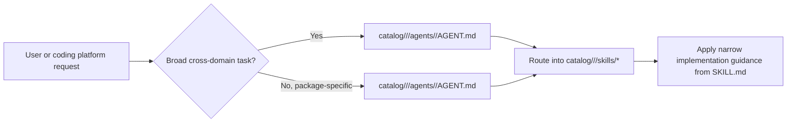
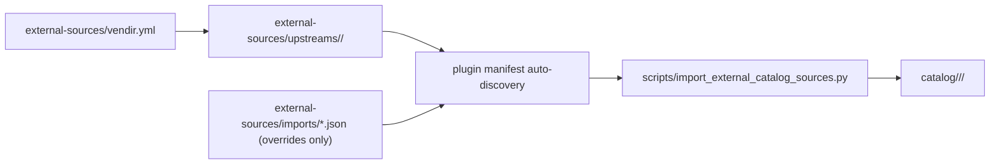

# dotnet-skills

[](https://www.nuget.org/packages/dotnet-skills)
[](LICENSE)
[](https://skills.managed-code.com/skills/)
[](https://dotnet.microsoft.com/)

**Stop explaining .NET to your AI. Start building.**

We've all been there: asking Claude to use Entity Framework, only to get EF6 patterns in a .NET 8 project. Explaining to Copilot that Blazor Server and Blazor WebAssembly aren't the same thing. Watching Codex generate `Startup.cs` for a Minimal API project.

This catalog fixes that. A growing catalog covering the entire .NET ecosystem—from ASP.NET Core to Orleans, from MAUI to Semantic Kernel. Install them once, and your AI agent actually knows modern .NET.

**[Browse the complete catalog on skills.managed-code.com →](https://skills.managed-code.com/skills/)**

## Why This Matters

- **No more outdated patterns.** Skills are maintained by the community and track official Microsoft documentation.
- **Works everywhere.** Same skills for Claude, Copilot, Gemini, Codex, and Junie.
- **Community-driven.** Missing a skill for your favorite library? Add it and help everyone.

**Your favorite .NET library deserves a skill.** If you maintain an open-source project or just love a framework that's missing, [contribute it](CONTRIBUTING.md). Let's make AI agents actually useful for .NET developers.

## Quick Start

```bash
dotnet tool install --global dotnet-skills

# choose one dedicated agent launcher
dotnet tool install --global dotnet-agents
dotnet tool install --global agents

dotnet skills                               # open the interactive control center
dotnet skills version                       # show current tool version and latest NuGet version
dotnet skills --version                     # alias for the same version view
dotnet skills list                          # show installed and available skills
dotnet skills bundle list                   # show focused bundles by collection and workflow
dotnet skills list --local                  # only installed skills in the current target
dotnet skills recommend                     # suggest skills from local .csproj files
dotnet skills install --auto                # install skills for NuGet packages detected in local .csproj files
dotnet skills install --auto --prune        # remove stale auto-managed skills that no longer match the project
dotnet skills install bundle quality        # install a focused .NET quality bundle
dotnet skills install mcaf                  # install the opt-in MCAF governance skill
dotnet skills install bundle orleans        # install the Orleans workflow bundle
dotnet skills install aspire orleans        # install skills
dotnet skills catalog tokens --catalog-root . # export per-skill token counts as JSON
dotnet skills remove aspire                 # remove one installed skill
dotnet skills remove bundle quality         # remove every skill from a focused bundle
dotnet skills remove collection distributed # remove every skill from a collection
dotnet skills remove --all                  # remove installed catalog skills from the target
dotnet skills update                        # refresh installed catalog skills
dotnet skills install blazor --agent claude # install for a specific agent
dotnet agents list                          # show bundled orchestration agents
dotnet agents install router --auto         # install agents to detected native agent folders
agents list                                 # same agent-only catalog via the plain standalone command
agents install router --auto                # same agent install flow without the dotnet-prefixed launcher
```

## Commands

| Command | Description |
|---------|-------------|
| `dotnet skills` | Open the interactive control center with direct skill browsing, collections, analysis, bundles, and install preview |
| `dotnet skills version` | Show the current installed tool version and check whether NuGet has a newer release |
| `dotnet skills list` | Show the current inventory, compare project/global scope when relevant, and keep the remaining catalog as a compact collection summary |
| `dotnet skills bundle list` | Show the focused bundles that expand into related skills by collection or workflow |
| `dotnet skills recommend` | Scan local `*.csproj` files, propose relevant skills, and let you decide what to install |
| `dotnet skills install --auto` | Inspect local `*.csproj` files, detect NuGet packages and strong project signals, and install matching skills automatically |
| `dotnet skills install --auto --prune` | Remove stale auto-managed skills that no longer match the current project's NuGet packages or app-model signals |
| `dotnet skills install <skill...>` | Install one or more skills |
| `dotnet skills install bundle <bundle...>` | Install one or more focused bundles such as `quality`, `frontend-quality`, or `orleans` |
| `dotnet skills catalog tokens --catalog-root .` | Export the tokenizer model name plus per-skill token counts as JSON |
| `dotnet skills remove <skill...>` | Remove one or more installed catalog skills by skill id or alias |
| `dotnet skills remove bundle <bundle...>` | Remove every installed skill mapped to one or more focused bundles |
| `dotnet skills remove collection <collection...>` | Remove every installed skill in one or more collections |
| `dotnet skills remove --all` | Remove every installed catalog skill from the selected target |
| `dotnet skills update [skill...]` | Update installed catalog skills to the selected catalog version |
| `dotnet skills sync` | Download latest catalog |
| `dotnet skills where` | Show install paths |
| `dotnet agents list` | List available orchestration agents |
| `dotnet agents install <agent...>` | Install orchestration agents |
| `dotnet agents install router --auto` | Install agents to all detected platforms |
| `dotnet agents remove <agent...>` | Remove installed agents |
| `dotnet agents where` | Show native agent install paths |
| `agents list` | List available orchestration agents through the standalone `agents` tool |
| `agents install <agent...>` | Install orchestration agents through the standalone `agents` tool |
| `agents where` | Show native agent install paths through the standalone `agents` tool |

Use `--agent` to target a specific agent platform, `--scope` to choose global or project install. Use `dotnet skills list --installed-only` or the shorter `dotnet skills list --local` when you only want the installed inventory, or `--available-only` when you want the detailed collection-by-collection breakdown of the remaining catalog. The default `list` view stays compact: it shows the current target inventory, compares project/global scope when that comparison is meaningful, and keeps the remaining catalog as a short collection summary instead of dumping one giant description table. The CLI renders rich terminal tables by default so you can quickly see installed versions, update candidates, install commands, and when a newer `dotnet-skills`, `dotnet-agents`, or `agents` package is available on NuGet. `dotnet skills --version`, `dotnet agents --version`, and `agents --version` are shortcuts for the version view.

`dotnet-skills` remains the skill-first CLI and still supports `dotnet skills agent ...` for compatibility. The dedicated agent-only surface is published in both forms: `dotnet-agents` for `dotnet agents ...` and `agents` for `agents ...`. Both top-level `list`, `install`, `remove`, and `where` commands target orchestration agents directly.

The interactive shell behind bare `dotnet skills` is the main control center: its primary catalog row now mirrors the public site with `Packages`, `Bundles`, `Collections`, `Skills`, `Agents`, and `About`, then layers CLI-only lifecycle surfaces such as `Project`, `Installed`, `Analysis`, and `Workspace` underneath. Inside that control center you still get direct individual-skill picking, `Collection -> Lane -> Skill` browsing, package-entry analysis, token hotspots, a full tree view, and install preview before files are written.

The [public catalog](https://skills.managed-code.com/) is the canonical browse surface for `Packages`, `Bundles`, `Collections`, `Skills`, `Agents`, and `About`. It uses the same shared navigation manifest and collection taxonomy as the CLI.

`dotnet skills bundle list` shows the ready-made focused bundles. Bundle installs are bulk shortcuts for related skill sets, so `dotnet skills install bundle quality`, `dotnet skills install bundle frontend-quality`, or `dotnet skills install bundle orleans` install every skill mapped to that focused bundle in one pass. MCAF is one opt-in governance skill and installs directly with `dotnet skills install mcaf`.

`dotnet skills install --auto` inspects local `*.csproj` files, detects NuGet packages plus strong SDK and project-property signals, and installs the matching skills for that project automatically. Add `dotnet skills install --auto --prune` when you also want to remove stale auto-managed skills that no longer match the current project. Protected diagnostic skills and `graphify-dotnet` are not pruned.

`dotnet skills recommend` is a scan-only command: it inspects local project files, proposes a skill list, and prints the install command you can run if you agree with the recommendations. It does not install anything automatically.

The bare `dotnet skills` usage view and `help` path also perform the automatic self-update check, so an outdated tool still tells you to upgrade before it renders the command table.

Use `dotnet skills version --no-check`, `dotnet agents version --no-check`, or `agents version --no-check` when you only want the local installed tool version without calling NuGet. Set `DOTNET_SKILLS_SKIP_UPDATE_CHECK=1`, `DOTNET_AGENTS_SKIP_UPDATE_CHECK=1`, or `AGENTS_SKIP_UPDATE_CHECK=1` if you want to suppress automatic update notices during normal command startup.

## Local Preview

When you want to preview the generated docs and public site locally:

```bash
python3 scripts/generate_catalog.py --validate-only
python3 scripts/generate_pages.py
```

The README stays intentionally compact. The generated catalog site is written to `artifacts/github-pages/` with the same shared `Packages / Bundles / Collections / Skills / Agents / About` navigation that the public site and CLI home surface use.

## Install Surface

Public bundle installs use `bundle`, not `package`. The focused bundle surface is intentionally small:

- `foundations`
- `quality`
- `frontend-quality`
- `architecture-core`
- `testing-base`
- `testing-xunit`
- `testing-nunit`
- `testing-mstest`
- `testing-tunit`
- `testing-migrations`
- `runtime-upgrades`
- `orleans`

Collections are intentionally split so installs stay explicit instead of collapsing into one overloaded `.NET` bucket:

- `.NET Foundations`
- `.NET Quality`
- `MSBuild`
- `NuGet & Publishing`
- `Templates & Scaffolding`
- `Diagnostics & Metrics`
- `Web`
- `Aspire`
- `Azure Functions`
- `Background Workers`
- `Mobile & Device`
- `XR & Spatial`
- `Desktop & UI`
- `Frontend Quality`
- `Testing`
- `Testing Research`
- `Architecture`
- `Governance & Delivery`
- `Data`
- `AI & Agents`
- `Distributed`
- `Legacy`
- `Upgrades & Migration`

Catalog releases are published automatically in `.github/workflows/publish-catalog.yml` at `04:00` UTC and include the `catalog-v*` release, GitHub Pages deployment, and NuGet publish for `dotnet-skills`, `dotnet-agents`, and `agents` in the same run. Automatic catalog versions use a numeric calendar-plus-daily-index format such as `2026.3.15.0`, where the first UTC-day release is `.0`, the second is `.1`, and so on. `dotnet-skills` reads the newest non-draft `catalog-v*` release by default, and `--catalog-version` is only for intentional pinning.

Install whichever dedicated agent package you prefer:

- `dotnet tool install --global dotnet-agents` gives you the `dotnet agents ...` command shape.
- `dotnet tool install --global agents` gives you the `agents ...` command shape.

## Agent Support

### Skills Installation Paths

| Agent | Global | Project |
|-------|--------|---------|
| Claude | `~/.claude/skills/` | `.claude/skills/` |
| Copilot | `~/.copilot/skills/` | `.github/skills/` |
| Gemini | `~/.gemini/skills/` | `.gemini/skills/` |
| Codex | `$CODEX_HOME/skills/` (default: `~/.codex/skills/`) | `.codex/skills/` |
| Junie | `~/.junie/skills/` | `.junie/skills/` |
| Default shared root | `~/.agents/skills/` | `.agents/skills/` |

### Orchestration Agents Installation Paths

| Agent | Global | Project |
|-------|--------|---------|
| Claude | `~/.claude/agents/` | `.claude/agents/` |
| Copilot | `~/.copilot/agents/` | `.github/agents/` |
| Gemini | `~/.gemini/agents/` | `.gemini/agents/` |
| Codex | `$CODEX_HOME/agents/` (default: `~/.codex/agents/`) | `.codex/agents/` |
| Junie | `~/.junie/agents/` | `.junie/agents/` |

`dotnet agents install --auto` and `agents install --auto` write only to already existing native agent directories. They do not use `.agents` as a shared agent target; if no native agent directory exists yet, specify `--agent` or `--target`.

`dotnet agents ... --target <path>` and `agents ... --target <path>` require an explicit `--agent` because the generated file format depends on the selected platform.

When `--agent` is omitted for skill installation, the tool checks for `.codex/`, `.claude/`, `.github/`, `.gemini/`, and `.junie/` directories in that order, installs into every already existing native platform target it finds, and uses `.agents/skills/` only when no native platform folder exists yet.

## Orchestration Agents

This repository now tracks a parallel agent layer above the skill catalog.

- reusable repo-authored skills, vendir-imported upstream skills, and repo-owned agents all live under package folders in `catalog/<type>/<package>/`.
- `catalog/<type>/<package>/skills/<skill>/SKILL.md` holds the detailed implementation guidance for one skill.
- `catalog/<type>/<package>/agents/<agent>/AGENT.md` holds routing behavior for one repo-owned orchestration agent.
- package `manifest.json` files hold the package-level metadata that both the installer and the public site scan.
- every skill and agent still gets its own folder so it can carry references, assets, scripts, and future installer metadata.
- an agent can therefore represent either a grouped pack of related skills or a narrow companion to one specific skill.
- the current `dotnet-skills` CLI remains skill-first; repo-owned agents can evolve and ship on their own track.
- runtime-specific `.agent.md` or native Claude files should be treated as install adapters, not as the canonical repo source format.



### Starter Agents

| Agent | Scope | Primary routing |
|-------|-------|-----------------|
| [`dotnet-router`](catalog/Platform/DotNet/agents/dotnet-router/) | package-scoped | classify web, data, AI, build, UI, testing, and modernization work |
| [`dotnet-build`](catalog/Platform/DotNet/agents/dotnet-build/) | package-scoped | restore, build, pack, CI, diagnostics |
| [`dotnet-data`](catalog/Frameworks/Entity-Framework-Core/agents/dotnet-data/) | package-scoped | EF Core, EF6, migrations, query issues |
| [`dotnet-frontend`](catalog/Tools/Biome/agents/dotnet-frontend/) | package-scoped | Blazor, frontend asset quality, browser-facing audits, and file-structure linting inside `.NET` repos |
| [`dotnet-ai`](catalog/Frameworks/Semantic-Kernel/agents/dotnet-ai/) | package-scoped | Semantic Kernel, Microsoft Agent Framework, Microsoft.Extensions.AI, MCP, ML.NET |
| [`dotnet-modernization`](catalog/Platform/Legacy-ASP.NET/agents/dotnet-modernization/) | package-scoped | upgrade, migration, and legacy modernization |
| [`dotnet-review`](catalog/Platform/Code-Review/agents/dotnet-review/) | package-scoped | code review, analyzers, testing, architecture |

### Package-Scoped Specialists

| Agent | Scope | Primary routing |
|-------|-------|-----------------|
| [`dotnet-orleans-specialist`](catalog/Frameworks/Orleans/agents/dotnet-orleans-specialist/) | package-scoped | Orleans grain boundaries, persistence, streams, reminders, placement, Aspire wiring, and cluster validation |
| [`dotnet-aspire-orchestrator`](catalog/Frameworks/Aspire/agents/dotnet-aspire-orchestrator/) | package-scoped | AppHost, CLI, first-party versus CommunityToolkit/Aspire integration choice, testing, and deployment routing inside the Aspire surface |
| [`agent-framework-router`](catalog/Frameworks/Microsoft-Agent-Framework/agents/agent-framework-router/) | package-scoped | Agent Framework agent-vs-workflow choice, `AgentThread`, tools, workflows, hosting, MCP/A2A/AG-UI, durable agents, and migration |

## Repository Layout

```text
catalog/
└── <Type>/
    └── <Package>/
        ├── manifest.json
        ├── icon.svg           # optional
        ├── skills/
        │   └── <skill-name>/
        │       ├── SKILL.md
        │       ├── manifest.json
        │       ├── scripts/     # optional
        │       ├── references/  # optional
        │       └── assets/      # optional
        └── agents/
            └── <agent-name>/
                ├── AGENT.md
                ├── manifest.json # optional
                ├── scripts/     # optional
                ├── references/  # optional
                └── assets/      # optional
```

The package-level `manifest.json` is the package control plane. It carries package title/description/icon and upstream links such as `links.repository`, `links.docs`, and `links.nuget`. Skill- or agent-specific metadata belongs in the nearest sibling `skills/<skill>/manifest.json` or `agents/<agent>/manifest.json`.

`SKILL.md` should stay focused on routing, workflow, deliverables, and validation. Do not put `version`, `category`, `packages`, or `package_prefix` in `SKILL.md` frontmatter.

## External Upstream Sources

External upstream repositories live in the dedicated [`external-sources/`](external-sources/) area.

- `external-sources/vendir.yml` and `external-sources/vendir.lock.yml` handle fetch-and-pin only.
- `external-sources/upstreams/` holds the checked-in vendored snapshots.
- `external-sources/imports/*.json` is overrides-only local policy for type, category, package naming, compatibility, and skill-level package trigger metadata.
- `scripts/import_external_catalog_sources.py` auto-discovers upstream plugins from vendored `plugin.json` and `.claude-plugin/plugin.json` files, applies the local overrides, and normalizes the result into `catalog/<type>/<package>/`.
- Imported upstream `SKILL.md`, `AGENT.md`, and supporting skill content is copied verbatim; local-only metadata stays in sibling `manifest.json` files instead of being injected into upstream markdown.

Official imports may keep their upstream skill ids instead of being renamed to match local repo-authored conventions.



When you refresh vendored upstream content locally, use `bash scripts/sync_external_catalog_sources.sh`.


## How Updates Are Tracked

This repository does not guess what to monitor.

It watches only the sources explicitly listed in the upstream watch config surface:

- [`.github/upstream-watch.json`](.github/upstream-watch.json) for shared metadata such as labels
- [`.github/upstream-watch*.json`](.github/) for shard files such as `upstream-watch.ai.json` or `upstream-watch-agent-framework.json`

Those files are the human-maintained source of truth for:

- GitHub release streams that should trigger skill review
- documentation pages that should trigger skill review
- which skills are affected by each upstream change
- how multiple page-level watches roll up into one open upstream issue per library or skill group

Each named shard file has exactly two lists:

- `github_releases`
- `documentation`

High-level flow:

```mermaid
flowchart LR
  A["Edit upstream-watch.json or a named upstream-watch.<domain>.json shard"] --> B["Run scripts/upstream_watch.py --validate-config"]
  B --> C["Run dry-run and sync-state-only once"]
  C --> D["Scheduled upstream-watch.yml runs upstream_watch.py daily"]
  D --> E["GitHub release or documentation change is detected"]
  E --> F["Automation opens or updates one grouped upstream issue per library or skill set"]
  F --> G["A human or agent updates catalog/<type>/<package>/ content and docs"]
  G --> H["Changes merge to main"]
  H --> I["04:00 UTC release pipeline publishes catalog, site, and tool"]
```



Use this shape:

```json
{
  "watch_issue_label": "upstream-update",
  "labels": [
    {
      "name": "upstream-update",
      "color": "5319E7",
      "description": "Framework or documentation updates detected by automation"
    }
  ]
}
```

```json
{
  "github_releases": [
    {
      "source": "https://github.com/managedcode/Storage",
      "skills": [
        "managedcode-storage"
      ]
    }
  ],
  "documentation": [
    {
      "source": "https://learn.microsoft.com/dotnet/aspire/",
      "skills": [
        "aspire"
      ]
    }
  ]
}
```

Keep the base file small and name shard files semantically, for example `upstream-watch.ai.json`, `upstream-watch.data.json`, `upstream-watch.platform.json`, or `upstream-watch-agent-framework.json`.

That is enough for normal maintenance.
`scripts/upstream_watch.py` derives the watch kind, ids, source coordinates, display names, and default notes at runtime.
Use optional fields only when you really need them, for example `match_tag_regex` for mixed release streams or `id` for a stable legacy key.

If you add a new library or framework and want this repo to keep watching it, the actual how-to is in [CONTRIBUTING.md](CONTRIBUTING.md#upstream-watch-entries).

## Contributing

**This catalog is community-driven.** If you maintain a .NET library, framework, or tool:

1. **Add or update a catalog package** under `catalog/<type>/<package>/`
2. **Keep package metadata in package `manifest.json`**: title, description, icon, and upstream `links`
3. **Keep entity-specific metadata in sibling manifests** such as `catalog/<type>/<package>/skills/<skill>/manifest.json` for `version`, `category`, `packages`, or `package_prefix`
4. **Keep implementation guidance in `catalog/<type>/<package>/skills/<skill>/SKILL.md`** and routing behavior in `catalog/<type>/<package>/agents/<agent>/AGENT.md`
5. **Add upstream watch** so we know when your project releases updates

See [CONTRIBUTING.md](CONTRIBUTING.md) for the full guide, and use the GitHub contribution templates when opening a package request, maintenance issue, or PR.

## Credits

This catalog builds on the work of many open-source projects and their authors:

### Inspiration & Standards

| Project | Authors | Description |
|---------|---------|-------------|
| [MCAF](https://mcaf.managed-code.com/) | Managed Code | Framework for building real software with AI coding agents through repo-native context, verification, `AGENTS.md`, and skills |
| [dotnet/skills](https://github.com/dotnet/skills) | Microsoft, .NET team | Official .NET skills repository vendir-imported into this catalog for upstream task-specific skills and agents |
| [webgpu-claude-skill](https://github.com/dgreenheck/webgpu-claude-skill) | Dan Greenheck | Three.js WebGPU and TSL skill vendir-imported with pinned source and upstream-change tracking |
| [Agent Skills Standard](https://agentskills.io) | Anthropic | Open specification for portable agent skill packages |
| [Claude Code](https://code.claude.com) | Anthropic | Subagent architecture that shaped our orchestration agent design |

### Test Frameworks

| Tool/Library | Authors | License |
|--------------|---------|---------|
| [xUnit](https://github.com/xunit/xunit) | Brad Wilson, James Newkirk | Apache-2.0 |
| [NUnit](https://github.com/nunit/nunit) | Charlie Poole, NUnit team | MIT |
| [MSTest](https://github.com/microsoft/testfx) | Microsoft | MIT |
| [TUnit](https://github.com/thomhurst/TUnit) | Tom Longhurst | MIT |

### Code Coverage & Mutation Testing

| Tool/Library | Authors | License |
|--------------|---------|---------|
| [Coverlet](https://github.com/coverlet-coverage/coverlet) | Toni Solarin-Sodara, Marco Rossignoli | MIT |
| [ReportGenerator](https://github.com/danielpalme/ReportGenerator) | Daniel Palme | Apache-2.0 |
| [Stryker.NET](https://github.com/stryker-mutator/stryker-net) | Stryker Mutator team | Apache-2.0 |

### Analyzers & Formatters

| Tool/Library | Authors | License |
|--------------|---------|---------|
| [Roslynator](https://github.com/dotnet/roslynator) | Josef Pihrt, .NET Foundation | Apache-2.0 |
| [StyleCop.Analyzers](https://github.com/DotNetAnalyzers/StyleCopAnalyzers) | .NET Analyzers team | MIT |
| [Meziantou.Analyzer](https://github.com/meziantou/Meziantou.Analyzer) | Gérald Barré | MIT |
| [CSharpier](https://github.com/belav/csharpier) | Bela VanderVoort | MIT |
| [ReSharper CLT](https://www.jetbrains.com/resharper/features/command-line.html) | JetBrains | Proprietary (free) |

### Architecture Testing

| Tool/Library | Authors | License |
|--------------|---------|---------|
| [NetArchTest](https://github.com/BenMorris/NetArchTest) | Ben Morris | MIT |
| [ArchUnitNET](https://github.com/TNG/ArchUnitNET) | TNG Technology Consulting | Apache-2.0 |

### Metrics & Analysis

| Tool/Library | Authors | License |
|--------------|---------|---------|
| [cloc](https://github.com/AlDanial/cloc) | Al Danial | GPL-2.0 |
| [CodeQL](https://github.com/github/codeql) | GitHub, Semmle | MIT (queries) |
| [QuickDup](https://github.com/asynkron/QuickDup) | Roger Johansson, Asynkron | MIT |
| [Asynkron.Profiler](https://github.com/asynkron/Asynkron.Profiler) | Roger Johansson, Asynkron | MIT |

### Frameworks & Libraries

| Tool/Library | Authors | License |
|--------------|---------|---------|
| [CommunityToolkit.Mvvm](https://github.com/CommunityToolkit/dotnet) | Microsoft, .NET Foundation | MIT |
| [Microsoft Agent Framework](https://github.com/microsoft/agent-framework) | Microsoft | MIT |
| [Microsoft.Extensions.AI](https://github.com/dotnet/extensions) | Microsoft, .NET Foundation | MIT |
| [MCP C# SDK](https://github.com/modelcontextprotocol/csharp-sdk) | Anthropic, Microsoft | Apache-2.0 |
| [Uno Platform](https://github.com/unoplatform/uno) | nventive, Uno Platform | Apache-2.0 |
| [Orleans](https://github.com/dotnet/orleans) | Microsoft | MIT |
| [Semantic Kernel](https://github.com/microsoft/semantic-kernel) | Microsoft | MIT |
| [Entity Framework Core](https://github.com/dotnet/efcore) | Microsoft, .NET Foundation | MIT |
| [ML.NET](https://github.com/dotnet/machinelearning) | Microsoft, .NET Foundation | MIT |
| [LibVLCSharp](https://github.com/videolan/libvlcsharp) | VideoLAN | LGPL-2.1 |

*Want your project credited? Add a skill and include yourself in this list!*
