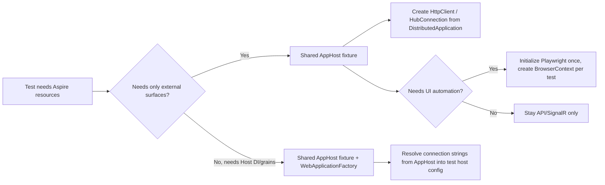

# .NET Aspire Testing Patterns

Use this reference when the task is about AppHost-backed integration tests, `DistributedApplicationTestingBuilder`, mixing Aspire with `WebApplicationFactory`, Playwright UI automation, or practical diagnostics.

These patterns are grounded in working production-style test harnesses used in `AIBase` and `WA.Storied.Agents`: one shared AppHost fixture per test session, optional `WebApplicationFactory` layering for Host DI/grains, and browser contexts created per test rather than per session.

## Fixture Selection



## Package Baseline

Typical Aspire-backed integration suites need:

```xml
<ItemGroup>
  <PackageReference Include="Aspire.Hosting.Testing" />
  <PackageReference Include="Microsoft.AspNetCore.Mvc.Testing" />
  <PackageReference Include="Microsoft.AspNetCore.SignalR.Client" />
  <PackageReference Include="Microsoft.Playwright" />
</ItemGroup>
```

Add the actual test framework package separately: `TUnit`, `xunit`, or `NUnit`.

## Shared AppHost Fixture

Boot the AppHost once, wait for the real resources, and hand out clients from the distributed app:

```csharp
using Aspire.Hosting.Testing;

public sealed class AspireTestFixture : IAsyncDisposable
{
    private DistributedApplication? _app;

    public DistributedApplication App =>
        _app ?? throw new InvalidOperationException("App not initialized.");

    public string ApiUrl { get; private set; } = string.Empty;

    public async Task InitializeAsync()
    {
        var builder = await DistributedApplicationTestingBuilder.CreateAsync<Projects.My_AppHost>();

        builder.Services.AddLogging(logging =>
        {
            logging.ClearProviders();
            logging.AddConsole();
            logging.SetMinimumLevel(LogLevel.Warning);
            logging.AddFilter("Aspire.Hosting.Dcp", LogLevel.Warning);
            logging.AddFilter("Aspire.Hosting.Backchannel", LogLevel.Critical);
        });

        _app = await builder.BuildAsync();
        await _app.StartAsync();

        using var cts = new CancellationTokenSource(TimeSpan.FromMinutes(1));
        await _app.ResourceNotifications.WaitForResourceHealthyAsync("api", cts.Token);

        ApiUrl = _app.CreateHttpClient("api", "http").BaseAddress?.ToString()
            ?? throw new InvalidOperationException("API URL was not resolved.");
    }

    public HttpClient CreateApiClient() => App.CreateHttpClient("api", "http");

    public async Task DisposeAsync()
    {
        if (_app is not null)
        {
            await _app.StopAsync();
            await _app.DisposeAsync();
        }
    }
}
```

Use this shape when the test only needs the real distributed topology: API, SignalR, SSE, workers, or resource health.

## Layer `WebApplicationFactory` On Top Of Aspire Infra

When the test needs Host DI services, direct `IGrainFactory` access, or in-process runtime services, reuse the AppHost infrastructure and inject its connection strings into the web host:

```csharp
public sealed class TestApplication
    : WebApplicationFactory<HostEntryPointMarker>, IAsyncDisposable
{
    private static readonly AspireTestFixture SharedFixture = new();
    private readonly Dictionary<string, string?> _overrides = new(StringComparer.OrdinalIgnoreCase);

    protected override void ConfigureWebHost(IWebHostBuilder builder)
    {
        builder.UseEnvironment(Environments.Development);

        builder.ConfigureAppConfiguration((_, config) =>
        {
            config.AddInMemoryCollection(new Dictionary<string, string?>
            {
                ["Logging:LogLevel:Default"] = "Warning",
                ["Logging:LogLevel:Orleans"] = "Warning",
                ["Logging:LogLevel:Aspire"] = "Warning",
            });

            config.AddInMemoryCollection(_overrides);
        });
    }

    public async Task InitializeAsync()
    {
        await SharedFixture.InitializeAsync();

        var tables = await SharedFixture.App.GetConnectionStringAsync("tables");
        var blobs = await SharedFixture.App.GetConnectionStringAsync("blobs");

        _overrides["ConnectionStrings:Tables"] = tables;
        _overrides["ConnectionStrings:Blobs"] = blobs;

        Environment.SetEnvironmentVariable("ConnectionStrings__Tables", tables);
        Environment.SetEnvironmentVariable("ConnectionStrings__Blobs", blobs);

        CreateClient();
    }

    public new HttpClient CreateClient()
    {
        var client = base.CreateClient();
        client.Timeout = TimeSpan.FromMinutes(5);
        return client;
    }

    public async Task DisposeAsync()
    {
        Dispose();
        await SharedFixture.DisposeAsync();
    }
}
```

Rules that matter:

- boot Aspire once, not per test
- resolve connection strings and endpoints from `SharedFixture.App`, not from copied local config
- keep `WebApplicationFactory` focused on DI/runtime access, not infrastructure provisioning
- adapt the lifecycle surface to the active test framework: xUnit `IAsyncLifetime`, TUnit `IAsyncInitializer`, or the repo's own fixture abstraction

## Playwright In The Shared Fixture

Initialize the browser once, then create a fresh browser context per test:

```csharp
public async Task InitializePlaywrightAsync()
{
    await InitializeAsync();

    var exitCode = Microsoft.Playwright.Program.Main(["install", "chromium"]);
    if (exitCode != 0)
    {
        throw new InvalidOperationException($"Playwright install failed: {exitCode}");
    }

    Playwright ??= await Microsoft.Playwright.Playwright.CreateAsync();
    Browser ??= await Playwright.Chromium.LaunchAsync(new BrowserTypeLaunchOptions
    {
        Headless = true,
        Args =
        [
            "--disable-dev-shm-usage",
            "--disable-gpu",
            "--window-size=1920,1080",
        ],
    });
}

public async Task<IBrowserContext> CreateBrowserContextAsync()
{
    await InitializePlaywrightAsync();

    return await Browser!.NewContextAsync(new BrowserNewContextOptions
    {
        BaseURL = ApiUrl,
        IgnoreHTTPSErrors = true,
        ViewportSize = new ViewportSize { Width = 1920, Height = 1080 },
        ScreenSize = new ScreenSize { Width = 1920, Height = 1080 },
    });
}
```

Do not share pages or browser contexts across tests. Reuse the browser process, not mutable browser state.

## Diagnostics And Failure Capture

Useful low-noise defaults:

- `logging.ClearProviders(); logging.AddConsole();`
- `logging.SetMinimumLevel(LogLevel.Warning);`
- `logging.AddFilter("Aspire.Hosting.Dcp", LogLevel.Warning);`
- `logging.AddFilter("Aspire.Hosting.Backchannel", LogLevel.Critical);`

For failures:

- dump server-side error logs from the shared fixture or `WebApplicationFactory` logger provider
- capture Playwright screenshots and HTML into an `artifacts/` folder
- include resource logs from the AppHost when a resource fails to become healthy

Example pattern:

```csharp
try
{
    var response = await client.GetAsync("/health");
    response.EnsureSuccessStatusCode();
}
catch
{
    Console.WriteLine(testApplication.GetHostLogDump(LogLevel.Error));
    throw;
}
```

## Practical Rules

- Use plain service-level tests when the AppHost topology does not matter.
- Use Aspire testing when the assertion depends on real resource wiring, service discovery, health, or cross-service flows.
- Mix Aspire with `WebApplicationFactory` only when the test needs direct access to DI, grains, or in-process runtime services.
- Keep one shared AppHost fixture per test session and one browser context per UI test.
- Prefer explicit resource names and explicit `WaitForResourceHealthyAsync(...)` checks so failures point to the right resource quickly.
