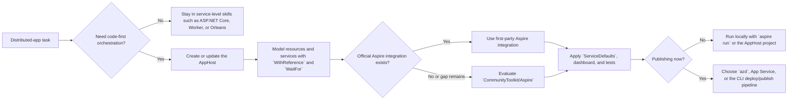

# .NET Aspire

## Trigger On

- `Aspire.AppHost.Sdk`, `Aspire.Hosting.*`, `DistributedApplication.CreateBuilder`, `WithReference`, `WaitFor`, `AddProject`, `AddRedis`, `AddPostgres`, `aspire run`, `aspire init`, `aspire add`, or `aspire update`
- `Aspire.Hosting.Testing`, `DistributedApplicationTestingBuilder`, or a test harness that mixes an Aspire AppHost with `WebApplicationFactory`
- orchestrating multiple services and resources with an AppHost for local development or cloud deployment
- setting up `ServiceDefaults`, service discovery, OpenTelemetry, health checks, or the Aspire Dashboard
- choosing between official first-party Aspire integrations and `CommunityToolkit/Aspire`
- upgrading older 8.x or 9.x Aspire solutions to the current CLI and AppHost SDK model
- wiring polyglot services into an Aspire topology, especially when Go, Java, Python, or extra dev-time tools enter the picture

## Workflow

1. Classify the task first: new AppHost creation, existing-solution enlistment, integration wiring, testing and observability, deployment, or version upgrade.
2. Prefer the current Aspire toolchain. For greenfield or modernized work, use the Aspire CLI and current AppHost SDK instead of writing new guidance around the deprecated legacy workload.
3. Treat 13.1.x patches as servicing updates, not a new app model. Keep the Aspire CLI, `Aspire.AppHost.Sdk`, and closely coupled hosting or testing packages on the same patch line, then rerun the AppHost and deployment checks after `aspire update`.
4. Keep the AppHost code-first and topology-focused. Model services, resources, dependencies, endpoints, lifetimes, and parameters there; keep business logic out.
5. Keep `ServiceDefaults` narrow. It exists for telemetry, health checks, resilience, and service discovery, not shared domain models or general utility code.
6. Prefer official first-party Aspire integrations when they cover the requirement. Use `CommunityToolkit/Aspire` only when the capability gap is real: unsupported language hosts, extra dev infrastructure, or extension packages the official project does not provide.
7. Validate the whole distributed system, not one project in isolation. Local success means the AppHost starts cleanly, dependencies resolve through `WithReference`, the dashboard shows the expected resource graph, and end-to-end tests can exercise the topology.
8. For integration tests, keep one shared AppHost fixture per test session. Use `Aspire.Hosting.Testing` to boot the distributed app, create `HttpClient` or SignalR clients from the AppHost, and layer `WebApplicationFactory` on top only when tests need direct Host DI, grains, or runtime services.
9. When publishing, switch from local containers or emulators to managed resources deliberately and verify which services truly need external endpoints.

## Architecture

## Current Guidance

- AppHost shape: prefer current SDK-style AppHost projects using `Aspire.AppHost.Sdk/<version>` or a file-based AppHost when that repo intentionally uses the single-file model. Recognize both as valid current patterns.
- CLI entry points: use `aspire new` for starter projects, `aspire init` to add Aspire support to an existing solution or create a single-file AppHost, `aspire add` to add integrations or starter pieces, `aspire run` for local orchestration, `aspire deploy` for the current CLI deploy pipeline, and `aspire update` for version-aware upgrades. `aspire publish` still exists for explicit artifact-generation flows and remains preview-sensitive.
- Patch posture: Aspire `13.1.3` is a servicing release. Treat it as a patch-line refresh for the current CLI-first workflow, not a new topology model; align package versions, rerun `aspire update`, then revalidate local orchestration and the chosen deployment path.
- App model wiring: use `WithReference(...)` for dependency and configuration flow, and `WaitFor(...)` for startup ordering. Use `WithExternalHttpEndpoints()` only when the resource truly needs an externally reachable endpoint for the chosen runtime or publish target.
- ServiceDefaults boundaries: `AddServiceDefaults()` should stay focused on OpenTelemetry, health endpoints, service discovery, `HttpClient` resilience, and related cross-cutting infrastructure.
- Testing model: prefer Aspire closed-box testing when you need to run the distributed application as a system. Use `DistributedApplicationTestingBuilder` plus a shared fixture for AppHost lifecycle, `App.CreateHttpClient(...)` for resource-bound clients, and a `WebApplicationFactory<TEntryPoint>` wrapper only when the test must resolve DI services or in-process runtime state from the hosted app. For UI flows, initialize Playwright once in the shared fixture, create a fresh browser context per test, and capture failure artifacts.
- Dashboard usage: treat the Aspire Dashboard as the development observability surface. It is valuable in AppHost runs and standalone OTLP scenarios, but it is not a production monitoring replacement.
- Upgrade posture: older 8.x or 9.x solutions need explicit migration work. Current guidance favors the Aspire CLI upgrade path and the newer AppHost SDK structure on `.NET 10`.

## Selection Rules

- Use first-party Aspire when the package and docs exist for the resource or platform, especially for core .NET, Azure, cache, database, messaging, and standard local-container flows.
- Use `CommunityToolkit/Aspire` when you need polyglot app hosts beyond official coverage, extra dev-time tools around a resource, or community-maintained integrations such as SQLite, Java, Go, PowerShell, k6, MailPit, MinIO, or Meilisearch.
- Prefer the smallest surface that solves the problem. Do not add a broad toolkit extension pack when an existing first-party integration plus a normal library already fits.
- Treat toolkit packages as community-supported. Verify maturity, maintenance, external container images, and security or licensing assumptions before making them part of a production baseline.

## Official Sources

- [Aspire docs home](https://aspire.dev/docs/)
- [AppHost](https://aspire.dev/get-started/app-host/)
- [Service defaults](https://aspire.dev/fundamentals/service-defaults/)
- [Integrations overview](https://aspire.dev/integrations/overview/)
- [Build your first app](https://aspire.dev/get-started/first-app/)
- [Aspire CLI reference](https://aspire.dev/reference/cli/commands/aspire/)
- [Upgrade Aspire](https://learn.microsoft.com/en-us/dotnet/aspire/get-started/upgrade-to-aspire-13)
- [Testing overview](https://aspire.dev/testing/overview/)
- [dotnet/aspire](https://github.com/dotnet/aspire)
- [CommunityToolkit/Aspire](https://github.com/CommunityToolkit/Aspire)

## Anti-Patterns

- hardcoding service URLs or connection strings instead of using `WithReference`
- putting business logic, data migrations, or large configuration transforms inside the AppHost
- turning `ServiceDefaults` into a dumping ground for shared models or helpers
- adding external HTTP endpoints everywhere instead of only where runtime or publish needs them
- defaulting to `CommunityToolkit/Aspire` when first-party Aspire already covers the requirement
- assuming the dashboard or local containers automatically mean production readiness
- treating Aspire tests as a mocking framework; they run the application as a real distributed system

## Deliver

- a version-aware Aspire architecture or upgrade direction
- the right AppHost, ServiceDefaults, integration, and CLI workflow
- an explicit first-party versus `CommunityToolkit/Aspire` package decision
- an end-to-end validation path for local orchestration, testing, and deployment

## Validate

- the AppHost starts cleanly via `aspire run` or the AppHost project
- resources and projects are modeled with explicit `WithReference` and `WaitFor` relationships where needed
- consuming apps resolve endpoints and connection strings without hardcoded values
- `ServiceDefaults` contains only cross-cutting infrastructure concerns
- dashboard, health checks, logs, and traces reflect the expected resource graph
- Aspire-backed integration tests reuse a shared AppHost fixture instead of booting the distributed app inside each test
- any `WebApplicationFactory` layer reuses connection strings and endpoints from the AppHost instead of duplicating local config
- testing and deployment guidance matches the chosen runtime: local AppHost, standalone dashboard, ACA/App Service, or the CLI deploy/publish pipeline

## References

- [patterns.md](references/patterns.md) - Current CLI-first setup flows, AppHost patterns, `ServiceDefaults`, testing, and upgrade checkpoints
- [testing.md](references/testing.md) - Shared AppHost fixtures, `DistributedApplicationTestingBuilder`, `WebApplicationFactory` integration, Playwright bootstrapping, and diagnostics
- [deployment.md](references/deployment.md) - ACA, App Service, publish-mode, and manifest-oriented deployment guidance
- [community-toolkit.md](references/community-toolkit.md) - Practical guide to `CommunityToolkit/Aspire` packages, capability gaps, and selection rules
