# Avalonia

## Workflow

1. Inspect the SDK, target frameworks, Avalonia package versions, `.axaml` files, entrypoint, and supported OS/RIDs. Keep Avalonia packages on one compatible version. Use the [Avalonia 12 docs](https://docs.avaloniaui.net/docs/welcome) for 12 and the [Avalonia 11 docs](https://v11.docs.avaloniaui.net/) for 11; do not copy 12-only APIs into 11.
2. Keep `Program.BuildAvaloniaApp`, `App.axaml`, views, view models, and domain/services separate. Desktop hosts use `StartWithClassicDesktopLifetime` and create `MainWindow` in `OnFrameworkInitializationCompleted`; single-view targets require their own lifetime. The previewer can have no application lifetime.
3. Use typed compiled bindings and explicit binding modes. `x:DataType` describes the binding type; it does not set the runtime `DataContext`. Avalonia 12 enables compiled bindings by default; explicitly enable them on 11. Read [references/bindings-and-controls.md](references/bindings-and-controls.md) for templates, properties, resources, and command patterns.
4. Use `CommunityToolkit.Mvvm` for observable state and commands when appropriate. Prefer cancellable asynchronous service operations, surface errors, and marshal background updates to the UI dispatcher. Keep services independent of controls.
5. Choose `StyledProperty` for styleable/animatable values and `DirectProperty` for backed state without style precedence. Use `DataTemplate` to display data and `ControlTemplate`/`ControlTheme` to change a control's visual structure. Use `UserControl` for application composition, `TemplatedControl` for reusable skinnable controls, and custom rendering only when needed.
6. Validate native integrations, dialogs, resources, shutdown, DPI, accessibility, and packaging on each supported platform. Read [references/platforms-and-publishing.md](references/platforms-and-publishing.md) before trimming or Native AOT. Read the [documentation map](references/official-docs-index.md) only for the selected topic.

```mermaid
flowchart LR
  Packages[Installed Avalonia major] --> Docs[Matching 11 or 12 documentation]
  Docs --> VM[View model and service]
  VM --> Bindings[Typed bindings and commands]
  Bindings --> UI[Views, templates, property system]
  UI --> Desktop[Desktop lifetime and UI dispatcher]
  Desktop --> Verify[Headless tests + native OS checks]
  Verify --> Publish[RID-specific publish and packaging]
```



## Install

For a new application, use the official templates rather than inventing project scaffolding:

```bash
dotnet new install Avalonia.Templates
dotnet new avalonia.mvvm -o MyApp
dotnet add MyApp/MyApp.csproj package CommunityToolkit.Mvvm
dotnet run --project MyApp/MyApp.csproj
```

For an existing project, select versions matching its target framework and installed Avalonia major:

```bash
dotnet add MyApp.csproj package Avalonia.Desktop --version <compatible-version>
dotnet add MyApp.csproj package Avalonia.Themes.Fluent --version <compatible-version>
```

## Read: typed view-model bindings

The view model implements notifications through the toolkit. Wire the runtime context when constructing the view:

```csharp
using CommunityToolkit.Mvvm.ComponentModel;
using CommunityToolkit.Mvvm.Input;

public partial class MainViewModel : ObservableObject
{
    [ObservableProperty]
    private string name = "Ada";

    [ObservableProperty]
    private string greeting = "Ready";

    [RelayCommand]
    private void Greet() => Greeting = $"Hello, {Name}";
}

// In App.OnFrameworkInitializationCompleted, after checking desktop lifetime:
// desktop.MainWindow = new MainWindow { DataContext = new MainViewModel() };
```

In the view, replace `MyApp.ViewModels` with the actual namespace:

```xml
<Window xmlns="https://github.com/avaloniaui"
        xmlns:x="http://schemas.microsoft.com/winfx/2006/xaml"
        xmlns:vm="using:MyApp.ViewModels"
        x:Class="MyApp.MainWindow"
        x:DataType="vm:MainViewModel" x:CompileBindings="True">
  <StackPanel Spacing="8" Margin="16">
    <TextBox Text="{Binding Name, Mode=TwoWay}" />
    <Button Content="Greet" Command="{Binding GreetCommand}" />
    <TextBlock Text="{Binding Greeting}" />
  </StackPanel>
</Window>
```

## Write: a styleable custom-control property

```csharp
using Avalonia;
using Avalonia.Controls.Primitives;

public class StatusBadge : TemplatedControl
{
    public static readonly StyledProperty<string> TextProperty =
        AvaloniaProperty.Register<StatusBadge, string>(nameof(Text), "Ready");

    public string Text
    {
        get => GetValue(TextProperty);
        set => SetValue(TextProperty, value);
    }
}
```

Define the visual tree in a control theme; keep CLR accessors limited to `GetValue`/`SetValue`, because styles and bindings can bypass them. Use property-change hooks for behavior and `SetCurrentValue` when changing a value without replacing its existing binding.

## Options and constraints

- Set `<AvaloniaUseCompiledBindingsByDefault>true</AvaloniaUseCompiledBindingsByDefault>` explicitly for consistent 11/12 behavior. Use `ReflectionBinding` only for a justified dynamic path; review trimming risk.
- Use `Dispatcher.UIThread.InvokeAsync` when completion matters, `Post` for a queued notification, and `CheckAccess` when deciding whether to marshal. Update bound collections on the UI thread; avoid `.Result`/`.Wait()` there.
- Choose an intentional `ShutdownMode` and owner for `ShowDialog<T>(owner)`. Inject a dialog service into view models instead of constructing windows there.
- Fluent themes, selectors, pseudoclasses, theme variants, and `avares://` resources differ from WPF. Do not transplant WPF styles or assume platform behavior is identical.
- Avalonia 12 changes binding APIs, clipboard, window decorations, and diagnostics packages. Review the major-version migration guide before upgrading.
- A successful build or headless test does not prove native rendering, packaging, accessibility, or AOT compatibility.

## Deliver and validate

- State the installed major, chosen lifetime, supported OS/RIDs, and matching docs.
- Run `dotnet build <solution> -c Release` and the repository's focused tests; verify that typed binding paths compile and commands update observable state.
- Use `Avalonia.Headless.XUnit` or `Avalonia.Headless.NUnit` for dispatcher-aware control tests. Keep unrelated tests parallel; constrain only a concrete destructive collision domain.
- Launch on each promised OS and check resizing, scaling, keyboard navigation, dialogs, resources, and shutdown.
- Publish for each RID and launch the actual output. Fix trim/AOT warnings and test native dependencies rather than suppressing them.
- Keep test output to warnings/errors plus one concise result, preserve native progress/ANSI and exit codes, and cap diagnostics at 80 lines / 8 KiB with bounded artifacts outside context.
