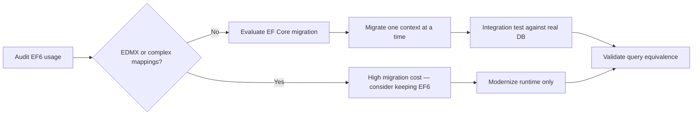

# Entity Framework 6

## Trigger On

- working in an EF6 codebase on .NET Framework or modern .NET
- deciding whether to keep EF6, move to modern .NET runtime, or port to EF Core
- reviewing EDMX, code-first, or legacy ASP.NET/WPF/WinForms data access
- planning a data layer migration strategy

## Workflow

1. **Audit current EF6 usage** before planning any migration. Identify which features the codebase depends on:
   ```csharp
   // Common EF6-specific patterns to inventory:
   // - EDMX designer models (check for *.edmx files)
   // - ObjectContext vs DbContext usage
   // - Lazy loading with virtual navigation properties
   // - Database.SqlQuery<T>() for raw SQL
   // - Stored procedure mappings in model
   // - Spatial types (DbGeography, DbGeometry)
   ```
2. **Decide runtime vs ORM migration separately:**

   | Path | When to use |
   |------|-------------|
   | Keep EF6 on .NET Framework | Legacy app with no runtime pressure |
   | EF6 on modern .NET | Runtime upgrade needed, ORM migration too risky |
   | EF6 → EF Core | Clean data layer, no EDMX, minimal stored-procedure mapping |

3. **For maintenance work** — keep EF6 stable:
   - use repository + unit of work patterns to isolate data access (see [references/patterns.md](references/patterns.md))
   - prefer `DbContext` over `ObjectContext` for new code
   - use `AsNoTracking()` for read-only queries
   - configure concurrency tokens with `[ConcurrencyCheck]` or `IsRowVersion()`
4. **For migration work** — validate each slice:
   - map EF6 features to EF Core equivalents (see [references/migration.md](references/migration.md))
   - migrate one bounded context at a time, not the entire data layer
   - run integration tests against the real database provider, not InMemory
   - verify: `dotnet ef migrations add` succeeds, queries produce equivalent results, lazy loading behavior matches expectations
5. **Do not promise EF Core features to EF6 codebases** — EF6 is stable and supported but not on the innovation path. Keep expectations realistic.

## Current Upstream Notes

- The current EF Core vs EF6 comparison page keeps the migration decision separate from runtime modernization. EF6 can remain the right ORM when EDMX, ObjectContext, or complex legacy mappings dominate the risk.
- EF Core `v10.0.10` servicing does not change EF6 guidance by itself; only move an EF6 codebase when the project has a bounded migration slice and database-backed equivalence tests.



## Deliver

- realistic EF6 maintenance or migration guidance based on actual codebase audit
- clear separation between runtime upgrade and ORM upgrade work
- bounded migration slices with concrete validation checkpoints
- reduced risk for legacy data access changes

## Validate

- EF6 feature inventory is complete before migration planning starts
- migration assumptions are backed by real feature usage, not guesses
- EF6-only features (EDMX, spatial types, ObjectContext patterns) are identified early
- integration tests run against the real database provider, not mocks or InMemory
- the proposed path avoids unnecessary churn in stable data access code

## References

- [references/migration.md](references/migration.md) - decision framework, migration approaches, EF6-to-EF Core feature mapping, and common pitfalls
- [references/patterns.md](references/patterns.md) - repository and unit of work patterns, query optimization, concurrency handling, auditing, and testing strategies for EF6 codebases
