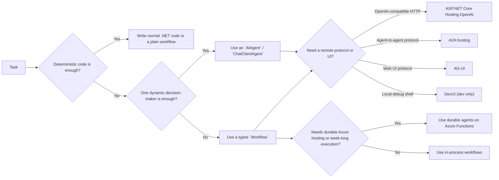

# Microsoft Agent Framework

## Trigger On

- building or reviewing `.NET` code that uses `Microsoft.Agents.*`, `Microsoft.Extensions.AI`, `AIAgent`, `AgentThread`, `AgentSession`, or Agent Framework hosting packages
- choosing between `ChatClientAgent`, Responses agents, hosted agents, custom agents, Anthropic agents, workflows, or durable agents
- authoring preview-era `Microsoft.Agents.AI.Workflows.Declarative*` packages or wrapping a workflow with `workflow.AsAIAgent()`
- adding tools, MCP, A2A, OpenAI-compatible hosting, AG-UI, DevUI, background responses, or OpenTelemetry
- migrating from Semantic Kernel agent APIs or aligning AutoGen-style multi-agent patterns to Agent Framework
- using Anthropic Claude models (haiku, sonnet, opus) via `AnthropicClient` or through Azure Foundry with `AnthropicFoundryClient`

## Workflow

1. Decide whether the problem should stay deterministic. If plain code or a typed workflow without LLM autonomy is enough, do that instead of adding an agent.
2. Choose the execution shape first: single `AIAgent`, explicit programmatic `Workflow`, workflow-as-agent wrapper, declarative workflow when YAML portability is explicitly required, Azure Functions durable agent, ASP.NET Core hosted agent, AG-UI remote UI, or DevUI local debugging.
3. Choose the agent type and provider intentionally. Prefer the simplest agent that satisfies the threading, tooling, and hosting requirements.
4. Keep agents stateless and keep conversation or long-lived state in provider-owned session objects. Most persistence guidance still centers on `AgentThread`, while newer middleware and background-response examples may surface `AgentSession`. Treat both as opaque provider-specific state.
5. Add only the tools and middleware that the scenario needs. Narrow the tool surface, require approval for side effects, and treat MCP, A2A, and third-party services as trust boundaries.
6. For workflows, model executors, edges, typed `RequestPort` boundaries, checkpoints, shared state, and human-in-the-loop explicitly rather than hiding control flow in prompts.
7. Prefer Responses-based protocols for new remote/OpenAI-compatible integrations unless you specifically need Chat Completions compatibility.
8. Use durable agents only when you truly need Azure Functions serverless hosting, durable thread storage, or deterministic long-running orchestrations.
9. Verify preview status, package maturity, docs recency, and provider-specific limitations before locking a production architecture.

## Current Upstream Notes

- The July 2026 overview now describes one Agent Framework across .NET, Python, and Go. This catalog skill remains intentionally .NET-scoped; do not infer API or feature parity from cross-language overview wording.
- The refreshed AG-UI security guidance keeps the browser outside the trust boundary: put a trusted frontend/server mediator in front of the AG-UI server, validate client-supplied messages, state, tools, and forwarded properties, and filter sensitive tool or agent output before streaming it back.
- Middleware, function-tool, migration, support, troubleshooting, upgrade, durable-agent, observability, and AG-UI pages all changed in the same review window. Check the exact current .NET page before relying on a Python example or an older preview signature.

## Architecture

## Core Knowledge

- `AIAgent` is the common runtime abstraction. It should stay mostly stateless.
- `AgentThread` still anchors most persisted conversation guidance, but some newer runtime surfaces now pass `AgentSession` instead. Treat either state object as opaque provider-owned data and verify exact callback signatures against the current official page.
- `AgentResponse` and `AgentResponseUpdate` are not just text containers. They can include tool calls, tool results, structured output, reasoning-like updates, and response metadata.
- `ChatClientAgent` is the safest default when you already have an `IChatClient` and do not need a hosted-agent service.
- Current Learn docs now treat Microsoft Foundry Agents as the canonical Azure-hosted persistent-agent page. The old Azure AI Foundry Agent and Foundry Models Chat/Responses URLs now collapse into that broader provider surface, so do not model them as separate top-level product families in design discussions.
- Current Learn docs also position Azure OpenAI Responses as the richest Azure OpenAI client: it is the path that exposes tool approval, code interpreter, file search, web search, hosted MCP, and local MCP tools.
- `Workflow` is an explicit graph of executors and edges. Use it when the control flow must stay inspectable, typed, resumable, or human-steerable.
- `workflow.AsAIAgent()` is the escape hatch when a complex workflow needs to present a normal agent surface. It keeps sessions, streaming, and agent response APIs, but the workflow start executor still needs chat-message-compatible input.
- `AgentWorkflowBuilder` provides high-level factory methods such as `BuildConcurrent` for common agent orchestration patterns. Use it when you need concurrent or sequential agent pipelines without writing custom executor classes.
- Sequential orchestration passes the previous agent's full input-and-response conversation forward by default. Choose response-only context deliberately when later stages should not inherit the entire conversation.
- Current .NET workflow execution uses `InProcessExecution.RunStreamingAsync(...)`. For sensitive agent tools, wrap the function with `ApprovalRequiredAIFunction`, listen for `RequestInfoEvent` with `ToolApprovalRequestContent`, and send the external approval response back through the run.
- Handoff is a mesh-style transfer of task ownership between agents, not a primary-agent tool call. In the current C# docs it requires locally tool-capable agents; Python-only autonomous handoff, approval, or checkpoint examples are not evidence of equivalent .NET APIs.
- Declarative workflows are now a documented surface, but the .NET package/runtime story is still preview-heavy and narrower than programmatic workflows. Use YAML when portability and operator-editable orchestration matter; keep deeply custom .NET control flow programmatic.
- Hosting layers such as OpenAI-compatible HTTP, A2A, and AG-UI are adapters over your in-process agent or workflow. They do not replace the core architecture choice.
- Durable agents are a hosting and persistence decision for Azure Functions. They are not the default answer for ordinary app-level orchestration.
- Current Learn docs now consolidate middleware under `agents/middleware` and tools under `agents/tools/*`; older tutorial URLs can redirect to the same canonical page, so prefer the canonical path when exact signatures or headings matter.
- The watched `/user-guide/hosting/` URL now resolves to the broader integrations hub. Treat chat-history, memory, RAG, vector-store, UI, safety, and protocol integrations as separate capability families; do not infer that every integration is an ASP.NET Core hosting package.
- The June 2026 Learn refresh adds deeper AG-UI, AutoGen migration, Semantic Kernel migration, support, troubleshooting, and upgrade pages. Load the relevant reference before writing AG-UI protocol, migration, or production-support guidance instead of relying only on the top-level overview.

## Decision Cheatsheet

| If you need | Default choice | Why |
|---|---|---|
| One model-backed assistant with normal .NET composition | `ChatClientAgent` or `chatClient.AsAIAgent(...)` | Lowest friction, middleware-friendly, works with `IChatClient` |
| OpenAI-style future-facing APIs, background responses, or richer response state | Responses-based agent | Better fit for new OpenAI-compatible integrations |
| Simple client-managed chat history | Chat Completions agent | Keeps request/response simple |
| Service-hosted agents and service-owned threads/tools | Microsoft Foundry Agent or other hosted agent | Managed runtime is the requirement |
| Azure-hosted OpenAI-compatible models with the richest hosted-tool surface but app-owned composition | Azure OpenAI Responses agent | Best Azure OpenAI default when you need code interpreter, file search, web search, hosted MCP, or tool approval without moving to a persistent service-managed agent |
| Anthropic Claude models (haiku, sonnet, opus) directly or via Azure Foundry | `AnthropicClient.AsAIAgent(...)` or `AnthropicFoundryClient.AsAIAgent(...)` | Use `Microsoft.Agents.AI.Anthropic`; add `Anthropic.Foundry` for Azure-hosted Claude |
| Typed multi-step orchestration | `Workflow` or `AgentWorkflowBuilder` helpers | Control flow stays explicit and testable; use `BuildConcurrent` for agent fan-out/fan-in |
| YAML-defined orchestration that non-developers or operators need to edit | Declarative workflow packages | Good for portable trigger/action graphs; do not pretend the .NET preview is as flexible as programmatic workflows |
| Week-long or failure-resilient Azure execution | Durable agent on Azure Functions | Durable Task gives replay and persisted state |
| Agent-to-agent interoperability | A2A hosting or A2A proxy agent | This is protocol-level delegation, not local inference |
| Browser or web UI protocol integration | AG-UI | Designed for remote UI sync and approval flows |

## Common Failure Modes

- Adding an agent where deterministic code or a plain typed workflow would be clearer and cheaper.
- Assuming agent instance fields are the durable source of truth instead of storing real state in `AgentThread`, stores, or workflow state.
- Picking Chat Completions when the scenario really needs Responses features such as background execution or service-backed response chains.
- Treating hosted-agent services and local `IChatClient` agents as if they share the same thread and tool guarantees.
- Hiding orchestration inside prompts instead of modeling executors, edges, requests, checkpoints, and HITL explicitly.
- Exposing too many tools at once, especially side-effecting tools without approvals, middleware checks, or clear trust boundaries.
- Treating DevUI as a production UI surface instead of a development and debugging tool.

## Deliver

- a justified architecture choice: agent vs workflow vs durable orchestration
- the concrete .NET agent type, provider, and package set
- an explicit thread, tool, middleware, and observability strategy
- hosting and protocol decisions for OpenAI-compatible APIs, A2A, AG-UI, or Azure Functions
- migration notes when replacing Semantic Kernel agent APIs or AutoGen-style orchestration

## Validate

- the scenario really needs agentic behavior and is not better served by deterministic code
- the selected agent type matches the provider, thread model, and tool model
- `AgentThread` or `AgentSession` lifecycle, serialization, and compatibility boundaries are explicit for the chosen provider surface
- tool approval, MCP headers, and third-party trust boundaries are handled safely
- workflows define checkpoints, request-response, shared state, and HITL paths deliberately
- DevUI is treated as a development sample, not a production surface
- docs or packages marked preview are called out, and Python-only docs are not mistaken for guaranteed .NET APIs

When a decision depends on exact wording, long-tail feature coverage, or a less-common integration, check the local official docs snapshot before relying on summaries.

## References

- [official-docs-index.md](references/official-docs-index.md) - Slim local Microsoft Learn snapshot map with direct links to every mirrored page, live-only support pages, and API-reference pointers
- [patterns.md](references/patterns.md) - Architecture routing, agent types, provider and thread model selection, and durable-agent guidance
- [providers.md](references/providers.md) - Provider, SDK, endpoint, package, and Responses-vs-ChatCompletions selection
- [tools.md](references/tools.md) - Function tools, hosted tools, tool approval, agent-as-tool, and service limitations
- [sessions.md](references/sessions.md) - `AgentThread`, chat history storage, reducers, context providers, and thread serialization
- [middleware.md](references/middleware.md) - Agent, function-calling, and `IChatClient` middleware with guardrail patterns
- [workflows.md](references/workflows.md) - Executors, edges, requests and responses, checkpoints, orchestrations, and declarative workflow notes
- [mcp.md](references/mcp.md) - MCP integration, agent-as-MCP, security rules, and MCP-vs-A2A guidance
- [hosting.md](references/hosting.md) - ASP.NET Core hosting, OpenAI-compatible APIs, A2A, AG-UI, Azure Functions, and Purview integration
- [devui.md](references/devui.md) - DevUI capabilities, modes, auth, tracing, and safe usage boundaries
- [migration.md](references/migration.md) - Semantic Kernel and AutoGen migration notes, concept mapping, and breaking-model shifts
- [support.md](references/support.md) - Preview status, official support channels, and recurring troubleshooting checks
- [examples.md](references/examples.md) - Quick-start and tutorial recipe index covering the official docs set
