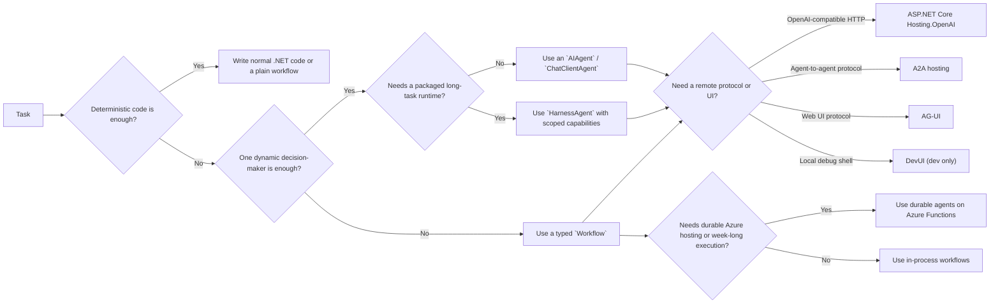

# Microsoft Agent Framework

## Trigger On

- building or reviewing `.NET` code that uses `Microsoft.Agents.*`, `Microsoft.Extensions.AI`, `AIAgent`, `HarnessAgent`, `AgentSession`, or Agent Framework hosting packages
- choosing between `ChatClientAgent`, Responses agents, hosted agents, custom agents, Anthropic agents, workflows, or durable agents
- adding the batteries-included `Microsoft.Agents.AI.Harness` surface for planning, todos, compaction, file memory/access, tool approvals, skills, shell execution, or background agents
- authoring preview-era `Microsoft.Agents.AI.Workflows.Declarative*` packages or wrapping a workflow with `workflow.AsAIAgent()`
- adding tools, MCP, A2A, OpenAI-compatible hosting, AG-UI, DevUI, background responses, or OpenTelemetry
- migrating from Semantic Kernel agent APIs or aligning AutoGen-style multi-agent patterns to Agent Framework
- using Anthropic Claude models (haiku, sonnet, opus) via `AnthropicClient` or through Azure Foundry with `AnthropicFoundryClient`

## Workflow

1. Decide whether the problem should stay deterministic. If plain code or a typed workflow without LLM autonomy is enough, do that instead of adding an agent.
2. Choose the execution shape first: single `AIAgent`, batteries-included `HarnessAgent`, explicit programmatic `Workflow`, workflow-as-agent wrapper, declarative workflow when YAML portability is explicitly required, Azure Functions durable agent, ASP.NET Core hosted agent, AG-UI remote UI, or DevUI local debugging.
3. Choose the agent type and provider intentionally. Prefer the simplest agent that satisfies the threading, tooling, and hosting requirements.
4. Keep agents stateless and keep conversation or long-lived state in `AgentSession`. Treat the session as opaque provider-owned state, serialize it through the owning agent, and never accept a raw service conversation ID as an end-user authorization boundary.
5. Add only the tools and middleware that the scenario needs. Narrow the tool surface, require approval for side effects, and treat MCP, A2A, and third-party services as trust boundaries.
6. For workflows, model executors, edges, typed `RequestPort` boundaries, checkpoints, shared state, and human-in-the-loop explicitly rather than hiding control flow in prompts.
7. Prefer Responses-based protocols for new remote/OpenAI-compatible integrations unless you specifically need Chat Completions compatibility.
8. Use durable agents only when you truly need Azure Functions serverless hosting, durable thread storage, or deterministic long-running orchestrations.
9. Verify preview status, package maturity, docs recency, and provider-specific limitations before locking a production architecture.

## Current Upstream Notes

- `dotnet-1.19.0` adds persisted routing and sessions, resilient/steerable hosted agents, AG-UI forwarding, and experimental agent hooks. It makes a breaking move to the MCP `2026-07-28` Tasks extension; update both peers and resume tests together.
- `dotnet-1.18.0` adds concurrent tool invocation, usage aggregation, Cosmos history/vector examples, hosted storage, and session-scoped background-task release. Its breaking isolation rename is `AgentIsolationKeyProvider`.
- `dotnet-1.16.0`-`1.17.0` stabilize Copilot agents, sessions, A2A forwarding, and declarative workflow failure paths. See the focused references for older Harness, hosting, and protocol changes.
- Current AG-UI hosting uses `Microsoft.Agents.AI.Hosting.AGUI.AspNetCore` with `AddAGUIServer()` and `MapAGUIServer(...)`; the client uses `AGUI.Client`, and conversation state flows through `AgentSession`. Do not copy older `AddAGUI`/`MapAGUI` or `AgentThread` hosting examples into current applications.
- The August 2026 documentation set is mirrored as `172` current markdown pages and now treats middleware, function tools and approvals, sessions, multimodal input, background responses, Azure Functions durable agents, AG-UI frontend and backend tools, MCP-hosted agents, observability, support, upgrades, and Semantic Kernel or AutoGen migration as first-class paths. Load the matching reference file before implementation and verify package maturity plus exact signatures against the linked official page; the expanded documentation does not make every provider or preview feature interchangeable.

## Architecture

```mermaid
flowchart LR
  A["Task"] --> B{"Deterministic code is enough?"}
  B -->|Yes| C["Write normal .NET code or a plain workflow"]
  B -->|No| D{"One dynamic decision-maker is enough?"}
  D -->|Yes| O{"Needs a packaged long-task runtime?"}
  O -->|No| E["Use an `AIAgent` / `ChatClientAgent`"]
  O -->|Yes| P["Use `HarnessAgent` with scoped capabilities"]
  D -->|No| F["Use a typed `Workflow`"]
  F --> G{"Needs durable Azure hosting or week-long execution?"}
  G -->|Yes| H["Use durable agents on Azure Functions"]
  G -->|No| I["Use in-process workflows"]
  E --> J{"Need a remote protocol or UI?"}
  P --> J
  F --> J
  J -->|OpenAI-compatible HTTP| K["ASP.NET Core Hosting.OpenAI"]
  J -->|Agent-to-agent protocol| L["A2A hosting"]
  J -->|Web UI protocol| M["AG-UI"]
  J -->|Local debug shell| N["DevUI (dev only)"]
```

## Core Knowledge

- `AIAgent` is the common runtime abstraction. It should stay mostly stateless.
- `AgentSession` owns conversation state. Create, reuse, serialize, and restore it through the owning agent; keep service IDs server-side and verify user or tenant ownership before resumption.
- `AgentResponse` and `AgentResponseUpdate` are not just text containers. They can include tool calls, tool results, structured output, reasoning-like updates, and response metadata.
- `ChatClientAgent` is the safest default when you already have an `IChatClient` and do not need a hosted-agent service.
- `HarnessAgent` is a prerelease packaged `ChatClientAgent` composition for tool loops, planning, todos, compaction, memory, approvals, telemetry, and optional file, web, shell, skill, loop, or background-agent capabilities. Enable only what the task needs.
- Microsoft Foundry Agents is the canonical Azure-hosted persistent-agent surface. Azure OpenAI Responses is the app-composed Azure option for tool approval, code interpreter, file search, web search, and MCP.
- `Workflow` is an explicit graph of executors and edges. Use it when the control flow must stay inspectable, typed, resumable, or human-steerable.
- `workflow.AsAIAgent()` is the escape hatch when a complex workflow needs to present a normal agent surface. It keeps sessions, streaming, and agent response APIs, but the workflow start executor still needs chat-message-compatible input.
- `AgentWorkflowBuilder` provides high-level factory methods such as `BuildConcurrent` for common agent orchestration patterns. Use it when you need concurrent or sequential agent pipelines without writing custom executor classes.
- Sequential orchestration passes the previous agent's full input-and-response conversation forward by default. Choose response-only context deliberately when later stages should not inherit the entire conversation.
- Current .NET workflow execution uses `InProcessExecution.RunStreamingAsync(...)`. For sensitive agent tools, wrap the function with `ApprovalRequiredAIFunction`, listen for `RequestInfoEvent` with `ToolApprovalRequestContent`, and send the external approval response back through the run.
- Handoff is a mesh-style transfer of task ownership between agents, not a primary-agent tool call. In the current C# docs it requires locally tool-capable agents; Python-only autonomous handoff, approval, or checkpoint examples are not evidence of equivalent .NET APIs.
- Declarative workflows are now a documented surface, but the .NET package/runtime story is still preview-heavy and narrower than programmatic workflows. Use YAML when portability and operator-editable orchestration matter; keep deeply custom .NET control flow programmatic.
- Hosting layers such as OpenAI-compatible HTTP, A2A, and AG-UI are adapters over your in-process agent or workflow. They do not replace the core architecture choice.
- Durable agents are a hosting and persistence decision for Azure Functions. They are not the default answer for ordinary app-level orchestration.
- Prefer canonical middleware, tool, integration, migration, support, and upgrade pages from the local docs index when exact signatures or maturity matter.

## Decision Cheatsheet

| If you need | Default choice | Why |
|---|---|---|
| One model-backed assistant with normal .NET composition | `ChatClientAgent` or `chatClient.AsAIAgent(...)` | Lowest friction, middleware-friendly, works with `IChatClient` |
| Long multi-step autonomous task with planning, todos, compaction, memory, approvals, and optional file/shell/delegation tools | `chatClient.AsHarnessAgent(...)` | Uses the packaged Harness pipeline instead of rebuilding an agent runtime from decorators and providers |
| OpenAI-style future-facing APIs, background responses, or richer response state | Responses-based agent | Better fit for new OpenAI-compatible integrations |
| Simple client-managed chat history | Chat Completions agent | Keeps request/response simple |
| Service-hosted agents and service-owned threads/tools | Microsoft Foundry Agent or other hosted agent | Managed runtime is the requirement |
| Azure-hosted OpenAI-compatible models with the richest hosted-tool surface but app-owned composition | Azure OpenAI Responses agent | Best Azure OpenAI default when you need code interpreter, file search, web search, hosted MCP, or tool approval without moving to a persistent service-managed agent |
| Anthropic Claude models (haiku, sonnet, opus) directly or via Azure Foundry | `AnthropicClient.AsAIAgent(...)` or `AnthropicFoundryClient.AsAIAgent(...)` | Use `Microsoft.Agents.AI.Anthropic`; add `Anthropic.Foundry` for Azure-hosted Claude |
| Typed multi-step orchestration | `Workflow` or `AgentWorkflowBuilder` helpers | Control flow stays explicit and testable; use `BuildConcurrent` for agent fan-out/fan-in |
| YAML-defined orchestration that non-developers or operators need to edit | Declarative workflow packages | Good for portable trigger/action graphs; do not pretend the .NET preview is as flexible as programmatic workflows |
| Week-long or failure-resilient Azure execution | Durable agent on Azure Functions | Durable Task gives replay and persisted state |
| Agent-to-agent interoperability | A2A hosting or A2A proxy agent | This is protocol-level delegation, not local inference |
| Browser or web UI protocol integration | AG-UI | Designed for remote UI sync and approval flows |

## Common Failure Modes

- Adding an agent where deterministic code or a plain typed workflow would be clearer and cheaper.
- Assuming agent instance fields are the durable source of truth instead of storing real state in `AgentSession`, stores, or workflow state.
- Picking Chat Completions when the scenario really needs Responses features such as background execution or service-backed response chains.
- Treating hosted-agent services and local `IChatClient` agents as if they share the same thread and tool guarantees.
- Hiding orchestration inside prompts instead of modeling executors, edges, requests, checkpoints, and HITL explicitly.
- Exposing too many tools at once, especially side-effecting tools without approvals, middleware checks, or clear trust boundaries.
- Supplying Harness file access, shell execution, web search, standing approvals, or background agents without constraining the working directory, capability set, iteration limits, and approval policy.
- Treating DevUI as a production UI surface instead of a development and debugging tool.

## Deliver

- a justified architecture choice: narrow agent vs Harness vs workflow vs durable orchestration
- the concrete .NET agent type, provider, and package set
- an explicit thread, tool, middleware, and observability strategy
- hosting and protocol decisions for OpenAI-compatible APIs, A2A, AG-UI, or Azure Functions
- migration notes when replacing Semantic Kernel agent APIs or AutoGen-style orchestration

## Validate

- the scenario really needs agentic behavior and is not better served by deterministic code
- the selected agent type matches the provider, session model, and tool model
- Harness capabilities are individually scoped or disabled, file access is opt-in through `FileAccessStore`, compaction has explicit token budgets when needed, and shell/file boundaries are not treated as security sandboxes
- `AgentSession` lifecycle, serialization, service-ID ownership, and compatibility boundaries are explicit for the chosen provider surface
- tool approval, MCP headers, and third-party trust boundaries are handled safely
- workflows define checkpoints, request-response, shared state, and HITL paths deliberately
- DevUI is treated as a development sample, not a production surface
- docs or packages marked preview are called out, and Python-only docs are not mistaken for guaranteed .NET APIs

When a decision depends on exact wording, long-tail feature coverage, or a less-common integration, check the local official docs snapshot before relying on summaries.

## References

- [official-docs-index.md](references/official-docs-index.md) - Complete current local snapshot map covering agents, concepts, get-started guides, hosting, integrations, journeys, migration, support, and workflows
- [patterns.md](references/patterns.md) - Architecture routing, agent types, provider and session model selection, and durable-agent guidance
- [harness.md](references/harness.md) - `HarnessAgent` selection, options, compaction, approvals, file/shell boundaries, and validation
- [providers.md](references/providers.md) - Provider, SDK, endpoint, package, and Responses-vs-ChatCompletions selection
- [tools.md](references/tools.md) - Function tools, hosted tools, tool approval, agent-as-tool, and service limitations
- [sessions.md](references/sessions.md) - `AgentSession`, chat history providers, reducers, context providers, ownership, and serialization
- [middleware.md](references/middleware.md) - Agent, function-calling, and `IChatClient` middleware with guardrail patterns
- [workflows.md](references/workflows.md) - Executors, edges, requests and responses, checkpoints, orchestrations, and declarative workflow notes
- [mcp.md](references/mcp.md) - MCP integration, agent-as-MCP, security rules, and MCP-vs-A2A guidance
- [hosting.md](references/hosting.md) - ASP.NET Core hosting, OpenAI-compatible APIs, A2A, AG-UI, Azure Functions, and Purview integration
- [devui.md](references/devui.md) - DevUI capabilities, modes, auth, tracing, and safe usage boundaries
- [migration.md](references/migration.md) - Semantic Kernel and AutoGen migration notes, concept mapping, and breaking-model shifts
- [support.md](references/support.md) - Preview status, official support channels, and recurring troubleshooting checks
- [examples.md](references/examples.md) - Quick-start and tutorial recipe index covering the official docs set
