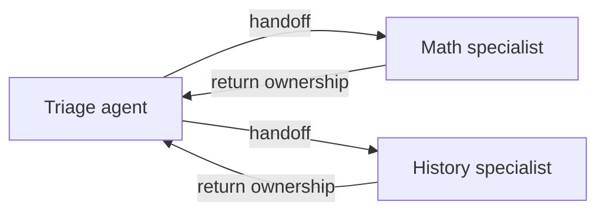

# Handoff Orchestration

Handoff transfers control and task ownership between agents according to explicit routes. It uses a mesh topology without a central orchestrator.



## Handoff Versus Agent-As-Tool

| Concern | Handoff | Agent-As-Tool |
| --- | --- | --- |
| Control | Moves to the receiving agent | Stays with the primary agent |
| Ownership | Receiving agent owns the task | Primary agent owns the task |
| Context | Conversation transfers with the handoff | Primary agent supplies bounded tool input |

Use handoff for dynamic specialist routing. Use agent-as-tool when one primary agent should remain accountable for orchestration.

## Current C# Shape

```csharp
ChatClientAgent triageAgent = new(
    client,
    "Route every request to the appropriate specialist.",
    "triage_agent",
    "Routes requests");

ChatClientAgent mathTutor = new(
    client,
    "Handle only mathematics questions.",
    "math_tutor",
    "Math specialist");

ChatClientAgent historyTutor = new(
    client,
    "Handle only history questions.",
    "history_tutor",
    "History specialist");

var workflow = AgentWorkflowBuilder.CreateHandoffBuilderWith(triageAgent)
    .WithHandoffs(triageAgent, [mathTutor, historyTutor])
    .WithHandoffs([mathTutor, historyTutor], triageAgent)
    .Build();

await using StreamingRun run = await InProcessExecution.RunStreamingAsync(workflow, messages);
await run.TrySendMessageAsync(new TurnToken(emitEvents: true));
```

Process `AgentResponseUpdateEvent.Update.Text` for streaming output and `WorkflowOutputEvent.As<List<ChatMessage>>()` for the completed conversation.

## Current Limits

- The current page states that handoff supports locally tool-capable `Agent` implementations.
- C# covers interactive handoff routing. The page's autonomous mode, tool-approval, and checkpointing examples are Python-only; do not invent equivalent .NET APIs from those samples.
- Keep route criteria explicit and test at least one forward handoff and one return-to-triage path.

Live source: https://learn.microsoft.com/agent-framework/user-guide/workflows/orchestrations/handoff
