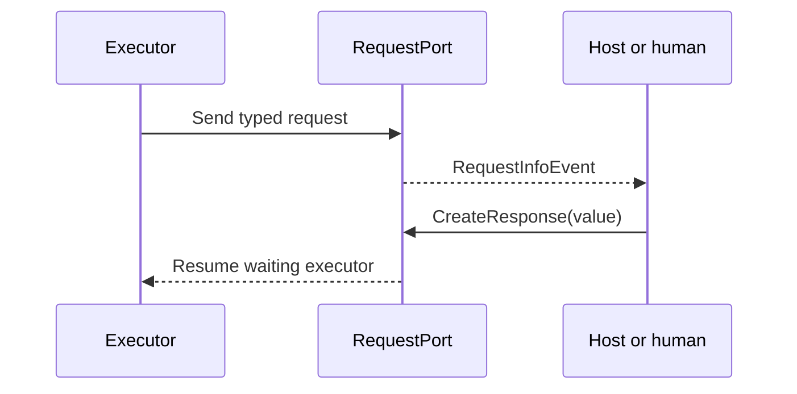

# Human-in-the-loop

Use workflow request/response handling when execution must pause for a human or external system and then resume with typed input.



## Custom Workflow Requests

`RequestPort` is the current .NET primitive. The older local `InputPort` wording is obsolete.

```csharp
var approvalPort = RequestPort.Create<ApprovalRequest, bool>("Approval");

var workflow = new WorkflowBuilder(approvalPort)
    .AddEdge(approvalPort, reviewerExecutor)
    .AddEdge(reviewerExecutor, approvalPort)
    .WithOutputFrom(reviewerExecutor)
    .Build();
```

Handle requests through the streaming run and return a response derived from the original request:

```csharp
await using StreamingRun run = await InProcessExecution.RunStreamingAsync(workflow, initialInput);

await foreach (WorkflowEvent evt in run.WatchStreamAsync())
{
    switch (evt)
    {
        case RequestInfoEvent requestEvent:
bool approved = ...; // Collect this decision from the external reviewer.
            await run.SendResponseAsync(requestEvent.Request.CreateResponse(approved));
            break;

        case WorkflowOutputEvent outputEvent:
            Console.WriteLine(outputEvent.Data);
            break;
    }
}
```

## Agent Tool Approval

Sequential, concurrent, and group-chat agent orchestrations use the same request/response channel for approval-required tools:

1. Wrap a sensitive tool with `ApprovalRequiredAIFunction`.
2. The orchestration pauses and emits `RequestInfoEvent`.
3. Read `ToolApprovalRequestContent` from the request.
4. Send an approved or rejected response with `run.SendResponseAsync(...)`.

Do not build a second approval state machine beside the workflow.

## Checkpoints

Pending requests are part of checkpoint state. Restoring a checkpoint re-emits them as `RequestInfoEvent`, so the host can resolve the same external decision after recovery.

Live source: https://learn.microsoft.com/agent-framework/user-guide/workflows/orchestrations/human-in-the-loop
