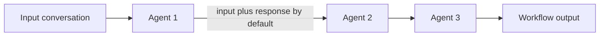

# Sequential Orchestration

Use sequential orchestration when agents form an ordered pipeline and each stage builds on its predecessor.



## Context Contract

By default, each agent receives the previous agent's full conversation: both the messages supplied to that agent and its response. Use the documented response-only option when the next stage should consume only its predecessor's response.

Make this choice explicit. Full context improves continuity but increases token use and can propagate irrelevant or low-quality messages.

## Current C# Shape

```csharp
var agents = new[]
{
    new ChatClientAgent(client, "Translate to French."),
    new ChatClientAgent(client, "Translate the previous result to Spanish."),
    new ChatClientAgent(client, "Translate the previous result to English.")
};

var workflow = AgentWorkflowBuilder.BuildSequential(agents);
var messages = new List<ChatMessage> { new(ChatRole.User, "Hello, world!") };

await using StreamingRun run = await InProcessExecution.RunStreamingAsync(workflow, messages);
await run.TrySendMessageAsync(new TurnToken(emitEvents: true));

await foreach (WorkflowEvent evt in run.WatchStreamAsync())
{
    if (evt is AgentResponseUpdateEvent update)
    {
        Console.Write(update.Update.Text);
    }
    else if (evt is WorkflowOutputEvent output)
    {
        List<ChatMessage> result = output.As<List<ChatMessage>>()!;
    }
}
```

## Tool Approval

Wrap sensitive functions and let the workflow expose the approval request:

```csharp
ChatClientAgent deployAgent = new(
    client,
    "Check staging, then deploy only after approval.",
    "DeployAgent",
    "Handles deployments",
    [
        AIFunctionFactory.Create(CheckStagingStatus),
        new ApprovalRequiredAIFunction(AIFunctionFactory.Create(DeployToProduction))
    ]);

var workflow = AgentWorkflowBuilder.BuildSequential([deployAgent, verifyAgent]);

await foreach (WorkflowEvent evt in run.WatchStreamAsync())
{
    if (evt is RequestInfoEvent request &&
        request.Request.TryGetDataAs(out ToolApprovalRequestContent? approval))
    {
        await run.SendResponseAsync(
            request.Request.CreateResponse(approval.CreateResponse(approved: true)));
    }
}
```

The built-in sequential workflow already propagates approval-required tool requests. Keep the human decision outside the agent and persist it when the run must survive process restarts.

## Validate

- verify ordered agent execution and final output
- test full-context and response-only behavior when context size or isolation matters
- test approval and rejection paths for every side-effecting tool
- confirm streaming uses `AgentResponseUpdateEvent.Update.Text` and completion uses `WorkflowOutputEvent`

Live source: https://learn.microsoft.com/agent-framework/user-guide/workflows/orchestrations/sequential
