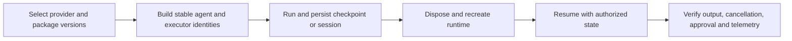

# .NET 1.20 and September Documentation Guidance

Read this before using older snapshot examples for checkpoint reconstruction, AG-UI state, or provider upgrades. The September 4 review covered the 102 pending Agent Framework watches, including the release and .NET API reference. Rendered documentation expands includes and language pivots; Python or Go additions do not establish a new .NET contract.

## Rebuild Checkpointed Workflows with Stable Identities

A checkpoint belongs to a particular graph and its executor identities. Rebuilding an equivalent-looking graph with newly generated agent IDs can still make resume fail. Give each local agent a stable, unique logical role ID and keep its name stable when supplied:

```csharp
AIAgent intake = chatClient.AsAIAgent(new ChatClientAgentOptions
{
    Id = "intake-agent",
    Name = "Intake",
    ChatOptions = new() { Instructions = "Route requests to the appropriate expert." }
});
```

Recreate topology and executor IDs before `InProcessExecution.ResumeStreamingAsync`. Do not derive these IDs from a request, user, or conversation. Tenant ownership belongs in the checkpoint/session storage boundary. Validate by persisting a checkpoint, disposing the original graph, rebuilding the graph in a fresh scope, and resuming it; resuming only the original in-memory graph misses this failure.

Source: [Workflow checkpoints](https://learn.microsoft.com/agent-framework/workflows/checkpoints).

## AG-UI Continuation and State

- Server registration remains `AddAGUIServer()` plus `MapAGUIServer(...)` from `Microsoft.Agents.AI.Hosting.AGUI.AspNetCore`; the .NET client uses `AGUI.Client` and `AGUIChatClient`.
- For explicit continuation, read `RunStartedEvent` from `update.AsChatResponseUpdate().RawRepresentation`. Supply its thread ID and run ID as `RunAgentInput.ThreadId` and `ParentRunId` through `ChatOptions.RawRepresentationFactory`, with the next message. Keep using the authorized `AgentSession`.
- Read input state through `ChatOptions.TryGetRunAgentInput(...)`. Validate client-provided state before turning it into model context or using it for tool execution.
- Use `AGUIStreamOptions.MapResultAsStateSnapshot` for whole-state replacement and `MapResultAsStateDelta` for incremental updates; attach the options with endpoint `WithMetadata`. A delta consumer must apply changes to the correct prior state rather than replacing the entire object.
- Render `FunctionCallContent` and `FunctionResultContent` as tool events, not just response text. For approval, return `ToolApprovalResponseContent` created from the actual request and resume the same session after the user's decision.
- Test a second turn, a snapshot followed by a delta, approval/rejection, cancellation, and reconnect. A single text response does not validate protocol state.

Sources: [Getting started](https://learn.microsoft.com/agent-framework/integrations/by-component/ui/ag-ui/getting-started), [state management](https://learn.microsoft.com/agent-framework/integrations/by-component/ui/ag-ui/state-management), [human-in-the-loop](https://learn.microsoft.com/agent-framework/integrations/by-component/ui/ag-ui/human-in-the-loop).

## Provider and Release Boundaries

- `AIProjectClient.AsAIAgent(model: ..., instructions: ...)` creates an app-owned `ChatClientAgent` for direct Foundry inference; it does not provision a server-side Prompt or Hosted Agent. `FoundryAgent` represents the service-managed case. Preserve this distinction when choosing persistence and deployment.
- `.NET 1.20.0` preserves Responses logprobs, honors cancellation in hosted workflow responses, fixes duplicate Foundry AgentHost port binding, and bounds the background-agent wait-for-first-completion path with a timeout. Re-run recovery and cancellation tests rather than carrying forward local workarounds blindly.
- AG-UI hosted web search uses Responses in current samples. The Cosmos vector sample uses `CommunityToolkit.VectorData.AzureCosmosDB` instead of `CommunityToolkit.VectorData.CosmosNoSql`.
- OpenAI Assistants integration tests were removed as retired. Choose an active Responses or Agent Framework provider path for new integrations and validate existing migrations explicitly.
- Sensitive telemetry is opt-in. An example setting `EnableSensitiveData = true` is not an application default; capture only the content the environment is allowed to export.

Sources: [Foundry model provider](https://learn.microsoft.com/agent-framework/integrations/by-component/model-providers/microsoft-foundry), [.NET 1.20.0 release](https://github.com/microsoft/agent-framework/releases/tag/dotnet-1.20.0), [observability](https://learn.microsoft.com/agent-framework/agents/observability).

## Validation Flow


