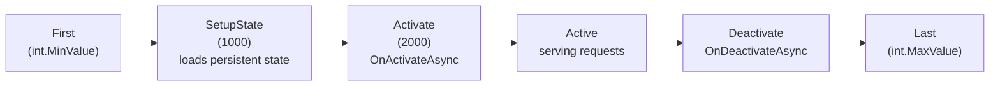

# Grain API Reference

Detailed grain API patterns extracted from official Orleans documentation. Use when you need exact API shapes, not just link navigation.

## Grain Identity

Identity structure: `type/key` (e.g., `shoppingcart/bob65`).

Grain type name derived from class name by removing "Grain" suffix and lowercasing. Customize with `[GrainType("cart")]`.

### Key Types

| Interface | Key Type | Access | Factory |
|---|---|---|---|
| `IGrainWithGuidKey` | `Guid` | `this.GetPrimaryKey()` | `GetGrain<T>(guid)` |
| `IGrainWithIntegerKey` | `long` | `this.GetPrimaryKeyLong()` | `GetGrain<T>(longId)` |
| `IGrainWithStringKey` | `string` | `this.GetPrimaryKeyString()` | `GetGrain<T>(stringId)` |
| `IGrainWithGuidCompoundKey` | `Guid+string` | `this.GetPrimaryKey(out string ext)` | `GetGrain<T>(guid, "ext", null)` |
| `IGrainWithIntegerCompoundKey` | `long+string` | `this.GetPrimaryKeyLong(out string ext)` | `GetGrain<T>(0, "ext", null)` |

Singleton pattern: use a well-known fixed key like `"default"` or `0`.

## Grain Interface Rules

```csharp
public interface IHello : IGrainWithIntegerKey
{
    ValueTask<string> SayHello(string greeting);
    Task DoWork();
    IAsyncEnumerable<int> StreamData(int count, [EnumeratorCancellation] CancellationToken ct = default);
}

[ResponseTimeout("00:00:05")]
Task<Result> TimeSensitiveCall();
```

- All methods must return `Task`, `Task<T>`, `ValueTask<T>`, or `IAsyncEnumerable<T>`
- `CancellationToken` as last parameter, optional with default
- `[ResponseTimeout]` on interface methods only (not implementations)
- Default response timeout: 30 seconds

## Grain Lifecycle



```csharp
public override Task OnActivateAsync(CancellationToken ct)
{
    // Called during activation (stage 2000)
    return base.OnActivateAsync(ct);
}

public override Task OnDeactivateAsync(DeactivationReason reason, CancellationToken ct)
{
    // Best-effort, not guaranteed on crash
    return base.OnDeactivateAsync(reason, ct);
}
```

### Memory-Based Activation Shedding (Orleans 9+)

Auto-deactivates grains under memory pressure.

```csharp
// Configure via GrainCollectionOptions
services.Configure<GrainCollectionOptions>(options =>
{
    options.EnableActivationSheddingOnMemoryPressure = true;
    options.MemoryUsageLimitPercentage = 80;  // default
    options.MemoryUsageTargetPercentage = 75; // default
    options.CollectionAge = TimeSpan.FromMinutes(15); // default
});
```

### Grain Migration (Orleans 8+)

Move activations between silos preserving in-memory state.

```csharp
// Implement IGrainMigrationParticipant
public class MyGrain : Grain, IMyGrain, IGrainMigrationParticipant
{
    public void OnDehydrate(IDehydrationContext context)
    {
        context.TryAddValue("key", _myValue);
    }

    public void OnRehydrate(IRehydrationContext context)
    {
        context.TryGetValue("key", out _myValue);
    }
}

// Trigger migration
this.MigrateOnIdle();

// Prevent migration
[Immovable]
public class PinnedGrain : Grain, IPinnedGrain { }
```

## Placement Strategies

| Strategy | Attribute | Behavior |
|---|---|---|
| Resource-Optimized (default 9.2+) | `[ResourceOptimizedPlacement]` | CPU + memory + activation count weighted scoring |
| Random | `[RandomPlacement]` | Random compatible server |
| Prefer Local | `[PreferLocalPlacement]` | Local if compatible, else random |
| Hash-Based | `[HashBasedPlacement]` | Hash grain ID mod server count |
| Activation-Count-Based | `[ActivationCountBasedPlacement]` | Power of Two Choices algorithm |
| Stateless Worker | `[StatelessWorker]` | Multiple activations per server |
| Silo-Role-Based | `[SiloRoleBasedPlacement]` | Deterministic on silos with role |

### Custom Placement

```csharp
// 1. Define strategy
public class MyPlacementStrategy : PlacementStrategy { }

// 2. Define attribute
[AttributeUsage(AttributeTargets.Class)]
public class MyPlacementAttribute : PlacementAttribute
{
    public MyPlacementAttribute() : base(new MyPlacementStrategy()) { }
}

// 3. Implement director
public class MyPlacementDirector : IPlacementDirector
{
    public Task<SiloAddress> OnAddActivation(
        PlacementStrategy strategy, PlacementTarget target,
        IPlacementContext context) { /* ... */ }
}

// 4. Register
services.AddPlacementDirector<MyPlacementStrategy, MyPlacementDirector>();
```

## Request Scheduling and Reentrancy

Default: **single-threaded, non-reentrant**. Each request runs to completion before the next starts. Safe but can deadlock with circular call patterns (A → B → A).

### Reentrancy Mechanisms

| Mechanism | Scope | Effect |
|---|---|---|
| `[Reentrant]` | Grain class | All methods interleave freely |
| `[AlwaysInterleave]` | Interface method | Method always interleaves even on non-reentrant grains |
| `[ReadOnly]` | Interface method | Concurrent with other `[ReadOnly]` methods |
| `[MayInterleave(nameof(P))]` | Grain class | Per-call predicate decides interleaving |
| `AllowCallChainReentrancy()` | Scoped | Reentrancy for current call chain only |
| `SuppressCallChainReentrancy()` | Scoped | Disables call chain reentrancy |

### Deadlock Prevention

```csharp
// Problem: A calls B, B calls back to A → deadlock (A is blocked waiting for B)

// Solution 1: Mark entire grain as reentrant
[Reentrant]
public class GrainA : Grain, IGrainA { }

// Solution 2: Mark specific callback method
public interface IGrainA : IGrainWithIntegerKey
{
    Task DoWork();
    [AlwaysInterleave] Task Callback(); // always interleaves
}

// Solution 3: Scoped reentrancy (best — minimal surface)
public async Task DoWork()
{
    using var _ = RequestContext.AllowCallChainReentrancy();
    await otherGrain.MethodThatMightCallBack();
}
```

### ReadOnly Methods

```csharp
public interface ICounterGrain : IGrainWithIntegerKey
{
    [ReadOnly] Task<int> GetCount();     // concurrent with other ReadOnly
    Task Increment();                     // exclusive access
}
```

### MayInterleave Predicate

```csharp
[MayInterleave(nameof(ArgHasInterleaveFlag))]
public class MyGrain : Grain, IMyGrain
{
    private static bool ArgHasInterleaveFlag(IInvokable req)
    {
        return req.GetArgument<MyRequest>(0)?.AllowInterleave == true;
    }
}
```

### Tradeoff

| Approach | Liveness | Safety |
|---|---|---|
| Non-reentrant (default) | Risk of deadlocks | No concurrent state mutation |
| `[Reentrant]` | No deadlocks | Must handle concurrent state access |
| `[AlwaysInterleave]` on method | Targeted | Only that method interleaves |
| `[ReadOnly]` | Concurrent reads | Only safe for read-only operations |
| `AllowCallChainReentrancy` | Targeted | Only the originating call chain reenters |

## Code Generation

Orleans 7+ uses **C# source generators** at build time. No runtime code generation.

### NuGet Packages

| Package | Use |
|---|---|
| `Microsoft.Orleans.Sdk` | Shared — grain interfaces, state types, serialization |
| `Microsoft.Orleans.Server` | Silo — includes Sdk |
| `Microsoft.Orleans.Client` | External client — includes Sdk |

### Key Attributes

```csharp
// Required on all serialized types (state, messages, events)
[GenerateSerializer]
public class MyState
{
    [Id(0)] public string Name { get; set; } = "";
    [Id(1)] public int Count { get; set; }
}
```

Source generators create:
- Grain reference proxies (method invokers)
- Serializers and copiers for `[GenerateSerializer]` types
- Method metadata for interceptors and profiling

### F# and VB.NET

```fsharp
[<assembly: Orleans.GenerateCodeForDeclaringAssembly(typeof<IMyGrainInterface>)>]
do ()
```

### Build-Time Only

No runtime IL emission or reflection-based generation. All code generated as part of compilation. Analyzers (`Microsoft.Orleans.Analyzers`) provide warnings for missing `[GenerateSerializer]`, `[Id]`, etc.

## Cancellation Tokens

Native `CancellationToken` support in grain interface methods (Orleans 7+). Cooperative cancellation.

```csharp
// Interface — CancellationToken as last parameter, optional with default
public interface IProcessGrain : IGrainWithStringKey
{
    Task<Result> Process(RequestData data, CancellationToken ct = default);
    IAsyncEnumerable<Item> StreamItems(int count,
        [EnumeratorCancellation] CancellationToken ct = default);
}

// Grain implementation
public class ProcessGrain : Grain, IProcessGrain
{
    public async Task<Result> Process(RequestData data, CancellationToken ct)
    {
        ct.ThrowIfCancellationRequested();
        var step1 = await DoStep1(ct);
        ct.ThrowIfCancellationRequested();
        return await DoStep2(step1, ct);
    }

    public async IAsyncEnumerable<Item> StreamItems(int count,
        [EnumeratorCancellation] CancellationToken ct = default)
    {
        for (int i = 0; i < count && !ct.IsCancellationRequested; i++)
            yield return await FetchItem(i);
    }
}

// Client usage with timeout
using var cts = new CancellationTokenSource(TimeSpan.FromSeconds(10));
var result = await grain.Process(data, cts.Token);

// IAsyncEnumerable with cancellation
await foreach (var item in grain.StreamItems(100).WithCancellation(cts.Token))
    Process(item);
```

### Cancellation Behavior

| Scenario | Behavior |
|---|---|
| Token cancelled before call | Throws `OperationCanceledException` immediately |
| Token cancelled during enqueued (not started) request | Request cancelled |
| Token cancelled during active call | Signal propagated, grain cooperatively cancels |
| Adding/removing `CancellationToken` parameter | Backward compatible, doesn't break existing callers |
| Multiple `CancellationToken` params | Compiler error `ORLEANS0109` |

### Configuration

```csharp
// SiloMessagingOptions / ClientMessagingOptions
options.CancelRequestOnTimeout = true;   // default: auto-cancel on timeout
options.WaitForCancellationAcknowledgement = false; // default: don't wait for ack
```

Metric: `orleans-app-requests-canceled`.

Legacy `GrainCancellationToken` / `GrainCancellationTokenSource` still available but deprecated.

## Timers

Non-durable, activation-local periodic work. Stops on deactivation or silo crash.

```csharp
// Modern API (Orleans 8+)
IGrainTimer timer = this.RegisterGrainTimer<MyState>(
    async (state, ct) => { /* callback with CancellationToken */ },
    myState,
    new GrainTimerCreationOptions
    {
        DueTime = TimeSpan.FromSeconds(5),
        Period = TimeSpan.FromMinutes(1),
        Interleave = false,  // default — respects single-threaded execution
        KeepAlive = false    // default — doesn't prevent deactivation
    });

// Update timer at runtime
timer.Change(newDueTime, newPeriod);

// Dispose to stop
timer.Dispose();
```

### Timer Properties

- Period measured from callback **completion** to next invocation (not fixed interval)
- `Interleave = false` (default): callback waits for turn like normal grain calls
- `Interleave = true`: callback interleaves with other grain calls (old `RegisterTimer` behavior)
- `KeepAlive = true`: prevents grain deactivation while timer is active
- Callback receives `CancellationToken` that is cancelled when timer is disposed or grain deactivates

### Migration from Legacy RegisterTimer

| Legacy `RegisterTimer` | Modern `RegisterGrainTimer` |
|---|---|
| Returns `IDisposable` | Returns `IGrainTimer` |
| Default interleave: `true` | Default interleave: `false` |
| No cancellation token | Callback receives `CancellationToken` |
| No `KeepAlive` option | `KeepAlive` available |

### POCO Grains — Timer via DI

```csharp
public class MyPocoGrain : IMyGrain
{
    private readonly ITimerRegistry _timers;
    private readonly IGrainContext _context;
    public MyPocoGrain(ITimerRegistry timers, IGrainContext context)
    {
        _timers = timers;
        _context = context;
    }
    public Task Start()
    {
        _timers.RegisterGrainTimer(_context, async (state, ct) => { },
            new object(), new GrainTimerCreationOptions { Period = TimeSpan.FromMinutes(1) });
        return Task.CompletedTask;
    }
}
```

## Reminders

Durable, persistent periodic wakeups. Survive activation/deactivation and cluster restarts. Minimum granularity: minutes/hours/days (not for high-frequency).

```csharp
public class MyGrain : Grain, IMyGrain, IRemindable
{
    public async Task StartReminder()
    {
        // Register or update (idempotent)
        IGrainReminder reminder = await RegisterOrUpdateReminder(
            "daily-check",
            dueTime: TimeSpan.FromHours(1),
            period: TimeSpan.FromHours(24));
    }

    public async Task StopReminder()
    {
        // Lookup by name
        IGrainReminder? reminder = await GetReminder("daily-check");
        if (reminder is not null)
            await UnregisterReminder(reminder);
    }

    public Task ReceiveReminder(string reminderName, TickStatus status)
    {
        // Reactivates idle grains when reminder ticks
        return reminderName switch
        {
            "daily-check" => DoCheck(),
            _ => Task.CompletedTask
        };
    }
}
```

### Reminder Operations

| Operation | Method |
|---|---|
| Register/update | `RegisterOrUpdateReminder(name, dueTime, period)` → `IGrainReminder` |
| Cancel | `UnregisterReminder(reminder)` |
| Lookup by name | `GetReminder(name)` → `IGrainReminder?` |
| List all | `GetReminders()` → `List<IGrainReminder>` |

### Reminder Storage Providers

| Provider | Registration Method |
|---|---|
| Azure Table Storage | `UseAzureTableReminderService(options)` |
| Redis | `UseRedisReminderService(options)` |
| Cosmos DB | `UseCosmosReminderService(options)` |
| ADO.NET | `UseAdoNetReminderService(options)` |
| In-Memory (dev only) | `UseInMemoryReminderService()` |

### Aspire Integration

```csharp
// AppHost
var redis = builder.AddRedis("redis");
var orleans = builder.AddOrleans("cluster")
    .WithReminders(redis);
    // or .WithMemoryReminders() for dev
```

### POCO Grains — Reminder via DI

Inject `IReminderRegistry` instead of using `Grain` base class methods.

### Timers vs Reminders Decision

| Need | Use |
|---|---|
| High-frequency ticks (seconds) | Timer |
| Must survive deactivation/restart | Reminder |
| Activation-local periodic work | Timer |
| Durable low-frequency wakeups | Reminder |
| Should prevent deactivation | Timer with `KeepAlive = true` |

## Interceptors

```csharp
// Silo-wide incoming filter
public class AuthFilter : IIncomingGrainCallFilter
{
    public async Task Invoke(IIncomingGrainCallContext context)
    {
        // context.Grain, context.InterfaceMethod, context.Arguments, context.Result
        await context.Invoke(); // call next filter or grain method
    }
}
siloBuilder.AddIncomingGrainCallFilter<AuthFilter>();

// Per-grain filter: grain implements IIncomingGrainCallFilter
// Outgoing filter: IOutgoingGrainCallFilter on silo or client

// Execution order: DI-registered → grain-level → grain method
```

## POCO Grains

For grains that don't inherit from `Grain`:

```csharp
public class MyPocoGrain : IMyGrain
{
    private readonly ITimerRegistry _timers;
    private readonly IReminderRegistry _reminders;
    private readonly IGrainContext _context;

    public MyPocoGrain(ITimerRegistry timers, IReminderRegistry reminders, IGrainContext context)
    {
        _timers = timers;
        _reminders = reminders;
        _context = context;
    }
}
```

## Grain References

Proxy objects that encapsulate logical identity (type + key). Location-independent, survive restarts, serializable.

```csharp
// From grain code
var grain = GrainFactory.GetGrain<IMyGrain>("key");

// From client code
var grain = client.GetGrain<IMyGrain>("key");

// Disambiguation when multiple implementations exist
var grain = GrainFactory.GetGrain<ICounterGrain>("key", grainClassNamePrefix: "Up");

// Or via explicit GrainId
var grain = GrainFactory.GetGrain<ICounterGrain>(GrainId.Create("up-counter", "key"));

// Or via DefaultGrainType attribute on interface
[DefaultGrainType("up-counter")]
public interface ICounterGrain : IGrainWithStringKey { }

// Or via unique marker interfaces
public interface IUpCounterGrain : ICounterGrain, IGrainWithStringKey { }
```

## Grain Extensions

Add behavior to grains without modifying the grain class via `IGrainExtension`.

```csharp
// Define extension interface
public interface IDeactivateExtension : IGrainExtension
{
    Task Deactivate(string msg);
}

// Implement
public sealed class DeactivateExtension : IDeactivateExtension
{
    private readonly IGrainContext _context;
    public DeactivateExtension(IGrainContext context) => _context = context;
    public Task Deactivate(string msg)
    {
        _context.Deactivate(new DeactivationReason(
            DeactivationReasonCode.ApplicationRequested, msg));
        return Task.CompletedTask;
    }
}

// Register globally
siloBuilder.AddGrainExtension<IDeactivateExtension, DeactivateExtension>();

// Use from anywhere
var ext = grain.AsReference<IDeactivateExtension>();
await ext.Deactivate("cleanup");
```

Per-grain registration: call `GrainContext.SetComponent<T>(instance)` in `OnActivateAsync`.

## Stateless Worker Grains

Multiple activations per silo, requests dispatched locally, auto-scaling.

```csharp
[StatelessWorker]       // scales up to CPU core count per silo
public class ProcessorGrain : Grain, IProcessorGrain { }

[StatelessWorker(4)]    // max 4 activations per silo
public class LimitedWorker : Grain, ILimitedWorker { }

// Typically called with fixed key
var worker = GrainFactory.GetGrain<IProcessorGrain>(0);
```

- Pool expands when all activations busy (up to limit), shrinks via idle deactivation
- Not individually addressable — two requests may hit different activations
- Useful for: CPU-bound stateless ops, hot cache items, reduce-style pre-aggregation
- Limitations: versioning does not apply, not supported in heterogeneous mode

## One-Way Requests

Fire-and-forget: returns immediately, no completion signal, no error propagation.

```csharp
public interface INotifyGrain : IGrainWithGuidKey
{
    [OneWay]
    Task Notify(MyData data);  // must return non-generic Task or ValueTask
}
```

Advanced feature — prefer regular bidirectional requests by default.

## External Tasks and Grains

Orleans grain scheduler is single-threaded. Understanding which APIs stay on it is critical.

| API | Scheduler |
|---|---|
| `await`, `Task.Factory.StartNew`, `ContinueWith`, `WhenAny`, `WhenAll`, `Task.Delay` | Stays on grain scheduler |
| `Task.Run`, `TaskFactory.FromAsync` endMethod | Escapes to thread pool |
| `ConfigureAwait(false)` | **NEVER** use in grain code |
| `async void` | **NEVER** use in grain code |

```csharp
// WRONG — unwrapped async delegate
var bad = Task.Factory.StartNew(SomeDelegateAsync);

// CORRECT
var good = Task.Factory.StartNew(SomeDelegateAsync).Unwrap();
```

**Never** use `Task.Wait()`, `.Result`, `WaitAny`, `WaitAll`, or `GetAwaiter().GetResult()` in grain code.

## Request Context

Ambient metadata flowing with requests (client → grain, grain → grain). Does NOT flow back with responses.

```csharp
// Set on client or calling grain
RequestContext.Set("TraceId", Guid.NewGuid().ToString());

// Read in target grain
var traceId = RequestContext.Get("TraceId") as string;
```

Values must be serializable. Prefer simple types (string, Guid, numeric) to minimize overhead.

## GrainServices

Special grains running on every silo from startup to shutdown. Not individually addressable, not collected when idle. Used for distributed per-silo services.

```csharp
// 1. Service interface
public interface IDataService : IGrainService { Task MyMethod(); }

// 2. Implementation
[Reentrant]
public class DataService : GrainService, IDataService
{
    private readonly IGrainFactory _grainFactory;
    public DataService(IServiceProvider services, GrainId id, Silo silo,
        ILoggerFactory loggerFactory, IGrainFactory grainFactory)
        : base(id, silo, loggerFactory) => _grainFactory = grainFactory;

    public override Task Init(IServiceProvider serviceProvider) => base.Init(serviceProvider);
    public override Task Start() => base.Start();
    public override Task Stop() => base.Stop();
    public Task MyMethod() => Task.CompletedTask;
}

// 3. Client interface
public interface IDataServiceClient : IGrainServiceClient<IDataService>, IDataService { }

// 4. Client implementation
public class DataServiceClient : GrainServiceClient<IDataService>, IDataServiceClient
{
    public DataServiceClient(IServiceProvider sp) : base(sp) { }
    private IDataService GrainService => GetGrainService(CurrentGrainReference.GrainId);
    public Task MyMethod() => GrainService.MyMethod();
}

// 5. Register
siloBuilder.AddGrainService<DataService>();
builder.Services.AddSingleton<IDataServiceClient, DataServiceClient>();
```

## Grain Versioning

Different silos can support different versions of a grain interface.

```csharp
[Version(2)]
public interface IMyGrain : IGrainWithIntegerKey
{
    Task OriginalMethod(int arg);    // from V1
    Task NewMethod(int arg, obj o);  // added in V2
}
```

### Compatibility Strategies

| Strategy | Behavior |
|---|---|
| `BackwardCompatible` (default) | V2 handles V1 requests; V1 cannot handle V2 |
| `FullyCompatible` | Bidirectional if no new methods added |

### Version Selector Strategies

| Strategy | Behavior |
|---|---|
| `AllCompatibleVersions` (default) | Random selection proportional to silo count |
| `LatestVersion` | Always newest compatible version |
| `MinimumVersion` | Always minimum compatible version |

```csharp
siloBuilder.Configure<GrainVersioningOptions>(options =>
{
    options.DefaultCompatibilityStrategy = nameof(BackwardCompatible);
    options.DefaultVersionSelectorStrategy = nameof(AllCompatibleVersions);
});
```

### Backward Compatibility Rules

- **Never** change signatures of existing methods
- **Never** rename parameters (position-based serialization)
- Add new methods in new versions instead of modifying existing
- Use two-step deprecation: mark `[Obsolete]` in V2, remove in V3 after V1 decommissioned
- Limitations: no versioning on stateless workers

### Deployment Strategies

- **Rolling upgrade**: deploy newer silos directly, use `BackwardCompatible` + `AllCompatibleVersions`
- **Staging environment**: deploy V2 in staging slot joining same cluster, use `BackwardCompatible` + `MinimumVersion`, VIP swap when validated

## Activation Collection

Automatic removal of idle grain activations. Default collection age: 15 minutes (Orleans 7+).

```csharp
siloBuilder.Configure<GrainCollectionOptions>(options =>
{
    options.CollectionAge = TimeSpan.FromMinutes(10);
    options.ClassSpecificCollectionAge[typeof(MyGrain).FullName!] =
        TimeSpan.FromMinutes(5);
});

// In grain code
this.DelayDeactivation(TimeSpan.FromHours(1)); // delay collection
this.DeactivateOnIdle(); // deactivate ASAP

// Prevent collection for a grain type
[KeepAlive]
public class PermanentGrain : Grain, IPermanentGrain { }
```

What counts as active: receiving a method call, reminder, or streaming event. NOT: outbound calls, timer events, arbitrary I/O.

## Error Handling

- Exceptions propagate across hosts with async/distributed try/catch semantics
- `InconsistentStateException` causes grain deactivation; other exceptions do not
- Read failures during activation fail the activation
- Write failures fault the `WriteStateAsync` Task
