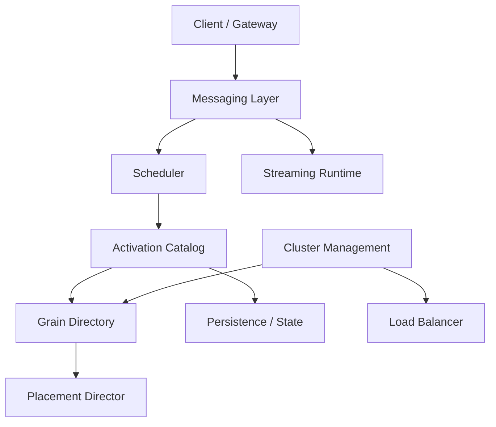
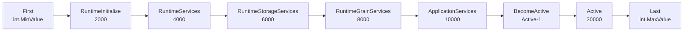
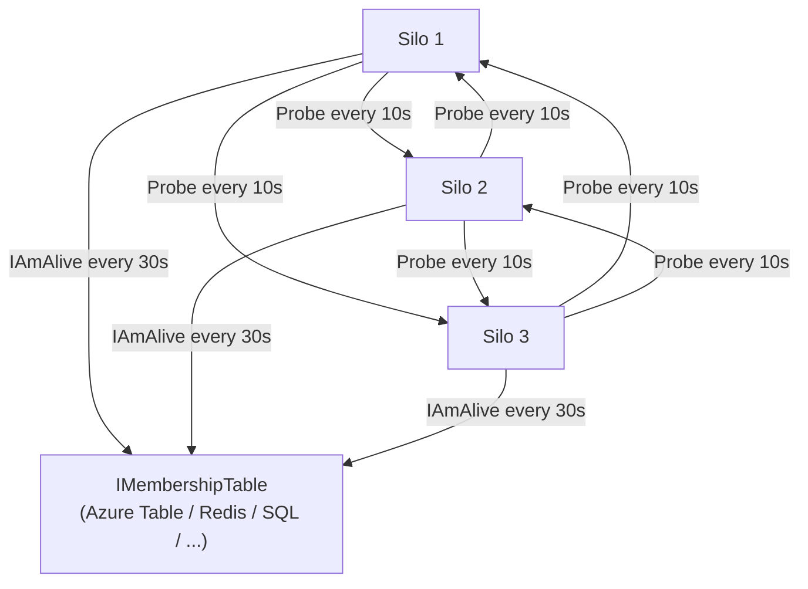
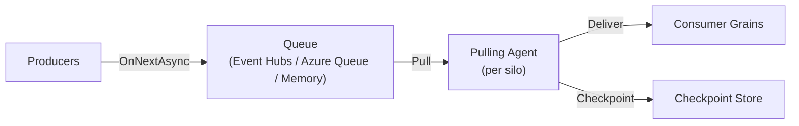

# Implementation Details, Runtime Internals, and Testing

Use this reference when architecture decisions depend on Orleans internals, scheduler rules, delivery guarantees, stream internals, or test-cluster behavior.

## Implementation Overview

Orleans runtime is built on a few core subsystems:



Key principle: grains are virtual — they always exist logically, and the runtime activates/deactivates physical instances as needed. The grain directory maps identities to activations, the scheduler enforces single-threaded execution per grain, and the messaging layer routes calls across silos.

## Grain Directory Internals

The grain directory maintains a mapping: `GrainId → (SiloAddress, ActivationId)`.

### How Activation Works

1. Client or grain makes a call to `GrainId`
2. Runtime checks local cache for existing activation
3. On cache miss, queries the grain directory
4. If no activation exists, directory picks a silo (via placement) and creates one
5. Directory registers the new activation
6. Future calls route directly to the registered silo

### Directory Partitioning

The default distributed directory uses a DHT (Distributed Hash Table):
- Each silo owns a range of the grain ID hash space
- Directory lookups are single-hop: hash the grain ID → find owning silo → query that silo
- On silo failure, its directory partition is rebuilt from surviving silos

### Consistency

- **Default (eventually consistent)**: may allow brief duplicate activations during cluster instability. The duplicate is detected and one is deactivated.
- **Strong consistency (Orleans 10 preview)**: uses versioned range locks, 30 virtual nodes per silo. Prevents duplicate activations entirely. Enable with `builder.AddDistributedGrainDirectory()`.

### Per-Grain-Type Directory

```csharp
[GrainDirectory(GrainDirectoryName = "my-directory")]
public class MyGrain : Grain, IMyGrain { }

// Register external directory
siloBuilder.AddRedisGrainDirectory("my-directory", options => { });
```

Available backends: In-Cluster (default), ADO.NET, Azure Table, Redis, Cosmos DB.

## Orleans Lifecycle

Orleans uses an observable lifecycle pattern for ordered startup and shutdown of components.

### Silo Lifecycle Stages



| Stage | Value | What Happens |
|---|---|---|
| `First` | `int.MinValue` | Earliest possible stage |
| `RuntimeInitialize` | 2000 | Threading initialization |
| `RuntimeServices` | 4000 | Networking, messaging, agents started |
| `RuntimeStorageServices` | 6000 | Storage providers initialized |
| `RuntimeGrainServices` | 8000 | Grain type management, membership joined, grain directory started |
| `ApplicationServices` | 10000 | Application-layer services initialized |
| `BecomeActive` | `Active - 1` | Silo joins the cluster |
| `Active` | 20000 | Ready for workload — grains can be activated |
| `Last` | `int.MaxValue` | Latest possible stage |

Shutdown reverses the order.

### Participation API

Components participate via `ILifecycleParticipant<ISiloLifecycle>`:

```csharp
public class MyComponent : ILifecycleParticipant<ISiloLifecycle>
{
    public void Participate(ISiloLifecycle lifecycle)
    {
        lifecycle.Subscribe<MyComponent>(
            ServiceLifecycleStage.ApplicationServices,
            onStart: async ct =>
            {
                // Initialization logic
            },
            onStop: async ct =>
            {
                // Cleanup logic
            });
    }
}

// Register in DI
services.AddSingleton<ILifecycleParticipant<ISiloLifecycle>, MyComponent>();
```

### Grain Lifecycle Stages

Grain-level lifecycle (distinct from silo lifecycle):

| Stage | Value | What Happens |
|---|---|---|
| `First` | `int.MinValue` | Earliest |
| `SetupState` | 1000 | Loads persistent state from storage |
| `Activate` | 2000 | Calls `OnActivateAsync` / `OnDeactivateAsync` |
| `Last` | `int.MaxValue` | Latest |

Override `Grain.Participate(IGrainLifecycle)` to hook into grain-level lifecycle.

### Logging

At `Information` level on `Orleans.Runtime.SiloLifecycleSubject`, logs which components participate at each stage and timing.

## Messaging Delivery Guarantees

### Default: At-Most-Once

Orleans delivers messages **at most once** by default. A message is either delivered exactly once or not at all — never duplicated.

- Every message has an automatic configurable timeout
- On timeout, the caller's `Task` is faulted with a timeout exception
- **No automatic retries** by default

### With Retries: At-Least-Once

If the application implements retry logic (e.g., via Polly), delivery becomes at-least-once: the message may arrive multiple times. Orleans does **not** deduplicate messages.

### Timeout Behavior

```csharp
// Global timeout
siloBuilder.Configure<SiloMessagingOptions>(options =>
{
    options.ResponseTimeout = TimeSpan.FromSeconds(30); // default
});

// Per-method timeout
[ResponseTimeout("00:00:05")]
Task<Result> TimeSensitiveCall();
```

### Failure Scenarios

| Scenario | What Happens |
|---|---|
| Target silo alive | Message delivered, response returned |
| Target silo dead (detected) | Grain reactivated on another silo, message re-routed |
| Target silo dead (not yet detected) | Timeout → exception → caller retries → grain activates elsewhere |
| Network partition | Timeout → exception to caller |
| Grain method throws | Exception propagated back to caller |
| Grain `OnActivateAsync` throws | Activation fails, exception to caller |

### Key Guarantee

With infinite retries, eventual delivery is guaranteed because grains never enter a permanent failure state — failed grains reactivate on another silo automatically.

## Scheduler

Orleans uses a **cooperative, single-threaded-per-grain scheduler** built on the .NET Thread Pool.

### Core Rules

1. **Single-threaded execution**: a grain never executes on more than one thread simultaneously (unless `[Reentrant]`)
2. **Turn-based**: each "turn" runs to the next `await` or completion. State only changes between turns.
3. **No preemption**: long-running synchronous code blocks the grain's scheduler slot
4. **Cooperative multitasking**: grains yield at `await` points

### Task Scheduling Behavior Within Grain Code

| API | Where It Runs |
|---|---|
| `await task` | Resumes on grain scheduler |
| `Task.Factory.StartNew(delegate)` | Runs on grain scheduler |
| `ContinueWith(delegate)` | Runs on grain scheduler |
| `Task.WhenAll`, `Task.WhenAny` | Continuation on grain scheduler |
| `Task.Delay` | Continuation on grain scheduler |
| `Task.Run(delegate)` | Delegate on thread pool; `await` resumes on grain scheduler |
| `ConfigureAwait(false)` | **NEVER use** — escapes grain scheduler |
| `async void` | **NEVER use** in grain code |

### Thread Pool Usage

Orleans runs grain turns on the .NET Thread Pool with cooperative scheduling. With proper async code, can achieve **90%+ CPU utilization** with stability.

```csharp
// Background work on thread pool (OK)
var result = await Task.Run(() => CpuBoundWork(data));
// Resumes here on grain scheduler

// WRONG — deadlock risk
var bad = task.Result; // NEVER block in grain code
```

### Scheduling Options

```csharp
siloBuilder.Configure<SchedulingOptions>(options =>
{
    options.AllowCallChainReentrancy = false;  // default
    options.PerformDeadlockDetection = true;   // default (dev)
});
```

### Reentrancy and Interleaving

Default non-reentrant: each request runs to completion. With `[Reentrant]`, multiple requests can interleave at `await` points. See grain-api.md `## Request Scheduling and Reentrancy` for full details.

## Cluster Management

Fully distributed peer-to-peer membership protocol with no central coordinator.

### Protocol Overview



### Configuration

```csharp
siloBuilder.Configure<ClusterMembershipOptions>(options =>
{
    options.NumProbedSilos = 10;                // how many silos monitor each silo (default 10 in 9.x+, was 3)
    options.NumVotesForDeathDeclaration = 2;    // votes needed to declare dead
    options.DeathVoteExpirationTimeout = TimeSpan.FromSeconds(180); // vote TTL
    options.ProbeTimeout = TimeSpan.FromSeconds(10);  // probe interval
    options.NumMissedProbesLimit = 3;           // missed probes before suspicion
});
```

### Failure Detection Timeline

Typical: **~15 seconds** (Orleans 9+) from silo crash to detection.

1. Monitoring silos send probes every 10 seconds
2. After 3 missed probes (30s), silo is suspected
3. 2 independent suspicions trigger death declaration
4. Dead silo evicted from cluster, its activations destroyed
5. Grains reactivate on other silos on next call

### Protocol Properties

- Handles any number of simultaneous failures (f ≤ n), including full cluster restart
- Light table traffic: probes go direct silo-to-silo, not through `IMembershipTable`
- Self-monitoring with Lifeguard-inspired health scoring (unhealthy silos get increased probe timeouts)
- Indirect probing for accuracy improvement
- Table unavailability **never** causes false death declarations
- `IAmAlive` writes every 30 seconds for diagnostics and disaster recovery
- Ordered membership views with guaranteed connectivity on join
- Dead silos forced to terminate and restart as new processes

### IMembershipTable Implementations

| Provider | Package |
|---|---|
| Azure Table Storage | `Microsoft.Orleans.Clustering.AzureStorage` |
| Redis | `Microsoft.Orleans.Clustering.Redis` |
| ADO.NET (SQL/PostgreSQL/MySQL/Oracle) | `Microsoft.Orleans.Clustering.AdoNet` |
| Cosmos DB | `Microsoft.Orleans.Clustering.Cosmos` |
| DynamoDB | `Microsoft.Orleans.Clustering.DynamoDB` |
| Consul | `Microsoft.Orleans.Clustering.Consul` |
| ZooKeeper | `Microsoft.Orleans.Clustering.ZooKeeper` |
| In-Memory (dev only) | built-in |

## Streams Implementation

### Architecture

The streaming runtime uses a **pulling model** with agents inside silos:



- **Pulling agents** run inside each silo, one per queue partition
- Agents pull batches of events from the underlying queue
- Events are dispatched to consumer grains via `IAsyncObserver<T>`
- Checkpoint position tracked in a separate storage provider

### Pub-Sub System

Stream subscriptions are managed by `PubSubRendezvousGrain`:
- One rendezvous grain per `StreamId`
- Stores list of subscribers
- Persisted via the `"PubSubStore"` storage provider
- Implicit subscriptions (`[ImplicitStreamSubscription]`) registered automatically

### Azure Queue Streams Implementation

NuGet: `Microsoft.Orleans.Streaming.AzureStorage`

```csharp
siloBuilder.AddAzureQueueStreams("AQProvider", optionsBuilder =>
    optionsBuilder.ConfigureAzureQueue(options =>
        options.Configure(opt =>
        {
            opt.QueueServiceClient = new QueueServiceClient(endpoint, credential);
            opt.QueueNames = new List<string> { "queue1", "queue2" }; // optional
        })));
```

Behavior:
- Uses Azure Storage Queues as the backing store
- Pulling agents poll queues at configurable intervals
- **Not rewindable** — cannot replay from arbitrary position
- Does **not** guarantee FIFO on failures (poison messages re-queued)
- Multiple queues for parallelism
- Automatic queue assignment to silo agents via consistent hashing

### Event Hubs vs Azure Queue

| Feature | Event Hubs | Azure Queue |
|---|---|---|
| Rewindable | Yes (replay from token) | No |
| FIFO guarantee | Per partition | Not on failures |
| Throughput | High (millions/sec) | Moderate |
| Cost | Higher | Lower |
| Checkpointing | Yes (via checkpoint store) | Via queue dequeue |
| Use case | High-volume event streaming | Simple message queuing |

## Load Balancing

Orleans uses multiple mechanisms to distribute load across the cluster:

### Placement-Based Balancing

The placement strategy determines where new activations are created:

| Strategy | Load Distribution |
|---|---|
| `ResourceOptimizedPlacement` (default 9.2+) | Weighted scoring: CPU (40), memory (20), available memory (20), max memory (5), activation count (15) |
| `ActivationCountBasedPlacement` | Power of Two Choices — pick two random silos, place on the one with fewer activations |
| `RandomPlacement` | Uniform random across compatible silos |
| `PreferLocalPlacement` | Local first, then random |

### Activation Repartitioning (Experimental)

Monitors grain-to-grain communication patterns and migrates grains closer to frequent communication partners.

```csharp
#pragma warning disable ORLEANSEXP001
siloBuilder.AddActivationRepartitioner();
#pragma warning restore ORLEANSEXP001
```

Uses probabilistic tracking (sampling) and anchoring filters to limit migration churn.

### Activation Rebalancing (Experimental, Orleans 10)

Cluster-wide redistribution for memory and activation count balance.

```csharp
#pragma warning disable ORLEANSEXP002
siloBuilder.AddActivationRebalancer();
#pragma warning restore ORLEANSEXP002
```

Uses entropy calculations to detect imbalance and session-based execution to coordinate rebalancing.

### Memory-Based Activation Shedding (Orleans 9+)

Auto-deactivates least-recently-used grains when memory exceeds threshold:

```csharp
services.Configure<GrainCollectionOptions>(options =>
{
    options.EnableActivationSheddingOnMemoryPressure = true;
    options.MemoryUsageLimitPercentage = 80;  // start shedding
    options.MemoryUsageTargetPercentage = 75; // stop shedding
    options.MemoryUsagePollingPeriod = TimeSpan.FromSeconds(5);
});
```

## Unit Testing

### InProcessTestCluster (Orleans 9+, Recommended)

```csharp
// Setup
var builder = new InProcessTestClusterBuilder();
builder.ConfigureSilo((options, siloBuilder) =>
{
    siloBuilder.AddMemoryGrainStorage("Default");
    siloBuilder.AddMemoryGrainStorage("PubSubStore");
    siloBuilder.UseInMemoryReminderService();
});
var cluster = builder.Build();
await cluster.DeployAsync();

// Test
var grain = cluster.Client.GetGrain<IPlayerGrain>("player-1");
await grain.UpdateScore(100);
var state = await grain.GetState();
Assert.Equal(100, state.Score);

// Cleanup
await cluster.DisposeAsync();
```

Options: `InitialSilosCount` (default 1), `InitializeClientOnDeploy` (default true), `ConfigureFileLogging` (default true), `GatewayPerSilo` (default true).

### Dynamic Silo Management

```csharp
// Add silo to running cluster
var newSilo = await cluster.StartSiloAsync();

// Stop specific silo (simulate failure)
await cluster.StopSiloAsync(newSilo);

// Restart entire cluster
await cluster.RestartAsync();
```

### TestCluster (Legacy, Still Supported)

```csharp
var builder = new TestClusterBuilder();
builder.AddSiloBuilderConfigurator<TestSiloConfigurator>();
var cluster = builder.Build();
cluster.Deploy(); // synchronous

public class TestSiloConfigurator : ISiloConfigurator
{
    public void Configure(ISiloBuilder siloBuilder)
    {
        siloBuilder.AddMemoryGrainStorage("Default");
    }
}
```

### Multi-Silo Testing

```csharp
var builder = new InProcessTestClusterBuilder();
builder.InitialSilosCount = 3; // start with 3 silos

// Test placement, failover, reminders, etc.
var grain = cluster.Client.GetGrain<IMyGrain>("key");
await grain.DoWork();

// Kill a silo and verify grain reactivates
var siloToKill = cluster.Silos[1];
await cluster.StopSiloAsync(siloToKill);

// Grain auto-reactivates on next call
var result = await grain.DoWork(); // succeeds on different silo
```

### xUnit Fixture Sharing

```csharp
public class ClusterFixture : IAsyncLifetime
{
    public InProcessTestCluster Cluster { get; private set; } = null!;

    public async Task InitializeAsync()
    {
        var builder = new InProcessTestClusterBuilder();
        builder.ConfigureSilo((_, silo) => silo.AddMemoryGrainStorage("Default"));
        Cluster = builder.Build();
        await Cluster.DeployAsync();
    }

    public async Task DisposeAsync() => await Cluster.DisposeAsync();
}

[CollectionDefinition("Orleans")]
public class ClusterCollection : ICollectionFixture<ClusterFixture> { }

[Collection("Orleans")]
public class MyGrainTests
{
    private readonly InProcessTestCluster _cluster;
    public MyGrainTests(ClusterFixture fixture) => _cluster = fixture.Cluster;

    [Fact]
    public async Task TestGrainBehavior()
    {
        var grain = _cluster.Client.GetGrain<IMyGrain>("test");
        var result = await grain.DoWork();
        Assert.NotNull(result);
    }
}
```

### Mocking Approach

```csharp
// Override GrainFactory for mocking
public class TestableOrderGrain : OrderGrain
{
    public new virtual IGrainFactory GrainFactory { get; set; }
}

// With Moq
var mockInventory = new Mock<IInventoryGrain>();
mockInventory.Setup(i => i.Reserve(It.IsAny<int>())).Returns(Task.CompletedTask);

var mockFactory = new Mock<IGrainFactory>();
mockFactory.Setup(f => f.GetGrain<IInventoryGrain>(It.IsAny<string>(), null))
    .Returns(mockInventory.Object);
```

Alternative: `OrleansTestKit` from OrleansContrib provides unit-test-friendly grain activation with less ceremony.

## Tutorials, Samples, and Resource Pages

| Need | Official Source |
|---|---|
| Browse tutorials and samples | [Code samples overview](https://learn.microsoft.com/dotnet/orleans/tutorials-and-samples/) |
| Hello World tutorial | [Hello World](https://learn.microsoft.com/dotnet/orleans/tutorials-and-samples/overview-helloworld) |
| Orleans basics tutorial | [Tutorial 1](https://learn.microsoft.com/dotnet/orleans/tutorials-and-samples/tutorial-1) |
| Adventure game sample | [Adventure](https://learn.microsoft.com/dotnet/orleans/tutorials-and-samples/adventure) |
| Custom grain storage | [Custom storage sample](https://learn.microsoft.com/dotnet/orleans/tutorials-and-samples/custom-grain-storage) |
| Design principles | [Architecture principles](https://learn.microsoft.com/dotnet/orleans/resources/orleans-architecture-principles-and-approach) |
| When Orleans fits | [Applicability](https://learn.microsoft.com/dotnet/orleans/resources/orleans-thinking-big-and-small) |
| NuGet package map | [NuGet packages](https://learn.microsoft.com/dotnet/orleans/resources/nuget-packages) |
| Best practices | [Best practices](https://learn.microsoft.com/dotnet/orleans/resources/best-practices) |
| FAQ | [FAQ](https://learn.microsoft.com/dotnet/orleans/resources/frequently-asked-questions) |
| External links | [Links](https://learn.microsoft.com/dotnet/orleans/resources/links) |

## API Reference and Source Entry Points

| Need | Official Source |
|---|---|
| Core API | [Orleans.Core](https://learn.microsoft.com/dotnet/api/orleans.core) |
| Runtime API | [Orleans.Runtime](https://learn.microsoft.com/dotnet/api/orleans.runtime) |
| Streams API | [Orleans.Streams](https://learn.microsoft.com/dotnet/api/orleans.streams) |
| Source repo | [dotnet/orleans](https://github.com/dotnet/orleans) |
| Official samples | [dotnet/samples Orleans](https://github.com/dotnet/samples/tree/main/orleans) |
| Repo samples README | [Samples README](https://github.com/dotnet/orleans/blob/main/samples/README.md) |

## Usage Guidance

- Start here when the problem depends on scheduler rules, runtime delivery guarantees, stream internals, cluster management, or test-cluster behavior.
- Use grain-api.md for grain-level API details (reentrancy, timers, placement).
- Use configuration-api.md for operational setup (deployment, observability, providers).
- Use examples.md for example-first navigation.
- Use official-docs-index.md for the full documentation tree.
