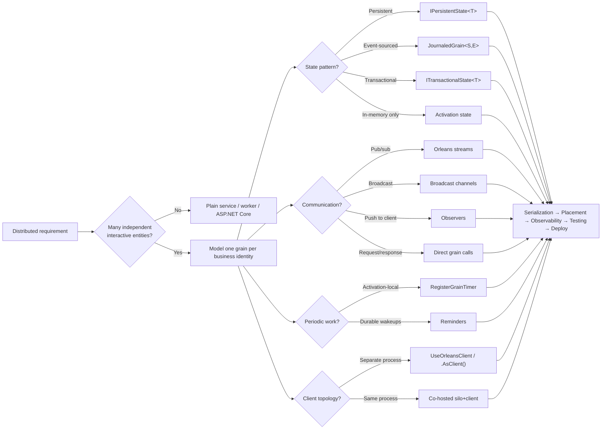

# Microsoft Orleans

## Trigger On

- building or reviewing `.NET` code that uses `Microsoft.Orleans.*`, `Grain`, `IGrainWith*`, `UseOrleans`, `UseOrleansClient`, `IGrainFactory`, `JournaledGrain`, `ITransactionalState`, or Orleans silo/client builders
- testing Orleans code with `InProcessTestCluster`, `Aspire.Hosting.Testing`, `WebApplicationFactory`, or shared AppHost fixtures
- modeling high-cardinality stateful entities such as users, carts, devices, rooms, orders, digital twins, sessions, or collaborative documents
- choosing between grains, streams, broadcast channels, reminders, stateless workers, persistence providers, placement strategies, transactions, event sourcing, and external client/frontend topologies
- deploying or operating Orleans with Redis, Azure Storage, Cosmos DB, ADO.NET, .NET Aspire, Kubernetes, Azure Container Apps, or built-in/dashboard observability
- designing grain serialization contracts, versioning grain interfaces, configuring custom placement, or implementing grain call filters and interceptors

## Workflow

1. **Decide whether Orleans fits.** Use it when the system has many loosely coupled interactive entities that can each stay small and single-threaded. Do not force Orleans onto shared-memory workloads, long batch jobs, or systems dominated by constant global coordination.

2. **Model grain boundaries around business identity.** Prefer one grain per user, cart, device, room, order, or other durable entity. Never create unique grains per request — use `[StatelessWorker]` for stateless fan-out. Grain identity types:
   - `IGrainWithGuidKey` — globally unique entities
   - `IGrainWithIntegerKey` — relational DB integration
   - `IGrainWithStringKey` — flexible string keys
   - `IGrainWithGuidCompoundKey` / `IGrainWithIntegerCompoundKey` — composite identity with extension string

3. **Design coarse-grained async APIs.** All grain interface methods must return `Task`, `Task<T>`, or `ValueTask<T>`. Use `IAsyncEnumerable<T>` for streaming responses. Avoid `.Result`, `.Wait()`, blocking I/O, lock-based coordination. Use `Task.WhenAll` for parallel cross-grain calls. Apply `[ResponseTimeout("00:00:05")]` on interface methods when needed.

4. **Choose the right state pattern:**
   - `IPersistentState<TState>` with `[PersistentState("name", "provider")]` for named persistent state (preferred)
   - Multiple named states per grain for different storage providers
   - `JournaledGrain<TState, TEvent>` for event-sourced grains
   - `ITransactionalState<TState>` for ACID transactions across grains
   - `Grain<TState>` is legacy — use only when constrained by existing code

5. **Pick the right runtime primitive deliberately:**
   - Standard grains for stateful request/response logic
   - `[StatelessWorker]` for pure stateless fan-out or compute helpers
   - Orleans streams for decoupled event flow and pub/sub with `[ImplicitStreamSubscription]`
   - Broadcast channels for fire-and-forget fan-out with `[ImplicitChannelSubscription]`
   - `RegisterGrainTimer` for activation-local periodic work (non-durable)
   - Reminders via `IRemindable` for durable low-frequency wakeups
   - Observers via `IGrainObserver` and `ObserverManager<T>` for one-way push notifications

6. **Configure serialization correctly:**
   - `[GenerateSerializer]` on all state and message types
   - `[Id(N)]` on each serialized member for stable identification
   - `[Alias("name")]` for safe type renaming
   - `[Immutable]` to skip copy overhead on immutable types
   - Use surrogates (`IConverter<TOriginal, TSurrogate>`) for types you don't own

7. **Handle reentrancy and scheduling deliberately:**
   - Default is non-reentrant single-threaded execution (safe but deadlock-prone with circular calls)
   - `[Reentrant]` on grain class for full interleaving
   - `[AlwaysInterleave]` on interface method for specific method interleaving
   - `[ReadOnly]` for concurrent read-only methods
   - `RequestContext.AllowCallChainReentrancy()` for scoped reentrancy
   - Native `CancellationToken` support (last parameter, optional default)

8. **Choose hosting intentionally.**
   - `UseOrleans` for silos, `UseOrleansClient` for separate clients
   - Co-hosted client runs in same process (reduced latency, no extra serialization)
   - In Aspire, declare Orleans resource in AppHost, wire clustering/storage/reminders there, use `.AsClient()` for frontend-only consumers
   - In Aspire-backed tests, resolve Orleans backing-resource connection strings from the distributed app and feed them into the test host instead of duplicating local settings
   - Prefer `TokenCredential` with `DefaultAzureCredential` for Azure-backed providers

9. **Configure providers with production realism.**
   - In-memory storage, reminders, and stream providers are dev/test only
   - Persistence: Redis, Azure Table/Blob, Cosmos DB, ADO.NET, DynamoDB
   - Reminders: Azure Table, Redis, Cosmos DB, ADO.NET
   - Clustering: Azure Table, Redis, Cosmos DB, ADO.NET, Consul, Kubernetes
   - Streams: Azure Event Hubs, Azure Queue, Memory (dev only)

10. **Treat placement as an optimization tool, not a default to cargo-cult.**
    - `ResourceOptimizedPlacement` is default since 9.2 (CPU, memory, activation count weighted)
    - `RandomPlacement`, `PreferLocalPlacement`, `HashBasedPlacement`, `ActivationCountBasedPlacement`
    - `SiloRoleBasedPlacement` for role-targeted placement
    - Custom placement via `IPlacementDirector` + `PlacementStrategy` + `PlacementAttribute`
    - Placement filtering (9.0+) for zone-aware and hardware-affinity placement
    - Activation repartitioning and rebalancing are experimental

11. **Make the cluster observable.**
    - Standard `Microsoft.Extensions.Logging`
    - `System.Diagnostics.Metrics` with meter `"Microsoft.Orleans"`
    - OpenTelemetry export via `AddOtlpExporter` + `AddMeter("Microsoft.Orleans")`
    - Distributed tracing via `AddActivityPropagation()` with sources `"Microsoft.Orleans.Runtime"` and `"Microsoft.Orleans.Application"`
    - Orleans Dashboard for operational visibility (secure with ASP.NET Core auth)
    - Health checks for cluster readiness

12. **Test the cluster behavior you actually depend on.**
   - `InProcessTestCluster` for new tests
   - Shared Aspire/AppHost fixtures for real HTTP, SignalR, SSE, or UI flows that must exercise the co-hosted Orleans topology
   - `WebApplicationFactory<TEntryPoint>` layered over a shared AppHost when tests need Host DI services, `IGrainFactory`, or direct grain/runtime access while keeping real infrastructure
   - Multi-silo coverage when placement, reminders, persistence, or failover matters
   - Benchmark hot grains before claiming the design scales
   - Use memory providers in test, real providers in integration tests

## Architecture

## Deliver

- a justified Orleans fit, or a clear rejection when the problem should stay as plain `.NET` code
- grain boundaries, grain identities, and activation behavior aligned to the domain model
- concrete choices for clustering, persistence, reminders, streams, placement, transactions, and hosting topology
- serialization contracts with `[GenerateSerializer]`, `[Id]`, versioning via `[Alias]`, and immutability annotations
- an async-safe grain API surface with bounded state, proper reentrancy, and reduced hot-spot risk
- an explicit testing and observability plan for local development and production
- a test-harness choice that matches the assertion level: runtime-only, API/SignalR/UI, or direct Host DI/grain access

## Validate

- Orleans is being used for many loosely coupled entities, not as a generic distributed hammer
- grain interfaces are coarse enough to avoid chatty cross-grain traffic
- no grain code blocks threads or mixes sync-over-async with runtime calls
- state is bounded, version-tolerant, and persisted only through intentional provider-backed writes
- all state and message types use `[GenerateSerializer]` and `[Id(N)]` correctly
- timers are not used where durable reminders are required; reminders are not used for high-frequency ticks
- in-memory storage, reminders, and stream providers are confined to dev/test usage
- Aspire projects register required keyed backing resources before `UseOrleans()` or `UseOrleansClient()`
- reentrancy is handled deliberately — circular call patterns use `[Reentrant]`, `[AlwaysInterleave]`, or `AllowCallChainReentrancy`
- transactional grains are marked `[Reentrant]` and use `PerformRead`/`PerformUpdate`
- hot grains, global coordinators, and affinity-heavy grains are measured and justified
- tests cover multi-silo behavior, persistence, and failover-sensitive logic when those behaviors matter
- Aspire-backed tests reuse one shared AppHost fixture and do not boot the distributed topology inside individual tests
- co-hosted Host tests do not start a redundant Orleans client unless external-client behavior is the thing under test
- Host or API test factories resolve connection strings from the AppHost resource graph instead of copied local config
- deployment uses production clustering, real providers, and proper GC configuration

## Load References

Open only what you need. Each reference is topic-focused for token economy:

- references/official-docs-index.md — full Orleans documentation map with direct links to the official Learn tree
- references/grains.md — grain modeling, persistence, event sourcing, reminders, transactions, versioning links
- references/grain-api.md — grain identity, placement, lifecycle, reentrancy, cancellation API details with code
- references/persistence-api.md — IPersistentState API, provider configuration, event sourcing, transactions with code
- references/streaming-api.md — streams, broadcast channels, observers, IAsyncEnumerable patterns with code
- references/serialization-api.md — GenerateSerializer, Id, Alias, surrogates, copier, immutability details
- references/hosting.md — clients, Aspire, configuration, observability, dashboard, deployment links
- references/configuration-api.md — silo/client config, GC tuning, deployment targets, observability setup with code
- references/implementation.md — runtime internals, testing, load balancing, messaging guarantees
- references/testing-patterns.md — practical Orleans test harness selection with `InProcessTestCluster`, shared AppHost fixtures, `WebApplicationFactory`, SignalR, and Playwright
- references/patterns.md — grain, persistence, streaming, coordination, and performance patterns with code
- references/anti-patterns.md — blocking calls, unbounded state, chatty grains, bottlenecks, deadlocks with code
- references/examples.md — quickstarts, samples browser entries, and official Orleans example hubs

Official sources:

- [GitHub Repository](https://github.com/dotnet/orleans)
- [Overview](https://learn.microsoft.com/dotnet/orleans/overview)
- [Best Practices](https://learn.microsoft.com/dotnet/orleans/resources/best-practices)
- [Grain Persistence](https://learn.microsoft.com/dotnet/orleans/grains/grain-persistence)
- [Grain Placement](https://learn.microsoft.com/dotnet/orleans/grains/grain-placement)
- [Timers and Reminders](https://learn.microsoft.com/dotnet/orleans/grains/timers-and-reminders)
- [Streaming](https://learn.microsoft.com/dotnet/orleans/streaming/)
- [Transactions](https://learn.microsoft.com/dotnet/orleans/grains/transactions)
- [Serialization](https://learn.microsoft.com/dotnet/orleans/host/configuration-guide/serialization)
- [Testing](https://learn.microsoft.com/dotnet/orleans/implementation/testing)
- [Orleans Dashboard](https://learn.microsoft.com/dotnet/orleans/dashboard/)
- [Orleans and .NET Aspire Integration](https://learn.microsoft.com/dotnet/orleans/host/aspire-integration)
