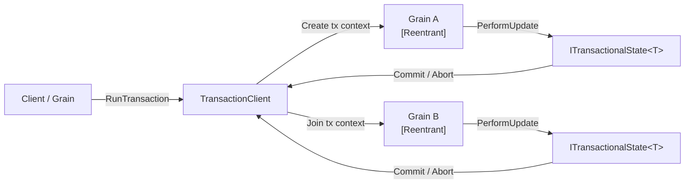

# Persistence, Databases, Journaling, Event Sourcing, and Transactions API

Detailed state management API patterns from official Orleans documentation.

## Contents

- [State ownership and database boundary](#state-ownership-and-database-boundary)
- [IPersistentState API](#ipersistentstate-api)
- [Storage provider configuration](#storage-provider-configuration)
- [Experimental Orleans.Journaling](#experimental-orleansjournaling)
- [Event sourcing with JournaledGrain](#event-sourcing-with-journaledgrain)
- [ACID transactions](#acid-transactions)

## State Ownership and Database Boundary

Use Orleans persistence to preserve state owned by a logical grain identity. The normal model is:

1. Orleans activates the grain and loads its named state before application calls are processed.
2. Grain code reads and mutates the in-memory state during serialized turns.
3. Grain code explicitly calls `WriteStateAsync` when the new state must become durable.
4. The storage provider persists an opaque state record keyed by grain identity and state name.

This is an entity-state API, not a general database abstraction. Select it for bounded current state addressed by grain identity. Select an application database/repository or read model for:

- joins, search, reports, arbitrary filters, or scans across many identities;
- large/unbounded collections, time-series, files, and append-only history;
- set-based updates and database-native constraints;
- data shared with non-Orleans applications;
- an existing external system of record.

It is common to use both. Let the grain own command serialization, invariants, workflow position, idempotency keys, and a small current snapshot. Let a database own query projections, history, reporting rows, or large payloads. Define which side is authoritative for each field and how projections recover after failure.

Do not:

- query another grain's storage row instead of calling its contract;
- mutate provider tables/containers behind an active grain;
- assume that using an ADO.NET or Cosmos provider turns grain state into a supported application query model;
- store an unbounded child collection in one grain because the provider can serialize it;
- keep two writable copies without conflict/reconciliation rules.

When external data is authoritative, keep only a cache plus its version/staleness metadata in the grain, or re-read the external repository at the consistency points required by the domain.

## IPersistentState API

```csharp
public class PlayerGrain : Grain, IPlayerGrain
{
    private readonly IPersistentState<PlayerProfile> _profile;
    private readonly IPersistentState<PlayerInventory> _inventory;

    public PlayerGrain(
        [PersistentState("profile", "profileStore")]
        IPersistentState<PlayerProfile> profile,
        [PersistentState("inventory", "itemStore")]
        IPersistentState<PlayerInventory> inventory)
    {
        _profile = profile;
        _inventory = inventory;
    }
}
```

### Operations

| Operation | Behavior |
|---|---|
| `state.State` | Access/modify in-memory state |
| `state.ReadStateAsync()` | Reload from storage (automatic on activation) |
| `state.WriteStateAsync()` | Persist current state (must call explicitly) |
| `state.ClearStateAsync()` | Clear/delete from storage |
| `state.RecordExists` | Whether state exists in storage |
| `state.Etag` | Provider-specific optimistic concurrency token |

### State Type Requirements

```csharp
[GenerateSerializer]
public class PlayerProfile
{
    [Id(0)] public string Name { get; set; } = "";
    [Id(1)] public int Level { get; set; }
    [Id(2)] public DateTime LastLogin { get; set; }
}
```

- Use `[GenerateSerializer]` and `[Id(N)]` on all state types
- Use JSON or version-tolerant format for stored state
- Adding new `[Id]` members is safe; removing is safe if ID not reused; changing types is breaking

## Storage Provider Configuration

### Redis

```csharp
siloBuilder.AddRedisGrainStorage("redis", options =>
{
    options.ConfigurationOptions = new ConfigurationOptions
    {
        EndPoints = { "localhost:6379" }
    };
    options.DeleteStateOnClear = true;
    options.EntryExpiry = TimeSpan.FromDays(30);
});
```

### Azure Cosmos DB

```csharp
siloBuilder.AddCosmosGrainStorage("cosmos", options =>
{
    options.DatabaseName = "OrleansState";
    options.ContainerName = "GrainState";
    options.IsResourceCreationEnabled = true;
    options.DeleteStateOnClear = true;
    options.StateFieldsToIndex = new[] { "/State/Type" };
});
```

### Azure Table/Blob Storage

```csharp
siloBuilder.AddAzureTableGrainStorage("table", options =>
    options.ConfigureTableServiceClient(connectionString));

siloBuilder.AddAzureBlobGrainStorage("blob", options =>
    options.ConfigureBlobServiceClient(connectionString));
```

### ADO.NET

```csharp
siloBuilder.AddAdoNetGrainStorage("sql", options =>
{
    options.Invariant = "Microsoft.Data.SqlClient";
    options.ConnectionString = connectionString;
});
```

### Amazon DynamoDB

```csharp
siloBuilder.AddDynamoDBGrainStorage("dynamo", options =>
{
    options.Service = "us-east-1";
    options.AccessKey = accessKey;
    options.SecretKey = secretKey;
    options.TableName = "OrleansGrainState";
    options.CreateIfNotExists = true;
    options.DeleteStateOnClear = true;
});
```

### Storage Provider Summary

| Provider | Package | Config Method |
|---|---|---|
| Redis | `Microsoft.Orleans.Persistence.Redis` | `AddRedisGrainStorage` |
| Azure Table | `Microsoft.Orleans.Persistence.AzureStorage` | `AddAzureTableGrainStorage` |
| Azure Blob | `Microsoft.Orleans.Persistence.AzureStorage` | `AddAzureBlobGrainStorage` |
| Cosmos DB | `Microsoft.Orleans.Persistence.Cosmos` | `AddCosmosGrainStorage` |
| ADO.NET | `Microsoft.Orleans.Persistence.AdoNet` | `AddAdoNetGrainStorage` |
| DynamoDB | `Microsoft.Orleans.Persistence.DynamoDB` | `AddDynamoDBGrainStorage` |
| Memory (dev) | built-in | `AddMemoryGrainStorage` |

### Custom Storage Provider

```csharp
public class MyStorage : IGrainStorage
{
    public Task ReadStateAsync<T>(string stateName, GrainId grainId, IGrainState<T> grainState) { }
    public Task WriteStateAsync<T>(string stateName, GrainId grainId, IGrainState<T> grainState) { }
    public Task ClearStateAsync<T>(string stateName, GrainId grainId, IGrainState<T> grainState) { }
}
```

## Experimental Orleans.Journaling

`Microsoft.Orleans.Journaling` is a separate experimental persistence surface in Orleans 10.2. It records durable state operations in an ordered journal and replays them to recover durable collections and values. The `10.2.1` package is published as `10.2.1-alpha.1`, so require an explicit adoption decision and version pin.

Use it when operation-journaled durable collections or completion state solve a concrete need. Available durable shapes include dictionary, list, queue, set, value, persistent state, and durable task completion source. Do not confuse it with `JournaledGrain<TState,TEvent>`:

| Surface | Purpose | Entry model |
|---|---|---|
| `IPersistentState<T>` | Persist the current entity snapshot | Application writes the current state |
| `Orleans.Journaling` | Persist/replay durable collection/value operations | Framework durable-operation codecs |
| `JournaledGrain<TState,TEvent>` | Event-source domain state | Application-defined business events |

Install and configure a journaling provider on the same Orleans version:

```bash
dotnet add package Microsoft.Orleans.Journaling --version 10.2.1-alpha.1
dotnet add package Microsoft.Orleans.Journaling.AzureStorage --version 10.2.1-alpha.1
```

```csharp
[JsonSerializable(typeof(string))]
[JsonSerializable(typeof(int))]
internal partial class JournalJsonContext : JsonSerializerContext;

builder.UseOrleans(siloBuilder =>
    siloBuilder
        .AddAzureBlobJournalStorage()
        .UseJsonJournalFormat(JournalJsonContext.Default));
```

Use durable keyed state from a `DurableGrain` and commit through `WriteStateAsync`:

```csharp
public sealed class CartGrain(
    [FromKeyedServices("cart")] IDurableDictionary<string, int> items)
    : DurableGrain, ICartGrain
{
    public async ValueTask SetQuantityAsync(string itemId, int quantity)
    {
        items[itemId] = quantity;
        await WriteStateAsync();
    }
}
```

Orleans 10.2 uses JSON Lines for new journal writes by default. Existing records with format metadata remain readable; records without metadata are treated as legacy Orleans binary. Pin `JournaledStateManagerOptions.JournalFormatKey = "orleans-binary"` only when a staged compatibility plan requires continuing old-format writes.

For trimming or Native AOT, register source-generated `System.Text.Json` metadata for every journaled key, value, and state type. Test replay, compaction/snapshot migration, provider failure, and version upgrade with production-like storage.

Official package sources:

- [Orleans.Journaling README for 10.2.1](https://github.com/dotnet/orleans/blob/v10.2.1/src/Orleans.Journaling/README.md)
- [Azure Storage Journaling README for 10.2.1](https://github.com/dotnet/orleans/blob/v10.2.1/src/Azure/Orleans.Journaling.AzureStorage/README.md)
- [Orleans 10.2.0 release notes](https://github.com/dotnet/orleans/releases/tag/v10.2.0)

## Event Sourcing with JournaledGrain

```csharp
// State class
[GenerateSerializer]
public class BankAccountState
{
    [Id(0)] public decimal Balance { get; set; }

    // Apply methods — called automatically by the runtime
    public void Apply(DepositEvent e) => Balance += e.Amount;
    public void Apply(WithdrawEvent e) => Balance -= e.Amount;
}

// Event base
[GenerateSerializer]
public abstract record AccountEvent;

[GenerateSerializer]
public record DepositEvent([property: Id(0)] decimal Amount) : AccountEvent;

[GenerateSerializer]
public record WithdrawEvent([property: Id(0)] decimal Amount) : AccountEvent;

// Grain
public class BankAccountGrain : JournaledGrain<BankAccountState, AccountEvent>, IBankAccountGrain
{
    public Task Deposit(decimal amount)
    {
        RaiseEvent(new DepositEvent(amount));
        return ConfirmEvents(); // immediate confirmation
    }

    public Task<decimal> GetBalance() => Task.FromResult(State.Balance);
}
```

### Confirmation Modes

| Mode | Method | Tradeoff |
|---|---|---|
| Immediate | `ConfirmEvents()` after `RaiseEvent` | Consistent but slower |
| Delayed | Just `RaiseEvent`, no confirm | Higher throughput, eventual consistency |
| Conditional | Confirm at checkpoints | Balance of both |

### Log Consistency Providers

Three built-in providers. Configure via silo builder:

```csharp
siloBuilder.AddLogStorageBasedLogConsistencyProvider("LogStorage");
siloBuilder.AddStateStorageBasedLogConsistencyProvider("StateStorage");
siloBuilder.AddCustomStorageBasedLogConsistencyProvider("CustomStorage");
```

### Raising Multiple Events

```csharp
// Individual raises — two storage accesses, risk of partial write
RaiseEvent(e1);
RaiseEvent(e2);
await ConfirmEvents();

// Atomic batch — written atomically
RaiseEvents(new[] { e1, e2 });
await ConfirmEvents();
```

### Retrieving Events

```csharp
// Not all providers support this (throws NotSupportedException if unavailable)
IReadOnlyList<AccountEvent> events = await RetrieveConfirmedEvents(0, Version);
```

### Immediate vs Delayed Confirmation

**Immediate**: call `ConfirmEvents()` after every `RaiseEvent`. Grain unavailable during storage issues. Safe, consistent.

**Delayed**: raise events without confirming. Higher throughput but eventual consistency.

```csharp
// Delayed — access tentative state
IEnumerable<AccountEvent> UnconfirmedEvents { get; }
AccountState TentativeState { get; } // State + all unconfirmed events applied
```

`TentativeState` is a best guess — events may be canceled or reordered in multi-instance scenarios.

### Conditional Events (Conflict Resolution)

```csharp
// Returns false if race lost (version mismatch)
bool success = await RaiseConditionalEvent(new WithdrawEvent { Amount = 100 });
// Awaiting the task is sufficient confirmation — no need for ConfirmEvents
```

Analogous to e-tag conditional updates. Use for operations that must not silently conflict (withdrawals). Unconditional events (deposits) always append.

### Notifications

```csharp
// Called when confirmed state changes (load, write success, remote notification)
protected override void OnStateChanged() { }

// Called when tentative state changes (including during RaiseEvent)
protected override void OnTentativeStateChanged() { }
```

### Explicit Synchronization

```csharp
await RefreshNow(); // confirms all unconfirmed events + loads latest from storage
```

### Diagnostics

```csharp
EnableStatsCollection();
LogConsistencyStatistics stats = GetStats();
DisableStatsCollection();

// Connection error monitoring
protected override void OnConnectionIssue(ConnectionIssue issue) { }
protected override void OnConnectionIssueResolved(ConnectionIssue issue) { }
```

### Log Consistency Providers

| Provider | Storage | RetrieveConfirmedEvents | Use Case |
|---|---|---|---|
| `StateStorage` | State snapshot via standard storage provider | No (events not persisted) | Production — snapshot-based |
| `LogStorage` | Complete event list as single object | Yes (all events in memory) | Testing only — full read/write each time |
| `CustomStorage` | Grain implements `ICustomStorageInterface<S,E>` | No (you control storage) | Production — custom backends |

```csharp
// Register providers
siloBuilder.AddStateStorageBasedLogConsistencyProvider("StateStorage");
siloBuilder.AddLogStorageBasedLogConsistencyProvider("LogStorage");
siloBuilder.AddCustomStorageBasedLogConsistencyProvider("CustomStorage");

// Attribute on grain
[StorageProvider(ProviderName = "OrleansStorage")]
[LogConsistencyProvider(ProviderName = "StateStorage")]
public class MyGrain : JournaledGrain<MyState, MyEvent> { }
```

### CustomStorage Interface

```csharp
public interface ICustomStorageInterface<StateType, EventType>
{
    Task<KeyValuePair<int, StateType>> ReadStateFromStorage();
    // Return false on version mismatch (e-tag semantics)
    Task<bool> ApplyUpdatesToStorage(IReadOnlyList<EventType> updates, int expectedVersion);
}
```

### Replicated Instances

Multi-cluster event sourcing guarantees:
- Same version number = same state across instances
- Racing events resolved into one agreed sequence
- Notifications propagated after events raised

## ACID Transactions



### Setup

```csharp
// Silo
siloBuilder.UseTransactions();

// Client
clientBuilder.UseTransactions();

// Storage
siloBuilder.AddAzureTableTransactionalStateStorage("TransactionStore",
    options => options.ConfigureTableServiceClient(connectionString));
```

### Transaction Attributes

| Attribute | Meaning |
|---|---|
| `[Transaction(TransactionOption.Create)]` | Always starts new transaction |
| `[Transaction(TransactionOption.Join)]` | Must be within existing transaction |
| `[Transaction(TransactionOption.CreateOrJoin)]` | Joins existing or creates new |
| `[Transaction(TransactionOption.Suppress)]` | Not transactional |
| `[Transaction(TransactionOption.Supported)]` | Not transactional but passes context |
| `[Transaction(TransactionOption.NotAllowed)]` | Cannot be called in transaction |

### Grain Implementation

```csharp
// Interface
public interface IAccountGrain : IGrainWithStringKey
{
    [Transaction(TransactionOption.Join)]
    Task Withdraw(decimal amount);

    [Transaction(TransactionOption.Join)]
    Task Deposit(decimal amount);

    [Transaction(TransactionOption.CreateOrJoin)]
    Task<decimal> GetBalance();
}

// Grain — MUST be [Reentrant]
[Reentrant]
public class AccountGrain : Grain, IAccountGrain
{
    private readonly ITransactionalState<AccountBalance> _balance;

    public AccountGrain(
        [TransactionalState("balance", "TransactionStore")]
        ITransactionalState<AccountBalance> balance)
    {
        _balance = balance;
    }

    public Task Withdraw(decimal amount) =>
        _balance.PerformUpdate(state =>
        {
            if (state.Value < amount)
                throw new InsufficientFundsException();
            state.Value -= amount;
        });

    public Task Deposit(decimal amount) =>
        _balance.PerformUpdate(state => state.Value += amount);

    public Task<decimal> GetBalance() =>
        _balance.PerformRead(state => state.Value);
}
```

### Client-Side Transactions

```csharp
var transactionClient = serviceProvider.GetRequiredService<ITransactionClient>();

await transactionClient.RunTransaction(TransactionOption.Create, async () =>
{
    await fromAccount.Withdraw(100m);
    await toAccount.Deposit(100m);
});
```

### Error Handling

- `OrleansTransactionException` wraps app exceptions
- `OrleansTransactionAbortedException` is retryable
- Unknown-state: wait for `SystemResponseTimeout` before retrying
- `OrleansTransactionsDisabledException` if `UseTransactions()` not called
