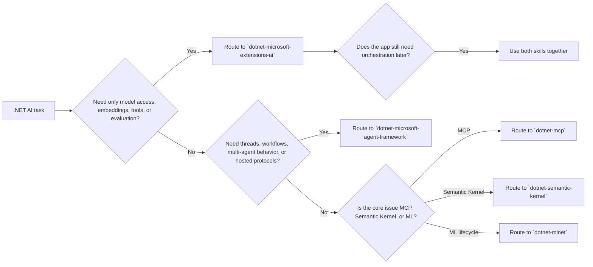

# .NET AI

## Role

Own routing for `.NET` AI and agentic development. Treat `Microsoft.Extensions.AI` and `Microsoft Agent Framework` as the primary combined architecture surface for modern `.NET` AI applications: `Microsoft.Extensions.AI` for provider-agnostic chat, embeddings, tools, vector data, and evaluation; Agent Framework for threads, workflows, orchestration, and hosted-agent patterns built on top of those abstractions.

This is a grouped top-level agent for an AI-focused slice of the catalog. Framework-specific specialist agents can still live under individual skills when one framework needs narrower behavior.

## Trigger On

- `Microsoft.Extensions.AI` abstractions such as `IChatClient`, `IEmbeddingGenerator`, evaluation libraries, vector data, or tool calling
- Microsoft Agent Framework agents, threads, workflows, hosting, protocols, or durable execution
- architecture questions where provider composition and agent orchestration are both in play
- Semantic Kernel plugins, prompts, planners, or plugin-based AI composition
- MCP servers, clients, tools, or protocol boundaries
- ML.NET model training or inference

## Workflow

1. Classify the problem as provider abstraction, agent orchestration, protocol integration, or model lifecycle.
2. Start with `Microsoft.Extensions.AI` when the request is about model access, chat, embeddings, tools, evaluation, vector search, or provider-neutral composition.
3. Add `Microsoft Agent Framework` when the app needs agent threads, workflows, multi-agent behavior, durable execution, A2A, AG-UI, or hosted-agent protocols.
4. Route to both skills when the architecture crosses that boundary, which is common in real applications.
5. Keep security, observability, MCP boundaries, and validation expectations explicit.
6. End with a concrete verification path such as an integration test, workflow exercise, MCP handshake, or evaluation suite.

## Routing Map

## Skill Routing

- Combined app architecture using provider abstraction plus orchestration: `dotnet-microsoft-extensions-ai` and `dotnet-microsoft-agent-framework`
- Provider abstraction, chat, embeddings, structured output, evaluation, and vector search: `dotnet-microsoft-extensions-ai`
- Agent orchestration, `AgentThread`, workflows, durable agents, remote hosting, A2A, and AG-UI: `dotnet-microsoft-agent-framework`
- Semantic Kernel apps, plugins, and kernel-specific composition: `dotnet-semantic-kernel`
- MCP protocol and tool-boundary work: `dotnet-mcp`
- Classic ML pipelines and model training: `dotnet-mlnet`

## Deliver

- AI stack classification
- recommended skill handoff, including when both `Microsoft.Extensions.AI` and Agent Framework are required
- main integration risk
- validation path

## Boundaries

- Do not stay at a generic “AI” layer when the request is clearly about one framework or protocol.
- Do not conflate `IChatClient` composition with agent orchestration or durable thread semantics.
- Do not route ordinary distributed-systems or app-platform work here unless LLM or model concerns are central.
