# SharpConsoleUI terminal application framework

## Trigger On

- building an interactive terminal UI: dashboards, wizards, settings screens, admin/monitoring consoles
- building a full-screen single-window TUI: a `.Frameless()` (no title bar, no title buttons) + `.Maximized()` app that owns the whole terminal
- building a multi-window terminal desktop: overlapping windows with drag/resize/minimize/maximize, z-order, focus routing, modal windows, and mouse support (full-screen and multi-window are equally first-class here)
- wanting flicker-free rendering that stays clean over SSH (diff-based cell buffer, not full repaints)
- needing rich terminal controls: data tables, tree/list views, forms, an embedded PTY terminal, markdown, charts, or video
- shipping a NativeAOT-ready console application with a real UI

Do not trigger for plain line-based CLI tools, argument parsing, or non-interactive scripts.

## Install

- NuGet:
  - `dotnet add package SharpConsoleUI`
  - `dotnet add package SharpConsoleUI --version <version>`
- XML package reference:
  - `<PackageReference Include="SharpConsoleUI" Version="x.y.z" />`
- Targets `net8.0`, `net9.0`, `net10.0`.
- Sources:
  - [NuGet: SharpConsoleUI](https://www.nuget.org/packages/SharpConsoleUI/)
  - [GitHub: nickprotop/ConsoleEx](https://github.com/nickprotop/ConsoleEx)
  - [Docs site](https://nickprotop.github.io/ConsoleEx/)

## Workflow

```mermaid
flowchart LR
  A["NetConsoleDriver (RenderMode.Buffer)"] --> B["ConsoleWindowSystem"]
  B --> C["WindowBuilder -> Window"]
  C --> D["window.AddControl(Controls.*)"]
  D --> E["DOM layout: Measure -> Arrange -> Paint"]
  E --> F["windowSystem.AddWindow(window)"]
  F --> G["windowSystem.Run()  (blocks until Shutdown)"]
  G --> H["compositor merges per-window buffers -> terminal"]
```



1. Create a `NetConsoleDriver` and a `ConsoleWindowSystem` that owns all windows.
2. Build one or more windows with `WindowBuilder` (title, size, position, borders, padding).
3. Add controls to each window with `window.AddControl(...)`, usually via the `Controls` static factory.
4. Wire interactivity through control events (e.g. `Button.OnClick`); call `windowSystem.Shutdown()` to exit.
5. `windowSystem.AddWindow(window)` then `windowSystem.Run()` starts the render/input loop (blocks until shutdown).
6. For layout, dialogs, portals/overlays, forms, and the full control set, load the reference files below.

### Minimal app (read + show + interact)

```csharp
using SharpConsoleUI;
using SharpConsoleUI.Builders;
using SharpConsoleUI.Controls;
using SharpConsoleUI.Drivers;

var driver = new NetConsoleDriver(RenderMode.Buffer);
var windowSystem = new ConsoleWindowSystem(driver);

var window = new WindowBuilder(windowSystem)
    .WithTitle("Hello World")
    .WithSize(50, 12)
    .Centered()
    .Build();

window.AddControl(Controls.Markup()
    .AddLine("[bold cyan]Hello, SharpConsoleUI![/]")
    .Build());

window.AddControl(Controls.Button("Quit")
    .OnClick((sender, e, win) => windowSystem.Shutdown())
    .Build());

windowSystem.AddWindow(window);
windowSystem.Run();
```

### Layout + data example

Use a `GridControl` when you need columns/rows with fixed, size-to-content, or
proportional (`Star`) tracks, and put content controls (tables, lists, markdown)
into the cells:

```csharp
var grid = Controls.Grid()
    .Columns(GridLength.Cells(20), GridLength.Star(1))   // fixed sidebar + fill
    .Rows(GridLength.Auto(), GridLength.Star(1))         // toolbar + body
    .RowGap(1)
    .Place(Controls.Markup("[bold]Dashboard[/]").Build(), 0, 0, colSpan: 2)
    .Place(sidebarList, 1, 0)
    .Place(dataTable, 1, 1)
    .Build();

window.AddControl(grid);
```

See `references/recipes.md` for full grid/table/form/dialog examples and
`references/controls.md` for the control chosen per region.

## Best practices

- Describe the UI declaratively (retained mode). Let the framework own redraws, focus, and input — do not mix raw `Console.Write` into a running app.
- The app runs on one cooperative UI thread. Never block it: don't call `.Result` / `.Wait()` on async work inside a handler (it deadlocks the loop). Push blocking/CPU work off-thread and marshal UI mutations back with `EnqueueOnUIThread` / `InvokeAsync`. See `references/architecture.md`.
- Use portals for dropdowns, overlays, and toasts, and the built-in `Dialogs` for confirm/prompt/progress, instead of hand-positioning windows. See `references/recipes.md`.
- Apply semantic control `Role`s (Primary, Success, Danger, …) so colors come from the active theme instead of being hand-set.
- Style all text with `[tag]text[/]` markup — it works everywhere text renders (labels, titles, status bars, table cells, tree nodes), including `[markdown]`, `[gradient=…]`, and inline `[spinner]`. Escape untrusted text with `MarkupParser.Escape(...)`. See `references/markup.md`.
- Prefer `Controls.*` factory + fluent builders over manual control construction for consistent wiring.
- For a full app (not a single screen), follow the production patterns in `references/app-patterns.md`: one maximized window with content-swap navigation, an app-owned header/hint bar, custom awaitable modals closed via `CloseModalWindow`, dialogs clamped to `DesktopDimensions`, a semantic color/theme layer (no hardcoded hex), and a wrapper so no async action can crash the loop.

## Limitations to check before production

- It is a full retained-mode application framework, not a drop-in for one-off `Console.WriteLine` output. Small non-interactive tools do not need it.
- Cooperative single-threaded UI model: unsynchronized cross-thread control mutation, or blocking the UI thread on async work, is a bug — not a shortcut.
- `TerminalControl` (the embedded PTY emulator) runs on Linux and Windows 10 1809+ (openpty on Linux, ConPTY on Windows); it throws `PlatformNotSupportedException` on other OSes. On Linux it requires `PtyShim.RunIfShim(args)` as the very first line of `Main` (a safe no-op on Windows) — see `references/controls.md`.
- Advanced media (video, Kitty-graphics image rendering) auto-detects terminal capability and degrades to half-block/ASCII/braille fallbacks; verify on the target terminal.
- NativeAOT is supported (the library is `IsAotCompatible` and CI-verified), but confirm your own reflection/serialization code is trim/AOT-safe; `HtmlControl` is the one documented AOT caveat. See `references/architecture.md`.

## Deliver

- an install + first-run guide ready to paste into a .NET console project
- a minimal window app and a layout/data example that actually render
- clear notes on the threading model, portals/dialogs, and terminal-capability tradeoffs

## Validate

- `dotnet add package SharpConsoleUI` restores and the project compiles.
- The minimal app above builds and runs, showing a centered window with a working Quit button (Tab to focus, Enter/click to quit).
- One layout/control sample from `references/recipes.md` renders correctly.
- Any control used is confirmed against `references/controls.md` (correct factory/API).

## Load References

- [Control reference](references/controls.md) — the 40+ control set grouped by purpose, with the factory/API entry point and a "use when" for each group.
- [Markup reference](references/markup.md) — the `[tag]text[/]` markup language (colors, decorations, links, `[spinner]`, `[markdown]`, `[gradient]`, `MarkupParser` API). Markup works everywhere text renders — load this for any styled-text work.
- [Architecture reference](references/architecture.md) — compositor, DOM layout pipeline, cooperative UI-thread model, marshalling, and NativeAOT notes.
- [Recipe reference](references/recipes.md) — full-screen and multi-window apps, window builders, grids, dialogs, portals/toasts, and forms, with verified code.
- [Feature reference](references/features.md) — gradients, transparency/alpha blending, compositor effects, animations, desktop background, and image/video/syntax-highlighting rendering.
- [System reference](references/system.md) — constructor overloads, state services, panels, configuration, registry, MVVM data binding, flows, plugins, clipboard, shell-pipeline/schost distribution, and the "when to choose this framework" comparison + pattern catalog.
- [Application-pattern reference](references/app-patterns.md) — how to structure and polish a real production app: single-window shell + content-swap navigation, own-your-header, custom awaitable modals, live process output, the semantic color/theme layer, escaping untrusted text, threading discipline, and a never-crash wrapper. Load this when building a full app, not just one screen.
