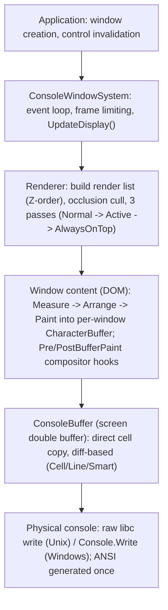

# SharpConsoleUI architecture

How the framework renders, lays out, threads, and stays AOT-safe. This governs
the correctness rules an agent must respect when writing SharpConsoleUI code.

## Rendering pipeline

`ConsoleWindowSystem.Run()` drives a tight main loop (frame-limited, ~60 FPS by
default via `FrameDelayMilliseconds`). Each frame `ProcessOnce()` handles input,
drains queued events, and conditionally renders. Rendering is a multi-stage,
double-buffered pipeline with dirty tracking at three levels (a per-window
`PendingWork` intent accumulator of `Repaint`/`Relayout`, plus per-cell and
per-line dirty tracking) and occlusion culling.

Key components: `ConsoleWindowSystem` (loop + coordinator), `Renderer`
(multi-pass, occlusion), `VisibleRegions` (rectangle subtraction / overlap),
`Window` (content + DOM rebuild), `CharacterBuffer` (per-window cell buffer,
DOM paint target), `ConsoleBuffer` (screen-level double buffer, diff render),
`NetConsoleDriver` (console abstraction, I/O).

Because output is a diff-based cell copy (only changed cells emit ANSI, once at
the end) rather than direct string writes to stdout, redraws stay flicker-free
and cheap — including over SSH, where latency tracks what actually changed, not a
full-screen repaint.

## Compositor

Each window owns its own `CharacterBuffer`. The compositor merges per-window
buffers with occlusion culling and per-cell Porter-Duff **alpha blending**, so
overlapping windows, animated desktop backgrounds, and tween/easing animations
composite cleanly. Gradient backgrounds propagate through transparent controls
automatically. `PreBufferPaint` / `PostBufferPaint` hooks let effects (blur,
fade, custom) run at the window-buffer stage.

## DOM layout system

Layout is a WPF-style two-pass model over a `LayoutNode` tree that mirrors the
control hierarchy:

1. **Build tree** — `LayoutNode` tree mirrors controls.
2. **Measure (bottom-up)** — "how much space do you need?" Controls implement
   `MeasureDOM(LayoutConstraints)` returning desired `LayoutSize`.
3. **Arrange (top-down)** — "here is your final rect."
4. **Paint** — `PaintDOM(buffer, bounds, clipRect, defaultFg, defaultBg)` renders
   to the character buffer at computed positions.

Track sizing (used by `GridControl` / `HorizontalGridControl`) is `GridLength`:
`Cells(n)` fixed, `Auto()` size-to-content, `Star(weight)` proportional share of
leftover space. Star tracks collapse to 0 when measured unbounded (WinUI
contract); set `ContentSizedStars = true` to self-size at measure and fill at
arrange. Cells support `rowSpan`/`colSpan`, `RowGap`/`ColumnGap`, and per-cell
alignment/margin; splitters make columns resizable.

## Threading and async model

The framework is **cooperative single-threaded**: one UI thread (the caller of
`Run()`) owns all rendering and event dispatch.

| Runs ON the UI thread | Runs OFF it |
|---|---|
| Input dispatch (`ProcessKey` / `ProcessMouseEvent`) | `Window.WindowThreadDelegateAsync` (background `Task`) |
| `Button.Click` and other control handlers | `Task.Run(...)` — anything you push off-thread |
| Paint hooks (`PreBufferPaint` / `PostBufferPaint`) | Timers, file watchers, socket receive loops |
| Window lifecycle (`Activated`, `OnResize`) | |
| Actions marshalled via `EnqueueOnUIThread` / `InvokeAsync` | |

Golden rules:

- **Never block the UI thread.** Do not call `.Result` / `.Wait()` /
  `.GetAwaiter().GetResult()` inside a handler. With a UI `SynchronizationContext`
  installed, an awaited continuation is posted back to the UI thread; if that
  thread is blocked waiting on the same task, the continuation never runs and the
  loop deadlocks. A watchdog detects the stall.
- **Marshal UI mutations from background threads** with `EnqueueOnUIThread` /
  `InvokeAsync`. By default (`InstallSynchronizationContext = false`) awaited
  continuations resume on the thread pool, so you marshal back yourself.
- Opt-in `ConsoleWindowSystemOptions.InstallSynchronizationContext = true` makes
  `async` handlers resume on the UI thread automatically (WinForms/WPF model).
  It is off by default so upgrading apps that block on async freeze-then-recover
  instead of deadlocking; it is slated to become the default in a future major
  version, so writing `await`-based handlers now is correct under both.
- Per-window opt-in `WithWindowThreadOnUI(...)` runs a window's async delegate on
  the UI thread (no marshalling needed) but must never block it; use
  `WithAsyncWindowThread` for CPU-bound/blocking work and marshal mutations. A
  window may have only one window thread.
- Most notification events have an async twin `<Name>Async` (delegate
  `AsyncEventHandler<TArgs>`); subscribe to `Click` or `ClickAsync` (or both).
  Prefer async handlers when you need to await I/O: `await task`, not `.Result`.
- Thread checks work regardless of the option: `IsOnUIThread` is the
  `InvokeRequired` analogue (`!IsOnUIThread` ≡ WinForms `InvokeRequired`),
  `VerifyAccess` asserts UI-thread affinity, and `SynchronizationContextInstalled`
  reports the *resolved* async mode after `Run()` starts. The WinForms
  check-then-marshal pattern translates directly:
  `if (!system.IsOnUIThread) system.EnqueueOnUIThread(() => UpdateUI()); else UpdateUI();`

## NativeAOT

The library is marked `<IsAotCompatible>true</IsAotCompatible>` (full trim/AOT
analyzer suite on) and a Release build produces zero `IL` warnings, with no
`[RequiresUnreferencedCode]` / `[RequiresDynamicCode]` in the public surface. CI
publishes a native `AotSmoke` binary (`PublishAot=true`,
`IlcTreatWarningsAsErrors=true`) on every push and runs it headlessly, exercising
the broad control set plus the real AOT-risk paths (`[markdown]`/Markdig, syntax
highlighters, `SpectreRenderableControl`, `ImageControl`/ImageSharp, the
data-binding engine, `[gradient=…]`). Under NativeAOT, expression-tree binding
falls back to the LINQ interpreter rather than `Reflection.Emit`.

Caveats: this guarantees the *library* won't break your AOT publish — your own
reflection/dynamic-code/serialization is still your responsibility.
`HtmlControl` is the one documented AOT exception.
