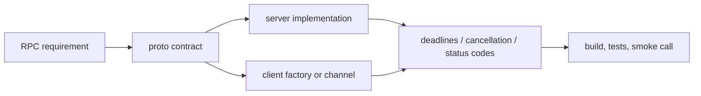

# gRPC for .NET

## Trigger On

- building backend-to-backend RPC services or clients
- adding protobuf contracts, streaming calls, or interceptors
- deciding between gRPC, HTTP APIs, and SignalR
- optimizing gRPC performance, deadlines, cancellation, or connection reuse
- integrating service-to-service communication in microservices

## Do Not Use For

- public browser-first APIs unless gRPC-Web limitations are explicitly acceptable
- SignalR hub design, realtime UI fan-out, or websocket-style client collaboration
- generic ASP.NET Core minimal APIs or REST controllers with no protobuf/RPC requirement
- non-.NET gRPC work unless the user asks for cross-stack contract guidance

## Load References

- [references/patterns.md](references/patterns.md) for proto design, streaming implementations, interceptors, health checks, load balancing, and client factory setup.
- [references/anti-patterns.md](references/anti-patterns.md) for common channel, deadline, streaming, message-size, and exception-handling mistakes.

## Workflow

1. Validate the architecture fit before touching code.
   - prefer gRPC for backend RPC, strong contracts, low-latency calls, or streaming
   - prefer REST or minimal APIs for broad browser compatibility and loosely coupled public APIs
   - prefer SignalR for browser/client realtime fan-out and UI collaboration
2. Treat `.proto` files as the source of truth.
   - keep package names, `csharp_namespace`, service names, and versioning deliberate
   - reserve removed field numbers and avoid reusing tags
   - use wrapper types or explicit messages when optionality matters
3. Choose the RPC shape from the interaction model.
   - unary for request/response
   - server streaming for large or progressive result sets
   - client streaming for uploads or batches
   - bidirectional streaming for coordinated two-way flows
4. Wire server and client behavior together.
   - register services with `AddGrpc`
   - use `AddGrpcClient` or long-lived `GrpcChannel` reuse
   - set deadlines and propagate cancellation
   - convert domain failures to appropriate `RpcException` status codes
5. Add observability and resilience where the boundary justifies it.
   - logging or exception interceptors
   - OpenTelemetry traces and status-code metrics
   - retry policy only for safe idempotent calls
6. Validate with the repo's normal build and tests, plus a focused smoke call when runnable.

## Current Upstream Notes

- `dotnet/aspnetcore` `v10.0.10` is servicing and does not change the gRPC programming model. Keep guidance focused on proto compatibility, streaming shape, deadlines, cancellation, channel reuse, and smoke calls.
- After package servicing updates, regenerate protobuf outputs only when inputs or generator packages actually changed; do not churn generated files as a proxy for validation.



## Examples

Use client factory for normal app integration:

```csharp
builder.Services.AddGrpcClient<Greeter.GreeterClient>(options =>
{
    options.Address = new Uri("https://localhost:5001");
});
```

Always set a deadline and pass cancellation:

```csharp
var response = await client.SayHelloAsync(
    new HelloRequest { Name = name },
    deadline: DateTime.UtcNow.AddSeconds(5),
    cancellationToken: cancellationToken);
```

For streaming, check cancellation inside the read/write loop and keep message sizes bounded. Load [references/patterns.md](references/patterns.md) before writing detailed streaming code.

## Anti-Patterns

- creating a new `GrpcChannel` per call
- omitting deadlines and relying only on client-side cancellation
- ignoring `ServerCallContext.CancellationToken` in streaming handlers
- sending large single messages instead of chunking or streaming
- using gRPC as the default public browser API
- swallowing exceptions inside interceptors
- retrying non-idempotent calls without explicit policy

## Deliver

- stable protobuf contracts and generated-code ownership
- service and client code that match the RPC shape
- explicit deadline, cancellation, retry, and status-code behavior
- tests or smoke checks for serialization and call behavior
- documentation of browser, transport, or deployment constraints when relevant

## Validate

- `dotnet build` succeeds after contract or generated-code changes
- tests or smoke checks exercise at least one server/client call
- streaming methods respect cancellation and bounded message sizes
- channels are reused through client factory or a long-lived channel
- status-code handling is intentional and observable
- browser constraints are documented if gRPC-Web is involved
