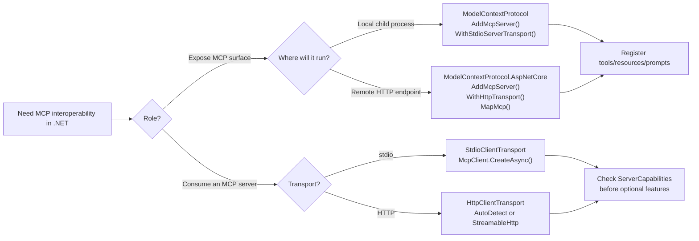

# MCP C# SDK for .NET

## Trigger On

- building or consuming MCP servers from a .NET application or library
- choosing between stdio and HTTP transport for MCP
- exposing tools, resources, prompts, completions, or logging to an MCP host
- connecting a .NET app to an existing MCP server and passing discovered tools into `IChatClient`
- bootstrapping a minimal MCP client/server from the `.NET AI` quickstarts or publishing a server to the MCP Registry
- implementing capability-aware flows such as roots, sampling, elicitation, subscriptions, or session resumption

## Use This Skill Instead Of

- Use `dotnet-mcp` when **protocol interoperability** is the requirement.
- Use `dotnet-microsoft-extensions-ai` when you only need model/provider abstraction or local tool orchestration without the MCP wire protocol.
- Use `dotnet-microsoft-agent-framework` when the main problem is agent orchestration; combine it with `dotnet-mcp` only when those agents must consume or expose MCP endpoints.
- Use the `.NET AI` quickstarts for the very first vertical slice, then come back here to harden transport, capability negotiation, publishing, and host interoperability.

## Documentation

- [MCP C# SDK overview](https://csharp.sdk.modelcontextprotocol.io/)
- [Getting Started](https://csharp.sdk.modelcontextprotocol.io/concepts/getting-started.html)
- [API reference](https://csharp.sdk.modelcontextprotocol.io/api/ModelContextProtocol.html)
- [Conceptual docs](https://csharp.sdk.modelcontextprotocol.io/concepts/index.html)
- [Versioning policy](https://csharp.sdk.modelcontextprotocol.io/versioning.html)
- [Experimental APIs](https://csharp.sdk.modelcontextprotocol.io/experimental.html)
- [MCP C# SDK repository](https://github.com/modelcontextprotocol/csharp-sdk)
- [Model Context Protocol specification](https://modelcontextprotocol.io/specification/)

## References

Load only what the task needs:

- [`references/patterns.md`](references/patterns.md) - current server/client patterns, transports, capabilities, filters, and chat-client integration
- [`references/security.md`](references/security.md) - safe error handling, auth boundaries, stdio logging hygiene, and defensive tool/resource patterns

## Package Selection

| Package | Choose when |
|---------|-------------|
| `ModelContextProtocol.Core` | You only need a client or low-level server APIs and want the smallest dependency set. |
| `ModelContextProtocol` | You want the main SDK package with hosting, DI, attribute discovery, and stdio server support. Start here for most projects. |
| `ModelContextProtocol.AspNetCore` | You are hosting a remote MCP server in ASP.NET Core over HTTP. This includes the main package. |

## Transport Selection

| Transport | Use when | Notes |
|-----------|----------|-------|
| `StdioClientTransport` / `WithStdioServerTransport()` | The MCP server should run as a local child process. | Best for local tooling and editor/agent integrations. |
| `HttpClientTransport` + `HttpTransportMode.StreamableHttp` | The server is remote or should be reachable over HTTP. | Recommended HTTP transport; supports streaming and session resumption. |
| `HttpTransportMode.Sse` | You must connect to an older SSE-only server. | Legacy compatibility only; do not choose this for new servers. |



## Workflow

1. Pick the package and transport first.
   - Local child-process server: `ModelContextProtocol` + `WithStdioServerTransport()`.
   - Remote server: `ModelContextProtocol.AspNetCore` + `WithHttpTransport()` + `MapMcp()`.
   - Client-only app: start with `ModelContextProtocol` or `ModelContextProtocol.Core`.
   - Registry distribution: pair a minimal server with the MCP Registry publishing flow only after the server contract is stable.

2. Model the MCP surface explicitly.
   - Tools: `[McpServerToolType]` + `[McpServerTool]`
   - Resources: `[McpServerResourceType]` + `[McpServerResource]`
   - Prompts: `[McpServerPromptType]` + `[McpServerPrompt]`
   - Use custom handlers or filters only for cross-cutting behavior, protocol extensions, or advanced routing.

3. Prefer attribute discovery for straightforward servers.

```csharp
using Microsoft.Extensions.DependencyInjection;
using Microsoft.Extensions.Hosting;
using Microsoft.Extensions.Logging;
using ModelContextProtocol.Server;
using System.ComponentModel;

var builder = Host.CreateApplicationBuilder(args);
builder.Logging.AddConsole(options =>
{
    options.LogToStandardErrorThreshold = LogLevel.Trace;
});

builder.Services
    .AddMcpServer()
    .WithStdioServerTransport()
    .WithToolsFromAssembly();

await builder.Build().RunAsync();

[McpServerToolType]
public static class EchoTool
{
    [McpServerTool, Description("Echoes the message back to the client.")]
    public static string Echo(string message) => $"hello {message}";
}
```

4. For HTTP servers, use the ASP.NET Core transport and map the endpoint directly.

```csharp
using ModelContextProtocol.Server;
using System.ComponentModel;

var builder = WebApplication.CreateBuilder(args);

builder.Services
    .AddMcpServer()
    .WithHttpTransport()
    .WithToolsFromAssembly();

var app = builder.Build();
app.MapMcp("/mcp");
app.Run();

[McpServerToolType]
public static class EchoTool
{
    [McpServerTool, Description("Echoes the message back to the client.")]
    public static string Echo(string message) => $"hello {message}";
}
```

5. When consuming a server, use `McpClient.CreateAsync(...)` and stay capability-aware.

```csharp
using ModelContextProtocol.Client;
using ModelContextProtocol.Protocol;

var transport = new StdioClientTransport(new StdioClientTransportOptions
{
    Name = "Everything",
    Command = "npx",
    Arguments = ["-y", "@modelcontextprotocol/server-everything"],
});

await using var client = await McpClient.CreateAsync(transport);

IList<McpClientTool> tools = await client.ListToolsAsync();

if (client.ServerCapabilities.Prompts is not null)
{
    var prompts = await client.ListPromptsAsync();
}
```

6. Treat optional features as negotiated capabilities, not assumptions.
   - Client capabilities: configure `McpClientOptions.Capabilities` for roots, sampling, and elicitation.
   - Server capabilities are inferred from registered features.
   - Check `client.ServerCapabilities` before using completions, logging, prompt list-change notifications, or resource subscriptions.
   - Use `client.NegotiatedProtocolVersion` or `server.NegotiatedProtocolVersion` only when version-specific behavior matters.

7. Keep HTTP guidance current.
   - Streamable HTTP is the recommended transport for remote servers.
   - `MapMcp()` also serves SSE compatibility endpoints for older clients.
   - HTTP clients can use `AutoDetect` by default, or force `StreamableHttp` / `Sse`.
   - Session resumption is available for Streamable HTTP through `McpClient.ResumeSessionAsync(...)`.

8. Treat the `.NET AI` MCP quickstarts as bootstrap examples.
   - `build-mcp-client` and `build-mcp-server` are good starting points when the surrounding app is still MEAI-centric.
   - `publish-mcp-registry` is the distribution step, not the design step. Stabilize the protocol surface before publishing.

9. Respect current error and serialization rules.
   - Tool exceptions normally come back as `CallToolResult.IsError == true`.
   - Throw `McpProtocolException` only for protocol-level JSON-RPC failures.
   - `McpClientTool` inherits from `AIFunction`, so discovered tools can be passed directly into `IChatClient`.
   - Experimental APIs use `MCPEXP...` diagnostics; suppress them intentionally, not globally by accident.
   - If you use a custom `JsonSerializerContext`, prepend `McpJsonUtilities.DefaultOptions.TypeInfoResolver` so MCP protocol types keep the SDK's contract.

## Anti-Patterns To Avoid

| Anti-pattern | Why it causes trouble | Better approach |
|--------------|-----------------------|-----------------|
| Picking HTTP transport for a purely local child-process scenario | Adds unnecessary hosting, auth, and deployment surface | Use stdio for local/editor-hosted integrations |
| Treating SSE as the default remote transport | Locks new work to legacy behavior | Prefer Streamable HTTP and keep SSE only for backward compatibility |
| Writing tools without `[Description]` metadata | Hosts and models lose schema clarity | Describe tool purpose and parameters explicitly |
| Returning huge binary/text payloads from every tool call | Bloats context and slows hosts | Return focused content and move large data to resources |
| Logging to stdout on stdio servers | Corrupts the protocol stream | Send logs to stderr |
| Assuming prompts/resources/logging/completions exist | Breaks against partial implementations | Check negotiated capabilities first |
| Using filters for normal business logic | Makes handlers opaque and hard to reason about | Keep filters for cross-cutting policy, audit, or protocol plumbing |

## Deliver

- a correctly packaged MCP server or client that matches the deployment topology
- explicit tool/resource/prompt definitions with descriptions and bounded payloads
- capability-aware handling for optional MCP features
- validation notes for transport, auth boundary, and host/client interoperability

## Validate

- chosen package matches the topology: `Core`, `ModelContextProtocol`, or `AspNetCore`
- stdio servers do not write logs or diagnostics to stdout
- HTTP servers use `MapMcp()` and are tested at the final route, for example `/mcp`
- tools, resources, and prompts use current `[McpServer*]` attributes or documented handler/filter alternatives
- client code checks `ServerCapabilities` before using subscriptions, completions, logging, or prompt/resource list-change flows
- Streamable HTTP is the default for new remote servers; SSE is used only for legacy compatibility
- experimental APIs and custom serialization settings are reviewed intentionally rather than copied blindly
