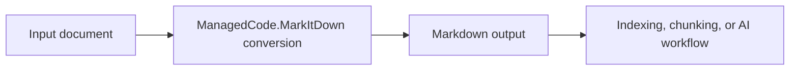

# ManagedCode.MarkItDown

## Trigger On

- integrating `ManagedCode.MarkItDown` into document ingestion flows
- converting office or rich-text content into Markdown for downstream processing
- reviewing indexing, chunking, or AI-preparation pipelines that depend on Markdown output
- documenting file-conversion steps for a .NET application

## Workflow

1. Identify the document sources the app actually handles.
2. Decide where Markdown conversion belongs in the pipeline:
   - before indexing
   - before chunking
   - before AI summarization or enrichment
3. Keep conversion isolated behind one ingestion or processing service instead of scattering format handling everywhere.
4. Validate real converted output for structure, links, headings, and attachment handling.
5. Document which downstream stage depends on the produced Markdown.

## Deliver

- guidance on where ManagedCode.MarkItDown fits in a real processing pipeline
- conversion-boundary recommendations for application design
- output-validation expectations for document ingestion

## Validate

- the converted Markdown is good enough for the actual downstream consumer
- conversion is isolated in one clear pipeline step
- tests or review samples cover the real input formats the application claims to support
