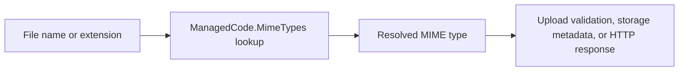

# ManagedCode.MimeTypes

## Trigger On

- integrating `ManagedCode.MimeTypes` into upload or download flows
- mapping file extensions to content types in APIs or background processing
- reviewing content-type handling for files, blobs, or attachments
- documenting a reusable MIME-type decision point in a .NET application

## Install

```bash
dotnet add package ManagedCode.MimeTypes --version 10.0.9
```

Use `PackageReference` when the repository centralizes dependency versions:

```xml
<PackageReference Include="ManagedCode.MimeTypes" Version="10.0.9" />
```

The current package targets .NET 8, 9, and 10. Keep the version in the repository's existing central package-management file when one is present.

## Workflow

1. Identify where the application needs stable MIME-type decisions:
   - upload validation
   - download response headers
   - storage metadata
   - attachment processing
2. Centralize content-type mapping instead of scattering ad-hoc string tables across the codebase.
3. Use one library boundary for extension and MIME lookups.
4. Validate the extensions and media types that matter to the product.
5. Document any product-specific overrides separately from the library defaults.

## Read MIME Metadata

Map file names, URLs, and compound extensions through the generated catalog:

```csharp
using ManagedCode.MimeTypes;

var reportType = MimeHelper.GetMimeType("report.pdf");
var archiveType = MimeHelper.GetMimeType("archive.tar.gz");
var imageType = MimeHelper.GetMimeType("https://cdn.example.test/avatar.png?v=2");
var jpegExtensions = MimeHelper.GetExtensions("image/jpeg");
```

Use registry metadata when the application needs provenance or registration details:

```csharp
if (MimeHelper.TryGetMimeTypeInfoByExtension("report.pdf", out var info))
{
    Console.WriteLine($"{info.Mime} registered={info.IsIanaRegistered}");
}
```

## Write Application Mappings

Register product-specific mappings at startup and remove them only when the owning application lifecycle requires it:

```csharp
MimeHelper.RegisterMimeType("acme", "application/x-acme");
var customType = MimeHelper.GetMimeType("invoice.acme");

MimeHelper.UnregisterMimeType("acme");
```

Runtime registrations affect extension and reverse lookup, but do not synthesize full IANA registry metadata.

## Validate Upload Content

Treat the extension and declared content type as claims. Inspect the signature before accepting security-sensitive uploads:

```csharp
using var stream = upload.OpenReadStream();

if (!MimeHelper.MatchesMimeTypeByContent(stream, upload.ContentType) ||
    !MimeHelper.MatchesExtensionByContent(upload.FileName, stream))
{
    throw new InvalidOperationException("Upload content does not match its declared type.");
}
```

`GetMimeTypeByContent` and the `Matches*ByContent` helpers inspect known prefixes and restore the position of seekable streams. They are not full document parsers, malware scanners, or proof that the remainder of a file is valid.

## Settings and Tradeoffs

- Unknown extensions resolve to `MimeHelper.DefaultMimeType`, initially `application/octet-stream`; use `SetDefaultMimeType` only when the whole application owns a different fallback contract.
- Prefer `MimeHelper.Instance` through `IMimeHelper` when dependency injection and test substitution are useful; use static calls for small, deterministic mapping boundaries.
- The `10.0.9` release refreshes the generated MIME database. It adds mappings such as `1clr`, `aion`, `ccr`, `did`, `ignition`, `jumbf`, and `zst`, changes mappings including `3dm`, `bpd`, `frm`, and `wv`, and removes stale entries. Re-run product-specific mapping tests because preferred mappings can change without an API change.
- Never trust MIME classification alone for authorization, file execution, archive extraction, or active-content rendering.



## Deliver

- guidance on where MIME lookup belongs in application code
- recommendations for centralized content-type decisions
- validation expectations for real file types used by the product

## Validate

- MIME mapping is not duplicated across multiple services or controllers
- important file types are verified explicitly
- response or storage code uses the resolved type consistently
- `dotnet restore` resolves `ManagedCode.MimeTypes` `10.0.9` or the repository-approved newer version
- focused tests cover known extensions, unknown fallbacks, reverse lookup, upload signature mismatches, and any runtime registrations
- `dotnet test` passes for the projects that own upload, download, or storage behavior
