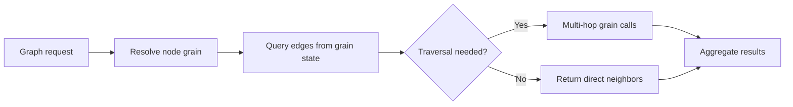

# ManagedCode.Orleans.Graph

## Trigger On

- integrating `ManagedCode.Orleans.Graph` into an Orleans-based system
- modeling graph relationships, edges, or traversal behavior with Orleans grains
- reviewing graph-oriented distributed workflows on top of Orleans
- deciding whether a graph abstraction is the right fit vs relational modeling

## Workflow

1. **Install the library:**
   ```bash
   dotnet add package ManagedCode.Orleans.Graph
   ```
2. **Confirm the application has a real graph problem** — node-to-node relationships, directed/undirected edges, or traversal queries. If the data is tabular or hierarchical, prefer standard Orleans grain patterns instead.
3. **Model graph entities as grains:**
   - nodes map to grain identities
   - edges represent relationships between grains
   - traversal operations query across grain boundaries
4. **Implement graph operations:**
   ```csharp
   // Define a graph grain interface
   public interface IGraphGrain : IGrainWithStringKey
   {
       Task AddEdge(string targetId, string edgeType);
       Task<IReadOnlyList<string>> GetNeighbors(string edgeType);
       Task<bool> HasEdge(string targetId, string edgeType);
       Task RemoveEdge(string targetId, string edgeType);
   }
   ```
5. **Keep Orleans runtime concerns explicit:**
   - grain identity determines the node identity
   - persistence provider stores edge state
   - grain activation lifecycle affects traversal latency
6. **Add traversal logic for multi-hop queries:**
   ```csharp
   // Breadth-first traversal across grains
   public async Task<IReadOnlyList<string>> TraverseAsync(
       IGrainFactory grainFactory, string startId, string edgeType, int maxDepth)
   {
       var visited = new HashSet<string>();
       var queue = new Queue<(string Id, int Depth)>();
       queue.Enqueue((startId, 0));

       while (queue.Count > 0)
       {
           var (currentId, depth) = queue.Dequeue();
           if (!visited.Add(currentId) || depth >= maxDepth) continue;

           var grain = grainFactory.GetGrain<IGraphGrain>(currentId);
           var neighbors = await grain.GetNeighbors(edgeType);
           foreach (var neighbor in neighbors)
               queue.Enqueue((neighbor, depth + 1));
       }
       return visited.ToList();
   }
   ```
7. **Validate** that traversal and relationship operations work against real Orleans clusters, not only unit tests with mock grain factories.



## Deliver

- concrete guidance on when Orleans.Graph is the right abstraction vs standard grain patterns
- graph grain interface patterns with edge management
- traversal implementation that respects Orleans distributed execution
- verification expectations for real graph flows

## Validate

- the application has a genuine graph problem, not a generic relational one
- graph integration does not blur grain identity and traversal concerns
- edge persistence is configured for the correct Orleans storage provider
- traversal operations are tested against a real Orleans cluster, not only mocks
- multi-hop queries have bounded depth to prevent runaway grain activations
