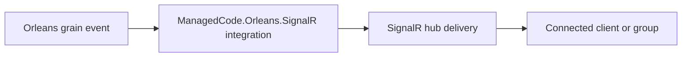

# ManagedCode.Orleans.SignalR

## Trigger On

- integrating `ManagedCode.Orleans.SignalR` into a real-time distributed application
- coordinating SignalR delivery from Orleans grains
- reviewing grain-to-hub push flows and connection routing
- documenting how Orleans state or events become SignalR messages

## Workflow

1. Confirm the application genuinely needs both Orleans and SignalR in the same flow.
2. Identify which grain events or workflows should publish to connected clients.
3. Keep Orleans domain logic in grains and SignalR transport concerns in the integration boundary.
4. Document how user, group, or connection targeting is resolved.
5. Validate end-to-end message delivery from grain event to connected client.

## Deliver

- guidance on where the Orleans-to-SignalR bridge belongs
- separation between grain logic and transport concerns
- validation expectations for real-time distributed delivery

## Validate

- the integration is justified instead of mixing Orleans and SignalR casually
- grain logic stays focused on domain or orchestration concerns
- real-time delivery is verified end to end, not only through registration code
