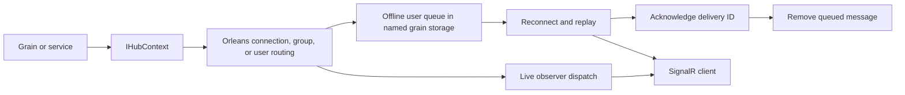

# ManagedCode.Orleans.SignalR

## Trigger On

- configuring an Orleans SignalR backplane or sending messages from grains
- diagnosing connection, group, or user routing across hosts
- upgrading offline delivery, heartbeat persistence, or client invocation handling

## Install

For a host that runs both the silo and SignalR endpoint:

```bash
dotnet add package ManagedCode.Orleans.SignalR.Server --version 10.3.0
dotnet add package ManagedCode.Orleans.SignalR.Client --version 10.3.0
```

For separate hosts, put Server on the silo and Client on the ASP.NET Core endpoint. Core supplies shared contracts transitively. Keep versions and partition options aligned across participants; preserve central package management when present.

## Configure the Backplane

A combined local development host can use the memory provider:

```csharp
using ManagedCode.Orleans.SignalR.Server.Extensions;
using Microsoft.AspNetCore.SignalR;

var builder = WebApplication.CreateBuilder(args);
builder.Host.UseOrleans(silo =>
{
    silo.UseLocalhostClustering();
    silo.ConfigureOrleansSignalR();
    silo.AddOrleansSignalRInMemoryStorage();
});
builder.Services.AddSignalR().AddOrleans(options =>
{
    options.ConnectionPartitionCount = 4;
    options.GroupPartitionCount = 4;
    options.KeepMessageInterval = TimeSpan.FromMinutes(5);
    options.MaxQueuedMessagesPerUser = 100;
});

var app = builder.Build();
app.MapHub<UpdatesHub>("/updates");
app.Run();

public sealed class UpdatesHub : Hub { }
```

Import only `Server.Extensions` for this combined host; a separate client-only endpoint uses `Client.Extensions`. Importing both makes `AddOrleans` ambiguous. Use authenticated hub endpoints and the application's existing cluster discovery in deployed environments. The memory provider does not survive silo restarts. When offline delivery must survive restarts, register a durable Orleans grain-storage provider under `OrleansSignalROptions.OrleansSignalRStorage` instead of the memory helper. Connection metadata, queued messages, heartbeat registrations, and invocation state use this named store.

## Send and Receive Updates

Inject `IHubContext<UpdatesHub>` into the grain or application service that owns the event:

```csharp
using Microsoft.AspNetCore.SignalR;

public sealed class UpdatePublisher(IHubContext<UpdatesHub> hub)
{
    public Task NotifyUserAsync(string userId, string eventId, string text) =>
        hub.Clients.User(userId).SendAsync("Updated", eventId, text);

    public Task NotifyGroupAsync(string group, string eventId, string text) =>
        hub.Clients.Group(group).SendAsync("Updated", eventId, text);
}
```

Register a receiver before starting the connection. This example uses the application's `@microsoft/signalr` client:

```javascript
import { HubConnectionBuilder } from '@microsoft/signalr';

const connection = new HubConnectionBuilder()
  .withUrl('/updates')
  .withAutomaticReconnect()
  .build();

connection.on('Updated', (eventId, text) => {
  renderUpdate(eventId, text); // Application-owned rendering and deduplication.
});
await connection.start();
```

Derive `userId` and permitted group membership from authenticated application identity. Never treat a client-supplied user or group name as authorization. Keep domain state in the owning grain; the backplane transports notifications about that state.

## Delivery and Upgrade Boundaries

- `10.3.0` persists queued offline user messages with delivery IDs and expiry, removing them after acknowledgement. Successful dispatch or queue storage is not proof that the browser applied the update; use application event IDs and idempotent handlers when replay matters.
- `KeepMessageInterval` bounds offline retention. `MaxQueuedMessagesPerUser` defaults to 100 and discards oldest entries when exceeded. Test expiry and overflow explicitly; offline queues are not an unlimited event log.
- `KeepEachConnectionAlive` renews a bounded heartbeat lease. Disabling it relies on ordinary observer/activation lifecycle; it does not make disconnected observers immortal. Test clean disconnect and abrupt host loss independently.
- Observer failure thresholds, grace-period buffering, and circuit-breaker options affect retries and cleanup. Set them from measured reconnect behavior and watch drop/failure metrics.
- Internal persisted `HubMessageState` changed from a dictionary to a `QueuedHubMessage` list, and `ISignalRInvocationGrain.WaitForCompletion` now returns a cancellation-aware `IAsyncEnumerable<CqrsStreamChunk<InvocationProgress, CompletionMessage>>`. Applications using these lower-level contracts must validate serialization and mixed-version compatibility before rolling upgrades.
- A storage write failure must remain observable. Test retry and reactivation with the actual configured serializer and storage provider; an in-memory-only test does not prove durable recovery.



## Workflow

1. Choose combined or separate silo/endpoint hosts and align packages, clustering, partition options, and named storage.
2. Configure authenticated connection, user, and group targeting.
3. Keep publishing at an explicit domain-event boundary and decide whether bounded offline retention is sufficient.
4. Exercise live delivery, reconnect replay, queue limits, heartbeat cleanup, and interrupted client invocations.
5. Before upgrades, validate prior persisted payloads with the production serializer and choose an explicit compatibility or maintenance-window strategy.

## Deliver

- configured backplane and named storage with a stated durability boundary
- a working publisher and client receiver
- evidence for the required live, offline, restart, and failure behavior

## Validate

- `dotnet restore` and `dotnet build` resolve the aligned package set
- a real connected client receives a grain-originated message on another host
- user/group isolation, reconnect, queue expiry/overflow, and heartbeat cleanup work
- restart tests preserve queued messages only when durable storage is configured
- cancellation and missing-client completion terminate predictably
- tests keep unrelated cases parallel; isolate destructive restart tests by their owned cluster

## Sources

- [Upstream setup and configuration](https://github.com/managedcode/Orleans.SignalR)
- [10.3.0 release](https://github.com/managedcode/Orleans.SignalR/releases/tag/v10.3.0)
- [Durable delivery changes](https://github.com/managedcode/Orleans.SignalR/commit/407e834)
- [Connection lifecycle changes](https://github.com/managedcode/Orleans.SignalR/commit/921218c)
