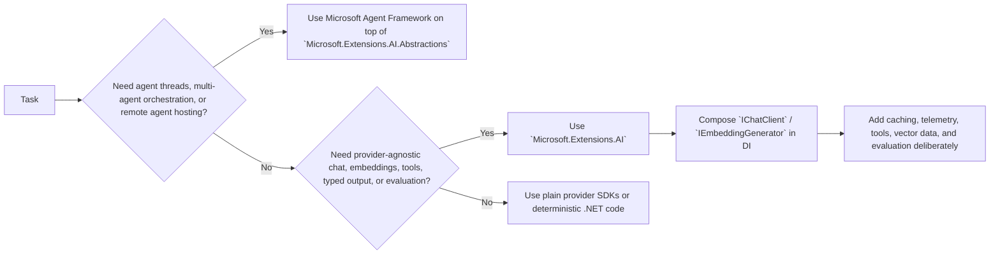

# Microsoft.Extensions.AI

## Trigger On

- building or reviewing `.NET` code that uses `Microsoft.Extensions.AI`, `Microsoft.Extensions.AI.Abstractions`, `IChatClient`, `IEmbeddingGenerator`, `ChatOptions`, or `AIFunction`
- adding `IImageGenerator`, local-model chat via Ollama, AI app templates, or the `.NET AI` quickstarts for assistants and MCP
- choosing between low-level AI abstractions, provider SDKs, vector-search composition, evaluation libraries, and a fuller agent framework
- adding streaming chat, structured output, embeddings, tool calling, telemetry, caching, or DI-based AI middleware
- wiring `Microsoft.Extensions.VectorData`, `Microsoft.Extensions.DataIngestion`, MCP tooling, or evaluation packages around a provider-agnostic AI app

## Workflow

1. Classify the request first: plain model access, tool calling, embeddings/vector search, evaluation, image generation, local-model prototyping, MCP bootstrap, or true agent orchestration.
2. Default to `Microsoft.Extensions.AI` for application and service code that needs provider-agnostic chat, embeddings, middleware, structured output, and testability.
3. Reference `Microsoft.Extensions.AI.Abstractions` directly only when authoring provider libraries or lower-level reusable integration packages.
4. Model `IChatClient` and `IEmbeddingGenerator` composition explicitly in DI. Keep options, caching, telemetry, logging, and tool invocation inspectable in the pipeline.
5. Treat chat state deliberately. For stateless providers, resend history. For stateful providers, propagate `ConversationId` rather than assuming all providers behave the same way.
6. Use `Microsoft.Extensions.VectorData` and `Microsoft.Extensions.DataIngestion` as adjacent building blocks for RAG instead of hand-rolling store abstractions prematurely. Model ingestion as an explicit reader -> processor -> chunker -> writer pipeline when the document-preparation path matters.
7. Treat the `.NET AI` quickstarts as bootstrap paths, not finished architecture. They now cover minimal assistants, MCP client/server flows, local models, app templates, and image generation. Start there for a vertical slice, then harden the DI, telemetry, and evaluation story here.
8. Escalate to `dotnet-microsoft-agent-framework` when the requirement becomes agent threads, multi-agent orchestration, higher-order workflows, durable execution, or remote agent hosting.
9. Validate with real providers, realistic prompts, and evaluation gates so the abstraction layer actually buys portability and reliability.

## Architecture

## Core Knowledge

- `Microsoft.Extensions.AI.Abstractions` contains the core exchange contracts such as `IChatClient`, `IEmbeddingGenerator<TInput, TEmbedding>`, message/content types, and tool abstractions.
- `Microsoft.Extensions.AI` adds the higher-level application surface: middleware builders, automatic function invocation, caching, logging, and OpenTelemetry integration.
- Most apps and services should reference `Microsoft.Extensions.AI`; provider and connector libraries usually reference only the abstractions package.
- `IChatClient` centers on `GetResponseAsync` and `GetStreamingResponseAsync`. The returned `ChatResponse` or `ChatResponseUpdate` objects carry messages, tool-related content, metadata, and optional conversation identifiers.
- Local-model quickstarts still route through the same `IChatClient` abstraction. Ollama-backed clients are useful for low-cost prototyping, offline dev loops, and portability testing, but you still own chat history replay, latency, and model-quality tradeoffs.
- `ChatOptions` is the normal control plane for model ID, temperature, tools, `AdditionalProperties`, and provider-specific raw options.
- Tool calling is modeled with `AIFunction`, `AIFunctionFactory`, and `FunctionInvokingChatClient`. Ambient data can flow through closures, `AdditionalProperties`, `AIFunctionArguments.Context`, or DI.
- Tool calling can target local .NET methods, external APIs, or MCP-backed tools. The model requests calls; your app still owns execution, validation, and side-effect boundaries.
- Tool definitions consume request tokens. Keep tool descriptions short and register only the tools relevant for the current conversation or workflow.
- `FunctionInvokingChatClient` can handle the tool-invocation loop and parallel tool-call responses automatically when the provider/model supports that shape.
- `IEmbeddingGenerator` is the standard abstraction for semantic search, vector indexing, similarity, and cache-key generation. Pair it with `Microsoft.Extensions.VectorData.Abstractions` for vector store operations.
- `IImageGenerator` is the experimental MEAI image surface. Treat `MEAI001` as an intentional opt-in, keep image generation separate from chat concerns, and compose logging/caching/hosting middleware around it the same way you would for `IChatClient`.
- `Microsoft.Extensions.DataIngestion` gives you the document-side RAG pipeline: `IngestionDocument`, document readers like MarkItDown/Markdig, document processors such as `ImageAlternativeTextEnricher`, chunkers, chunk processors, `VectorStoreWriter<T>`, and `IngestionPipeline<T>` for end-to-end composition.
- `IngestionPipeline<T>.ProcessAsync` is partial-success oriented. Handle `IAsyncEnumerable<IngestionResult>` deliberately instead of assuming one failed document should automatically crash the whole ingestion run.
- `Microsoft.Extensions.AI.Evaluation.*` gives you quality, NLP, safety, caching, and reporting layers for regression checks and CI gates.
- The official `.NET AI` docs now make MCP, assistants, local models, templates, and text-to-image part of the same app-level story. Use `dotnet-mcp` when the protocol itself becomes the design problem; stay here when you still mostly need app composition around `IChatClient` and friends.
- `Microsoft Agent Framework` builds on these abstractions. Use it when you need autonomous orchestration, threads, workflows, hosting, or multi-agent collaboration instead of just model composition.

## Decision Cheatsheet

| If you need | Default choice | Why |
|---|---|---|
| App-level provider abstraction with middleware | `Microsoft.Extensions.AI` | Highest leverage for apps and services |
| A reusable provider or connector library | `Microsoft.Extensions.AI.Abstractions` | Keeps your package at the contract layer |
| Typed chat or UI streaming | `IChatClient` with `GetResponseAsync` / `GetStreamingResponseAsync` | Common request/response shape across providers |
| Tool calling from .NET methods | `AIFunction` + `FunctionInvokingChatClient` | Native function metadata and invocation pipeline |
| Typed structured output | `IChatClient.GetResponseAsync<T>` extensions | Keeps schema intent in code instead of prompt parsing |
| Vector search or RAG | `IEmbeddingGenerator` + `Microsoft.Extensions.VectorData.Abstractions` | Standardizes embeddings and store access |
| Local model prototyping | `IChatClient` with an Ollama-backed implementation | Keeps the app on the MEAI abstractions while you validate prompts or UX locally |
| Text-to-image or image-generation middleware | `IImageGenerator` | Use the dedicated image abstraction instead of overloading chat APIs |
| Evaluation and regression gates | `Microsoft.Extensions.AI.Evaluation.*` | Relevance, safety, task adherence, caching, reports |
| Agent threads or multi-step autonomous orchestration | `dotnet-microsoft-agent-framework` | This is beyond plain provider abstraction |

## Common Failure Modes

- Referencing only `Microsoft.Extensions.AI.Abstractions` in an app and then rebuilding middleware, telemetry, or function invocation by hand.
- Treating `IChatClient` as if it already gives you durable agent threads, orchestration, or hosted-agent semantics.
- Mixing provider-specific assistants APIs with `IChatClient` as if they were the same runtime contract.
- Forgetting to distinguish stateless history replay from stateful `ConversationId` flows.
- Hiding important chat behavior in singleton service fields instead of explicit message history, options, or persistent storage.
- Adding tool calling without validating parameter binding, invalid input behavior, side effects, or DI-scoped dependencies.
- Building RAG without stable chunking, embedding-model/version tracking, or vector dimension discipline.
- Shipping AI features without evaluation baselines, safety checks, or telemetry for prompt/model drift.

## Deliver

- a justified package and abstraction choice: `Abstractions` only vs full `Microsoft.Extensions.AI`
- a concrete `IChatClient` / `IEmbeddingGenerator` composition strategy
- explicit tool-calling, options, state, caching, logging, and telemetry decisions
- vector-search, evaluation, or MCP integration guidance when the scenario needs it
- a clear escalation path to Agent Framework when the problem exceeds provider abstraction

## Validate

- the abstraction layer solves a real portability, testability, or composition problem
- provider registration and middleware order stay explicit in DI
- chat state management matches whether the provider is stateless or stateful
- structured output, tool invocation, and embedding flows are typed and observable
- vector store, embedding model, and chunking strategy are consistent
- evaluation or safety gates exist for important prompts and agent-like behaviors
- agentic requirements are not being under-modeled as a simple `IChatClient` integration

When exact wording, edge-case API behavior, or less-common examples matter, check the local official docs snapshot before relying on summaries.

## References

- [official-docs-index.md](references/official-docs-index.md) - Slim local snapshot map with direct links to every mirrored `.NET AI` docs page plus API-reference pointers
- [patterns.md](references/patterns.md) - Package choice, `IChatClient`, embeddings, DI pipelines, tool-calling, and Agent Framework escalation guidance
- [examples.md](references/examples.md) - Quickstart-to-task map covering chat, structured output, function calling, vector search, local models, MCP, and assistants
- [evaluation.md](references/evaluation.md) - Quality, NLP, safety, caching, reporting, and CI-oriented evaluation guidance
