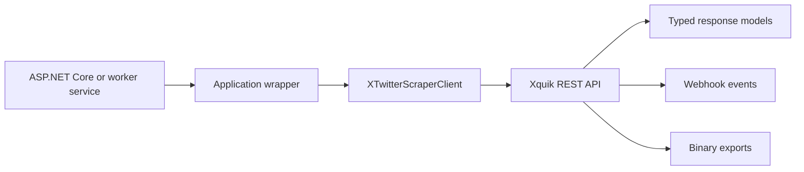

# XTwitterScraper

## Trigger On

- adding the `XTwitterScraper` NuGet package to a .NET application
- searching tweets, reading tweet/user data, running extraction jobs, or monitoring X accounts through Xquik from .NET
- posting tweets, replies, likes, reposts, follows, or DMs through typed SDK methods
- exporting extraction results, handling raw responses, retries, rate limits, or API errors
- wiring Xquik webhook events into ASP.NET Core, workers, queues, or background processing

## Workflow

1. Confirm the project actually needs Xquik API access from .NET. If it only needs prompt guidance, use a generic agent or API-design skill instead.
2. Install the NuGet package:

   ```bash
   dotnet add package XTwitterScraper
   ```

3. Configure credentials through environment or secret storage. Prefer `X_TWITTER_SCRAPER_API_KEY`; keep `X_TWITTER_SCRAPER_BASE_URL` at its default unless a test fixture intentionally overrides it.
4. Create `XTwitterScraperClient` at the composition boundary and inject it or a narrow wrapper into application services. Do not scatter client construction across handlers.
5. Build typed `Params` objects for SDK calls instead of manually concatenating query strings.
6. Treat paginated responses, extraction jobs, binary exports, and webhook events as different flow types. Do not force them through one generic helper.
7. Preserve typed exceptions. Catch `XTwitterScraperRateLimitException`, authorization errors, and 5xx errors only where the application can retry, defer, or show a useful state.
8. Validate with unit tests around your wrapper and integration tests with configured API credentials only when the environment explicitly provides them.

## Architecture



## Core Knowledge

- `XTwitterScraperClient` reads `X_TWITTER_SCRAPER_API_KEY`, `X_TWITTER_SCRAPER_BEARER_TOKEN`, and `X_TWITTER_SCRAPER_BASE_URL` from the environment, and can also be configured manually.
- The default API base URL is `https://xquik.com/api/v1`.
- Common read paths include tweet search, tweet detail, user search, user detail, profile tweets, followers, trends, monitors, and extraction jobs.
- Common write paths include tweet creation, replies, likes, reposts, follows, DMs, media upload, and giveaway draw actions.
- Request methods use typed `Params` classes, such as `TweetSearchParams`, and return typed response models such as paginated tweets.
- Binary export methods return `HttpResponse`; copy the stream deliberately instead of assuming JSON deserialization.
- Raw response access is available through `WithRawResponse` when code needs status, headers, or raw body inspection.
- `WithOptions` can override client options for one call without mutating the original client or service.
- The SDK retries selected transient failures by default. Do not add broad outer retry loops without checking idempotency and endpoint semantics.

## Decision Cheatsheet

| If you need | Default approach | Why |
|---|---|---|
| Tweet search or user lookup | Use typed SDK methods and `Params` classes | Keeps request shape explicit |
| Application-wide client usage | Register one wrapper around `XTwitterScraperClient` | Keeps auth and options centralized |
| One-off option override | Use `WithOptions` | Avoids mutating shared client state |
| Headers or status inspection | Use `WithRawResponse` | Keeps normal typed flow clean |
| Extraction result download | Treat response as a stream | Avoids accidental JSON assumptions |
| Webhook handling | Map events to application commands or queue messages | Keeps delivery separate from business processing |

## Common Failure Modes

- Committing API keys, sample tokens, or local environment files.
- Building URLs by hand instead of using SDK params.
- Treating every response as JSON when export endpoints may return binary data.
- Hiding API failures behind generic `Exception` catches.
- Retrying write or workflow actions without checking whether the operation is safe to replay.
- Mixing webhook verification, persistence, and business processing in one oversized controller.
- Overriding `BaseUrl` globally in production code when only tests need a custom endpoint.

## Deliver

- a narrow package integration with `XTwitterScraper`
- centralized credential and client configuration
- typed request and response usage for the specific Xquik endpoint family
- explicit pagination, export, raw-response, retry, and webhook handling where needed
- tests that cover wrapper behavior without requiring live credentials by default

## Validate

- `dotnet restore` resolves `XTwitterScraper`
- `dotnet build` succeeds without leaking credential values into source or logs
- unit tests cover the application wrapper around the SDK
- live integration tests are skipped unless the API key environment is explicitly configured
- webhook handlers validate signatures or event authenticity before processing
- retries and background jobs are scoped to operations that are safe for the application to replay
