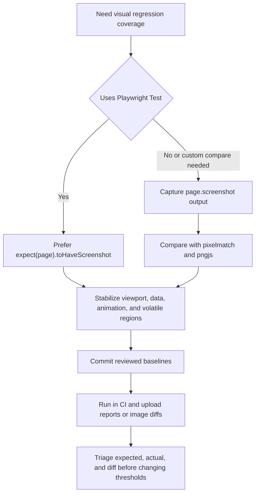

# Playwright Visual Testing

## Trigger On

- the user asks for pixel, screenshot, visual, or UI regression testing with Playwright
- a .NET repo needs visual baselines for ASP.NET Core, Blazor, WebAssembly, static pages, or generated frontend assets
- GitHub Actions should run Playwright screenshots and expose expected, actual, and diff artifacts
- tests fail with screenshot mismatches, noisy baselines, or unstable visual snapshots

## Do Not Use For

- pure .NET unit or integration tests without a browser surface
- accessibility, SEO, PWA, or security-header audits; route those to `webhint`
- browser debugging or live DOM inspection; route that to `chrome-devtools-mcp`
- JavaScript, TypeScript, CSS, or HTML linting; route those to `biome`, `eslint`, `stylelint`, or `htmlhint`

## Load References

- Read [CI and snapshot patterns](references/ci-and-snapshot-patterns.md) when adding a new visual test suite, wiring GitHub Actions, choosing between Playwright snapshots and a standalone Pixelmatch script, or stabilizing screenshot diffs.

## Current Upstream Notes

- The July 2026 Playwright CI and visual-comparison docs still require browser dependencies to be installed explicitly in CI and warn that screenshot rendering varies by host OS, browser build, fonts, headless mode, and hardware. Generate and review baselines in the same environment used for comparison.
- Keep `--update-snapshots` as an intentional local review action. Pull-request CI should retain expected, actual, diff, trace, and report artifacts instead of silently accepting a new baseline.

## Workflow

1. Inspect the current browser-test surface:
   - nearest `AGENTS.md`
   - `package.json`, lockfile, Playwright config, test folders, and CI workflows
   - how the app starts locally: `dotnet run`, Aspire AppHost, static preview, or frontend dev server
2. Choose the comparison path deliberately:
   - default to Playwright Test `expect(page).toHaveScreenshot()` when the repo can use Playwright Test snapshots
   - use `page.screenshot()` plus a standalone Pixelmatch script only when the repo needs article-style central `screenshots/baseline`, `screenshots/actual`, and `screenshots/diff` folders, non-Playwright image inputs, or custom reporting outside Playwright Test
3. Make screenshots deterministic before tuning thresholds:
   - fix viewport, browser project, locale/time zone, color scheme, and device scale factor
   - use stable test data and wait for the app-specific ready state
   - disable animations or use Playwright screenshot options for animations
   - mask or hide volatile regions such as ads, time, avatars, random IDs, spinners, and third-party iframes
4. Keep baseline updates explicit:
   - generate missing baselines once, review them, and commit them
   - update intended Playwright snapshots with `npx playwright test --update-snapshots`
   - do not auto-create or auto-update baselines in pull-request CI
5. Wire CI for repeatability:
   - use `npm ci`, then `npx playwright install --with-deps`, then the focused Playwright command
   - set CI workers conservatively when screenshots are resource-sensitive
   - optionally run `npx playwright test --only-changed=origin/$GITHUB_BASE_REF` first on pull requests for faster feedback, but always follow it with the full suite because changed-test selection is heuristic
   - use the same OS, browser build, fonts, headless mode, and rendering environment that produced the committed baselines; an official Playwright container is useful when host drift keeps changing pixels
   - upload the Playwright HTML report and `test-results/`, or upload `screenshots/baseline`, `screenshots/actual`, and `screenshots/diff` for a custom Pixelmatch flow
6. Triage failures from artifacts:
   - inspect expected, actual, and diff images together
   - classify the mismatch as intentional design change, rendering nondeterminism, app bug, or baseline drift
   - fix nondeterminism before increasing `maxDiffPixels`, `maxDiffPixelRatio`, or Pixelmatch mismatch thresholds

## Deliver

- a Playwright visual-test path that matches the repo's existing package manager and test layout
- committed reviewed baseline images or a clear command to generate and review them
- deterministic screenshot controls for dynamic UI regions
- GitHub Actions report or diff artifacts that make failures reviewable
- a short note on whether the implementation uses built-in Playwright snapshots or a custom Pixelmatch comparison script

## Validate

- `npm ci`
- `npx playwright install --with-deps`
- `npx playwright test` or the repo's focused visual-test script
- `npx playwright test --update-snapshots` only when accepting intentional baseline changes
- in CI changes, confirm artifact upload uses maintained GitHub Actions versions and runs on pull requests without requiring secrets

## Common Pitfalls

- capturing screenshots before the UI is stable
- generating baselines on one OS and comparing them on another
- sharing one mutable browser context across tests
- masking too much of the page and removing the regression signal
- raising thresholds to hide animation, font, clock, or data nondeterminism
- using a custom Pixelmatch script when Playwright's built-in screenshot assertion would give better trace, report, and snapshot integration
