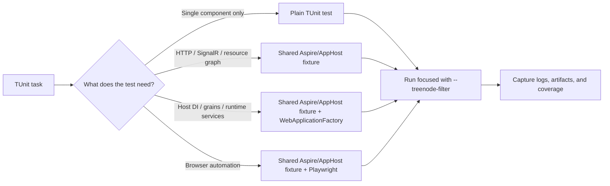

# TUnit

## Trigger On

- the repo uses TUnit
- you need to add, run, debug, or repair TUnit tests
- the repo uses Microsoft.Testing.Platform-based test execution
- the repo uses `ClassDataSource<...>(Shared = SharedType.PerTestSession)`, `TUnit.Playwright`, or `--treenode-filter`

## Do Not Use For

- xUnit projects
- MSTest projects
- generic test strategy with no TUnit-specific mechanics

## Inputs

- the nearest `AGENTS.md`
- the test project file and package references
- the repo's current TUnit execution command

## Workflow

1. Confirm the project really uses TUnit and not a different MTP-based framework.
2. Read the repo's real `test` command from `AGENTS.md`. If the repo has no explicit command yet, start with `dotnet test PROJECT_OR_SOLUTION`.
3. Keep the TUnit execution model intact:
   - tests are source-generated at build time
   - tests run in parallel by default
   - on .NET 10, test modules also run in parallel by default up to `Environment.ProcessorCount`
   - built-in analyzers should remain enabled
4. Choose the fixture level deliberately:
   - plain TUnit tests for isolated logic
   - shared AppHost/Aspire fixtures for HTTP, SignalR, SSE, or UI flows
   - `WebApplicationFactory` layered over shared Aspire infra when tests need Host DI services, `IGrainFactory`, or other runtime internals
5. Reuse expensive fixtures with `ClassDataSource<Fixture>(Shared = SharedType.PerTestSession)` instead of booting distributed infrastructure per test. Fixture reuse does not serialize consumers: keep the fixture concurrency-safe and give each test unique mutable state.
6. Keep tests and test modules parallel. Do not add `--max-parallel-test-modules 1`, `TUNIT_MAX_PARALLEL_TESTS=1`, `[assembly: NotInParallel]`, a class-wide `[NotInParallel]`, or an equivalent global restriction.
7. Use keyed `[NotInParallel("collision-domain")]` only on the smallest tests that perform destructive changes to the same shared state and can corrupt one another. A shared read-only fixture, expensive startup, module boundary, or vague CI-stability concern is not a reason to limit parallelism.
8. Run the narrowest useful scope first with `dotnet test ... --treenode-filter "..."` on .NET 10. Use the older `--` separator only when the repository is pinned to an SDK that requires it.
9. Capture useful failure evidence: host log dumps, focused console output, coverage files, and Playwright screenshots/HTML for UI tests.
10. Use `[Test]`, `[Arguments]`, hooks, and dependencies only when they make the scenario clearer, not because the framework allows it.

## Bootstrap When Missing

If `TUnit` is requested but not configured yet:

1. Detect current state:
   - `rg -n "TUnit|Microsoft\\.Testing\\.Platform" -g '*.csproj' -g 'Directory.Build.*' .`
2. Add the minimal package set to the test project:
   - `dotnet add TEST_PROJECT.csproj package TUnit`
   - do not add `Microsoft.NET.Test.Sdk` to a current TUnit project; it selects the VSTest path and conflicts with the normal Microsoft.Testing.Platform setup
3. Keep the runner model explicit in `AGENTS.md` and CI:
   - record that the repo uses Microsoft.Testing.Platform-compatible execution for this test project
   - record the exact `dotnet test TEST_PROJECT.csproj` command the repo will use
4. Add one small executable test using `[Test]`.
5. Run `dotnet test TEST_PROJECT.csproj` and return `status: configured` or `status: improved`.
6. If the repo intentionally standardizes on xUnit or MSTest, return `status: not_applicable` unless migration is explicitly requested.

## Deliver

- TUnit tests that respect source generation and parallel execution
- commands that work in local and CI runs
- framework-specific verification guidance for the repo
- a fixture strategy that matches the actual test scope: logic-only, AppHost/API, Host DI/grains, or Playwright UI

## Validate

- the command matches the repo's TUnit runner style
- focused runs use `--treenode-filter` rather than VSTest-style `--filter`
- .NET 10 runs pass MTP options directly without a `--` separator
- no global or assembly-wide single-thread setting has been introduced
- any keyed non-parallel group is limited to tests with a named destructive shared-state collision
- shared distributed fixtures use `SharedType.PerTestSession` or an equivalent reuse pattern
- fixture and shared infrastructure are safe for concurrent consumers; mutable data is isolated per test
- built-in TUnit analyzers remain active
- coverage tooling matches Microsoft.Testing.Platform if coverage is enabled
- UI failures capture artifacts and server-side failures expose enough logs to avoid blind reruns

## Test Harness



## Load References

- [references/patterns.md](references/patterns.md)
- [references/migration.md](references/migration.md)
- [references/tunit.md](references/tunit.md)
- [references/integration-testing.md](references/integration-testing.md)

## Running Tests

TUnit uses Microsoft.Testing.Platform. Use `--treenode-filter` for filtering, not VSTest `--filter`. On .NET 10, pass MTP switches directly; older SDKs may require `--`.

```bash
# Run all tests
dotnet test --solution MySolution.sln

# Run one test project
dotnet test --project tests/MyProject.Tests/MyProject.Tests.csproj

# Filter by class
dotnet test --project tests/MyProject.Tests/MyProject.Tests.csproj --treenode-filter "/*/*/CalculatorTests/*"

# Filter by category
dotnet test --project tests/MyProject.Tests/MyProject.Tests.csproj --treenode-filter "/*/*/*/*[Category=Integration]"

# Coverage on Microsoft.Testing.Platform
dotnet test --solution MySolution.sln --coverage --coverage-output coverage.cobertura.xml --coverage-output-format cobertura

# Raw runner help when the repo needs direct TUnit app switches
dotnet run --project tests/MyProject.Tests/MyProject.Tests.csproj -- --help
```

Filter syntax: `/<Assembly>/<Namespace>/<Class>/<Test>` with `*` wildcards. See [references/patterns.md](references/patterns.md) for full examples.

## Example Requests

- "Run this TUnit project correctly."
- "Fix our TUnit CI command."
- "Add a regression test in TUnit without breaking parallelism."
