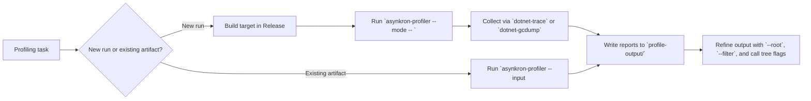

# Asynkron.Profiler

## Trigger On

- the repo wants `Asynkron.Profiler` or `asynkron-profiler`
- the user wants automation-friendly profiling output instead of GUI-only tooling
- profiling needs are CPU, allocation, exception, contention, or heap focused and should land as plain-text summaries in CI, scripts, or agent workflows
- the task needs to render an existing `.nettrace`, `.speedscope.json`, `.etlx`, or `.gcdump` file into a readable report

## Workflow

1. Decide whether the task is a new profile capture or rendering an existing trace artifact.
2. Prefer built `Release` output over `dotnet run` so the trace represents the target app rather than restore/build noise.
3. Install and verify all three tools before assuming the profiler is usable:
   - `asynkron-profiler`
   - `dotnet-trace`
   - `dotnet-gcdump`
4. Choose exactly one primary mode first:
   - `--cpu`
   - `--memory`
   - `--exception`
   - `--contention`
   - `--heap`
5. Use `--input <path>` when the trace already exists and the task is about rendering or narrowing the report, not recollecting data.
6. Refine the output only after the baseline run:
   - `--root <text>` to anchor the call tree
   - `--filter <text>` to trim tables
   - `--exception-type <text>` for exception-heavy flows
   - `--calltree-depth`, `--calltree-width`, `--calltree-self`, `--calltree-sibling-cutoff`
7. Treat `profile-output/` as the stable output folder for review artifacts and reruns.
8. If the task needs process attach, counters, or raw official diagnostics flows rather than this CLI frontend, hand off to `dotnet-profiling`.

## Architecture



## Install

- Install the profiler tool from upstream:

```bash
dotnet tool install -g asynkron-profiler --prerelease
```

- Install prerequisites:

```bash
dotnet tool install -g dotnet-trace
dotnet tool install -g dotnet-gcdump
```

- Verify the toolchain:

```bash
asynkron-profiler --help
dotnet-trace --version
dotnet-gcdump --version
```

## Practical Usage

### Capture a new profile

```bash
dotnet build -c Release
asynkron-profiler --cpu -- ./bin/Release/<tfm>/MyApp
```

Framework-dependent apps can run through `dotnet`:

```bash
asynkron-profiler --memory -- dotnet ./bin/Release/<tfm>/MyApp.dll
```

Project and solution paths are also valid when the tool should build and run for you:

```bash
asynkron-profiler --contention -- ./MyApp.csproj
asynkron-profiler --exception -- ./MySolution.sln
```

### Render an existing trace

```bash
asynkron-profiler --input ./profile-output/app.nettrace --cpu
asynkron-profiler --input ./profile-output/app.etlx --memory
asynkron-profiler --input ./profile-output/app.gcdump --heap
```

Manual collection with the official tools still fits when the trace must be captured separately:

```bash
dotnet-trace collect --output ./profile-output/app.nettrace -- dotnet run MyProject.sln
asynkron-profiler --input ./profile-output/app.nettrace --cpu
```

## Option Patterns

- mode flags:
  - `--cpu` for sampled hotspots
  - `--memory` for GC allocation ticks and per-type call trees
  - `--exception` for thrown counts and throw-site trees
  - `--contention` for wait-time trees
  - `--heap` for retained heap shape via `dotnet-gcdump`
- scope and readability:
  - `--root <text>` to focus the tree on a subsystem
  - `--filter <text>` to narrow function tables
  - `--exception-type <text>` when one exception dominates the signal
- output shaping:
  - `--calltree-depth <n>`
  - `--calltree-width <n>`
  - `--calltree-self`
  - `--calltree-sibling-cutoff <n>`
- trace replay and project targeting:
  - `--input <path>` for `.nettrace`, `.speedscope.json`, `.etlx`, or `.gcdump`
  - `--tfm <tfm>` when the profiler must resolve a specific target framework from a `.csproj` or `.sln`

## Constraints

- upstream currently documents `.NET SDK 10.x` as the supported toolchain baseline
- `dotnet run` is supported but usually produces noisy traces because it captures host, restore, and build work
- the tool is a frontend over `dotnet-trace` and `dotnet-gcdump`, so missing prerequisites or blocked diagnostics IPC will break runs
- `--heap` captures retained heap shape, not CPU or allocation timelines
- this skill is for launched commands or existing trace files; if the task is process attach, counters, or raw trace authoring, prefer `dotnet-profiling`

## Deliver

- a repeatable `asynkron-profiler` command path for the profiling mode that matches the problem
- explicit install and prerequisite commands
- a clear baseline command plus any focused `--root`, `--filter`, `--exception-type`, or call-tree options needed for readable output
- trace replay guidance when the task starts from an existing artifact

## Validate

- `asynkron-profiler --help`, `dotnet-trace --version`, and `dotnet-gcdump --version` all succeed
- the chosen profiling mode matches the question being investigated
- the command profiles built `Release` output unless there is a documented reason to accept `dotnet run` noise
- `profile-output/` contains the expected report or artifact after the run
- any replay flow uses an input file type that matches the selected mode

## References

- [overview.md](references/overview.md) - tool positioning, install paths, prerequisites, and when to choose it over raw diagnostics CLIs
- [commands.md](references/commands.md) - command patterns for capture, replay, and option tuning
- [examples.md](references/examples.md) - mode-by-mode examples, output expectations, and troubleshooting checks
