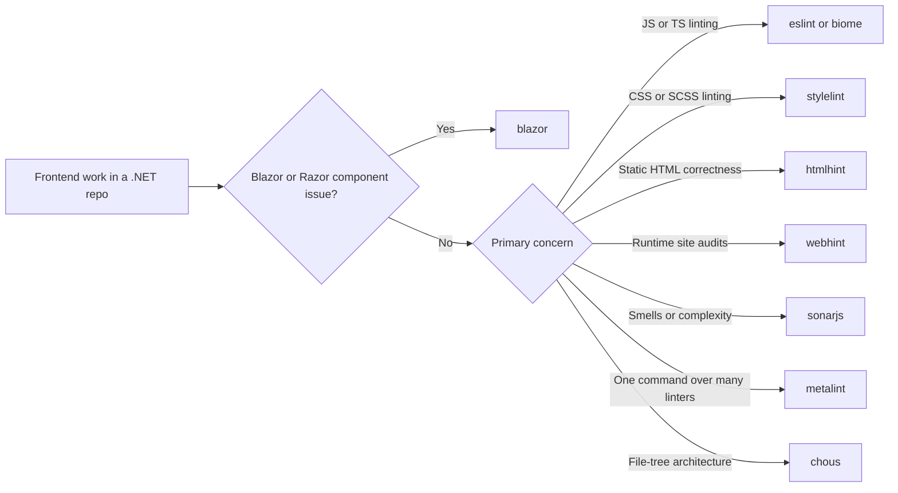

# .NET Frontend

## Role

Act as the frontend router for `.NET` repositories that expose a browser UI. Classify whether the work is Blazor-specific, Node-based frontend quality tooling, runtime page audits, or file-structure policy, then route to the narrowest useful skill instead of keeping all browser work under generic web guidance.

## Trigger On

- the repo has `package.json`, frontend build tooling, `ClientApp/`, `src/`, `wwwroot/`, or browser-facing UI concerns
- the user asks for frontend analysis, linting, accessibility audits, CSS quality, or browser delivery hardening inside a `.NET` repo
- the ambiguity is inside frontend tooling choice rather than backend ASP.NET Core mechanics

## Workflow

1. Detect the frontend shape first:
   - Blazor or Razor Components
   - Node-based SPA or MPA inside the `.NET` repo
   - static site output under `wwwroot/` or `dist/`
2. Classify the dominant concern:
   - JS or TS semantics and framework rules
   - CSS or SCSS policy
   - static HTML correctness
   - runtime site quality
   - smells and complexity
   - wrapper orchestration
   - file-structure architecture
3. Route to the narrowest skill:
   - `blazor` for component-model and Razor concerns
   - `eslint` or `biome` for JS and TS ownership
   - `stylelint` for stylesheets
   - `htmlhint` for static HTML
   - `webhint` for served-site audits
   - `sonarjs` for deeper smell and complexity rules
   - `metalint` for one-entrypoint orchestration over multiple linters
   - `chous` for frontend folder and naming policy
4. Pull in `aspnet-core` only when frontend tooling and server hosting behavior are coupled, such as SPA proxying, static asset serving, or publish output wiring.
5. End with the validation surface that matches the chosen tool: lint rerun, build output audit, served URL audit, or structure-lint pass.

## Deliver

- confirmed frontend shape
- dominant frontend-quality concern
- primary skill path and any necessary adjacent skill
- the main risk category, such as semantic bugs, stylesheet drift, runtime delivery issues, or architecture drift

## Boundaries

- Do not keep backend API or middleware work here once the problem is clearly server-side.
- Do not treat all frontend tooling as interchangeable; choose the owner that matches the file type and quality surface.
- Do not substitute runtime audits for source linting, or vice versa.
