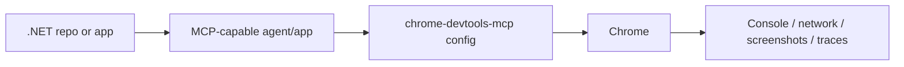

# Chrome DevTools MCP for .NET Repos

## Trigger On

- the repo needs browser-level debugging for ASP.NET Core, Blazor, WebAssembly, or any .NET app with a web UI
- the user wants an MCP server that can inspect console output, network traffic, screenshots, traces, and DOM state
- the repo needs agent-friendly browser control instead of manual DevTools work

## Do Not Use For

- pure .NET code analysis, unit testing, or NuGet/package management
- static HTML linting alone
- sensitive browser sessions that must not be exposed to an MCP client

## Inputs

- the nearest `AGENTS.md`
- the MCP client config for the current agent or app
- the target Chrome mode: launch new, connect to existing browser, or attach to a WebSocket endpoint
- the target app URL or local dev server

## Workflow

1. Choose the browser mode first.
   - new ephemeral browser: default when you want a clean session
   - existing browser: use `--browserUrl` or `--wsEndpoint`
   - running browser with a user profile: use `--autoConnect` only when Chrome 144+ and remote debugging are already enabled
2. Prefer repo-local config over ad hoc shell commands.
   - store the MCP server block in the repo or agent config so every run is repeatable
3. Start from the smallest useful surface.
   - use `--slim` when you only need navigation, JavaScript execution, and screenshots
   - leave the full toolset enabled when you need network, performance, or emulation
4. Be explicit about privacy and cost.
   - disable usage statistics or CrUX-backed performance enrichment when policy or sensitivity requires it
5. Validate against the real app, not a mock page.
   - use the app's local dev server, preview URL, or a production-like environment that reflects the bug

## Install And Configure

Use the same JSON MCP server block in whatever .NET agent/app host you use:

```json
{
  "mcpServers": {
    "chrome-devtools": {
      "command": "npx",
      "args": ["-y", "chrome-devtools-mcp@latest"]
    }
  }
}
```

Common variants:

```json
{
  "mcpServers": {
    "chrome-devtools": {
      "command": "npx",
      "args": ["-y", "chrome-devtools-mcp@latest", "--slim", "--headless"]
    }
  }
}
```

```json
{
  "mcpServers": {
    "chrome-devtools": {
      "command": "npx",
      "args": ["-y", "chrome-devtools-mcp@latest", "--browserUrl", "http://127.0.0.1:9222"]
    }
  }
}
```

For Codex CLI, the upstream repo documents:

```bash
codex mcp add chrome-devtools -- npx chrome-devtools-mcp@latest
```

### Useful Flags

- `--slim`: three-tool surface for navigation, JavaScript execution, and screenshots only
- `--headless`: run without UI
- `--browserUrl` or `--wsEndpoint`: attach to an existing debuggable browser
- `--wsHeaders`: add custom WebSocket headers when `--wsEndpoint` is used
- `--autoConnect`: connect to a locally running Chrome 144+ instance instead of launching a new one
- `--channel stable|beta|dev|canary`: pick a Chrome channel
- `--isolated`: create and clean up a temporary profile
- `--userDataDir`: reuse a specific Chrome profile directory
- `--no-usage-statistics`: opt out of usage collection
- `--no-performance-crux`: stop sending performance trace URLs to CrUX
- `--acceptInsecureCerts`: only when the target environment uses self-signed or expired certs
- `--logFile <path>`: capture debug logs for bug reports
- `--experimentalScreencast`: only when ffmpeg is available and you need video capture

## Practical Usage Patterns

- Debug a local ASP.NET Core or Blazor app:
  - start the app
  - connect with `--browserUrl` if the browser is already running, or let the server launch Chrome
  - ask the agent to inspect console errors, network failures, and rendering behavior
- Investigate a flaky UI test:
  - use `--headless --isolated`
  - capture screenshots and console logs from the failing route
  - compare the result to a known-good run
- Diagnose performance regressions:
  - keep the full toolset enabled
  - use performance tools only when you need trace data
  - prefer `--slim` for quick smoke checks, not for performance work
- Work in a sandboxed or containerized environment:
  - attach to a running browser with `--browserUrl` or `--wsEndpoint`
  - avoid assuming the server can launch Chrome itself
- Reuse a signed-in session:
  - use `--userDataDir`
  - avoid `--isolated`
  - accept that this increases exposure to sensitive browser state



## Risks And Tradeoffs

- The server can see and act on browser content, so do not point it at sensitive accounts or data unless that exposure is intended.
- `--slim` lowers token and tool overhead, but it removes network, performance, and emulation workflows.
- `--isolated` is safer for disposable runs, but it discards existing browser state and logins.
- `--autoConnect` is convenient for local debugging, but it depends on Chrome 144+ and remote debugging being enabled.
- `--no-usage-statistics` and CrUX-backed performance traces may change what data leaves the machine; disable them when policy requires it.
- `--headless` is good for CI or scripted runs, but it can hide UI-specific failures.
- Passing `--chromeArg='--no-sandbox'` or similar launch flags can be necessary in some container or root environments, but only use it when the environment really requires it.

## Handle Failures

- If `npx` returns a permission denied error on macOS from `_npx`, clear `~/.npm/_npx` and rerun.
- If the server cannot find Chrome, check `--channel`, `--executablePath`, and whether Chrome is installed on the host.
- If connection to an existing browser fails, verify `http://127.0.0.1:9222/json/version` and the `webSocketDebuggerUrl` value.
- If performance traces are noisy or too expensive, keep the browser mode stable and compare runs against the same URL and browser channel.

## Validate

- `npx -y chrome-devtools-mcp@latest --help` prints the expected flags on the current host
- the MCP client can list the server and open a page in the target browser
- the agent can capture at least one screenshot or console/network observation from the real app
- the chosen mode matches the task: `--slim` for quick browser checks, full mode for debugging and performance

## Deliver

- a repeatable MCP server config for the repo or agent host
- a browser connection mode that fits the environment
- a safe default for privacy, performance, and reproducibility
