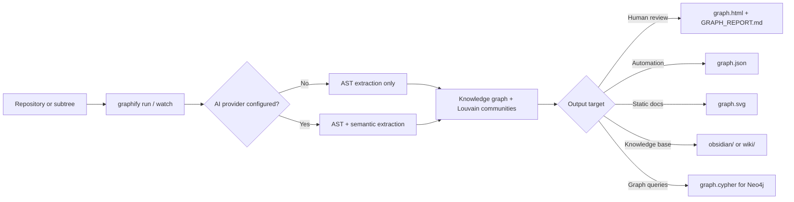

# graphify-dotnet

## Trigger On

- `graphify`, `graphify run`, `graphify watch`, `graphify benchmark`, or `graphify config`
- generating `graph.json`, `graph.html`, `graph.svg`, `graph.cypher`, `GRAPH_REPORT.md`, `obsidian/`, or `wiki/`
- building onboarding maps, architecture snapshots, or dependency-discovery artifacts from a repository
- choosing between AST-only extraction and AI-enriched semantic extraction
- pushing graph output into Neo4j, Obsidian, wiki docs, or CI artifacts

## Workflow

1. Confirm the problem is structural discovery, architecture review, onboarding, or graph export. If the user only needs one symbol lookup, one bug fix, or one dependency trace, normal repo search and tests are cheaper than a full graph run.
2. Install and verify the tool before doing anything else:
   ```bash
   dotnet --version
   dotnet tool install -g graphify-dotnet
   graphify --version
   ```
3. Start with a bounded AST-only run so the first output is fast and deterministic:
   ```bash
   graphify run ./src --format json,html,report --provider none --verbose
   ```
4. Review outputs in this order:
   - `GRAPH_REPORT.md` for quick signal
   - `graph.html` for visual exploration
   - `graph.json` for scripting and downstream tooling
5. Add AI enrichment only when inferred relationships or conceptual grouping matter more than strict syntax-only structure.
6. Expand export formats for the real consumer:
   - `svg` for static docs and PRs
   - `neo4j` for graph queries
   - `obsidian,wiki` for knowledge-base or onboarding flows
7. Use `watch` for iterative architecture work, but rerun a clean `run` periodically because deletes and renames can leave stale references behind.
8. Run `benchmark` only after you already trust the generated `graph.json`; its value is comparative token-reduction evidence, not billing-grade accounting.

## Architecture



## Practical Recipes

### Write a quick architecture snapshot

```bash
graphify run . --format html,report --output ./artifacts/graph
```

Use this when you need a fast human-readable map of the current repo. Read `./artifacts/graph/GRAPH_REPORT.md` first, then open `./artifacts/graph/graph.html`.

### Write queryable and documentation exports

```bash
graphify run ./src --format json,neo4j,svg,obsidian,wiki --output ./graphify-out
```

Use this when the graph will be consumed by scripts, Neo4j, docs, or knowledge-base tooling instead of only a browser.

### Read and benchmark an existing graph

```bash
graphify benchmark ./graphify-out/graph.json
```

Treat this as a heuristic efficiency check for AI-context workflows after the graph already exists.

## Provider Choice

- `none`: best first run, deterministic, fast, no external dependencies
- `ollama`: local and privacy-friendly; good for sensitive code or low-cost experimentation
- `azureopenai`: enterprise-hosted semantic extraction with explicit endpoint, key, and deployment
- `copilotsdk`: lowest-friction option for teams that already authenticate with GitHub Copilot

Choose the provider by operational constraint first, not by model hype:

- privacy or offline requirements: `ollama`
- enterprise Azure governance: `azureopenai`
- fastest setup for existing subscribers: `copilotsdk`
- no semantic extraction required: `none`

## Configuration Patterns

graphify resolves settings in this priority order:

1. CLI arguments
2. user secrets
3. environment variables
4. `appsettings.local.json`
5. `appsettings.json`

Use `graphify config` for the interactive wizard and `graphify config show` to inspect the resolved effective settings.

Common environment-variable patterns:

```bash
# AST-only explicit override
export GRAPHIFY__Provider=None

# Ollama
export GRAPHIFY__Provider=Ollama
export GRAPHIFY__Ollama__Endpoint=http://localhost:11434
export GRAPHIFY__Ollama__ModelId=llama3.2

# Azure OpenAI
export GRAPHIFY__Provider=AzureOpenAI
export GRAPHIFY__AzureOpenAI__Endpoint=https://myresource.openai.azure.com/
export GRAPHIFY__AzureOpenAI__ApiKey=...
export GRAPHIFY__AzureOpenAI__DeploymentName=gpt-4o

# GitHub Copilot SDK
export GRAPHIFY__Provider=CopilotSdk
export GRAPHIFY__CopilotSdk__ModelId=gpt-4.1
```

## Tradeoffs And Constraints

- AST-only mode is reliable for structural facts such as files, classes, methods, and imports, but it will not infer conceptual links that are absent from syntax.
- AI enrichment produces richer graphs but adds latency, provider setup, quota or subscription concerns, and privacy review.
- `watch` mode is an inner-loop accelerator, not a perfect source of truth. Deleted files are not fully removed from the graph until a clean rebuild, and renames can temporarily duplicate nodes.
- `graph.html` is great for quick inspection, but large graphs can render slowly and some browsers block `file://` loading. Serve the output folder locally if the page renders blank.
- graphify respects `.gitignore`, so an empty graph can be a path-selection problem instead of a parser failure.
- `benchmark` is approximate. The source uses heuristic token estimation, so treat the numbers as directional rather than invoice-grade.

## Deliver

- a justified choice of AST-only vs AI-enriched extraction
- concrete `graphify` commands for the repo, folder, or output consumer
- the right export-format set for humans, docs, scripts, or graph databases
- configuration guidance that fits the chosen provider and operating model
- a validation path for the produced graph artifacts

## Validate

- `dotnet --version` shows a .NET 10 SDK
- `graphify --version` resolves after installation
- `graphify run <path> --format json,html,report -v` completes without provider or path errors
- the output folder contains the expected artifacts for the selected formats
- `graphify config show` reflects the intended provider configuration when AI enrichment is enabled
- `graphify benchmark <graph.json>` runs only after a real graph file exists

## Load References

- `references/source-map.md` - upstream repository and docs map with direct links to the README, CLI docs, provider setup guides, sample project, and export-format docs
- `references/usage-and-operations.md` - practical commands, provider setup patterns, export selection, watch-mode behavior, troubleshooting, and benchmark caveats
