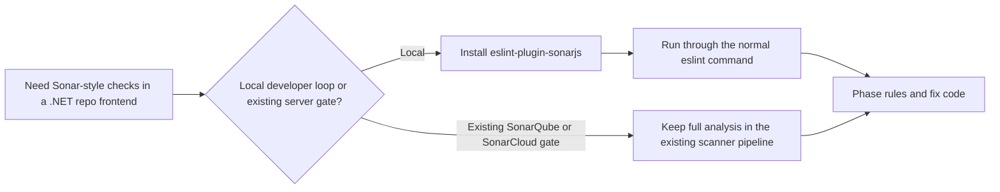

# SonarJS Rules for Frontend Assets in .NET Repositories

## Trigger On

- the repo already uses SonarQube, SonarCloud, or `eslint-plugin-sonarjs`
- the user asks for frontend code smells, cognitive complexity limits, or deeper bug-risk rules beyond base ESLint
- maintainability and reliability findings on JS or TS code should become a review or CI gate

## Do Not Use For

- repos that want only a lightweight base lint setup with no extra smell or complexity rules
- teams that reject SonarQube, SonarCloud, or source-available SonarJS-derived tooling as a default gate
- cases where the problem is runtime page quality rather than source-level maintainability

## Inputs

- the nearest `AGENTS.md`
- `package.json`
- existing ESLint config
- any SonarQube, SonarCloud, or scanner config already present in CI

## Workflow

1. Decide the execution path first:
   - local developer loop through `eslint-plugin-sonarjs`
   - server-side analysis through an already adopted SonarQube or SonarCloud pipeline
2. For local work, treat SonarJS as an ESLint extension rather than a standalone CLI.
3. Keep the first rollout narrow:
   - bug-prone rules
   - cognitive complexity
   - duplicated branching or suspicious control flow
4. Add rules to the existing ESLint command instead of inventing a parallel local lint entrypoint.
5. If the repo already has SonarQube or SonarCloud, align local rule expectations with the server gate instead of maintaining two conflicting policies.
6. Fix code or phase rules deliberately; do not hide the first rollout behind broad disables.
7. Document licensing or hosting caveats before making Sonar-based tooling the default quality gate.

## Bootstrap When Missing

1. Detect current state:
   - `rg --files -g 'package.json' -g 'eslint.config.*' -g '.eslintrc*'`
   - `rg -n '"eslint-plugin-sonarjs"|"sonar"|"sonarqube"|"sonarcloud"' .`
2. Prefer the local ESLint-plugin path for developer workflows:
   - `npm install --save-dev eslint-plugin-sonarjs`
3. Add the plugin and selected rules to the checked-in ESLint config.
4. Verify with the repo's normal lint entrypoint, for example:
   - `npx eslint .`
5. If the repo already uses SonarQube or SonarCloud, keep the full analysis in that existing CI path instead of inventing a new local scanner flow.
6. Return `status: configured` if SonarJS-derived checks now have explicit ownership, or `status: improved` if an existing setup was tightened.
7. Return `status: not_applicable` when the repo explicitly chooses a purely OSS lint baseline without Sonar-based extensions.

## Handle Failures

- There is no separate local `sonarjs` CLI from this repo; local developer use should go through ESLint with `eslint-plugin-sonarjs`.
- Plugin-load failures usually mean the ESLint config does not match the installed plugin version or plugin registration syntax.
- If the first rollout produces too many smells, phase rule adoption instead of disabling the plugin wholesale.
- If SonarQube or SonarCloud disagrees with local lint output, treat the server gate as the source of truth and align the local config deliberately.

## Deliver

- explicit SonarJS-derived rule ownership
- a clear split between local ESLint-based use and any existing server-side Sonar pipeline
- documented rollout scope and caveats

## Validate

- local developer commands still use the repo's standard ESLint entrypoint
- Sonar-based rules are not treated as a standalone local CLI when none exists
- licensing or hosting caveats are documented before broad adoption
- findings are actionable and phased instead of silently suppressed

## Ralph Loop

1. Plan: analyze current state, target outcome, constraints, and risks.
2. Execute one step and produce a concrete delta.
3. Review the result and capture findings.
4. Apply fixes in small batches and rerun checks.
5. Update the plan after each iteration.
6. Repeat until outcomes are acceptable.
7. If a dependency is missing, bootstrap it or return `status: not_applicable` with a reason.

### Required Result Format

- `status`: `complete` | `clean` | `improved` | `configured` | `not_applicable` | `blocked`
- `plan`: concise plan and current step
- `actions_taken`: concrete changes made
- `verification`: commands, checks, or review evidence
- `remaining`: unresolved items or `none`

## Example Requests

- "Add SonarJS rules to the existing ESLint setup."
- "Use cognitive complexity checks on the frontend."
- "Explain whether we should use the ESLint plugin or SonarQube here."
