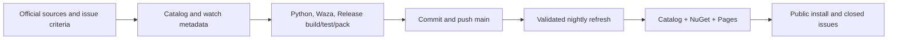

# Roslynk and catalog issue delivery

## Scope

Finish the existing Roslynk vendir import, resolve Avalonia support (#1584), and repair the repo-owned Waza findings (#1574). Preserve upstream Markdown verbatim and unrelated checkout changes. Deliver on `main` through the canonical catalog, NuGet, and Pages release.

## Implementation

- [x] Verify Roslynk source, byte-preserving import, license, classification, and nightly refresh.
- [x] Add source-driven Avalonia guidance, practical examples, documentation map, package signals, and release/documentation watches.
- [x] Add regression coverage for collection placement and package-driven recommendation/automatic installation.
- [x] Reduce Orleans entrypoint weight using focused references; verify and repair Graphify and StyleCop source links.
- [x] Run Python regressions, importer/catalog/agent/watch validation, Waza, format, Release build, .NET tests, and Release pack.
- [x] Commit with issue-closing references, push, validate GitHub checks, and exercise nightly refresh.
- [x] Publish and verify catalog assets, all NuGet tools, Pages, and installed skill contents; confirm issues closed.

## Validation order

Use `skill-creator` to review source fidelity and reference reachability, `dotnet` for package detection and installer regressions, and `quality-ci` for automation and release checks. Run static/catalog checks first, Waza second, then the solution's Release build/test/pack lane. CI smoke checks prove package installability. Verify publication against the public feeds and deployed site after the workflow completes.

## Risks and acceptance

Avalonia 11 and 12 use different documentation and APIs; route by installed major version and validate Native AOT on each actual target. Treat imported Waza findings as report-only without rewriting upstream content. Network or publication failures must retain the original exit code and leave delivery pending until repaired or an exact external blocker is established.

## Local evidence

- Python regressions: 56 passed, including a public package-prefix rendering regression.
- Release build: zero warnings and errors. The final full rebuild used `--no-incremental` with normal build parallelism outside the sandbox. An earlier temporary `-m:1` recovery followed a sandbox MSBuild worker failure; tests retained their normal parallel execution.
- .NET regressions: 1153 passed, zero skipped or failed.
- Format verification: clean.
- Waza: 194 checked, zero repo-owned warnings; 98 imported findings remain report-only, including upstream Roslynk frontmatter syntax.
- Release pack: all three tools produced; existing NU5111/NU5123 warnings concern bundled upstream scripts and long reference paths.
- Roslynk skill/reference files and MIT license are byte-identical to the pinned source.

## Publication follow-up and local CLI UX review

The first published Pages check exposed `Avalonia..*` because display code appended a separator to an already delimited matching prefix. Keep `Avalonia.` in metadata so auto-install does not match unrelated package ids; normalize only the display suffix across site cards, package search, structured data, and CLI package/detail cards. A separate local CLI UX pass checked consistency of the package signals and preserved the existing rich console hierarchy and escaped labels; Claude is unavailable in this environment.

PR Checks and the nightly refresh completed successfully for the implementation commit. Both issues closed through commit references. All 208 live watch sources were reachable; 36 transient Microsoft Learn HTTP 429 responses succeeded on a focused retry without changing the watch baseline. The follow-up patch passed the final solution Release lane and a second public release.

## Public delivery evidence

- [Final Release workflow](https://github.com/managedcode/dotnet-skills/actions/runs/38036708361): release, Pages build, deployment, and report succeeded.
- [Final PR Checks](https://github.com/managedcode/dotnet-skills/actions/runs/38036706677): catalog, Waza, and all three tool smoke checks succeeded. Waza checked 194 skills with zero repo-owned findings; 98 imported findings remain report-only.
- [Nightly refresh](https://github.com/managedcode/dotnet-skills/actions/runs/38035898283): succeeded with no content changes, no unnecessary PR, and watch-state promotion completed.
- [Catalog release 2026.10.10.1](https://github.com/managedcode/dotnet-skills/releases/tag/catalog-v2026.10.10.1): tag and release point to implementation commit `8013ba8884cae7432fe552f5533a12e2aa203e84`; manifest and catalog ZIP are published.
- NuGet `dotnet-skills`, `dotnet-agents`, and `agents` version `0.1.253`: installed through the standard public V3 feed with an isolated package cache after indexing completed. Both bundled and GitHub-release catalogs installed Roslynk and Avalonia; Avalonia auto-install and Roslynk source/license byte fidelity passed.
- [Roslynk](https://skills.managed-code.com/skills/roslynk/) and [Avalonia](https://skills.managed-code.com/skills/avalonia/) are live. Avalonia renders the correct `Avalonia.*` package signal.
- The existing local `dotnet-skills` tool was updated from the fresh Release package to `0.1.253` and its runtime version was verified.
- [#1584](https://github.com/managedcode/dotnet-skills/issues/1584) and [#1574](https://github.com/managedcode/dotnet-skills/issues/1574) are closed; the repository has zero open issues at delivery.
