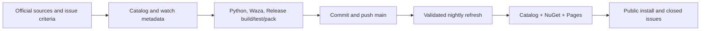

# Roslynk and catalog issue delivery

## Scope

Finish the existing Roslynk vendir import, resolve Avalonia support (#1584), and repair the repo-owned Waza findings (#1574). Preserve upstream Markdown verbatim and unrelated checkout changes. Deliver on `main` through the canonical catalog, NuGet, and Pages release.

## Implementation

- [x] Verify Roslynk source, byte-preserving import, license, classification, and nightly refresh.
- [x] Add source-driven Avalonia guidance, practical examples, documentation map, package signals, and release/documentation watches.
- [x] Add regression coverage for collection placement and package-driven recommendation/automatic installation.
- [x] Reduce Orleans entrypoint weight using focused references; verify and repair Graphify and StyleCop source links.
- [x] Run Python regressions, importer/catalog/agent/watch validation, Waza, format, Release build, .NET tests, and Release pack.
- [ ] Commit with issue-closing references, push, validate GitHub checks, and exercise nightly refresh.
- [ ] Publish and verify catalog assets, all NuGet tools, Pages, and installed skill contents; confirm issues closed.

## Validation order

Use `skill-creator` to review source fidelity and reference reachability, `dotnet` for package detection and installer regressions, and `quality-ci` for automation and release checks. Run static/catalog checks first, Waza second, then the solution's Release build/test/pack lane. CI smoke checks prove package installability. Verify publication against the public feeds and deployed site after the workflow completes.

## Risks and acceptance

Avalonia 11 and 12 use different documentation and APIs; route by installed major version and validate Native AOT on each actual target. Treat imported Waza findings as report-only without rewriting upstream content. Network or publication failures must retain the original exit code and leave delivery pending until repaired or an exact external blocker is established.

## Local evidence

- Python regressions: 55 passed.
- Release build: zero warnings and errors; a temporary `-m:1` build recovery followed a local MSBuild worker crash. Tests retained their normal parallel execution.
- .NET regressions: 1153 passed, zero skipped or failed.
- Format verification: clean.
- Waza: 194 checked, zero repo-owned warnings; 98 imported findings remain report-only, including upstream Roslynk frontmatter syntax.
- Release pack: all three tools produced; existing NU5111/NU5123 warnings concern bundled upstream scripts and long reference paths.
- Roslynk skill/reference files and MIT license are byte-identical to the pinned source.
