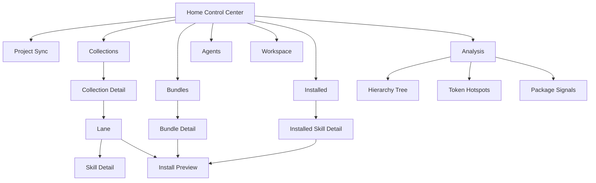
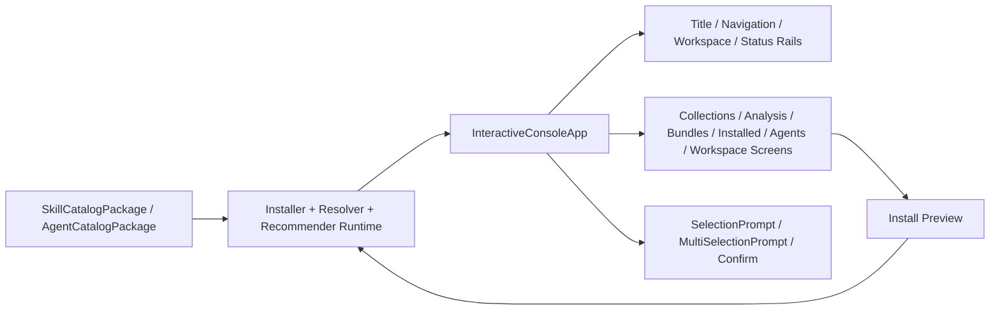

# dotnet-skills CLI Rewrite Plan

Status: Implemented, including the page-surface redesign follow-up. The browser and lifecycle screens now render as pane/card-first surfaces instead of spreadsheet-style matrices.
Owner: Codex local rewrite pass
Last updated: 2026-04-19

## Why This Rewrite Exists

The current `dotnet skills` interactive shell is not acceptable.

The visible problems are structural, not cosmetic:

- The home screen still reads like a diagnostic dump instead of a control center.
- The interactive UI has been rendered through repo-local ASCII widgets, so even "improved" layouts still look fake and flat.
- User-facing terminology is inconsistent. The product needs `Collection -> Lane -> Skill`, not `Stacks`.
- The catalog flow must stay explicit and narrow. The shell must never drift back to full-catalog dump behavior or broad mixed install surfaces.
- Fallback behavior has already been removed at the prompt/catalog level; the rewrite must keep that hard line and remove the remaining visual fallback behavior from the interactive shell.

This plan treats the current interactive CLI surface as disposable. The installer, catalog, selection, install, update, and resolver backends stay. The visible shell gets rebuilt.

## External Design References

These sources define the design language and technical constraints for the rewrite:

- [Spectre.Console layout guide](https://spectreconsole.net/console/how-to/organizing-layout-with-panels-and-grids)
  - Use `Panel`, `Columns`, `Grid`, and alignment intentionally instead of stacking loose tables.
- [Spectre.Console grid widget reference](https://spectreconsole.net/console/widgets/grid)
  - Use nested grids and embedded widgets for dense dashboard-style layouts.
- [SharpConsoleUI / ConsoleEx](https://nickprotop.github.io/ConsoleEx/)
  - Reference patterns to carry over:
    - windowed composition rather than prompt-first flow
    - strong section hierarchy
    - visible title/status/task rails
    - dense information panes instead of vertical whitespace
    - meaningful color accents that separate primary flows
    - dashboard feel over diagnostic output feel

Important constraint:

- `dotnet-skills` is not becoming a full SharpConsoleUI app in this rewrite.
- The near-term implementation target is a Spectre-based shell that borrows ConsoleEx layout principles.
- A later phase may move further toward a native retained-mode TUI if still needed.

## Rewrite Goals

### Product goals

1. Bare `dotnet skills` must open a skill-and-collection control center.
2. The home screen must feel like a terminal application, not like a list command wrapped in boxes.
3. Every top-level interactive surface must keep hierarchy obvious:
   - Collections
   - Analysis
   - Bundles
   - Installed
   - Agents
   - Workspace
4. Users must be able to inspect size, token count, area, and related package signals before installing.
5. No silent fallback paths remain in the interactive shell.
6. Docs, tests, generated site content, and built-in help must match the rewritten shell.

### Catalog goals

1. `Collection -> Lane -> Skill` is the only public browse language.
2. Broad category bundles remain unavailable.
3. Legacy and migration surfaces stay isolated.
4. Bundle installs remain narrow and explicit.

### Engineering goals

1. Preserve the runtime/install/catalog backends.
2. Replace only the interactive shell and closely related presentation code.
3. Keep test coverage around navigation, narrowing, preview, and install behavior.
4. Remove presentation dead code where possible.

## Non-Goals

- Rewriting installer backends that already behave correctly.
- Reverting the focused-bundle model.
- Reintroducing plain-text fallback prompt flows.
- Shipping a fake "desktop" look through ASCII approximations and calling it done.
- Expanding the repo into a generic application unrelated to the catalog installer.

## Keep vs Replace

### Keep

- `cli/ManagedCode.DotnetSkills/Runtime/*`
- install, remove, update, recommend, auto-sync, and target resolution logic in `Program.cs`
- catalog loading, token counting, package signal detection, bundle selection, and agent installation backends

### Replace or heavily rewrite

- `cli/ManagedCode.DotnetSkills/InteractiveConsoleApp.cs`
- interactive rendering assumptions tied to repo-local ASCII widgets
- interactive home/dashboard composition
- interactive collection browser, analysis, preview, and detail surfaces
- user-facing help and site copy that still says `Stacks`

### Re-evaluate for deletion after rewrite

- interactive-only helpers in `cli/ManagedCode.DotnetSkills/ConsoleRendering.cs`
- unused shell-specific helper types after the new rich shell lands

## Destructive Cut Line

The clean rewrite boundary is:

- keep backend services and data models
- keep `IInteractivePrompts`
- rebuild the visible shell around real rich renderables
- stop using repo-local ASCII widgets inside `InteractiveConsoleApp`

That means the rewrite does **not** start from an empty repository. It starts from a hard cut between backend logic and UI shell logic.

## Target UX Model

### Top-level structure

The shell behaves like a control center with six persistent mental areas:

1. Project
2. Collections
3. Analysis
4. Bundles
5. Installed
6. Agents
7. Workspace

### Shell anatomy

The home screen should always include:

- Title rail
  - product name
  - CLI version
  - catalog version
  - current source label
- Tool update rail
  - visible when a newer `dotnet-skills` version exists
  - current versus latest version
  - direct update command for global and local tool installs
- Navigation rail
  - six primary sections
  - one-line description per section
  - one command hint per section
  - direct bulk lifecycle actions for `Update all skills` and `Remove all skills` on the home screen
- Lifecycle multi-select pickers
  - explicit `Back` row inside update/remove/review pickers
  - no requirement to deselect everything just to return
- Workspace rail
  - platform
  - scope
  - project root
  - skill target
  - agent target or explicit unavailable state
  - tokenizer model and total tokens
- Insight rail
  - installed count
  - collection count
  - bundle count
  - package signal count
  - outdated count
- Main panes
  - collection coverage pane
  - focused bundles pane
  - token hotspots pane
  - package signals pane
- Status rail
  - key interaction hints
  - no noisy paragraph dumps

### Navigation model

### Screen-by-screen behavior

#### 1. Home Control Center

Purpose:

- orient the user immediately
- show the current catalog/session/workspace state
- expose primary navigation without reading docs first

Must show:

- compact header, not a hero banner
- two-column or three-zone layout
- metrics and active surfaces with low whitespace
- no long prose except tiny status notes

Must not show:

- giant empty gaps
- repeated tables that say the same thing
- raw filesystem paths at full length when they can be compacted
- any "browse all skills" starting point

#### 2. Collections

Purpose:

- browse the catalog through explicit collection boundaries

Must show:

- collection list with
  - collection name
  - lane count
  - installed count
  - token count
  - short lane preview
- a side pane with ordering rationale:
  - biggest collections
  - least covered collections
  - suggested next action

Flow:

1. choose a collection
2. land on collection detail
3. choose a lane
4. inspect or install skills from that lane only

Hard rule:

- no action from this surface may repopulate a global full catalog list

#### 3. Collection Detail

Purpose:

- make lane boundaries concrete before install

Must show:

- collection summary
- lane map
- heavy skills in the collection
- related focused bundles

Flow:

1. inspect lane
2. inspect skill
3. install selected skills from lane
4. update all outdated skills for this collection in one action
5. review outdated skills only when the update set needs pruning

#### 4. Analysis

Purpose:

- let the user reason about weight and shape before install

Must show:

- collection composition
- token hotspots
- package signals
- full hierarchy tree

Primary actions:

- open full tree
- inspect heaviest skills
- inspect package-linked skills

#### 5. Bundles

Purpose:

- install narrow, opinionated, multi-skill sets

Must show:

- only focused bundles
- bundle area
- skill count
- token footprint
- exact install command

Must not show:

- category-wide mixed bundles

#### 6. Installed

Purpose:

- manage current target inventory

Must show:

- current version
- catalog version
- update state
- token size
- collection/lane placement

Primary actions:

- inspect
- repair
- copy/move
- remove
- update

#### 7. Agents

Purpose:

- manage bundled orchestration agents with the same UI discipline

Must show:

- bundled agents
- linked skills
- model
- target readiness

#### 8. Workspace

Purpose:

- expose platform/scope/source state without hiding errors

Must show:

- platform
- scope
- project root
- skill target
- agent target
- catalog source
- refresh action

## Visual Design Rules

### Layout

- Prefer nested `Grid` and `Columns` compositions.
- Use panels as windows, not as decoration pasted around every trivial line.
- Each screen needs a dominant pane and 1-2 supporting panes.
- Keep dense spacing. Avoid tall panels with only two rows.

### Color

- Use one accent color per functional group.
- Keep base frame neutral/dim.
- Reserve high-contrast color for selection state, critical actions, and change state.

Suggested accents:

- Project: blue
- Collections: green
- Analysis: yellow/gold
- Bundles: cyan
- Installed: orange
- Agents: mint/green
- Workspace: blue-grey

### Typography and content density

- Prefer short labels.
- Prefer compact path rendering.
- Prefer one-line descriptions over paragraphs.
- Show commands in dedicated hint lines instead of prose paragraphs.

### Terminology

- Public term: `Collection`
- Public hierarchy: `Collection -> Lane -> Skill`
- Public grouped install term: `Bundle`
- `Package` means NuGet package signal or library package only

## Implementation Plan

### Phase 0 — Design and plan capture

- [x] Capture rewrite goals, references, and architecture in this file.
- [x] Link the implementation work back to this plan from the final status summary.

### Phase 1 — Remove current shell assumptions

- [x] Stop using repo-local ASCII widget types inside `InteractiveConsoleApp`.
- [x] Remove or bypass interactive rendering paths that make the shell look like plain diagnostic output.
- [x] Keep only a real rich-console rendering path for the interactive shell.
- [x] Confirm existing prompt and remote-catalog fallback removals remain intact.

### Phase 2 — Build new shell primitives

- [x] Create reusable rich-shell helpers for:
  - [x] title rail
  - [x] navigation rail
  - [x] workspace rail
  - [x] metric cards
  - [x] status rail
  - [x] compact path rendering
  - [x] compact text rendering
- [x] Ensure helpers are built on Spectre renderables, not local ASCII approximations.

### Phase 3 — Rewrite core screens

- [x] Rewrite Home Control Center.
- [x] Rewrite Collections screen.
- [x] Rewrite Collection Detail screen.
- [x] Rewrite Analysis screen.
- [x] Rewrite Tree screen.
- [x] Rewrite Bundle Detail / Bundle Browser screens.
- [x] Rewrite Install Preview screen.
- [x] Rewrite Skill Detail screen.
- [x] Rewrite Agent Detail screen.
- [x] Rewrite Workspace screen.

### Phase 3b — Page surface redesign follow-up

- [x] Replace collection browser matrix-heavy rendering with collection cards plus spotlight/support panes.
- [x] Replace collection detail lane and heavy-skill matrices with card-style lane and skill surfaces.
- [x] Replace bundle, installed, analysis, package-signal, project-sync, install-preview, and agent browser pages where a giant inventory table is still the dominant visual.
- [x] Keep hierarchy-first tree browsing available, but do not let generic spreadsheet tables remain the default page design.
- [x] Revalidate the redesigned pages in a real TTY after installing the freshly packed tool locally.

### Phase 3c — Direct skill-first browsing follow-up

- [x] Add a first-class `Skills` home-screen surface for direct individual-skill browsing.
- [x] Keep `Collections` for taxonomy-first exploration and `Bundles` for grouped installs, but do not force individual-skill picks through either surface.
- [x] Revalidate the new direct-skill surface in a real TTY after installing the freshly packed tool locally.

### Phase 3d — Site/CLI IA parity follow-up

- [x] Move primary site and CLI navigation labels into one shared repo-owned model instead of parallel hardcoded lists.
- [x] Add a first-class `Packages` browser in the interactive shell so the home surface matches the public site's package-entry taxonomy.
- [x] Reorder and recopy the home/control-center navigation so `Packages`, `Bundles`, `Collections`, `Skills`, and `Agents` stay visibly aligned with the site.
- [x] Revalidate the new shared IA in a real TTY and in generated GitHub Pages output before release.

### Phase 3e — Home menu interaction follow-up

- [x] Replace typed `Action key:` home entry with a real arrow/enter menu prompt.
- [x] Demote shortcut keys from the home control copy so the primary affordance reads like menu navigation instead of manual command entry.
- [x] Revalidate the new home menu in a real TTY after installing the freshly packed tool locally.

### Phase 4 — Remove terminology drift

- [x] Replace remaining public `Stack` wording with `Collection` in:
  - [x] interactive shell
  - [x] built-in help
  - [x] README
  - [x] generated site copy
  - [x] relevant tests
- [x] Leave internal runtime property names alone only where renaming would create noisy churn without user-visible benefit.

### Phase 5 — Simplify and delete dead presentation code

- [x] Delete or isolate interactive-only fallback widget code that is no longer used.
- [x] Remove obsolete helper methods from the old shell model.
- [x] Remove duplicate or redundant panels/tables that survived the transition.

### Phase 6 — Documentation and generated surfaces

- [x] Update `README.md` command and UX descriptions.
- [x] Update `cli/ManagedCode.DotnetSkills/ConsoleUi.cs` help copy.
- [x] Update `scripts/generate_pages.py` wording for the public site.
- [x] Ensure generated site copy matches the rewritten shell model.

### Phase 7 — Tests and validation

- [x] Update `tests/ManagedCode.DotnetSkills.Tests/InteractiveConsoleAppTests.cs` for collection-first prompts and flows.
- [x] Add or update tests for narrowed collection flow where needed.
- [x] Keep bundle/install tests aligned with the focused-bundle model.
- [x] Run `dotnet build dotnet-skills.slnx`.
- [x] Run `dotnet test dotnet-skills.slnx`.
- [x] Run `python3 scripts/generate_catalog.py --validate-only`.
- [x] Run `python3 scripts/generate_pages.py`.

## File-Level Execution Map

### Primary implementation files

- `cli/ManagedCode.DotnetSkills/InteractiveConsoleApp.cs`
- `cli/ManagedCode.DotnetSkills/ConsoleRendering.cs`
- `cli/ManagedCode.DotnetSkills/ConsoleUi.cs`
- `cli/ManagedCode.DotnetSkills/Program.cs`

### Docs and generated-surface files

- `README.md`
- `scripts/generate_pages.py`
- this file: `docs/cli-rewrite-plan.md`

### Primary test files

- `tests/ManagedCode.DotnetSkills.Tests/InteractiveConsoleAppTests.cs`
- any adjacent tests that assert old labels or old shell behavior

## Architecture Diagram

## Acceptance Criteria

This rewrite is complete only when all of the following are true:

1. The shell no longer renders through the old fake ASCII control-center path.
2. The home screen reads like a rich terminal control center.
3. `Collection -> Lane -> Skill` is the visible browse hierarchy everywhere user-facing.
4. No broad category bundle surfaces are shown.
5. No prompt/catalog fallback behavior has been reintroduced.
6. Docs, tests, and generated site content match the new shell.
7. Build, tests, catalog generation, and page generation all pass.

## Progress Log

- 2026-04-18: Created the rewrite plan and locked the target direction before continuing implementation.
- 2026-04-18: Rebuilt `InteractiveConsoleApp` around Spectre renderables only for the live shell, including the control center, collections, analysis, bundles, installed inventory, agents, workspace, previews, and post-action summaries.
- 2026-04-18: Removed remaining live-shell `ConsoleUi` dependencies, deleted obsolete interactive helpers, and kept fallback removal intact for prompts and remote catalog loading.
- 2026-04-18: Renamed the CLI browse model to `Collection*` view types, updated public help/site wording, and revalidated with `dotnet build`, `dotnet test`, catalog validation, and page generation.
- 2026-04-19: Added a persistent home-screen tool-update rail for newer CLI versions and promoted `Update all skills` to a first-class interactive action, with review-style multi-select left as a secondary flow.
- 2026-04-19: Promoted `Remove all skills` to the same first-class home-screen lifecycle surface as `Update all skills`, and removed the older `Clear this target` wording from installed-skill UX.
- 2026-04-19: Added explicit `Back` handling inside lifecycle multi-select pickers so remove/update/review flows can return without forcing the user to clear every selection first.
