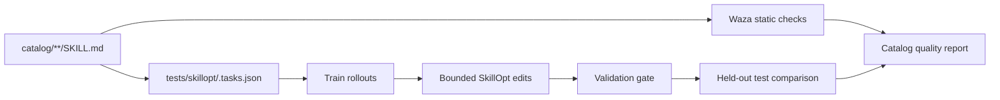

# SkillOpt Catalog Evaluation

[SkillOpt](https://microsoft.github.io/SkillOpt/) is a dynamic optimizer, not a
Markdown linter. It needs scored tasks, training and validation evidence, and a
held-out test split before it can say whether a skill helps an agent. The local
catalog integration therefore complements Waza instead of replacing it:

- Waza checks every catalog skill for structure, routing quality, token size,
  references, and other static signals.
- SkillOpt replays reviewed tasks against a selected skill, proposes bounded
  edits from training failures, accepts a candidate only through the validation
  gate, and measures the current and candidate skill on held-out test tasks.



The repository runner uses the SkillOpt-Sleep engine directly because its
reviewed task records and rule judges fit a heterogeneous catalog better than
one hard-coded research benchmark. It keeps SkillOpt's train, validation, and
test separation while avoiding transcript harvesting and staging.

## Install The Local Engine

Use an isolated Python environment. The adapter currently targets the SkillOpt
0.2 API surface:

```bash
python3 -m venv .venv-skillopt
.venv-skillopt/bin/python -m pip install "skillopt>=0.2,<0.3"
```

The committed runner itself has no third-party dependency for coverage or task
validation. SkillOpt is imported only by the `run` command.

## Local Commands

Inspect dynamic-evaluation coverage without making model calls:

```bash
python3 scripts/skillopt_catalog.py coverage \
  --json-output artifacts/skillopt/coverage.json
```

Validate every committed task set:

```bash
python3 scripts/skillopt_catalog.py validate
```

Exercise the covered suites with SkillOpt's deterministic mock backend. This
checks integration plumbing only; it is not a quality result:

```bash
.venv-skillopt/bin/python scripts/skillopt_catalog.py run \
  --covered \
  --backend mock
```

Run one real Codex-backed evaluation:

```bash
.venv-skillopt/bin/python scripts/skillopt_catalog.py run \
  --skill quality-ci \
  --backend codex \
  --progress
```

Run the complete repo-owned catalog only after every repo-owned skill has a
task set:

```bash
.venv-skillopt/bin/python scripts/skillopt_catalog.py run \
  --all \
  --backend codex \
  --progress
```

`--all` fails before model calls when coverage is incomplete. Use `--covered`
for the incremental rollout. Imported upstream skills are excluded from runs by
default because their Markdown is owned by the vendir source; add
`--include-imported` only when an upstream task set is intentionally present.

Every run is read-only with respect to catalog skills. Candidate edits are
written only into `artifacts/skillopt/report.json` as review evidence. The
runner never stages or adopts them.

## Task-Set Contract

Task sets live in `tests/skillopt/<skill-id>.tasks.json`. The file name maps to
the canonical skill id, while `target_skill_path` protects against accidentally
evaluating a same-named or moved file.

Each file must contain:

- `format: skillopt_sleep.tasks.v1`
- the canonical `skill` id and repo-relative `target_skill_path`
- `reviewed: true`
- `minimum_test_score` between `0` and `1`
- at least six tasks, with at least two each in `train`, `val`, and `test`
- unique task ids, explicit `project`, `intent`, `split`, and `origin: real`
- a checkable `exact`, `rubric`, or `rule` reference

Prefer deterministic `rule` judges where possible. Supported operators match
the SkillOpt-Sleep rule judge: `contains`, `max_chars`, `min_chars`, `regex`,
`section_present`, and `tool_called`. Rubric and exact-reference tasks can use
model judging and should be reserved for behavior that cannot be checked
locally.

The pilot suite is `tests/skillopt/quality-ci.tasks.json`. Add coverage one
skill at a time, starting with repo-owned skills that are broad, frequently
used, or currently changing. Do not generate task sets from the skill text
alone: that creates circular tests that merely restate the artifact being
evaluated.

## Safety And Cost

- `coverage` and `validate` make no provider calls.
- `--backend mock` makes no provider calls but cannot establish real skill
  quality.
- A real backend receives the committed task text and the selected skill
  content. It does not receive archived Codex or Claude sessions through this
  runner.
- Runs are sequential by default so a catalog command cannot unexpectedly fan
  out model spend.
- The current skill fails its gate when its held-out hard score is below the
  suite's `minimum_test_score`, even if SkillOpt discovers a better candidate.
  The candidate still requires a normal reviewed repository change.

See the upstream [SkillOpt CLI reference](https://github.com/microsoft/SkillOpt/blob/main/docs/reference/cli.md)
and [SkillOpt-Sleep data-boundary notes](https://github.com/microsoft/SkillOpt/blob/main/docs/sleep/README.md)
for the underlying engine behavior.
