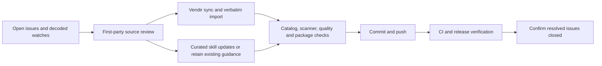

# Upstream Review — September 4, 2026

Scope: all 21 open repository issues at the start of this review. Their decoded payloads identify 171 pending watches. Review covered the official release notes, all referenced documentation pages (including sources omitted from visible issue bodies), and the vendir-managed skill payloads. Changed ETags alone do not establish an API change; unchanged guidance is retained deliberately.

Direct Microsoft Learn requests encountered rate limiting. The official Microsoft Docs MCP returned the complete affected pages. The `.NET AI` source tree was also compared against the current `dotnet/docs` markdown; only `ichatclient.md` differed from the existing 64-page snapshot. Agent Framework documentation was reviewed against the existing snapshot with particular attention to C# examples; expanded Python/Go examples were not treated as new .NET APIs.

## Implementation and Validation Plan

- [x] Read every issue and decode its complete pending-watch list.
- [x] Review first-party releases and documentation, then synchronize vendir-managed sources.
- [x] Update actionable skill guidance and sibling manifest versions; retain correct existing guidance.
- [x] Fix Python/C# scanner compatibility with upstream nested YAML metadata and cover it with regression tests.
- [x] Complete catalog, agent, watch, Waza, Python, .NET build/test/pack, and package-example validation.

Delivery uses issue-closing commit references, followed by GitHub CI/release verification and a final open-issue check. Live run and package evidence is reported with the task.

## Issue Dispositions

| Issue | Source reviewed | Result |
| --- | --- | --- |
| #1503 | [dotnet/skills](https://github.com/dotnet/skills) at `ac8f41264bdd557e58924a3110eea8e0917dcf4d` | Synced official skills and agents verbatim. Updated test overlays, test guidance, MSBuild/template material, and .NET 11 JSON guidance. New `run-tests` nested metadata exposed a scanner incompatibility; both scanners now ignore this opaque block without promoting child keys or changing the payload. |
| #1502 | [Astro](https://github.com/withastro/astro) at `09d7772a2f272b93942126d51ade74c438c9a770` | Synced upstream and derived the skill manifest version from Astro `7.3.1`. The upstream skill body itself was unchanged. CI exposed an existing broad `packages/*` ignore rule hiding the authoritative package manifest; a narrow exception now keeps that vendir input in Git. |
| #1501 | [Aspire](https://aspire.dev/) | Reviewed AppHost composition, runtime, telemetry, testing, and deployment navigation. Existing 13.5.x skill already covers those paths and 13.5.3 servicing; no forced version or architecture change. |
| #1500 | [Agent Framework .NET 1.20.0](https://github.com/microsoft/agent-framework/releases/tag/dotnet-1.20.0) and [current docs](https://learn.microsoft.com/agent-framework/overview/) | Reviewed all 102 pending watches. Added release guidance, stable checkpoint executor/agent identity, AG-UI continuation/state/approval handling, cancellation and recovery checks, and provider boundaries in a focused reference linked from the skill. |
| #1499 | [MimeTypes 10.1.1](https://github.com/managedcode/MimeTypes/releases/tag/v10.1.1) | Updated install examples; documented build-time catalog generation, frozen caches, constant access, `WarmUp`, and cold-versus-steady-state performance checks. |
| #1498 | [Orleans.SignalR 10.3.0](https://github.com/managedcode/Orleans.SignalR/releases/tag/v10.3.0) | Replaced placeholder guidance with installation, combined/separate host setup, send/receive examples, storage durability, acknowledged offline replay, heartbeat leases, queue limits, serializer compatibility, and cancellation-aware invocation guidance. |
| #1497 | [Semantic Kernel .NET 1.80.1](https://github.com/microsoft/semantic-kernel/releases/tag/dotnet-1.80.1) | Updated the release reference and connector/OpenAPI upgrade checks; distinguished retired Assistants tests from a working migration path. |
| #1496 | [Windows Forms overview](https://learn.microsoft.com/dotnet/desktop/winforms/overview/) | Designer, events, data binding, Windows-only deployment, and modern .NET versus .NET Framework distinctions remain covered. The overview's older version wording is not a reason to downgrade current guidance. |
| #1495 | [WPF overview](https://learn.microsoft.com/dotnet/desktop/wpf/overview/) | XAML/code-behind, binding, resources, layout, and Windows-only runtime guidance remain covered. No new feature contract requiring a skill rewrite. |
| #1494 | [MAUI overview](https://learn.microsoft.com/dotnet/maui/what-is-maui?view=net-maui-10.0) | Reviewed shared project, native platform APIs, Mac Catalyst, WinUI, AOT, and Mac build requirements. Existing MAUI skill and imported platform skills cover this guidance. |
| #1493 | [ASP.NET Core overview](https://learn.microsoft.com/aspnet/core/overview?view=aspnetcore-10.0) | Reviewed the .NET 10 moniker and routing to Blazor, Minimal APIs, SignalR, gRPC, security, and testing. Existing six affected skills retain their distinct responsibilities. |
| #1492 | [F# Interactive](https://learn.microsoft.com/dotnet/fsharp/tools/fsharp-interactive/) | Added explicit `usepackagetargets` restore behavior with a pinned package example and trusted-package boundary. |
| #1491 | [F# overview](https://learn.microsoft.com/dotnet/fsharp/what-is-fsharp) | Immutability, records/unions, pattern matching, functions, and .NET interoperability remain covered; no language-version change inferred from an overview update. |
| #1490 | [Build apps with .NET](https://learn.microsoft.com/dotnet/core/apps) | Cloud/client/console/IoT/ML routing remains correct in `dotnet` and `project-setup`; retained the existing narrow-skill handoffs. |
| #1488 | [Playwright snapshots](https://playwright.dev/docs/test-snapshots) and [CI](https://playwright.dev/docs/ci) | Added lossless WebP baseline selection and snapshot path constraints. Kept the custom PNG comparator's format boundary explicit and preserved parallel tests/sharding. |
| #1486 | [Orleans docs](https://learn.microsoft.com/dotnet/orleans/) | Reviewed lifecycle, identity, persistence, versioning, deployment, hosting, and observability navigation. Existing 10.3.1 guidance remains valid; no API change inferred from the hub page. |
| #1484 | [EF Core versus EF6](https://learn.microsoft.com/ef/efcore-and-ef6/) | Retained the supported-but-not-actively-developed EF6 posture, separate runtime/ORM decisions, and provider-backed migration validation. EF Core remains the default for new applications, not a drop-in EF6 replacement. |
| #1482 | [.NET MCP guidance](https://learn.microsoft.com/dotnet/ai/get-started-mcp) and its four watched quickstart/resource pages | Compared current source pages for client, server, registry publishing, and server discovery. Existing MCP and MEAI guidance matches; source markdown was unchanged. |
| #1481 | [.NET AI ecosystem](https://learn.microsoft.com/dotnet/ai/dotnet-ai-ecosystem), agents concept, and assistant quickstart | Existing MEAI-versus-Agent-Framework routing remains correct; source markdown was unchanged. Agent Framework release guidance was refreshed under #1500. |
| #1480 | [.NET AI docs](https://learn.microsoft.com/dotnet/ai/overview), all 43 watched concept/quickstart/evaluation/API pages | Updated the `IChatClient` snapshot and skill for experimental failover before first output. Streaming failures after output must not replay into another provider. API pages can default to `net-11.0-pp`; package maturity remains explicit. |
| #1479 | [Biome 2.5.12](https://github.com/biomejs/biome/releases/tag/%40biomejs/biome%402.5.12) | Added Astro/TSX, Unicode stdin/stdout, dependency-scanning, and Promise diagnostics checks; kept new Nursery rules opt-in. |

## Scope Boundaries

The public collection/bundle taxonomy did not change, so the README overview remains accurate. Generated pages and release manifests are transient outputs. Imported warnings remain visible in Waza's report; upstream content is not rewritten to suppress them. Routine upstream-watch state is not committed to `main`.

## Local Validation Results

- Python regression suite: 26 passed, including opaque nested metadata and child-key isolation.
- .NET suite: 1146 passed, none skipped; Release build passed without warnings.
- Release pack: all three installer packages produced. NuGet reported existing packaged-script and long-path warnings (`NU5111`/`NU5123`); these do not indicate failed packing.
- Scoped `dotnet format --verify-no-changes`: passed.
- Catalog: 182 skills, 12 bundles, 26 agents; source metadata, import configuration, and watch configuration passed validation.
- Waza: zero repo-owned warnings; 83 imported skills retain report-only upstream warnings.
- Generated public pages successfully from the scanned catalog.
- Compiled the Orleans.SignalR setup/publisher examples against 10.3.0; the combined host imports only Server extensions to avoid ambiguous `AddOrleans` calls. Executed MIME warm-up, lookup, and registration checks against 10.1.1. This is package/API validation, not a claim of multi-host delivery testing.
- Diff whitespace and personal-path scans passed.
