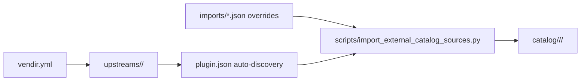

# External Sources

This directory isolates vendir-managed upstream repositories from the human-maintained `catalog/` tree.

## Layout

- `vendir.yml`: transport-only fetch config for vendir
- `vendir.lock.yml`: pinned upstream SHAs
- `upstreams/`: checked-in vendored snapshots
- `imports/*.json`: local normalization policy and overrides for the importer

## Rules

- Keep vendir transport details here instead of mixing them into `catalog/`.
- Keep `imports/*.json` overrides-only. Do not mirror every upstream plugin there.
- Let `scripts/import_external_catalog_sources.py` auto-discover upstream plugins from vendored `plugin.json` files.
- Put local policy here only when upstream does not know it: catalog type, category, package naming, compatibility, or skill-level package trigger overrides.

## Flow



## Local Refresh

```bash
bash scripts/sync_external_catalog_sources.sh
```
