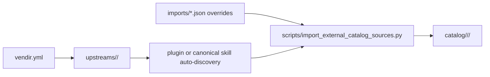

# External Sources

This directory isolates vendir-managed upstream repositories from the human-maintained `catalog/` tree.

## Layout

- `vendir.yml`: transport-only fetch config for vendir
- `vendir.lock.yml`: pinned upstream SHAs
- `upstreams/`: checked-in vendored snapshots
- `imports/*.json`: local normalization policy and overrides for the importer

## Rules

- Keep vendir transport details here instead of mixing them into `catalog/`.
- Keep `imports/*.json` overrides-only. Do not mirror every upstream plugin there.
- Let `scripts/import_external_catalog_sources.py` auto-discover upstream plugins from vendored `plugin.json` files or standalone skills from canonical `.agents/skills/*/SKILL.md`, `.github/skills/*/SKILL.md`, and root `skills/*/SKILL.md` trees (root skills are discovered when the repository has no plugin manifests).
- Put local policy here only when upstream does not know it: catalog type, category, package naming, compatibility, or skill-level package trigger overrides. Use `standaloneVersion` for the base guidance version when upstream has no authoritative version metadata; imports append a deterministic source-content fingerprint so nightly changes become detectable installed-skill updates; use `standaloneVersionFile` when upstream supplies it. Set `licenseFile` when the upstream license sits outside the skill tree so catalog distributions carry that original license too.

## Flow


```mermaid
flowchart LR
  A["vendir.yml"] --> B["upstreams/<repo>/"]
  B --> C["plugin or canonical skill auto-discovery"]
  D["imports/*.json overrides"] --> E["scripts/import_external_catalog_sources.py"]
  C --> E
  E --> F["catalog/<type>/<package>/"]
```

## Local Refresh

```bash
bash scripts/sync_external_catalog_sources.sh
```
