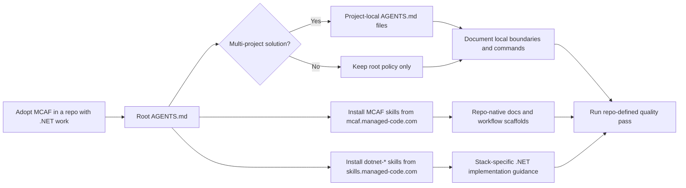

# MCAF Adoption

## Trigger On

- bootstrapping MCAF in a new or existing repository that also contains `.NET` work
- updating root or project-local `AGENTS.md` files to follow a durable repo workflow
- deciding which MCAF skills and `dotnet-*` skills a solution should install together
- organizing repo-native docs for architecture, features, ADRs, testing, development, and operations
- aligning AI-agent workflow with explicit build, test, format, analyze, and coverage commands

## Workflow

1. Treat the canonical bootstrap surface as URL-first:
   - tutorial: `https://mcaf.managed-code.com/tutorial`
   - concepts: `https://mcaf.managed-code.com/`
   - public MCAF skills: `https://mcaf.managed-code.com/skills`
2. Place root `AGENTS.md` at the repository or solution root. Add project-local `AGENTS.md` files when the `.NET` solution has multiple projects or bounded modules with stricter local rules.
3. Keep MCAF bootstrap small and repo-native:
   - durable instructions in `AGENTS.md`
   - durable engineering docs in the repository
   - workflow details in skills, references, and repo docs instead of chat memory
4. Treat MCAF as its own skill catalog, not one monolithic rule file. The current catalog exposes separate `mcaf-*` skills for governance, docs, testing, CI/CD, observability, maintainability, source control, UI/UX, and AI/ML delivery.
5. Route to the narrowest MCAF skill once the governance problem is clear:
   - repo bootstrap and local `AGENTS.md`: `mcaf-solution-governance`
   - architecture map: `mcaf-architecture-overview`
   - feature spec and ADRs: `mcaf-feature-spec`, `mcaf-adr-writing`
   - testing and review policy: `mcaf-testing`, `mcaf-code-review`
   - release and pipeline policy: `mcaf-ci-cd`, `mcaf-source-control`
   - maintainability and NFR policy: `mcaf-solid-maintainability`, `mcaf-nfr`
6. For `.NET` repositories, fetch framework-governance skills from the MCAF catalog and fetch implementation skills from `https://skills.managed-code.com/`. Do not replace repo-specific `dotnet build`, `dotnet test`, `dotnet format`, analyzer, coverage, and CI commands with vague generic guidance.
7. Keep documentation explicit enough for direct implementation:
   - `docs/Architecture.md`
   - `docs/Features/`
   - `docs/ADR/`
   - `docs/Testing/`
   - `docs/Development/`
   - `docs/Operations/`
8. Encode the non-trivial task flow directly in `AGENTS.md`: root-level `<slug>.brainstorm.md`, then `<slug>.plan.md`, then implementation and validation.
9. Treat verification as part of done. The change is not complete until the full repo-defined quality pass is green, including tests, analyzers, formatters, coverage, and any architecture or security gates the repo configured.

## Architecture

## Deliver

- a repository-ready MCAF adoption shape for the solution
- clear root and local `AGENTS.md` responsibilities
- the right split between specific `mcaf-*` governance skills and `dotnet-*` implementation skills
- explicit repo docs and verification expectations instead of chat-only instructions

## Validate

- root `AGENTS.md` exists at the repository or solution root
- project-local `AGENTS.md` files exist where the solution actually needs stricter local rules
- the repo documents exact `.NET` build, test, formatting, analyzer, and coverage commands
- durable docs exist for architecture and behavior, not only inline comments or chat context
- non-trivial work requires the brainstorm-to-plan flow before implementation
- the full relevant quality pass is part of done, not only a narrow happy-path test run

## References

- [references/adoption.md](references/adoption.md) - Canonical MCAF entry points, bootstrap rules for repos that also use dotnet-skills, and the most relevant MCAF adoption boundaries
- [references/skill-map.md](references/skill-map.md) - Current MCAF catalog map, grouped by governance concern so teams can route to the right `mcaf-*` skill instead of treating MCAF as a single blob
